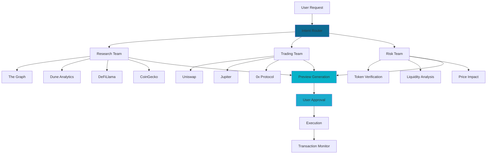
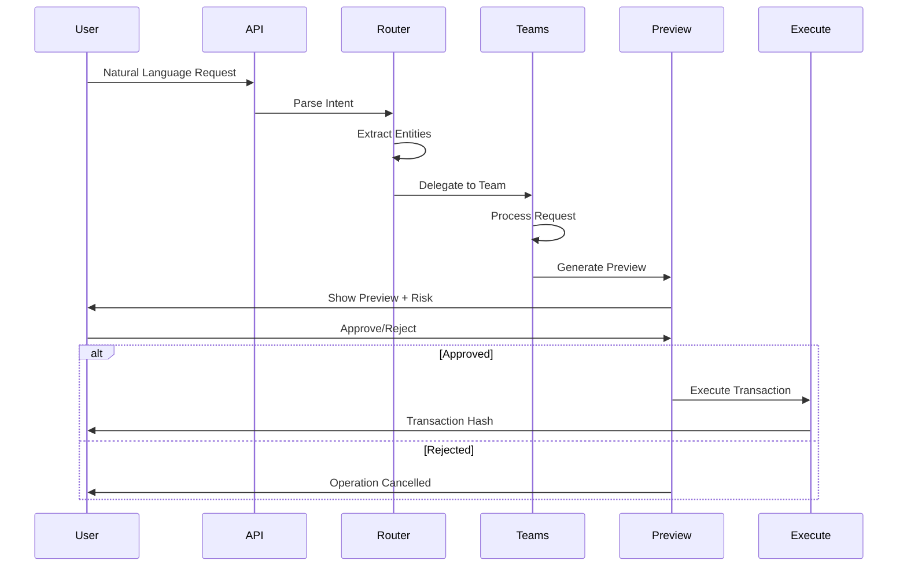
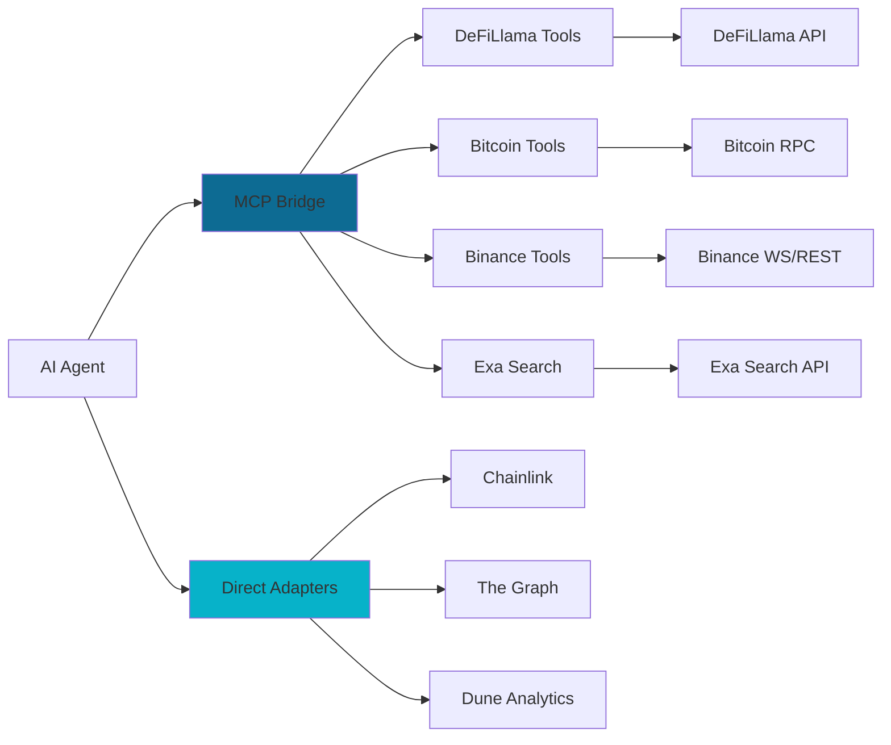

# Features

<Info>
Nex‑T1 combines enterprise-grade infrastructure with cutting-edge AI orchestration to deliver a comprehensive Web3 automation platform. Every feature is designed for production use with reliability, security, and scalability at its core.
</Info>

## Architecture Overview

### Multi-Agent System Architecture



### Request Flow Architecture



## Core Platform Features

### High-Performance Backend

| Component | Technology | Capability |
|-----------|-----------|-----------|
| Framework | FastAPI | Async Python for maximum throughput |
| Concurrency | ASGI Server | Handle thousands of concurrent requests |
| CORS | Middleware | Secure cross-origin resource sharing |
| Security | Headers | XSS, CSP, frame options protection |
| Validation | Pydantic | Runtime type checking and validation |
| Error Handling | Custom Handlers | Graceful recovery with structured logging |
| API Schema | OpenAPI 3.1 | Auto-generated interactive documentation |

**Performance Characteristics**:
- Sub-100ms response time for cached queries
- 1000+ concurrent connections supported
- Async I/O for non-blocking operations
- Connection pooling for efficient resource use

### Observability & Monitoring

<Tabs>
  <Tab title="Metrics">
    **Prometheus Integration**:
    - Request latency histograms (p50, p95, p99)
    - Error rate monitoring by endpoint
    - Active connection tracking
    - Resource utilization (CPU, memory)
    - Custom business metrics
    - Token usage per model
    - Cost tracking by operation
  </Tab>
  <Tab title="Dashboards">
    **Pre-built Grafana Dashboards**:
    - API Performance: Request/response metrics
    - Agent Execution: AI operation tracking
    - Tool Usage: Integration analytics
    - Cost Monitoring: LLM and infrastructure costs
    - Error Analysis: Failure patterns
    - User Analytics: Engagement metrics
  </Tab>
  <Tab title="Health Checks">
    **Kubernetes-Ready Probes**:
    - `/health` - Root health endpoint
    - `/api/v1/health` - API health check
    - Liveness probes for crash detection
    - Readiness probes for traffic routing
    - Startup probes for slow initialization
  </Tab>
  <Tab title="Logging">
    **Structured Logging**:
    - JSON format for machine parsing
    - Environment-aware formatting
    - File and console output
    - Request ID tracking
    - Error stack traces
    - Performance timing
  </Tab>
</Tabs>

### AI Agent Orchestration

<Tabs>
  <Tab title="LangGraph">
    **Stateful Multi-Agent Workflows**:
    - Conversation memory management
    - Context preservation across sessions
    - Parallel agent execution
    - Conditional routing based on intent
    - State checkpointing to PostgreSQL
    - Transaction-safe state updates
    - Point-in-time recovery
    - State replay for debugging
  </Tab>
  <Tab title="LLM Providers">
    **Multi-Provider Support**:
    - OpenAI GPT-4, GPT-3.5
    - Anthropic Claude 3 (Opus, Sonnet, Haiku)
    - Automatic fallback on failures
    - Model-specific optimization
    - Token usage tracking
    - Cost optimization strategies
    - Response caching
  </Tab>
  <Tab title="State Management">
    **PostgreSQL Checkpointing**:
    - AsyncPostgresSaver for high throughput
    - Transaction-safe state updates
    - Automatic state persistence
    - Session-scoped conversations
    - Conversation history retrieval
    - Message history clearing
  </Tab>
  <Tab title="Streaming">
    **Real-Time Communication**:
    - Server-Sent Events (SSE)
    - Token-by-token streaming
    - Progress updates during execution
    - EventSource-compatible endpoints
    - Fallback to non-streaming
  </Tab>
</Tabs>

### LLM Observability

**Langfuse Integration**:
- Complete trace visibility into AI operations
- Token usage analytics per model
- Response time tracking
- Quality scoring and evaluation
- Cost attribution by user/session
- Prompt effectiveness metrics
- A/B testing support
- Production debugging

## Security Features

| Security Layer | Feature | Implementation |
|----------------|---------|----------------|
| **Authentication** | JWT Tokens | Stateless bearer authentication |
| | Session Management | User registration, login, session creation |
| | Token Scoping | Session-scoped tokens for chat binding |
| **Authorization** | Role-Based Access | User-level permissions |
| | API Key Management | Secure key storage and rotation |
| **Rate Limiting** | Request Throttling | `slowapi` with per-endpoint policies |
| | Burst Protection | Configurable rate limits |
| | User-Based Limits | Per-user quota enforcement |
| **Input Validation** | Pydantic Schemas | Runtime type checking |
| | Sanitization | Prevent injection attacks |
| | Request Filtering | Block malicious payloads |
| **Network Security** | CORS Configuration | Explicit allowed origins |
| | Security Headers | XSS, CSP, frame options |
| | TLS/SSL | Encrypted data in transit |
| **Data Protection** | Encryption at Rest | Database encryption |
| | Secure Storage | Environment-based secrets |
| | Data Minimization | Only store necessary data |

## Multi-Agent System

### Agent Capabilities Comparison

| Agent Team | Primary Function | Data Sources | Output |
|------------|------------------|--------------|--------|
| **Intent Router** | NLU & Classification | User input | Intent + entities + team assignment |
| **Research Team** | Data aggregation | The Graph, Dune, DeFiLlama, CoinGecko | Market insights, protocol comparisons |
| **Trading Team** | Quote generation | Uniswap, Jupiter, 0x, Chainlink | Route quotes, gas estimates |
| **Risk Team** | Safety validation | On-chain data, audit databases | Risk scores, warnings |

### Agent Team Details

<CardGroup cols={2}>
  <Card title="Intent Router" icon="route">
    **Capabilities**:
    - Natural language understanding
    - Intent classification (research/trading/risk)
    - Entity extraction (tokens, amounts, chains)
    - Team delegation with context

    **Supported Intents**:
    - Research queries
    - Trading operations
    - Risk assessments
    - Market data requests
    - Portfolio analysis
  </Card>
  <Card title="Research Team" icon="magnifying-glass">
    **Data Sources**:
    - The Graph Protocol subgraphs
    - Dune Analytics SQL queries
    - DeFiLlama TVL/yields
    - CoinGecko market data
    - Sentiment analysis APIs

    **Analysis Types**:
    - Protocol comparisons
    - Yield optimization
    - Historical trends
    - Cross-chain analytics
    - Market sentiment
  </Card>
  <Card title="Trading Team" icon="arrow-right-arrow-left">
    **Supported Operations**:
    - Quote generation (Chainlink prices)
    - Route optimization
    - Slippage calculation
    - Gas estimation
    - Wallet balance checks

    **Integrations**:
    - Uniswap V2/V3
    - 0x Protocol
    - Jupiter (Solana)
    - Chainlink price feeds
    - Pseudo EVM quotes
  </Card>
  <Card title="Risk Team" icon="shield-halved">
    **Risk Checks**:
    - Token verification
    - Liquidity analysis
    - Price impact assessment
    - Smart contract audits
    - Transaction simulation

    **Thresholds**:
    - Configurable limits
    - Custom rule engine
    - Whitelist/blacklist
    - Alert mechanisms
    - Multi-sig support
  </Card>
</CardGroup>

### Tool Integration Architecture



### Preview-to-Execute Flow

| Step | Action | Safety Check | User Control |
|------|--------|--------------|--------------|
| 1. Intent Analysis | AI parses request | Input validation | Can rephrase |
| 2. Route Preview | Generate execution plan | Entity extraction | Review plan |
| 3. Quote Generation | Get best prices | Price validation | Compare quotes |
| 4. Risk Assessment | Run safety checks | Threshold validation | Review risks |
| 5. Preview Display | Show complete preview | All checks passed | Approve/reject |
| 6. Execution | Submit transaction | Confirmation gate | Explicit approval required |
| 7. Monitoring | Track status | Transaction validation | Real-time updates |

<Note>
**Safety First**: Execution is gated by default with `EXECUTION_ENABLED = False` in feature flags. Users must explicitly approve every transaction after reviewing the complete preview with risk assessment.
</Note>

## Integrated Tools & Adapters

### Research & Analytics Tools

<Tabs>
  <Tab title="The Graph">
    - **Subgraph Queries**: Direct access to indexed blockchain data
    - **Multi-Protocol Support**: Uniswap, Compound, Aave, etc.
    - **Custom Queries**: GraphQL interface for complex analytics
    - **Real-Time Updates**: WebSocket subscriptions
  </Tab>
  <Tab title="Dune Analytics">
    - **SQL Queries**: Complex on-chain analysis
    - **Pre-Built Dashboards**: Instant insights
    - **Custom Metrics**: Build your own KPIs
    - **Export Capabilities**: CSV, JSON, API
  </Tab>
  <Tab title="DeFiLlama">
    - **TVL Tracking**: Total value locked across protocols
    - **Yield Farming**: APY comparisons
    - **Chain Analytics**: Cross-chain metrics
    - **Historical Data**: Trend analysis
  </Tab>
  <Tab title="CoinGecko">
    - **Price Data**: Real-time and historical
    - **Market Metrics**: Volume, market cap, dominance
    - **Token Information**: Metadata and links
    - **Trending Analysis**: Hot tokens and gainers
  </Tab>
</Tabs>

### Trading & Execution Tools

<Tabs>
  <Tab title="EVM Chains">
    **Uniswap Integration**:
    - V2 and V3 support
    - Optimal route finding
    - Liquidity aggregation
    - MEV protection

    **0x Protocol**:
    - Best price discovery
    - Aggregated liquidity
    - Gas optimization
    - RFQ system

    **Chainlink**:
    - Price feeds
    - Proof of reserves
    - VRF for randomness
    - Automation triggers
  </Tab>
  <Tab title="Solana">
    **Jupiter**:
    - Token swaps
    - Route optimization
    - Limit orders
    - DCA strategies

    **Serum**:
    - Order book DEX
    - Advanced orders
    - Cross-chain bridge
    - Margin trading
  </Tab>
  <Tab title="Bitcoin">
    **Bitcoin MCP**:
    - Address generation
    - Transaction creation
    - UTXO management
    - Lightning Network

    **Block Explorers**:
    - Transaction tracking
    - Address monitoring
    - Fee estimation
    - Mempool analysis
  </Tab>
</Tabs>

### Market Data & Exchange Integration

**Binance Integration**:
- Spot market data
- Futures information
- Order book depth
- Trade history
- WebSocket streams for real-time updates

**Additional Exchanges** (via MCP):
- Coinbase Pro
- Kraken
- Bybit
- OKX
- Bitfinex

## MCP (Model Context Protocol) Support

<Info>
**What is MCP?** The Model Context Protocol standardizes how AI models interact with external tools and data sources, similar to how USB-C standardizes device connections. It enables seamless integration of diverse data sources and execution capabilities.
</Info>

### Supported MCP Servers

| Category | MCP Server | Capabilities | Status |
|----------|-----------|--------------|--------|
| **DeFi** | DeFiLlama | TVL, yields, protocol data | Active |
| | Aave | Lending/borrowing markets | Planned |
| | Compound | Money markets | Planned |
| | Curve | Pool analytics | Planned |
| **Blockchain** | Bitcoin | UTXO, transactions, Lightning | Active |
| | Ethereum | EVM operations | Active |
| | Solana | SPL tokens, Jupiter | Active |
| **Exchange** | Binance | Spot, futures, WebSocket | Active |
| | Coinbase | Market data, trading | Planned |
| | Kraken | Order book, trades | Planned |
| **Search** | Exa | AI-powered web search | Active |
| | Google | Traditional search | Planned |
| **Infrastructure** | Alchemy | Node services, APIs | Planned |
| | Helius | Solana infrastructure | Planned |
| | Infura | RPC endpoints | Planned |
| **Analytics** | The Graph | Subgraph queries | Direct adapter |
| | Dune | SQL analytics | Direct adapter |
| | Nansen | Wallet labels | Planned |
| **Security** | Tenderly | Transaction simulation | Planned |
| | Forta | Threat detection | Planned |
| | CertiK | Audit verification | Planned |

### MCP Configuration

<Tabs>
  <Tab title="Core MCPs">
    ```env
    # DeFi Data
    DEFILLAMA_MCP_BASE=https://defillama.nex-t1.ai
    DEFILLAMA_API_KEY=your-key-here

    # Blockchain
    BITCOIN_MCP_BASE=https://bitcoin.nex-t1.ai
    THIRDWEB_MCP_BASE=https://thirdweb-mcp.nex-t1.ai
    THIRDWEB_MCP_TOKEN=your-token-here

    # Exchange
    BINANCE_MCP_BASE=https://binance.nex-t1.ai
    BINANCE_API_KEY=your-key-here
    BINANCE_API_SECRET=your-secret-here

    # Search
    EXA_MCP_BASE=https://exa.nex-t1.ai
    EXA_API_KEY=your-key-here
    ```
  </Tab>
  <Tab title="Trading MCPs">
    ```env
    # DEX Integrations
    UNISWAP_MCP_BASE=https://uniswap.nex-t1.ai
    JUPITER_MCP_BASE=https://jupiter.nex-t1.ai
    ZEROX_MCP_BASE=https://0x.nex-t1.ai

    # Price Feeds
    CHAINLINK_MCP_BASE=https://chainlink.nex-t1.ai
    PYTH_MCP_BASE=https://pyth.nex-t1.ai
    ```
  </Tab>
  <Tab title="Analytics MCPs">
    ```env
    # Data Platforms
    DUNE_MCP_BASE=https://dune.nex-t1.ai
    DUNE_API_KEY=your-key-here

    GRAPH_MCP_BASE=https://graph.nex-t1.ai
    GRAPH_API_KEY=your-key-here

    # Market Intelligence
    COINGECKO_API_KEY=your-key-here
    MESSARI_API_KEY=your-key-here
    ```
  </Tab>
  <Tab title="Infrastructure MCPs">
    ```env
    # RPC Providers
    ALCHEMY_MCP_BASE=https://alchemy.nex-t1.ai
    ALCHEMY_API_KEY=your-key-here

    HELIUS_MCP_BASE=https://helius.nex-t1.ai
    HELIUS_API_KEY=your-key-here

    INFURA_API_KEY=your-key-here
    QUICKNODE_ENDPOINT=your-endpoint-here
    ```
  </Tab>
</Tabs>

### MCP vs Direct Adapters

| Integration Type | Use Case | Examples | Performance |
|------------------|----------|----------|-------------|
| **MCP Servers** | Standardized, pluggable tools | Bitcoin, Binance, DeFiLlama, Exa | Slightly higher latency |
| **Direct Adapters** | Performance-critical, custom logic | Chainlink, The Graph, Dune | Low latency, optimized |

**When to use MCP**: New integrations, community tools, rapid prototyping

**When to use Direct Adapters**: Core functionality, performance-critical paths, custom business logic

## Developer Features

### Clean Architecture
```
app/
├── api/          # HTTP endpoints
├── core/         # Business logic
│   ├── agents/   # AI agent definitions
│   ├── auth/     # Authentication
│   └── tools/    # Tool implementations
├── models/       # Database models
├── schemas/      # Request/response schemas
├── services/     # External services
└── utils/        # Helper functions
```

### Type Safety
- **Pydantic Models**: Runtime validation
- **Type Hints**: Full typing coverage
- **MyPy Compatible**: Static type checking
- **OpenAPI Schema**: Auto-generated docs

### Testing Infrastructure
- **Pytest Framework**: Comprehensive test suite
- **Mock Integrations**: Test without external deps
- **Coverage Reports**: Track test completeness
- **Load Testing**: Performance validation

### Deployment Options

<Tabs>
  <Tab title="Docker">
    - Multi-stage builds for optimization
    - Docker Compose for full stack
    - Health checks included
    - Volume management
    - Network isolation
  </Tab>
  <Tab title="Kubernetes">
    - Helm charts provided
    - Horizontal pod autoscaling
    - ConfigMaps and Secrets
    - Ingress configuration
    - Service mesh ready
  </Tab>
  <Tab title="Cloud Platforms">
    **AWS**:
    - ECS/Fargate deployment
    - Lambda functions
    - API Gateway integration

    **Google Cloud**:
    - Cloud Run support
    - Kubernetes Engine
    - Cloud Functions

    **Railway/Vercel**:
    - One-click deployment
    - Automatic scaling
    - Built-in monitoring
  </Tab>
</Tabs>

## Performance Optimization

### Caching Strategy
- **Redis Integration**: Sub-millisecond cache
- **Multi-Layer Caching**: Memory → Redis → Database
- **Smart Invalidation**: Event-driven cache updates
- **TTL Management**: Configurable expiration

### Async Operations
- **Non-Blocking I/O**: Maximum concurrency
- **Connection Pooling**: Efficient resource usage
- **Background Tasks**: Long-running operations
- **Queue Management**: Priority-based processing

### Database Optimization
- **Indexed Queries**: Fast data retrieval
- **Query Optimization**: Explain plan analysis
- **Connection Pooling**: Resource efficiency
- **Read Replicas**: Scale read operations

## Tasks & Scheduling

### Task Management System

| Feature | Description | API Endpoints |
|---------|-------------|---------------|
| **Task Creation** | Create discrete tasks with metadata | `POST /api/v1/tasks` |
| **Task Listing** | Retrieve all tasks with filtering | `GET /api/v1/tasks` |
| **Task Details** | Get single task by ID | `GET /api/v1/tasks/{id}` |
| **Progress Updates** | Update status, percent, summaries | `PUT /api/v1/tasks/{id}/progress` |
| **Plan Creation** | Create plan from base task | `POST /api/v1/plans` |
| **Plan Retrieval** | Fetch plan with associated tasks | `GET /api/v1/plans/{id}` |

### Background Scheduler

**Market Overview Service**:
- Runs twice daily (configurable schedule)
- Aggregates crypto market data
- Generates summary with news, prices, sentiment
- Stores snapshots in database
- Accessible via API endpoints

**Discrete Task Scheduler**:
- Background service for task execution
- Supports async job processing
- Progress tracking and status updates
- Error handling and retries
- Webhook notifications (planned)

## Compliance & Governance

### Data Privacy

| Requirement | Implementation | Compliance |
|-------------|----------------|------------|
| **GDPR** | User data controls, right to deletion | Yes |
| **Data Minimization** | Only store necessary data | Yes |
| **Encryption** | At rest (database) and in transit (TLS) | Yes |
| **Data Retention** | Configurable policies | Yes |
| **User Consent** | Explicit opt-in for data collection | Yes |

### Audit Trail

**Complete Logging**:
- Every API request logged with structured JSON
- User actions tracked with session IDs
- Transaction history with immutable records
- Error tracking with stack traces
- Performance metrics with timing data

**Compliance Reports**:
- Automated generation from logs
- Exportable in multiple formats
- Customizable time ranges
- Filter by user, action, or outcome

### Risk Management

| Control | Configuration | Default |
|---------|--------------|---------|
| **Transaction Limits** | Per-user, per-transaction | User-configurable |
| **Execution Gate** | Feature flag | Disabled (preview only) |
| **Network Mode** | Mainnet/testnet | Testnet |
| **Approval Workflow** | Required for execution | Always required |
| **Risk Thresholds** | Configurable per-team | Medium sensitivity |
| **Monitoring Alerts** | Real-time notifications | Slack/email integration |

## Chat & Conversation Management

### Chat Capabilities

| Feature | Implementation | Endpoints |
|---------|----------------|-----------|
| **Non-Streaming Chat** | Full message history in response | `POST /api/v1/chatbot/chat` |
| **SSE Streaming** | Token-by-token streaming | `POST /api/v1/chatbot/chat/stream` |
| **EventSource Streaming** | Browser-compatible SSE | `GET /api/v1/chatbot/chat/stream/sse` |
| **Message History** | Retrieve conversation history | `GET /api/v1/chatbot/messages` |
| **History Clearing** | Clear session messages | `DELETE /api/v1/chatbot/messages` |
| **Session Management** | Create, list, rename, delete sessions | Various endpoints |

### LangGraph-Backed Chat

**Architecture**:
- Stateful conversation flow
- PostgreSQL checkpointing for persistence
- Context preservation across sessions
- Multi-turn conversation support
- Tool calling integration
- Streaming support for real-time feedback

## Feature Flags

Control feature rollout and behavior with built-in flags:

```python
# app/core/feature_flags.py
MULTI_AGENT_ENABLED = True      # Enable multi-agent orchestration
RISK_CHECKS_ENABLED = True      # Enable risk assessment
EXECUTION_ENABLED = False       # Preview only by default
MAINNET_ENABLED = False         # Testnet by default
STREAMING_ENABLED = True        # Enable SSE streaming
MARKET_OVERVIEW_ENABLED = True  # Enable market overview scheduler
```

<Warning>
**Production Safety**: `EXECUTION_ENABLED` and `MAINNET_ENABLED` are disabled by default. Only enable in production after thorough testing and with appropriate risk controls in place.
</Warning>

## Metrics & Analytics

### Comprehensive Monitoring

| Metric Category | Tracked Metrics | Storage | Visualization |
|----------------|----------------|---------|---------------|
| **Business** | User engagement, transaction success, tool usage | PostgreSQL + Prometheus | Grafana dashboards |
| **Technical** | API latency (p50/p95/p99), DB query times, cache hit rates | Prometheus | Grafana dashboards |
| **AI** | Token usage, model response times, intent accuracy | Langfuse | Langfuse UI |
| **Cost** | LLM costs per operation, infrastructure costs | Custom metrics | Grafana dashboards |
| **Error** | Error rates by category, failure patterns | Structured logs | Grafana + log analysis |

### Key Performance Indicators

<CardGroup cols={3}>
  <Card title="User Engagement" icon="users">
    - Active users per day
    - Sessions per user
    - Average session duration
    - Return rate
  </Card>
  <Card title="Transaction Success" icon="check">
    - Preview generation success
    - Quote generation success
    - Risk check pass rate
    - Execution success rate
  </Card>
  <Card title="System Health" icon="heart-pulse">
    - API uptime (target: 99.9%)
    - Response time p95 (target: <500ms)
    - Error rate (target: <1%)
    - Cache hit rate (target: >80%)
  </Card>
</CardGroup>

## Supported Chains & Protocols

### Blockchain Support

| Chain Category | Networks | Status | Features |
|----------------|----------|--------|----------|
| **EVM Chains** | Ethereum, Polygon, Arbitrum, Optimism, Base, BSC | Active | Swaps, quotes, risk checks |
| **Solana** | Mainnet, Devnet | Active | Jupiter integration |
| **Bitcoin** | Mainnet, Testnet | Active | UTXO management, Lightning |
| **Layer 2s** | All major EVM L2s | Active | Full support |

<Note>
See [Supported Chains](/Nex-T1/supported-chains) for the complete list of supported networks and their capabilities.
</Note>

## API & Developer Experience

### OpenAPI 3.1 Schema

**Interactive Documentation**:
- Swagger UI at `/docs`
- ReDoc at `/redoc`
- Scalar at `/scalar` (modern UI)
- Auto-generated from Pydantic models
- Try-it-out functionality
- Authentication testing

### Consistent JSON Schemas

All endpoints use consistent schema patterns:
- Request validation with Pydantic
- Response models with type hints
- Error responses in standard format
- Pagination with consistent parameters
- Filtering with query parameters

### Client Libraries

**Supported Languages** (Community/Planned):
- Python SDK
- TypeScript/JavaScript SDK
- Go SDK
- Rust SDK
- Example code in documentation

<Tip>
All API requests and responses follow REST principles with intuitive resource naming and HTTP verb usage.
</Tip>