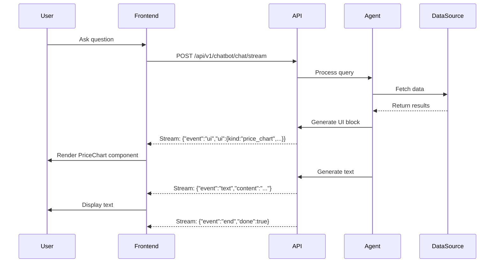

# Generative UI

<Info>
Generative UI enables Nex-T1 to stream rich, interactive UI components alongside text responses. Instead of just returning data, the AI generates complete, ready-to-render React components for charts, tables, wallet views, and transaction interfaces.
</Info>

## What is Generative UI?

Generative UI is a paradigm where AI agents don't just return text or JSON data—they stream fully-formed UI components directly to your frontend. When a user asks "Show me ETH price charts for the last 30 days," Nex-T1:

1. Fetches the data from on-chain sources
2. Generates a complete chart component with the data
3. Streams it to your frontend as a UI block
4. Your app renders it instantly

This creates seamless, natural interactions where the AI understands not just what data to show, but how to visualize it.

## Why Generative UI for Web3?

<CardGroup cols={2}>
  <Card title="Context-Aware Visualizations" icon="chart-line">
    AI chooses the best visualization based on user intent:
    - Price queries → Line charts
    - Portfolio analysis → Holdings tables
    - Token comparisons → Comparison grids
    - Transaction history → Timeline views
  </Card>
  <Card title="Zero Manual Formatting" icon="wand-magic-sparkles">
    No need to parse API responses and format data:
    - Components arrive ready-to-render
    - Data is pre-formatted and validated
    - Styling matches component type
    - Responsive by default
  </Card>
  <Card title="Interactive Elements" icon="hand-pointer">
    Generate actionable UI components:
    - Swap forms with pre-filled data
    - Sign request dialogs
    - Transaction status trackers
    - Approval workflows
  </Card>
  <Card title="Streaming Updates" icon="bolt">
    Real-time component delivery:
    - Progressive rendering as data arrives
    - Multiple components per response
    - Mixed text and UI content
    - Event-driven architecture
  </Card>
</CardGroup>

## Architecture

### How It Works



### Component Generation Process

1. **Intent Recognition**: Agent identifies what visualization is needed
2. **Data Fetching**: Retrieves data from appropriate sources
3. **Schema Generation**: Creates UI block following `app/schemas/ui.py`
4. **Streaming**: Sends UI block as JSON event
5. **Frontend Rendering**: Your app maps `ui.kind` to React component

### Stream Event Types

The streaming API returns three types of events:

<Tabs>
  <Tab title="Text Events">
    ```json
    {
      "event": "text",
      "content": "Here's the ETH price chart...",
      "done": false
    }
    ```
    Regular text tokens for conversational responses.
  </Tab>
  <Tab title="UI Events">
    ```json
    {
      "event": "ui",
      "ui": {
        "kind": "price_chart",
        "symbol": "ETH",
        "data": [{"t": "2024-01-01", "price": 2200}]
      },
      "done": false
    }
    ```
    Complete UI component definitions ready to render.
  </Tab>
  <Tab title="End Events">
    ```json
    {
      "event": "end",
      "done": true
    }
    ```
    Signals stream completion.
  </Tab>
</Tabs>

## Available UI Components

### Chart Components

<Tabs>
  <Tab title="Price Chart">
    **Component Type**: `price_chart`

    **Props**:
    ```typescript
    {
      kind: 'price_chart';
      title?: string;
      symbol?: string;
      pair?: string;          // e.g., "ETH/USDC"
      currency?: string;      // e.g., "USD"
      range?: string;         // e.g., "30d", "1y"
      data: Array<{
        t: string;            // ISO timestamp
        price: number;
      }>;
    }
    ```

    **Use Cases**:
    - Token price history
    - Multi-timeframe analysis
    - Price comparison overlays

    **Example**:
    ```tsx
    import { LineChart, Line, XAxis, YAxis, Tooltip } from 'recharts';

    export function PriceChart({ title, symbol, data }: PriceChartProps) {
      return (
        <div className="chart-container">
          <h3>{title || `${symbol} Price Chart`}</h3>
          <LineChart width={600} height={300} data={data}>
            <XAxis dataKey="t" />
            <YAxis />
            <Tooltip />
            <Line type="monotone" dataKey="price" stroke="#8884d8" />
          </LineChart>
        </div>
      );
    }
    ```
  </Tab>

  <Tab title="Volume Chart">
    **Component Type**: `volume_chart`

    **Props**:
    ```typescript
    {
      kind: 'volume_chart';
      title?: string;
      symbol?: string;
      pair?: string;
      data: Array<{
        t: string;
        volume: number;
      }>;
    }
    ```

    **Use Cases**:
    - Trading volume analysis
    - Liquidity tracking
    - Market activity visualization

    **Example**:
    ```tsx
    import { BarChart, Bar, XAxis, YAxis, Tooltip } from 'recharts';

    export function VolumeChart({ title, symbol, data }: VolumeChartProps) {
      return (
        <div className="chart-container">
          <h3>{title || `${symbol} Volume`}</h3>
          <BarChart width={600} height={300} data={data}>
            <XAxis dataKey="t" />
            <YAxis />
            <Tooltip />
            <Bar dataKey="volume" fill="#82ca9d" />
          </BarChart>
        </div>
      );
    }
    ```
  </Tab>

  <Tab title="Candlestick Chart">
    **Coming Soon**: Full OHLCV candlestick charts

    **Planned Props**:
    ```typescript
    {
      kind: 'candlestick_chart';
      symbol: string;
      data: Array<{
        t: string;
        open: number;
        high: number;
        low: number;
        close: number;
        volume: number;
      }>;
    }
    ```
  </Tab>
</Tabs>

### Table Components

<Tabs>
  <Tab title="Asset Table">
    **Component Type**: `asset_table`

    **Props**:
    ```typescript
    {
      kind: 'asset_table';
      title?: string;
      rows: Array<{
        symbol: string;
        name?: string;
        price?: number;
        change_24h_pct?: number;
        volume_24h?: number;
        logo_url?: string;
      }>;
    }
    ```

    **Use Cases**:
    - Token lists and rankings
    - Market comparisons
    - Watchlist displays

    **Example**:
    ```tsx
    export function AssetTable({ title, rows }: AssetTableProps) {
      return (
        <div className="asset-table">
          <h3>{title || 'Assets'}</h3>
          <table>
            <thead>
              <tr>
                <th>Token</th>
                <th>Price</th>
                <th>24h Change</th>
                <th>Volume</th>
              </tr>
            </thead>
            <tbody>
              {rows.map((row) => (
                <tr key={row.symbol}>
                  <td>
                    {row.logo_url && }
                    {row.name} ({row.symbol})
                  </td>
                  <td>${row.price?.toFixed(2)}</td>
                  <td className={row.change_24h_pct >= 0 ? 'positive' : 'negative'}>
                    {row.change_24h_pct?.toFixed(2)}%
                  </td>
                  <td>${row.volume_24h?.toLocaleString()}</td>
                </tr>
              ))}
            </tbody>
          </table>
        </div>
      );
    }
    ```
  </Tab>

  <Tab title="Wallet Holdings">
    **Component Type**: `wallet_holdings`

    **Props**:
    ```typescript
    {
      kind: 'wallet_holdings';
      wallet_address: string;
      chain?: string;
      rows: Array<{
        symbol: string;
        amount: number;
        usd_value?: number;
        logo_url?: string;
      }>;
    }
    ```

    **Use Cases**:
    - Portfolio displays
    - Asset allocation views
    - Multi-chain balances
  </Tab>

  <Tab title="Wallet Balance">
    **Component Type**: `wallet_balance`

    **Props**:
    ```typescript
    {
      kind: 'wallet_balance';
      wallet_address: string;
      chain?: string;
      total_usd?: number;
      breakdown: Array<HoldingRow>;
    }
    ```

    **Use Cases**:
    - Total balance overview
    - Asset breakdown
    - Net worth tracking
  </Tab>
</Tabs>

### Wallet & Transaction Components

<Tabs>
  <Tab title="Wallet PnL">
    **Component Type**: `wallet_pnl`

    **Props**:
    ```typescript
    {
      kind: 'wallet_pnl';
      wallet_address: string;
      period?: string;         // e.g., "24h", "7d", "30d"
      pnl_usd?: number;
      pnl_pct?: number;
      timeseries?: Array<{
        t: string;
        pnl_usd: number;
      }>;
    }
    ```

    **Use Cases**:
    - Portfolio performance tracking
    - Profit/loss visualization
    - Historical performance analysis

    **Example**:
    ```tsx
    export function WalletPnL({ wallet_address, period, pnl_usd, pnl_pct, timeseries }: WalletPnLProps) {
      const isPositive = pnl_usd >= 0;

      return (
        <div className="wallet-pnl">
          <h3>PnL for {wallet_address.slice(0, 6)}...{wallet_address.slice(-4)}</h3>
          <div className={`pnl-summary ${isPositive ? 'positive' : 'negative'}`}>
            <span className="pnl-amount">{isPositive ? '+' : ''}${pnl_usd?.toFixed(2)}</span>
            <span className="pnl-pct">{isPositive ? '+' : ''}{pnl_pct?.toFixed(2)}%</span>
            <span className="period">{period}</span>
          </div>
          {timeseries && (
            <LineChart width={400} height={200} data={timeseries}>
              <Line type="monotone" dataKey="pnl_usd" stroke={isPositive ? '#10b981' : '#ef4444'} />
            </LineChart>
          )}
        </div>
      );
    }
    ```
  </Tab>

  <Tab title="Sign Request">
    **Component Type**: `sign_request`

    **Props**:
    ```typescript
    {
      kind: 'sign_request';
      chain: string;           // 'ethereum', 'solana', 'polygon', etc.
      wallet_address: string;
      title?: string;
      message?: string;
      payload: any;            // Transaction or message to sign
      disclaimer?: string;
    }
    ```

    **Use Cases**:
    - Transaction approval flows
    - Message signing
    - Multi-sig coordination

    **Security Notes**:
    - **Never auto-execute**: Always require explicit user confirmation
    - **Display full details**: Show all transaction parameters
    - **Validate addresses**: Check network and address format
    - **Warn on mismatches**: Alert if wallet/network don't match

    **Example**:
    ```tsx
    import { useWallet } from '@solana/wallet-adapter-react';
    import { ethers } from 'ethers';

    export function SignRequest({ chain, wallet_address, title, message, payload, disclaimer }: SignRequestProps) {
      const [signing, setSigning] = useState(false);
      const wallet = useWallet(); // For Solana

      const handleSign = async () => {
        setSigning(true);
        try {
          if (chain === 'ethereum') {
            const provider = new ethers.BrowserProvider(window.ethereum);
            const signer = await provider.getSigner();

            // Determine payload type and sign accordingly
            if (payload.message) {
              const signature = await signer.signMessage(payload.message);
              console.log('Signature:', signature);
            } else if (payload.transaction) {
              const tx = await signer.sendTransaction(payload.transaction);
              console.log('Transaction:', tx.hash);
            }
          } else if (chain === 'solana' && wallet.signTransaction) {
            const signed = await wallet.signTransaction(payload.transaction);
            console.log('Signed transaction:', signed);
          }
        } catch (error) {
          console.error('Signing error:', error);
        } finally {
          setSigning(false);
        }
      };

      return (
        <div className="sign-request">
          <h3>{title || 'Sign Request'}</h3>
          {message && <p>{message}</p>}

          <div className="request-details">
            <div><strong>Chain:</strong> {chain}</div>
            <div><strong>Wallet:</strong> {wallet_address}</div>
            <pre>{JSON.stringify(payload, null, 2)}</pre>
          </div>

          {disclaimer && (
            <div className="disclaimer">{disclaimer}</div>
          )}

          <button onClick={handleSign} disabled={signing}>
            {signing ? 'Signing...' : 'Sign & Execute'}
          </button>
        </div>
      );
    }
    ```
  </Tab>

  <Tab title="Token Logo">
    **Component Type**: `token_logo`

    **Props**:
    ```typescript
    {
      kind: 'token_logo';
      symbol: string;
      logo_url: string;
      name?: string;
      size?: 'sm' | 'md' | 'lg';
    }
    ```

    **Use Cases**:
    - Token identification
    - Visual branding
    - Icon displays
  </Tab>
</Tabs>

### NFT Components

<Tabs>
  <Tab title="NFT Grid">
    **Component Type**: `nft_grid`

    **Props**:
    ```typescript
    {
      kind: 'nft_grid';
      title?: string;
      items: Array<{
        token_id?: string;
        name?: string;
        collection?: string;
        image_url?: string;
        permalink?: string;     // Link to marketplace
      }>;
    }
    ```

    **Use Cases**:
    - NFT collection displays
    - Gallery views
    - Wallet NFT portfolios

    **Example**:
    ```tsx
    export function NftGrid({ title, items }: NftGridProps) {
      return (
        <div className="nft-grid">
          <h3>{title || 'NFTs'}</h3>
          <div className="grid">
            {items.map((nft, idx) => (
              <a
                key={nft.token_id || idx}
                href={nft.permalink}
                target="_blank"
                rel="noopener noreferrer"
                className="nft-card"
              >
                {nft.image_url && (
                  
                )}
                <div className="nft-info">
                  <div className="nft-name">{nft.name || `#${nft.token_id}`}</div>
                  {nft.collection && (
                    <div className="nft-collection">{nft.collection}</div>
                  )}
                </div>
              </a>
            ))}
          </div>
        </div>
      );
    }
    ```
  </Tab>
</Tabs>

## Implementation Guide

### 1. Setting Up the Frontend

<Tabs>
  <Tab title="React Setup">
    **Install Dependencies**:
    ```bash
    npm install recharts @solana/wallet-adapter-react ethers
    ```

    **Create UIBlockRenderer**:
    ```tsx
    // components/UIBlockRenderer.tsx
    import React from 'react';
    import { PriceChart } from './PriceChart';
    import { VolumeChart } from './VolumeChart';
    import { AssetTable } from './AssetTable';
    import { WalletHoldings } from './WalletHoldings';
    import { WalletBalance } from './WalletBalance';
    import { WalletPnL } from './WalletPnL';
    import { SignRequest } from './SignRequest';
    import { NftGrid } from './NftGrid';
    import { TokenLogo } from './TokenLogo';

    export function UIBlockRenderer({ ui }: { ui: any }) {
      switch (ui.kind) {
        case 'price_chart':
          return <PriceChart {...ui} />;
        case 'volume_chart':
          return <VolumeChart {...ui} />;
        case 'asset_table':
          return <AssetTable {...ui} />;
        case 'wallet_holdings':
          return <WalletHoldings {...ui} />;
        case 'wallet_balance':
          return <WalletBalance {...ui} />;
        case 'wallet_pnl':
          return <WalletPnL {...ui} />;
        case 'sign_request':
          return <SignRequest {...ui} />;
        case 'nft_grid':
          return <NftGrid {...ui} />;
        case 'token_logo':
          return <TokenLogo {...ui} />;
        default:
          console.warn('Unknown UI block kind:', ui.kind);
          return null;
      }
    }
    ```
  </Tab>

  <Tab title="Vue Setup">
    **Install Dependencies**:
    ```bash
    npm install vue-chartjs chart.js @solana/wallet-adapter-vue ethers
    ```

    **Create UIBlockRenderer**:
    ```vue
    <!-- components/UIBlockRenderer.vue -->
    <template>
      <component :is="componentName" v-bind="ui" />
    </template>

    <script setup lang="ts">
    import { computed } from 'vue';
    import PriceChart from './PriceChart.vue';
    import VolumeChart from './VolumeChart.vue';
    import AssetTable from './AssetTable.vue';
    import WalletHoldings from './WalletHoldings.vue';
    import SignRequest from './SignRequest.vue';

    const props = defineProps<{ ui: any }>();

    const componentMap = {
      price_chart: PriceChart,
      volume_chart: VolumeChart,
      asset_table: AssetTable,
      wallet_holdings: WalletHoldings,
      sign_request: SignRequest,
    };

    const componentName = computed(() => componentMap[props.ui.kind]);
    </script>
    ```
  </Tab>
</Tabs>

### 2. Streaming UI Updates

<Tabs>
  <Tab title="POST Stream">
    **Using Fetch API**:
    ```typescript
    type StreamEvent = {
      event: 'text' | 'ui' | 'end' | 'error';
      content?: string;
      ui?: any;
      done?: boolean;
    };

    export async function startChatStream(
      message: string,
      token: string,
      onEvent: (event: StreamEvent) => void
    ) {
      const response = await fetch('/api/v1/chatbot/chat/stream', {
        method: 'POST',
        headers: {
          'Content-Type': 'application/json',
          'Authorization': `Bearer ${token}`,
        },
        body: JSON.stringify({ message }),
      });

      const reader = response.body?.getReader();
      const decoder = new TextDecoder();

      while (true) {
        const { done, value } = await reader.read();
        if (done) break;

        const chunk = decoder.decode(value);
        const lines = chunk.split('\n').filter(line => line.trim());

        for (const line of lines) {
          try {
            const event = JSON.parse(line);
            onEvent(event);
          } catch (e) {
            console.error('Failed to parse event:', line);
          }
        }
      }
    }
    ```
  </Tab>

  <Tab title="SSE Stream">
    **Using EventSource**:
    ```typescript
    export function startChatStreamSSE(
      query: { q: string; token: string },
      onEvent: (evt: StreamEvent) => void
    ) {
      const params = new URLSearchParams({
        q: query.q,
        token: query.token,
      });

      const es = new EventSource(
        `/api/v1/chatbot/chat/stream/sse?${params}`
      );

      es.onmessage = (e) => {
        try {
          const event = JSON.parse(e.data);
          onEvent(event);
        } catch (error) {
          console.error('Failed to parse SSE event:', error);
        }
      };

      es.onerror = () => {
        onEvent({
          event: 'error',
          content: 'stream_error',
          done: true,
        });
        es.close();
      };

      return () => es.close();
    }
    ```

    <Warning>
    **EventSource Limitation**: Native EventSource cannot set custom headers. You must pass the JWT token as a query parameter (`?token=...`) or rely on same-origin cookies.
    </Warning>
  </Tab>
</Tabs>

### 3. Rendering Components Dynamically

**Complete Chat Component**:
```tsx
// components/Chat.tsx
import { useState, useRef, useEffect } from 'react';
import { startChatStream } from '../lib/stream';
import { UIBlockRenderer } from './UIBlockRenderer';

type Message = {
  role: 'user' | 'assistant';
  content: string;
  ui?: any;
};

export function Chat() {
  const [messages, setMessages] = useState<Message[]>([]);
  const [input, setInput] = useState('');
  const [streaming, setStreaming] = useState(false);
  const messagesEndRef = useRef<HTMLDivElement>(null);

  const scrollToBottom = () => {
    messagesEndRef.current?.scrollIntoView({ behavior: 'smooth' });
  };

  useEffect(scrollToBottom, [messages]);

  const handleSend = async () => {
    if (!input.trim() || streaming) return;

    const userMessage: Message = { role: 'user', content: input };
    setMessages(prev => [...prev, userMessage]);
    setInput('');
    setStreaming(true);

    let assistantMessage: Message = { role: 'assistant', content: '' };
    const uiBlocks: any[] = [];

    try {
      await startChatStream(input, 'your-jwt-token', (event) => {
        if (event.event === 'text') {
          assistantMessage.content += event.content;
          setMessages(prev => [...prev.slice(0, -1), { ...assistantMessage }]);
        } else if (event.event === 'ui') {
          uiBlocks.push(event.ui);
          assistantMessage.ui = uiBlocks;
          setMessages(prev => [...prev.slice(0, -1), { ...assistantMessage }]);
        } else if (event.event === 'end') {
          setStreaming(false);
        }
      });

      setMessages(prev => [...prev, assistantMessage]);
    } catch (error) {
      console.error('Stream error:', error);
      setStreaming(false);
    }
  };

  return (
    <div className="chat-container">
      <div className="messages">
        {messages.map((msg, idx) => (
          <div key={idx} className={`message ${msg.role}`}>
            <div className="message-content">{msg.content}</div>
            {msg.ui && msg.ui.map((ui: any, uiIdx: number) => (
              <div key={uiIdx} className="ui-block">
                <UIBlockRenderer ui={ui} />
              </div>
            ))}
          </div>
        ))}
        <div ref={messagesEndRef} />
      </div>

      <div className="input-container">
        <input
          type="text"
          value={input}
          onChange={(e) => setInput(e.target.value)}
          onKeyPress={(e) => e.key === 'Enter' && handleSend()}
          placeholder="Ask about prices, portfolios, swaps..."
          disabled={streaming}
        />
        <button onClick={handleSend} disabled={streaming || !input.trim()}>
          {streaming ? 'Streaming...' : 'Send'}
        </button>
      </div>
    </div>
  );
}
```

### 4. State Management

<Tabs>
  <Tab title="React Context">
    ```tsx
    // contexts/ChatContext.tsx
    import { createContext, useContext, useState, ReactNode } from 'react';

    type ChatContextType = {
      messages: Message[];
      addMessage: (message: Message) => void;
      updateLastMessage: (updater: (msg: Message) => Message) => void;
      clearMessages: () => void;
    };

    const ChatContext = createContext<ChatContextType | null>(null);

    export function ChatProvider({ children }: { children: ReactNode }) {
      const [messages, setMessages] = useState<Message[]>([]);

      const addMessage = (message: Message) => {
        setMessages(prev => [...prev, message]);
      };

      const updateLastMessage = (updater: (msg: Message) => Message) => {
        setMessages(prev => {
          const last = prev[prev.length - 1];
          return [...prev.slice(0, -1), updater(last)];
        });
      };

      const clearMessages = () => setMessages([]);

      return (
        <ChatContext.Provider value={{ messages, addMessage, updateLastMessage, clearMessages }}>
          {children}
        </ChatContext.Provider>
      );
    }

    export const useChat = () => {
      const context = useContext(ChatContext);
      if (!context) throw new Error('useChat must be used within ChatProvider');
      return context;
    };
    ```
  </Tab>

  <Tab title="Zustand Store">
    ```typescript
    // stores/chatStore.ts
    import { create } from 'zustand';

    type Message = {
      id: string;
      role: 'user' | 'assistant';
      content: string;
      ui?: any[];
      timestamp: Date;
    };

    type ChatStore = {
      messages: Message[];
      streaming: boolean;
      addMessage: (message: Omit<Message, 'id' | 'timestamp'>) => void;
      updateMessage: (id: string, updates: Partial<Message>) => void;
      setStreaming: (streaming: boolean) => void;
      clearMessages: () => void;
    };

    export const useChatStore = create<ChatStore>((set) => ({
      messages: [],
      streaming: false,

      addMessage: (message) => set((state) => ({
        messages: [...state.messages, {
          ...message,
          id: crypto.randomUUID(),
          timestamp: new Date(),
        }],
      })),

      updateMessage: (id, updates) => set((state) => ({
        messages: state.messages.map(msg =>
          msg.id === id ? { ...msg, ...updates } : msg
        ),
      })),

      setStreaming: (streaming) => set({ streaming }),

      clearMessages: () => set({ messages: [] }),
    }));
    ```
  </Tab>
</Tabs>

## Examples

### Simple Chart Generation

**User Query**: "Show me ETH price for the last 7 days"

**Stream Response**:
```json
// Event 1: Text
{
  "event": "text",
  "content": "Here's the ETH price chart for the last 7 days:",
  "done": false
}

// Event 2: UI Block
{
  "event": "ui",
  "ui": {
    "kind": "price_chart",
    "symbol": "ETH",
    "range": "7d",
    "currency": "USD",
    "data": [
      {"t": "2024-01-01T00:00:00Z", "price": 2200},
      {"t": "2024-01-02T00:00:00Z", "price": 2250},
      {"t": "2024-01-03T00:00:00Z", "price": 2180},
      {"t": "2024-01-04T00:00:00Z", "price": 2300},
      {"t": "2024-01-05T00:00:00Z", "price": 2350},
      {"t": "2024-01-06T00:00:00Z", "price": 2280},
      {"t": "2024-01-07T00:00:00Z", "price": 2400}
    ]
  },
  "done": false
}

// Event 3: End
{
  "event": "end",
  "done": true
}
```

**Rendered Output**: A complete line chart showing ETH price trend.

### Complex Dashboard

**User Query**: "Show me a full analysis of my wallet 0x742d35Cc6634C0532925a3b844Bc9e7595f0bEb"

**Stream Response**: Multiple UI blocks in sequence:

1. **Wallet Balance Card**: Total portfolio value
2. **Holdings Table**: Breakdown by asset
3. **PnL Chart**: Performance over time
4. **Recent Transactions**: Last 10 transactions

```tsx
// The chat component automatically renders each UI block as it arrives
<div className="wallet-dashboard">
  <WalletBalance {...balanceUI} />
  <WalletHoldings {...holdingsUI} />
  <WalletPnL {...pnlUI} />
  <AssetTable {...transactionsUI} />
</div>
```

### Interactive Swap Interface

**User Query**: "Swap 1 ETH for USDC"

**Stream Response**:
```json
{
  "event": "ui",
  "ui": {
    "kind": "sign_request",
    "chain": "ethereum",
    "wallet_address": "0x742d35...",
    "title": "Swap 1 ETH → USDC",
    "payload": {
      "transaction": {
        "to": "0x...",
        "data": "0x...",
        "value": "1000000000000000000",
        "gasLimit": "200000"
      }
    },
    "disclaimer": "Review all transaction details carefully before signing."
  }
}
```

**Rendered**: Interactive swap form with sign button that connects to user's wallet.

### Real-Time Price Updates

**User Query**: "Monitor BTC and ETH prices"

**Implementation with Continuous Streaming**:
```tsx
function PriceMonitor() {
  const [prices, setPrices] = useState<Record<string, number>>({});

  useEffect(() => {
    const cleanup = startChatStream(
      "Monitor BTC and ETH prices",
      token,
      (event) => {
        if (event.event === 'ui' && event.ui.kind === 'price_chart') {
          const latestPrice = event.ui.data[event.ui.data.length - 1].price;
          setPrices(prev => ({
            ...prev,
            [event.ui.symbol]: latestPrice,
          }));
        }
      }
    );

    return cleanup;
  }, []);

  return (
    <div className="price-monitor">
      {Object.entries(prices).map(([symbol, price]) => (
        <div key={symbol} className="price-card">
          <span className="symbol">{symbol}</span>
          <span className="price">${price.toFixed(2)}</span>
        </div>
      ))}
    </div>
  );
}
```

## Best Practices

### Performance Optimization

<Tabs>
  <Tab title="Component Memoization">
    ```tsx
    import { memo } from 'react';

    export const PriceChart = memo(({ symbol, data }: PriceChartProps) => {
      // Component implementation
    }, (prevProps, nextProps) => {
      // Custom comparison: only re-render if data actually changed
      return prevProps.symbol === nextProps.symbol &&
             JSON.stringify(prevProps.data) === JSON.stringify(nextProps.data);
    });
    ```
  </Tab>

  <Tab title="Lazy Loading">
    ```tsx
    import { lazy, Suspense } from 'react';

    const PriceChart = lazy(() => import('./PriceChart'));
    const VolumeChart = lazy(() => import('./VolumeChart'));
    const AssetTable = lazy(() => import('./AssetTable'));

    export function UIBlockRenderer({ ui }: { ui: any }) {
      return (
        <Suspense fallback={<div>Loading component...</div>}>
          {ui.kind === 'price_chart' && <PriceChart {...ui} />}
          {ui.kind === 'volume_chart' && <VolumeChart {...ui} />}
          {ui.kind === 'asset_table' && <AssetTable {...ui} />}
        </Suspense>
      );
    }
    ```
  </Tab>

  <Tab title="Virtual Scrolling">
    For large tables, use virtual scrolling:
    ```tsx
    import { useVirtualizer } from '@tanstack/react-virtual';

    export function AssetTable({ rows }: AssetTableProps) {
      const parentRef = useRef<HTMLDivElement>(null);

      const virtualizer = useVirtualizer({
        count: rows.length,
        getScrollElement: () => parentRef.current,
        estimateSize: () => 50,
      });

      return (
        <div ref={parentRef} style={{ height: '400px', overflow: 'auto' }}>
          <div style={{ height: `${virtualizer.getTotalSize()}px` }}>
            {virtualizer.getVirtualItems().map((virtualRow) => {
              const row = rows[virtualRow.index];
              return (
                <div
                  key={virtualRow.key}
                  style={{
                    position: 'absolute',
                    top: 0,
                    left: 0,
                    width: '100%',
                    height: `${virtualRow.size}px`,
                    transform: `translateY(${virtualRow.start}px)`,
                  }}
                >
                  {/* Row content */}
                </div>
              );
            })}
          </div>
        </div>
      );
    }
    ```
  </Tab>
</Tabs>

### Error Handling

```tsx
export function UIBlockRenderer({ ui }: { ui: any }) {
  try {
    // Validate UI block structure
    if (!ui || !ui.kind) {
      console.error('Invalid UI block:', ui);
      return <ErrorBoundary>Invalid component data</ErrorBoundary>;
    }

    // Render based on kind
    switch (ui.kind) {
      case 'price_chart':
        if (!ui.data || !Array.isArray(ui.data)) {
          return <ErrorBoundary>Invalid chart data</ErrorBoundary>;
        }
        return <PriceChart {...ui} />;

      case 'sign_request':
        if (!ui.chain || !ui.wallet_address || !ui.payload) {
          return <ErrorBoundary>Incomplete sign request</ErrorBoundary>;
        }
        return <SignRequest {...ui} />;

      default:
        console.warn('Unknown UI kind:', ui.kind);
        return null;
    }
  } catch (error) {
    console.error('UI rendering error:', error);
    return <ErrorBoundary>Failed to render component</ErrorBoundary>;
  }
}

// Error Boundary Component
class ErrorBoundary extends React.Component<
  { children: React.ReactNode },
  { hasError: boolean }
> {
  state = { hasError: false };

  static getDerivedStateFromError() {
    return { hasError: true };
  }

  render() {
    if (this.state.hasError) {
      return <div className="error">Something went wrong rendering this component.</div>;
    }
    return this.props.children;
  }
}
```

### Accessibility

```tsx
export function PriceChart({ symbol, data }: PriceChartProps) {
  return (
    <div
      className="price-chart"
      role="img"
      aria-label={`Price chart for ${symbol}`}
    >
      <h3 id={`chart-${symbol}`}>{symbol} Price</h3>
      <LineChart
        width={600}
        height={300}
        data={data}
        aria-labelledby={`chart-${symbol}`}
      >
        <XAxis dataKey="t" />
        <YAxis />
        <Tooltip />
        <Line
          type="monotone"
          dataKey="price"
          stroke="#8884d8"
          aria-label="Price line"
        />
      </LineChart>

      {/* Provide text alternative for screen readers */}
      <div className="sr-only">
        {symbol} price data: {data.map(d => `${d.t}: $${d.price}`).join(', ')}
      </div>
    </div>
  );
}
```

### Mobile Responsiveness

```tsx
import { useState, useEffect } from 'react';

function useIsMobile() {
  const [isMobile, setIsMobile] = useState(false);

  useEffect(() => {
    const checkMobile = () => setIsMobile(window.innerWidth < 768);
    checkMobile();
    window.addEventListener('resize', checkMobile);
    return () => window.removeEventListener('resize', checkMobile);
  }, []);

  return isMobile;
}

export function PriceChart({ symbol, data }: PriceChartProps) {
  const isMobile = useIsMobile();

  return (
    <div className="price-chart">
      <LineChart
        width={isMobile ? 350 : 600}
        height={isMobile ? 200 : 300}
        data={data}
      >
        <XAxis
          dataKey="t"
          angle={isMobile ? -45 : 0}
          textAnchor={isMobile ? 'end' : 'middle'}
        />
        <YAxis />
        <Tooltip />
        <Line type="monotone" dataKey="price" stroke="#8884d8" />
      </LineChart>
    </div>
  );
}
```

```css
/* Responsive styles */
.price-chart {
  width: 100%;
  max-width: 600px;
  margin: 1rem auto;
}

@media (max-width: 768px) {
  .price-chart {
    max-width: 100%;
    padding: 0 1rem;
  }

  .chart-container {
    overflow-x: auto;
  }
}

.asset-table {
  overflow-x: auto;
}

.asset-table table {
  min-width: 600px;
}

@media (max-width: 768px) {
  .asset-table table {
    min-width: 100%;
    font-size: 0.875rem;
  }
}
```

## Security Considerations

<Warning>
**Critical Security Rules for Sign Requests**:

1. **Never Auto-Execute**: Always require explicit user confirmation
2. **Display Full Details**: Show all transaction parameters in plain language
3. **Validate Addresses**: Verify address format and checksum
4. **Network Matching**: Ensure connected wallet matches requested chain
5. **Throttle Requests**: Debounce consecutive sign_request blocks to prevent spam
6. **Warn on High Values**: Alert users for transactions above configured thresholds
7. **Audit Logging**: Log all signature requests and outcomes
</Warning>

**Example Security Implementation**:
```tsx
export function SignRequest({ chain, wallet_address, payload, disclaimer }: SignRequestProps) {
  const [userConfirmed, setUserConfirmed] = useState(false);
  const [addressValidated, setAddressValidated] = useState(false);

  useEffect(() => {
    // Validate address format
    const isValid = chain === 'ethereum'
      ? ethers.isAddress(wallet_address)
      : validateSolanaAddress(wallet_address);
    setAddressValidated(isValid);
  }, [chain, wallet_address]);

  const handleSign = async () => {
    if (!userConfirmed || !addressValidated) {
      alert('Please confirm all details before signing');
      return;
    }

    // Additional checks
    if (payload.transaction?.value) {
      const valueInEth = ethers.formatEther(payload.transaction.value);
      if (parseFloat(valueInEth) > 10) {
        const confirmed = confirm(`Warning: High value transaction (${valueInEth} ETH). Proceed?`);
        if (!confirmed) return;
      }
    }

    // Proceed with signing...
  };

  return (
    <div className="sign-request">
      {!addressValidated && (
        <div className="error">Invalid address format</div>
      )}

      <label>
        <input
          type="checkbox"
          checked={userConfirmed}
          onChange={(e) => setUserConfirmed(e.target.checked)}
        />
        I have reviewed all details and wish to proceed
      </label>

      {disclaimer && <div className="disclaimer">{disclaimer}</div>}

      <button
        onClick={handleSign}
        disabled={!userConfirmed || !addressValidated}
      >
        Sign & Execute
      </button>
    </div>
  );
}
```

## TypeScript Types

For type safety, generate TypeScript types from the backend schemas:

```typescript
// types/ui.ts

export type UIBlock =
  | PriceChartUI
  | VolumeChartUI
  | AssetTableUI
  | WalletHoldingsUI
  | WalletBalanceUI
  | WalletPnLUI
  | SignRequestUI
  | NftGridUI
  | TokenLogoUI;

export interface PriceChartUI {
  kind: 'price_chart';
  title?: string;
  symbol?: string;
  pair?: string;
  currency?: string;
  range?: string;
  data: Array<{ t: string; price: number }>;
}

export interface VolumeChartUI {
  kind: 'volume_chart';
  title?: string;
  symbol?: string;
  pair?: string;
  data: Array<{ t: string; volume: number }>;
}

export interface AssetTableUI {
  kind: 'asset_table';
  title?: string;
  rows: Array<{
    symbol: string;
    name?: string;
    price?: number;
    change_24h_pct?: number;
    volume_24h?: number;
    logo_url?: string;
  }>;
}

export interface WalletHoldingsUI {
  kind: 'wallet_holdings';
  wallet_address: string;
  chain?: string;
  rows: Array<{
    symbol: string;
    amount: number;
    usd_value?: number;
    logo_url?: string;
  }>;
}

export interface WalletBalanceUI {
  kind: 'wallet_balance';
  wallet_address: string;
  chain?: string;
  total_usd?: number;
  breakdown: Array<{
    symbol: string;
    amount: number;
    usd_value?: number;
    logo_url?: string;
  }>;
}

export interface WalletPnLUI {
  kind: 'wallet_pnl';
  wallet_address: string;
  period?: string;
  pnl_usd?: number;
  pnl_pct?: number;
  timeseries?: Array<{
    t: string;
    pnl_usd: number;
  }>;
}

export interface SignRequestUI {
  kind: 'sign_request';
  chain: string;
  wallet_address: string;
  title?: string;
  message?: string;
  payload: any;
  disclaimer?: string;
}

export interface NftGridUI {
  kind: 'nft_grid';
  title?: string;
  items: Array<{
    token_id?: string;
    name?: string;
    collection?: string;
    image_url?: string;
    permalink?: string;
  }>;
}

export interface TokenLogoUI {
  kind: 'token_logo';
  symbol: string;
  logo_url: string;
  name?: string;
  size?: 'sm' | 'md' | 'lg';
}
```

## Next Steps

<CardGroup cols={2}>
  <Card title="Integration Guide" icon="code" href="/Nex-T1/integration-guide">
    Learn how to integrate Generative UI into your application
  </Card>
  <Card title="API Reference" icon="book" href="/Nex-T1/get-started">
    Explore the streaming API endpoints
  </Card>
  <Card title="Examples" icon="flask" href="/Nex-T1/examples">
    See complete working examples
  </Card>
  <Card title="Tools" icon="wrench" href="/Nex-T1/tools">
    Discover available data sources for UI generation
  </Card>
</CardGroup>

<Info>
**Need Help?** Join our developer community or check out the example React implementation in `examples/frontend/react/` in the Nex-T1 repository.
</Info>
