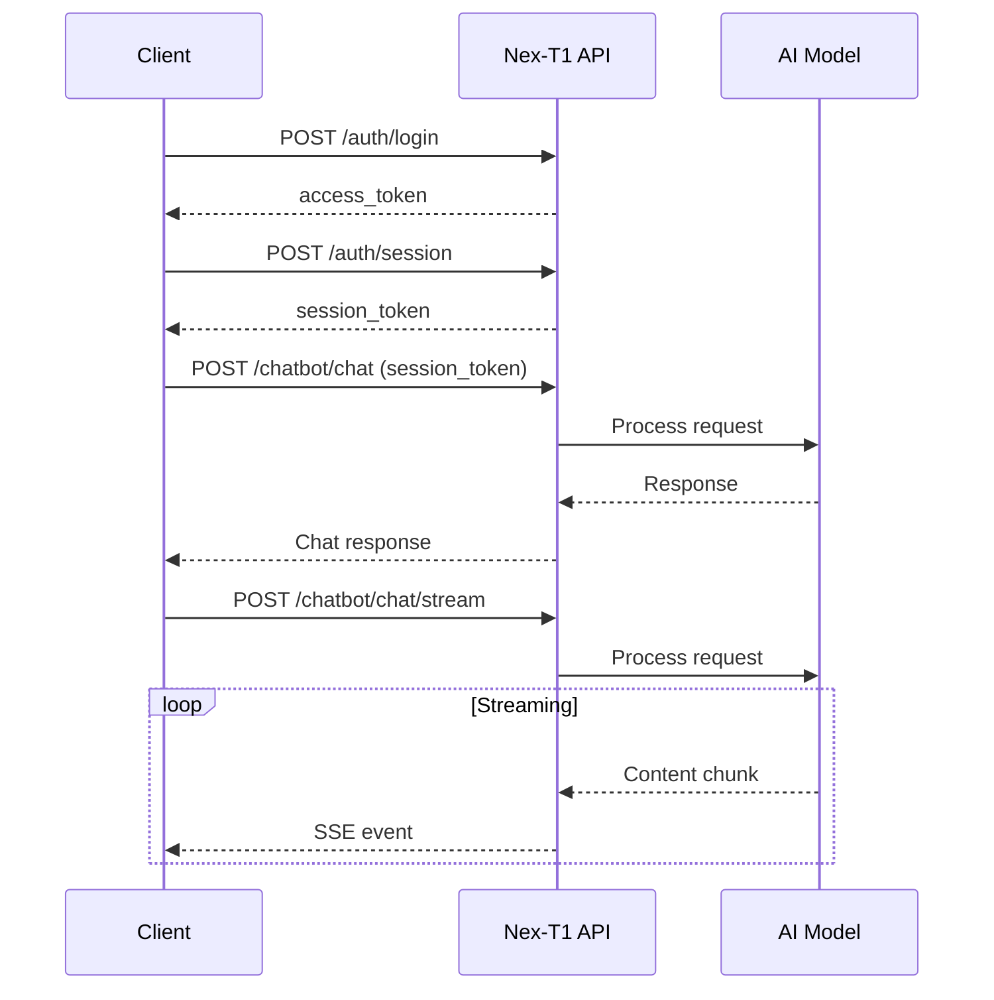
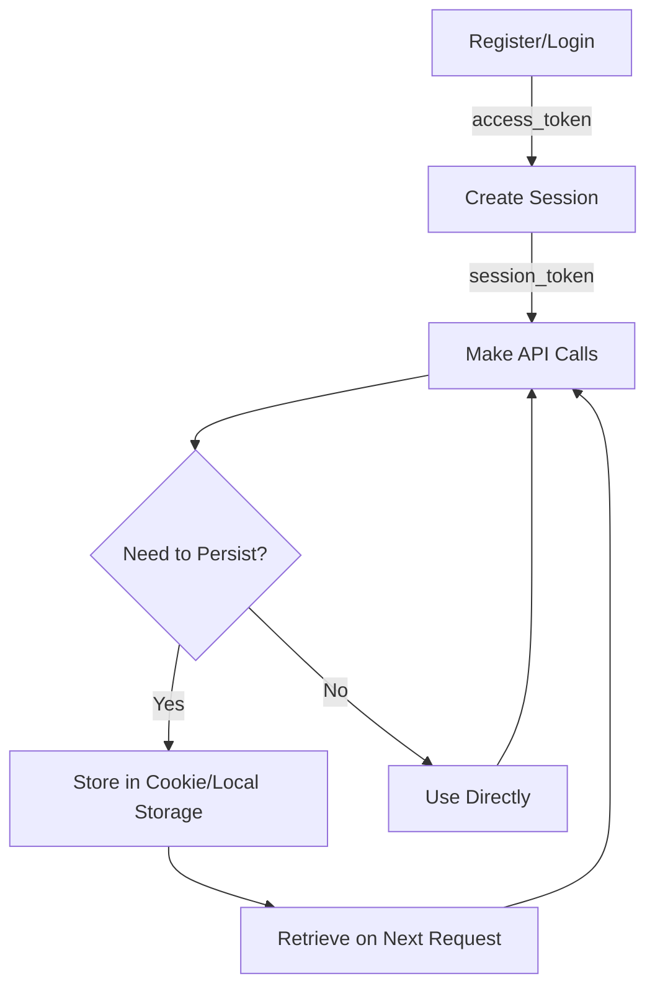

# Integration Guides

This comprehensive guide provides detailed instructions for integrating the Nex-T1 API into your applications across multiple frameworks and languages. Whether you're building a modern web app, a server-side application, or exploring different technology stacks, we've got you covered.

## Overview

The Nex-T1 API is a RESTful API that provides powerful AI-driven financial analysis, multi-agent orchestration, and blockchain interaction capabilities. All integrations follow a consistent authentication flow and support both synchronous and streaming chat interactions.

### Base URLs

<CodeGroup>
```bash Development
http://localhost:8000
```

```bash Production
https://api.nex-t1.ai
```
</CodeGroup>

### Authentication

All authenticated endpoints require a Bearer JWT token in the `Authorization` header:

```
Authorization: Bearer <access_token>
```

### Core Integration Flow



## Quick Start by Framework

Choose your framework to get started quickly:

<CardGroup cols={2}>
  <Card title="Next.js + TypeScript" icon="react" href="#nextjs--typescript">
    Server and client components with full type safety
  </Card>
  <Card title="Vue 3 + TypeScript" icon="vuejs" href="#vue-3--typescript">
    Composition API with reactive streaming
  </Card>
  <Card title="JavaScript + HTML" icon="js" href="#javascript--html">
    Vanilla JavaScript for any web project
  </Card>
  <Card title="Rust + Reqwest" icon="rust" href="#rust--reqwest">
    High-performance async Rust implementation
  </Card>
</CardGroup>

### Framework Comparison

| Feature | Next.js | Vue 3 | Vanilla JS | Rust |
|---------|---------|-------|------------|------|
| Type Safety | Full | Full | Manual | Full |
| SSR Support | Yes | Yes | No | N/A |
| Streaming | SSE + Fetch | SSE + Fetch | SSE + Fetch | Tokio Streams |
| Complexity | Medium | Medium | Low | High |
| Best For | Full-stack apps | SPAs | Simple demos | Backend services |

---

## Next.js + TypeScript

Build a production-ready Next.js application with Nex-T1 integration, featuring server-side rendering, route handlers, and streaming chat.

### Installation

<Steps>
  <Step title="Create Next.js Project">
    ```bash
    npx create-next-app@latest nex-t1-app --ts
    cd nex-t1-app
    ```
  </Step>

  <Step title="Configure Environment Variables">
    Create `.env.local`:

    ```env
    # Client-side API base URL
    NEXT_PUBLIC_NEX_T1_API_BASE_URL="http://localhost:8000"

    # Server-side API base URL (optional)
    NEX_T1_API_BASE_URL="http://localhost:8000"
    ```
  </Step>

  <Step title="Install Dependencies (if needed)">
    Next.js comes with everything you need, but you may want additional packages:

    ```bash
    npm install zustand  # For state management (optional)
    npm install @vercel/analytics  # For analytics (optional)
    ```
  </Step>
</Steps>

### Create the API Client

Create a fully typed API client with comprehensive error handling:

<CodeGroup>
```typescript lib/nexT1Client.ts
// lib/nexT1Client.ts

// ============================================================================
// Type Definitions
// ============================================================================

export type Token = {
  access_token: string;
  token_type?: string; // default: "bearer"
  expires_at: string;  // ISO date-time
};

export type TokenResponse = Token;

export type UserResponse = {
  id: number;
  email: string;
  token: Token;
};

export type SessionResponse = {
  session_id: string;  // uuid
  name?: string;
  token: Token;
};

export type Message = {
  role: "user" | "assistant" | "system";
  content: string;
};

export type ChatRequest = {
  messages: Message[];
};

export type ChatResponse = {
  messages: Message[];
};

export type StreamEvent = {
  content?: string;
  done?: boolean;
};

// ============================================================================
// Configuration
// ============================================================================

const baseUrl =
  process.env.NEX_T1_API_BASE_URL ||
  process.env.NEXT_PUBLIC_NEX_T1_API_BASE_URL ||
  "";

function withAuth(headers: HeadersInit, accessToken?: string): HeadersInit {
  return accessToken
    ? { ...headers, Authorization: `Bearer ${accessToken}` }
    : headers;
}

// ============================================================================
// API Client
// ============================================================================

export const NexT1 = {
  // AUTH METHODS

  async register(email: string, password: string): Promise<UserResponse> {
    const res = await fetch(`${baseUrl}/api/v1/auth/register`, {
      method: "POST",
      headers: { "Content-Type": "application/json" },
      body: JSON.stringify({ email, password }),
    });
    if (!res.ok) throw await res.json();
    return res.json();
  },

  async login(email: string, password: string): Promise<TokenResponse> {
    const body = new URLSearchParams();
    body.set("username", email);
    body.set("password", password);

    const res = await fetch(`${baseUrl}/api/v1/auth/login`, {
      method: "POST",
      headers: { "Content-Type": "application/x-www-form-urlencoded" },
      body,
    });
    if (!res.ok) throw await res.json();
    return res.json();
  },

  async createSession(accessToken: string): Promise<SessionResponse> {
    const res = await fetch(`${baseUrl}/api/v1/auth/session`, {
      method: "POST",
      headers: withAuth({}, accessToken),
    });
    if (!res.ok) throw await res.json();
    return res.json();
  },

  async listSessions(accessToken: string) {
    const res = await fetch(`${baseUrl}/api/v1/auth/sessions`, {
      headers: withAuth({}, accessToken)
    });
    if (!res.ok) throw await res.json();
    return res.json() as Promise<SessionResponse[]>;
  },

  async updateSessionName(
    accessToken: string,
    sessionId: string,
    name: string
  ) {
    const form = new URLSearchParams();
    form.set("name", name);

    const res = await fetch(
      `${baseUrl}/api/v1/auth/session/${sessionId}/name`,
      {
        method: "PATCH",
        headers: withAuth(
          { "Content-Type": "application/x-www-form-urlencoded" },
          accessToken
        ),
        body: form,
      }
    );
    if (!res.ok) throw await res.json();
    return res.json() as Promise<SessionResponse>;
  },

  async deleteSession(accessToken: string, sessionId: string) {
    const res = await fetch(
      `${baseUrl}/api/v1/auth/session/${sessionId}`,
      {
        method: "DELETE",
        headers: withAuth({}, accessToken),
      }
    );
    if (!res.ok) throw await res.json();
    return res.json();
  },

  // CHAT METHODS (Non-streaming)

  async chat(
    accessToken: string,
    payload: ChatRequest
  ): Promise<ChatResponse> {
    const res = await fetch(`${baseUrl}/api/v1/chatbot/chat`, {
      method: "POST",
      headers: withAuth(
        { "Content-Type": "application/json" },
        accessToken
      ),
      body: JSON.stringify(payload),
    });
    if (!res.ok) throw await res.json();
    return res.json();
  },

  // CHAT METHODS (SSE Streaming via POST /chat/stream)

  async chatStream(
    accessToken: string,
    payload: ChatRequest,
    onChunk: (e: StreamEvent) => void
  ) {
    const res = await fetch(`${baseUrl}/api/v1/chatbot/chat/stream`, {
      method: "POST",
      headers: withAuth(
        { "Content-Type": "application/json" },
        accessToken
      ),
      body: JSON.stringify(payload),
    });

    if (!res.ok || !res.body) throw await res.json();

    const reader = res.body.getReader();
    const decoder = new TextDecoder();
    let buffer = "";

    while (true) {
      const { value, done } = await reader.read();
      if (done) break;

      buffer += decoder.decode(value, { stream: true });

      // Parse Server-Sent Events lines: `data: {json}\n\n`
      const parts = buffer.split("\n\n");
      buffer = parts.pop() ?? "";

      for (const part of parts) {
        for (const line of part.split("\n")) {
          const trimmed = line.trim();
          if (trimmed.startsWith("data:")) {
            const json = trimmed.slice(5).trim();
            if (json && json !== "[DONE]") {
              try {
                onChunk(JSON.parse(json));
              } catch {}
            }
          }
        }
      }
    }
  },

  // CHAT METHODS (SSE Streaming via GET /chat/stream/sse)

  chatStreamSSEUrl(query: string, accessToken?: string) {
    const qp = new URLSearchParams({ q: query });

    if (!accessToken) {
      return `${baseUrl}/api/v1/chatbot/chat/stream/sse?${qp.toString()}`;
    }

    // Server accepts ?token=... if you cannot set Authorization header
    qp.set("token", accessToken);
    return `${baseUrl}/api/v1/chatbot/chat/stream/sse?${qp.toString()}`;
  },

  // MESSAGE HISTORY

  async getMessages(accessToken: string): Promise<ChatResponse> {
    const res = await fetch(`${baseUrl}/api/v1/chatbot/messages`, {
      headers: withAuth({}, accessToken)
    });
    if (!res.ok) throw await res.json();
    return res.json();
  },

  async clearMessages(accessToken: string) {
    const res = await fetch(`${baseUrl}/api/v1/chatbot/messages`, {
      method: "DELETE",
      headers: withAuth({}, accessToken),
    });
    if (!res.ok) throw await res.json();
    return res.json();
  },
};
```

```json package.json
{
  "name": "nex-t1-app",
  "version": "0.1.0",
  "private": true,
  "scripts": {
    "dev": "next dev",
    "build": "next build",
    "start": "next start",
    "lint": "next lint"
  },
  "dependencies": {
    "next": "^14.0.0",
    "react": "^18.2.0",
    "react-dom": "^18.2.0",
    "typescript": "^5.3.0"
  },
  "devDependencies": {
    "@types/node": "^20.10.0",
    "@types/react": "^18.2.0",
    "@types/react-dom": "^18.2.0"
  }
}
```
</CodeGroup>

### Client Component Example

<CodeGroup>
```tsx app/components/ChatSSE.tsx
"use client";

import { useEffect, useState } from "react";
import { NexT1 } from "@/lib/nexT1Client";

interface ChatSSEProps {
  accessToken: string;
}

export default function ChatSSE({ accessToken }: ChatSSEProps) {
  const [text, setText] = useState("");
  const [output, setOutput] = useState("");
  const [isStreaming, setIsStreaming] = useState(false);

  useEffect(() => {
    if (!text || !accessToken) return;

    setIsStreaming(true);
    setOutput("");

    const url = NexT1.chatStreamSSEUrl(text, accessToken);
    const es = new EventSource(url);

    es.onmessage = (ev) => {
      try {
        const chunk = JSON.parse(ev.data) as {
          content?: string;
          done?: boolean;
        };

        if (chunk.content) {
          setOutput((prev) => prev + chunk.content);
        }

        if (chunk.done) {
          es.close();
          setIsStreaming(false);
        }
      } catch (err) {
        console.error("Parse error:", err);
      }
    };

    es.onerror = () => {
      es.close();
      setIsStreaming(false);
    };

    return () => {
      es.close();
      setIsStreaming(false);
    };
  }, [text, accessToken]);

  return (
    <div className="max-w-2xl mx-auto p-6">
      <div className="mb-4">
        <input
          value={text}
          onChange={(e) => setText(e.target.value)}
          placeholder="Ask something..."
          className="w-full px-4 py-2 border rounded-lg"
          disabled={isStreaming}
        />
      </div>

      <div className="bg-gray-50 rounded-lg p-4 min-h-[200px]">
        <pre className="whitespace-pre-wrap font-sans">
          {output || "Response will appear here..."}
        </pre>
        {isStreaming && (
          <div className="mt-2 text-blue-500">Streaming...</div>
        )}
      </div>
    </div>
  );
}
```
</CodeGroup>

### Route Handler Example

Create a server-side proxy for streaming chat to keep tokens secure:

<CodeGroup>
```typescript app/api/chat/stream/route.ts
import { NextRequest } from "next/server";

export const runtime = "nodejs"; // or "edge"

export async function POST(req: NextRequest) {
  const { messages } = await req.json();

  // Retrieve session token from cookies or headers
  const accessToken = req.headers.get("x-session-token");

  if (!accessToken) {
    return new Response(
      JSON.stringify({ error: "Unauthorized" }),
      { status: 401 }
    );
  }

  const apiUrl = process.env.NEX_T1_API_BASE_URL ||
                 "http://localhost:8000";

  const upstream = await fetch(
    `${apiUrl}/api/v1/chatbot/chat/stream`,
    {
      method: "POST",
      headers: {
        "Content-Type": "application/json",
        Authorization: `Bearer ${accessToken}`,
      },
      body: JSON.stringify({ messages }),
    }
  );

  if (!upstream.ok || !upstream.body) {
    return new Response(
      await upstream.text(),
      { status: upstream.status }
    );
  }

  // Pass-through SSE body
  return new Response(upstream.body, {
    headers: {
      "Content-Type": "text/event-stream",
      "Cache-Control": "no-cache",
      "Connection": "keep-alive",
    },
  });
}
```
</CodeGroup>

### Complete Example

<CodeGroup>
```typescript example-usage.ts
import { NexT1 } from "@/lib/nexT1Client";

async function exampleFlow() {
  // 1) Login
  const login = await NexT1.login(
    "user@example.com",
    "SecurePass123!"
  );

  // 2) Create a session
  const session = await NexT1.createSession(login.access_token);
  const sessionToken = session.token.access_token;

  // 3) Synchronous chat
  const chat = await NexT1.chat(sessionToken, {
    messages: [
      { role: "user", content: "What is the price of BTC?" }
    ],
  });

  console.log("Response:", chat.messages);

  // 4) Streaming chat
  await NexT1.chatStream(
    sessionToken,
    {
      messages: [
        { role: "user", content: "Give me a market recap." }
      ]
    },
    (evt) => {
      if (evt.content) process.stdout.write(evt.content);
    }
  );
}
```
</CodeGroup>

---

## Vue 3 + TypeScript

Build a reactive Vue 3 application with the Composition API and full TypeScript support.

### Installation

<Steps>
  <Step title="Create Vue Project">
    ```bash
    npm create vite@latest nex-t1-vue -- --template vue-ts
    cd nex-t1-vue
    npm install
    ```
  </Step>

  <Step title="Configure Environment Variables">
    Create `.env`:

    ```env
    VITE_NEX_T1_API_BASE_URL="http://localhost:8000"
    ```
  </Step>
</Steps>

### Create the API Client

<CodeGroup>
```typescript src/lib/nexT1Client.ts
// src/lib/nexT1Client.ts

export type Token = {
  access_token: string;
  token_type?: string;
  expires_at: string;
};

export type TokenResponse = Token;

export type UserResponse = {
  id: number;
  email: string;
  token: Token;
};

export type SessionResponse = {
  session_id: string;
  name?: string;
  token: Token;
};

export type Message = {
  role: "user" | "assistant" | "system";
  content: string;
};

export type ChatRequest = {
  messages: Message[];
};

export type ChatResponse = {
  messages: Message[];
};

export type StreamEvent = {
  content?: string;
  done?: boolean;
};

const baseUrl = import.meta.env.VITE_NEX_T1_API_BASE_URL as string;

function withAuth(headers: HeadersInit, accessToken?: string): HeadersInit {
  return accessToken
    ? { ...headers, Authorization: `Bearer ${accessToken}` }
    : headers;
}

export const NexT1 = {
  async register(email: string, password: string): Promise<UserResponse> {
    const res = await fetch(`${baseUrl}/api/v1/auth/register`, {
      method: "POST",
      headers: { "Content-Type": "application/json" },
      body: JSON.stringify({ email, password }),
    });
    if (!res.ok) throw await res.json();
    return res.json();
  },

  async login(email: string, password: string): Promise<TokenResponse> {
    const body = new URLSearchParams();
    body.set("username", email);
    body.set("password", password);

    const res = await fetch(`${baseUrl}/api/v1/auth/login`, {
      method: "POST",
      headers: { "Content-Type": "application/x-www-form-urlencoded" },
      body,
    });
    if (!res.ok) throw await res.json();
    return res.json();
  },

  async createSession(accessToken: string): Promise<SessionResponse> {
    const res = await fetch(`${baseUrl}/api/v1/auth/session`, {
      method: "POST",
      headers: withAuth({}, accessToken),
    });
    if (!res.ok) throw await res.json();
    return res.json();
  },

  async listSessions(accessToken: string) {
    const res = await fetch(`${baseUrl}/api/v1/auth/sessions`, {
      headers: withAuth({}, accessToken)
    });
    if (!res.ok) throw await res.json();
    return res.json() as Promise<SessionResponse[]>;
  },

  async chat(
    accessToken: string,
    payload: ChatRequest
  ): Promise<ChatResponse> {
    const res = await fetch(`${baseUrl}/api/v1/chatbot/chat`, {
      method: "POST",
      headers: withAuth(
        { "Content-Type": "application/json" },
        accessToken
      ),
      body: JSON.stringify(payload),
    });
    if (!res.ok) throw await res.json();
    return res.json();
  },

  async chatStream(
    accessToken: string,
    payload: ChatRequest,
    onChunk: (e: StreamEvent) => void
  ) {
    const res = await fetch(`${baseUrl}/api/v1/chatbot/chat/stream`, {
      method: "POST",
      headers: withAuth(
        { "Content-Type": "application/json" },
        accessToken
      ),
      body: JSON.stringify(payload),
    });

    if (!res.ok || !res.body) throw await res.json();

    const reader = res.body.getReader();
    const decoder = new TextDecoder();
    let buffer = "";

    while (true) {
      const { value, done } = await reader.read();
      if (done) break;

      buffer += decoder.decode(value, { stream: true });
      const parts = buffer.split("\n\n");
      buffer = parts.pop() ?? "";

      for (const part of parts) {
        for (const line of part.split("\n")) {
          const trimmed = line.trim();
          if (trimmed.startsWith("data:")) {
            const json = trimmed.slice(5).trim();
            if (json && json !== "[DONE]") {
              try {
                onChunk(JSON.parse(json));
              } catch {}
            }
          }
        }
      }
    }
  },

  chatStreamSSEUrl(query: string, accessToken?: string) {
    const qp = new URLSearchParams({ q: query });
    if (!accessToken) {
      return `${baseUrl}/api/v1/chatbot/chat/stream/sse?${qp.toString()}`;
    }
    qp.set("token", accessToken);
    return `${baseUrl}/api/v1/chatbot/chat/stream/sse?${qp.toString()}`;
  },

  async getMessages(accessToken: string): Promise<ChatResponse> {
    const res = await fetch(`${baseUrl}/api/v1/chatbot/messages`, {
      headers: withAuth({}, accessToken)
    });
    if (!res.ok) throw await res.json();
    return res.json();
  },

  async clearMessages(accessToken: string) {
    const res = await fetch(`${baseUrl}/api/v1/chatbot/messages`, {
      method: "DELETE",
      headers: withAuth({}, accessToken),
    });
    if (!res.ok) throw await res.json();
    return res.json();
  },
};
```

```json package.json
{
  "name": "nex-t1-vue",
  "version": "0.1.0",
  "type": "module",
  "scripts": {
    "dev": "vite",
    "build": "vue-tsc && vite build",
    "preview": "vite preview"
  },
  "dependencies": {
    "vue": "^3.4.0"
  },
  "devDependencies": {
    "@vitejs/plugin-vue": "^5.0.0",
    "typescript": "^5.3.0",
    "vite": "^5.0.0",
    "vue-tsc": "^1.8.0"
  }
}
```
</CodeGroup>

### Vue Component Example

<CodeGroup>
```vue src/components/ChatSSE.vue
<script setup lang="ts">
import { ref, watch, onBeforeUnmount } from 'vue'
import { NexT1 } from '@/lib/nexT1Client'

// Props
const props = defineProps<{
  accessToken: string
}>()

// State
const prompt = ref('')
const output = ref('')
const isStreaming = ref(false)
let es: EventSource | null = null

// Watch for changes and stream
watch([prompt, () => props.accessToken], ([p, token]) => {
  if (!p || !token) return

  output.value = ''
  isStreaming.value = true

  if (es) es.close()

  const url = NexT1.chatStreamSSEUrl(p, token)
  es = new EventSource(url)

  es.onmessage = (ev) => {
    try {
      const chunk = JSON.parse(ev.data) as {
        content?: string;
        done?: boolean;
      }

      if (chunk.content) {
        output.value += chunk.content
      }

      if (chunk.done) {
        es?.close()
        isStreaming.value = false
      }
    } catch (err) {
      console.error('Parse error:', err)
    }
  }

  es.onerror = () => {
    es?.close()
    isStreaming.value = false
  }
})

// Cleanup
onBeforeUnmount(() => {
  es?.close()
})
</script>

<template>
  <div class="chat-container">
    <div class="input-section">
      <input
        v-model="prompt"
        placeholder="Ask something..."
        :disabled="isStreaming"
        class="chat-input"
      />
    </div>

    <div class="output-section">
      <pre class="output-text">{{
        output || 'Response will appear here...'
      }}</pre>
      <div v-if="isStreaming" class="streaming-indicator">
        Streaming...
      </div>
    </div>
  </div>
</template>

<style scoped>
.chat-container {
  max-width: 800px;
  margin: 0 auto;
  padding: 2rem;
}

.input-section {
  margin-bottom: 1rem;
}

.chat-input {
  width: 100%;
  padding: 0.75rem;
  border: 1px solid #e5e7eb;
  border-radius: 0.5rem;
  font-size: 1rem;
}

.chat-input:disabled {
  opacity: 0.5;
  cursor: not-allowed;
}

.output-section {
  background: #f9fafb;
  border-radius: 0.5rem;
  padding: 1rem;
  min-height: 200px;
}

.output-text {
  white-space: pre-wrap;
  font-family: system-ui, sans-serif;
  margin: 0;
}

.streaming-indicator {
  margin-top: 0.5rem;
  color: #3b82f6;
  font-size: 0.875rem;
}
</style>
```
</CodeGroup>

### Complete Example

<CodeGroup>
```typescript example-usage.ts
import { NexT1 } from '@/lib/nexT1Client'

async function exampleFlow() {
  // Login
  const login = await NexT1.login(
    'user@example.com',
    'SecurePass123!'
  )

  // Create session
  const session = await NexT1.createSession(login.access_token)
  const sessionToken = session.token.access_token

  // Synchronous chat
  const chat = await NexT1.chat(sessionToken, {
    messages: [
      { role: 'user', content: 'What is the price of BTC?' }
    ],
  })

  console.log('Response:', chat.messages)

  // Streaming chat
  await NexT1.chatStream(
    sessionToken,
    {
      messages: [
        { role: 'user', content: 'Brief market recap.' }
      ]
    },
    (evt) => {
      if (evt.content) console.log(evt.content)
    }
  )
}
```
</CodeGroup>

---

## JavaScript + HTML

Build a simple integration using vanilla JavaScript and HTML - perfect for demos, prototypes, or learning.

### Project Structure

<Steps>
  <Step title="Create Project Files">
    ```bash
    mkdir nex-t1-demo
    cd nex-t1-demo
    touch index.html app.js config.js
    ```
  </Step>

  <Step title="Configure Base URL">
    Edit `config.js`:

    ```javascript
    export const API_BASE_URL = "http://localhost:8000";
    // or "https://api.nex-t1.ai"
    ```
  </Step>
</Steps>

### Complete Implementation

<CodeGroup>
```html index.html
<!doctype html>
<html lang="en">
  <head>
    <meta charset="utf-8" />
    <meta name="viewport" content="width=device-width, initial-scale=1" />
    <title>Nex-T1 Vanilla JS Demo</title>
    <style>
      * {
        margin: 0;
        padding: 0;
        box-sizing: border-box;
      }

      body {
        font-family: -apple-system, BlinkMacSystemFont, 'Segoe UI',
                     'Roboto', 'Oxygen', 'Ubuntu', 'Cantarell',
                     sans-serif;
        max-width: 900px;
        margin: 2rem auto;
        padding: 0 1rem;
        background: #f8fafc;
      }

      h1 {
        color: #1e293b;
        margin-bottom: 2rem;
      }

      .section {
        background: white;
        border-radius: 0.5rem;
        padding: 1.5rem;
        margin-bottom: 1rem;
        box-shadow: 0 1px 3px rgba(0, 0, 0, 0.1);
      }

      .section h2 {
        color: #334155;
        font-size: 1.125rem;
        margin-bottom: 1rem;
      }

      .row {
        display: flex;
        gap: 0.5rem;
        margin-bottom: 0.75rem;
        flex-wrap: wrap;
      }

      input, button {
        padding: 0.625rem 1rem;
        font-size: 0.9375rem;
        border: 1px solid #cbd5e1;
        border-radius: 0.375rem;
        font-family: inherit;
      }

      input {
        flex: 1;
        min-width: 200px;
      }

      input:focus {
        outline: none;
        border-color: #3b82f6;
        box-shadow: 0 0 0 3px rgba(59, 130, 246, 0.1);
      }

      input:read-only {
        background: #f1f5f9;
        color: #64748b;
      }

      button {
        background: #3b82f6;
        color: white;
        border: none;
        cursor: pointer;
        font-weight: 500;
        transition: background 0.2s;
      }

      button:hover:not(:disabled) {
        background: #2563eb;
      }

      button:disabled {
        background: #cbd5e1;
        cursor: not-allowed;
      }

      button.secondary {
        background: #64748b;
      }

      button.secondary:hover:not(:disabled) {
        background: #475569;
      }

      .output {
        background: #f8fafc;
        padding: 1rem;
        border: 1px solid #e2e8f0;
        border-radius: 0.375rem;
        min-height: 200px;
        max-height: 400px;
        overflow-y: auto;
        font-family: 'SF Mono', Monaco, 'Cascadia Code',
                     'Courier New', monospace;
        font-size: 0.875rem;
        white-space: pre-wrap;
        word-wrap: break-word;
        line-height: 1.6;
      }

      .status {
        padding: 0.5rem 1rem;
        border-radius: 0.375rem;
        font-size: 0.875rem;
        margin-top: 0.5rem;
      }

      .status.success {
        background: #d1fae5;
        color: #065f46;
      }

      .status.error {
        background: #fee2e2;
        color: #991b1b;
      }

      .status.info {
        background: #dbeafe;
        color: #1e40af;
      }
    </style>
  </head>
  <body>
    <h1>Nex-T1 Vanilla JS Demo</h1>

    <!-- Authentication Section -->
    <div class="section">
      <h2>1. Authentication</h2>
      <div class="row">
        <input id="email" type="email" placeholder="Email"
               value="user@example.com" />
        <input id="password" type="password" placeholder="Password"
               value="" />
        <button id="loginBtn">Login</button>
      </div>
      <div id="authStatus"></div>
    </div>

    <!-- Session Section -->
    <div class="section">
      <h2>2. Create Session</h2>
      <div class="row">
        <button id="createSessionBtn" disabled>Create Session</button>
        <input id="sessionToken" placeholder="Session token will appear here"
               readonly />
      </div>
      <div id="sessionStatus"></div>
    </div>

    <!-- Chat Section -->
    <div class="section">
      <h2>3. Chat with Nex-T1</h2>
      <div class="row">
        <input id="prompt" placeholder="Ask something..."
               style="flex: 2" />
        <button id="chatBtn" disabled>Send</button>
        <button id="streamBtn" class="secondary" disabled>Stream</button>
      </div>
      <h3 style="margin-top: 1.5rem; margin-bottom: 0.5rem; color: #475569;">
        Output
      </h3>
      <div class="output" id="out">
        Response will appear here...
      </div>
    </div>

    <script type="module" src="app.js"></script>
  </body>
</html>
```

```javascript config.js
// config.js
export const API_BASE_URL = "http://localhost:8000";
// For production: export const API_BASE_URL = "https://api.nex-t1.ai";
```

```javascript app.js
// app.js
import { API_BASE_URL } from './config.js';

// ============================================================================
// State Management
// ============================================================================

let accessToken = null;
let sessionToken = null;

// ============================================================================
// DOM Helpers
// ============================================================================

const $ = (id) => document.getElementById(id);
const out = $('out');

function setStatus(elementId, message, type = 'info') {
  const el = $(elementId);
  el.innerHTML = `<div class="status ${type}">${message}</div>`;
}

function clearStatus(elementId) {
  $(elementId).innerHTML = '';
}

// ============================================================================
// Authentication Flow
// ============================================================================

$('loginBtn').onclick = async () => {
  const email = $('email').value.trim();
  const password = $('password').value;

  if (!email || !password) {
    setStatus('authStatus', 'Please enter email and password', 'error');
    return;
  }

  try {
    const body = new URLSearchParams();
    body.set('username', email);
    body.set('password', password);

    const res = await fetch(`${API_BASE_URL}/api/v1/auth/login`, {
      method: 'POST',
      headers: {
        'Content-Type': 'application/x-www-form-urlencoded'
      },
      body,
    });

    if (!res.ok) {
      const error = await res.json();
      throw new Error(error.detail || 'Login failed');
    }

    const tok = await res.json();
    accessToken = tok.access_token;

    $('createSessionBtn').disabled = false;
    setStatus('authStatus', 'Successfully logged in!', 'success');
    out.textContent = `Logged in as ${email}`;
  } catch (err) {
    setStatus('authStatus', `Error: ${err.message}`, 'error');
    out.textContent = `Login failed: ${err.message}`;
  }
};

// ============================================================================
// Session Management
// ============================================================================

$('createSessionBtn').onclick = async () => {
  try {
    const res = await fetch(`${API_BASE_URL}/api/v1/auth/session`, {
      method: 'POST',
      headers: { Authorization: `Bearer ${accessToken}` },
    });

    if (!res.ok) {
      const error = await res.json();
      throw new Error(error.detail || 'Create session failed');
    }

    const s = await res.json();
    sessionToken = s.token.access_token;

    $('sessionToken').value = sessionToken;
    $('chatBtn').disabled = false;
    $('streamBtn').disabled = false;

    setStatus('sessionStatus',
      `Session created: ${s.session_id}`, 'success');
    out.textContent = `Session ID: ${s.session_id}\nReady to chat!`;
  } catch (err) {
    setStatus('sessionStatus', `Error: ${err.message}`, 'error');
    out.textContent = `Create session failed: ${err.message}`;
  }
};

// ============================================================================
// Chat - Non-Streaming
// ============================================================================

$('chatBtn').onclick = async () => {
  const prompt = $('prompt').value.trim();

  if (!prompt) {
    out.textContent = 'Please enter a message';
    return;
  }

  try {
    out.textContent = 'Sending message...';

    const res = await fetch(`${API_BASE_URL}/api/v1/chatbot/chat`, {
      method: 'POST',
      headers: {
        'Content-Type': 'application/json',
        Authorization: `Bearer ${sessionToken}`,
      },
      body: JSON.stringify({
        messages: [{ role: 'user', content: prompt }]
      }),
    });

    if (!res.ok) {
      const error = await res.json();
      throw new Error(error.detail || 'Chat request failed');
    }

    const data = await res.json();
    out.textContent = JSON.stringify(data, null, 2);
  } catch (err) {
    out.textContent = `Chat failed: ${err.message}`;
  }
};

// ============================================================================
// Chat - Streaming (SSE)
// ============================================================================

let currentEventSource = null;

$('streamBtn').onclick = async () => {
  const prompt = $('prompt').value.trim();

  if (!prompt) {
    out.textContent = 'Please enter a message';
    return;
  }

  // Close existing stream
  if (currentEventSource) {
    currentEventSource.close();
  }

  try {
    out.textContent = '';

    const url = `${API_BASE_URL}/api/v1/chatbot/chat/stream/sse?` +
      new URLSearchParams({
        q: prompt,
        token: sessionToken
      });

    currentEventSource = new EventSource(url);

    currentEventSource.onmessage = (ev) => {
      try {
        const chunk = JSON.parse(ev.data);

        if (chunk.content) {
          out.textContent += chunk.content;
        }

        if (chunk.done) {
          currentEventSource.close();
          currentEventSource = null;
        }
      } catch (err) {
        console.error('Parse error:', err);
      }
    };

    currentEventSource.onerror = (err) => {
      console.error('EventSource error:', err);
      out.textContent += '\n\n[Connection closed or error occurred]';
      currentEventSource.close();
      currentEventSource = null;
    };
  } catch (err) {
    out.textContent = `Stream failed: ${err.message}`;
  }
};

// ============================================================================
// Cleanup
// ============================================================================

window.addEventListener('beforeunload', () => {
  if (currentEventSource) {
    currentEventSource.close();
  }
});
```
</CodeGroup>

### Running the Demo

<Steps>
  <Step title="Start a Local Server">
    You need to serve the files over HTTP (not `file://`):

    ```bash
    # Option 1: Python
    python3 -m http.server 3000

    # Option 2: Node.js
    npx serve

    # Option 3: PHP
    php -S localhost:3000
    ```
  </Step>

  <Step title="Open in Browser">
    Navigate to `http://localhost:3000` and test the integration flow
  </Step>
</Steps>

---

## Rust + Reqwest

Build a high-performance Rust application with async/await and streaming support.

### Project Setup

<Steps>
  <Step title="Create New Project">
    ```bash
    cargo new nex_t1_rust_demo --bin
    cd nex_t1_rust_demo
    ```
  </Step>

  <Step title="Configure Dependencies">
    Edit `Cargo.toml`:

    ```toml
    [package]
    name = "nex_t1_rust_demo"
    version = "0.1.0"
    edition = "2021"

    [dependencies]
    tokio = { version = "1", features = ["full"] }
    reqwest = { version = "0.11", features = [
      "json",
      "stream",
      "gzip",
      "brotli",
      "deflate"
    ] }
    serde = { version = "1", features = ["derive"] }
    serde_json = "1"
    futures-util = "0.3"
    anyhow = "1.0"
    ```
  </Step>

  <Step title="Set Environment Variables">
    Create `.env` (optional):

    ```bash
    NEX_T1_API_BASE_URL=http://localhost:8000
    NEX_T1_EMAIL=user@example.com
    NEX_T1_PASSWORD=SecurePass123!
    ```
  </Step>
</Steps>

### Implementation

<CodeGroup>
```rust src/models.rs
// src/models.rs
use serde::{Deserialize, Serialize};

#[derive(Debug, Deserialize, Serialize, Clone)]
pub struct Token {
    pub access_token: String,
    #[serde(default)]
    pub token_type: Option<String>,
    pub expires_at: String,
}

pub type TokenResponse = Token;

#[derive(Debug, Deserialize, Serialize, Clone)]
pub struct UserResponse {
    pub id: i64,
    pub email: String,
    pub token: Token,
}

#[derive(Debug, Deserialize, Serialize, Clone)]
pub struct SessionResponse {
    pub session_id: String,
    #[serde(default)]
    pub name: Option<String>,
    pub token: Token,
}

#[derive(Debug, Deserialize, Serialize, Clone)]
pub struct Message {
    pub role: String, // "user" | "assistant" | "system"
    pub content: String,
}

#[derive(Debug, Deserialize, Serialize, Clone)]
pub struct ChatRequest {
    pub messages: Vec<Message>,
}

#[derive(Debug, Deserialize, Serialize, Clone)]
pub struct ChatResponse {
    pub messages: Vec<Message>,
}

#[derive(Debug, Deserialize, Serialize, Clone, Default)]
pub struct StreamEvent {
    #[serde(default)]
    pub content: Option<String>,
    #[serde(default)]
    pub done: Option<bool>,
}
```

```rust src/client.rs
// src/client.rs
use anyhow::{Context, Result};
use futures_util::StreamExt;
use reqwest::Client;
use serde_json::json;

use crate::models::*;

pub struct NexT1Client {
    base_url: String,
    http: Client,
}

impl NexT1Client {
    pub fn new(base_url: impl Into<String>) -> Self {
        Self {
            base_url: base_url.into(),
            http: Client::new(),
        }
    }

    // AUTH METHODS

    pub async fn register(
        &self,
        email: &str,
        password: &str,
    ) -> Result<UserResponse> {
        let res = self
            .http
            .post(format!("{}/api/v1/auth/register", self.base_url))
            .json(&json!({
                "email": email,
                "password": password
            }))
            .send()
            .await?;

        res.error_for_status()?
            .json()
            .await
            .context("Failed to parse register response")
    }

    pub async fn login(
        &self,
        email: &str,
        password: &str,
    ) -> Result<TokenResponse> {
        let res = self
            .http
            .post(format!("{}/api/v1/auth/login", self.base_url))
            .form(&[("username", email), ("password", password)])
            .send()
            .await?;

        res.error_for_status()?
            .json()
            .await
            .context("Failed to parse login response")
    }

    pub async fn create_session(
        &self,
        access_token: &str,
    ) -> Result<SessionResponse> {
        let res = self
            .http
            .post(format!("{}/api/v1/auth/session", self.base_url))
            .bearer_auth(access_token)
            .send()
            .await?;

        res.error_for_status()?
            .json()
            .await
            .context("Failed to parse session response")
    }

    pub async fn list_sessions(
        &self,
        access_token: &str,
    ) -> Result<Vec<SessionResponse>> {
        let res = self
            .http
            .get(format!("{}/api/v1/auth/sessions", self.base_url))
            .bearer_auth(access_token)
            .send()
            .await?;

        res.error_for_status()?
            .json()
            .await
            .context("Failed to parse sessions response")
    }

    // CHAT METHODS

    pub async fn chat(
        &self,
        session_token: &str,
        req: &ChatRequest,
    ) -> Result<ChatResponse> {
        let res = self
            .http
            .post(format!("{}/api/v1/chatbot/chat", self.base_url))
            .bearer_auth(session_token)
            .json(req)
            .send()
            .await?;

        res.error_for_status()?
            .json()
            .await
            .context("Failed to parse chat response")
    }

    pub async fn chat_stream<F>(
        &self,
        session_token: &str,
        req: &ChatRequest,
        mut on_chunk: F,
    ) -> Result<()>
    where
        F: FnMut(StreamEvent),
    {
        let res = self
            .http
            .post(format!(
                "{}/api/v1/chatbot/chat/stream",
                self.base_url
            ))
            .bearer_auth(session_token)
            .json(req)
            .send()
            .await?;

        let mut stream = res.bytes_stream();
        let mut buffer = String::new();

        while let Some(chunk) = stream.next().await {
            let bytes = chunk?;
            let text = String::from_utf8_lossy(&bytes);
            buffer.push_str(&text);

            // Parse SSE events (delimiter: \n\n)
            while let Some(idx) = buffer.find("\n\n") {
                let event = buffer[..idx].to_string();
                buffer.drain(..idx + 2);

                for line in event.lines() {
                    if let Some(data) = line.strip_prefix("data:") {
                        let json = data.trim();
                        if json != "[DONE]" && !json.is_empty() {
                            if let Ok(evt) =
                                serde_json::from_str::<StreamEvent>(json)
                            {
                                on_chunk(evt);
                            }
                        }
                    }
                }
            }
        }

        Ok(())
    }

    // MESSAGE HISTORY

    pub async fn get_messages(
        &self,
        session_token: &str,
    ) -> Result<ChatResponse> {
        let res = self
            .http
            .get(format!("{}/api/v1/chatbot/messages", self.base_url))
            .bearer_auth(session_token)
            .send()
            .await?;

        res.error_for_status()?
            .json()
            .await
            .context("Failed to parse messages response")
    }

    pub async fn clear_messages(
        &self,
        session_token: &str,
    ) -> Result<serde_json::Value> {
        let res = self
            .http
            .delete(format!(
                "{}/api/v1/chatbot/messages",
                self.base_url
            ))
            .bearer_auth(session_token)
            .send()
            .await?;

        res.error_for_status()?
            .json()
            .await
            .context("Failed to parse clear messages response")
    }
}
```

```rust src/main.rs
// src/main.rs
mod client;
mod models;

use anyhow::Result;
use client::NexT1Client;
use models::{ChatRequest, Message};
use std::env;
use std::io::{self, Write};

#[tokio::main]
async fn main() -> Result<()> {
    // Configuration
    let base_url = env::var("NEX_T1_API_BASE_URL")
        .unwrap_or_else(|_| "http://localhost:8000".into());
    let email = env::var("NEX_T1_EMAIL")
        .unwrap_or_else(|_| "user@example.com".into());
    let password = env::var("NEX_T1_PASSWORD")
        .unwrap_or_else(|_| "SecurePass123!".into());

    println!("🚀 Nex-T1 Rust Demo");
    println!("=====================================");
    println!("Base URL: {}", base_url);
    println!("Email: {}", email);
    println!();

    // Initialize client
    let api = NexT1Client::new(base_url);

    // Step 1: Login
    println!("🔑 Logging in...");
    let token = api.login(&email, &password).await?;
    println!("✓ Logged in successfully");
    println!("  Token expires: {}", token.expires_at);
    println!();

    // Step 2: Create session
    println!("📝 Creating session...");
    let session = api.create_session(&token.access_token).await?;
    println!("✓ Session created");
    println!("  Session ID: {}", session.session_id);
    println!("  Name: {}", session.name.unwrap_or_else(|| "Unnamed".into()));
    println!();

    let session_token = session.token.access_token.clone();

    // Step 3: Non-streaming chat
    println!("💬 Sending non-streaming chat request...");
    let chat_response = api
        .chat(
            &session_token,
            &ChatRequest {
                messages: vec![Message {
                    role: "user".into(),
                    content: "What is the current price of Bitcoin?".into(),
                }],
            },
        )
        .await?;

    println!("✓ Received {} messages", chat_response.messages.len());
    for (i, msg) in chat_response.messages.iter().enumerate() {
        println!("  Message {}: [{}] {}", i + 1, msg.role,
                 &msg.content[..msg.content.len().min(100)]);
    }
    println!();

    // Step 4: Streaming chat
    println!("🌊 Sending streaming chat request...");
    println!("Response: ");
    print!("  ");
    io::stdout().flush()?;

    api.chat_stream(
        &session_token,
        &ChatRequest {
            messages: vec![Message {
                role: "user".into(),
                content: "Give me a two-sentence market recap.".into(),
            }],
        },
        |evt| {
            if let Some(content) = evt.content {
                print!("{}", content);
                io::stdout().flush().unwrap();
            }
            if matches!(evt.done, Some(true)) {
                println!("\n✓ Stream complete");
            }
        },
    )
    .await?;

    println!();
    println!("=====================================");
    println!("✨ Demo complete!");

    Ok(())
}
```

```toml Cargo.toml
[package]
name = "nex_t1_rust_demo"
version = "0.1.0"
edition = "2021"

[dependencies]
tokio = { version = "1", features = ["full"] }
reqwest = { version = "0.11", features = [
  "json",
  "stream",
  "gzip",
  "brotli",
  "deflate"
] }
serde = { version = "1", features = ["derive"] }
serde_json = "1"
futures-util = "0.3"
anyhow = "1.0"
```
</CodeGroup>

### Running the Application

<Steps>
  <Step title="Set Environment Variables">
    ```bash
    export NEX_T1_API_BASE_URL=http://localhost:8000
    export NEX_T1_EMAIL=user@example.com
    export NEX_T1_PASSWORD=SecurePass123!
    ```
  </Step>

  <Step title="Build and Run">
    ```bash
    cargo build --release
    cargo run
    ```
  </Step>
</Steps>

---

## Common Patterns

These reusable patterns apply across all frameworks and languages.

### Authentication Flow

All integrations follow this standard flow:



### Error Handling Best Practices

<Tabs>
  <Tab title="TypeScript">
    ```typescript
    async function safeApiCall<T>(
      apiFunction: () => Promise<T>
    ): Promise<{ data?: T; error?: string }> {
      try {
        const data = await apiFunction();
        return { data };
      } catch (err: any) {
        // Handle validation errors (422)
        if (err.detail && Array.isArray(err.detail)) {
          const errors = err.detail.map(
            (e: any) => `${e.loc?.join('.')}: ${e.msg}`
          ).join(', ');
          return { error: errors };
        }

        // Handle standard errors
        return { error: err.detail || err.message || 'Unknown error' };
      }
    }

    // Usage
    const { data, error } = await safeApiCall(() =>
      NexT1.chat(token, { messages: [...] })
    );

    if (error) {
      console.error('Chat failed:', error);
    } else {
      console.log('Success:', data);
    }
    ```
  </Tab>

  <Tab title="Rust">
    ```rust
    use anyhow::{Context, Result};

    async fn safe_api_call(
        api: &NexT1Client,
        token: &str,
    ) -> Result<ChatResponse> {
        api.chat(token, &ChatRequest {
            messages: vec![/* ... */],
        })
        .await
        .context("Failed to send chat request")
    }

    // Usage
    match safe_api_call(&api, &token).await {
        Ok(response) => println!("Success: {:?}", response),
        Err(e) => eprintln!("Error: {:#}", e),
    }
    ```
  </Tab>

  <Tab title="JavaScript">
    ```javascript
    async function safeApiCall(apiFunction) {
      try {
        const data = await apiFunction();
        return { data, error: null };
      } catch (err) {
        return {
          data: null,
          error: err.detail || err.message || 'Unknown error'
        };
      }
    }

    // Usage
    const { data, error } = await safeApiCall(() =>
      fetch(url, options).then(r => r.json())
    );

    if (error) {
      console.error('Request failed:', error);
    } else {
      console.log('Success:', data);
    }
    ```
  </Tab>
</Tabs>

### Streaming Chat Patterns

<Tabs>
  <Tab title="POST Stream">
    **Best for:** Server-side implementations, full control over stream parsing

    ```typescript
    async function streamChat(token: string, messages: Message[]) {
      const response = await fetch(`${API_URL}/chatbot/chat/stream`, {
        method: 'POST',
        headers: {
          'Content-Type': 'application/json',
          'Authorization': `Bearer ${token}`,
        },
        body: JSON.stringify({ messages }),
      });

      const reader = response.body!.getReader();
      const decoder = new TextDecoder();
      let buffer = '';

      while (true) {
        const { value, done } = await reader.read();
        if (done) break;

        buffer += decoder.decode(value, { stream: true });
        const parts = buffer.split('\n\n');
        buffer = parts.pop() || '';

        for (const part of parts) {
          for (const line of part.split('\n')) {
            if (line.startsWith('data:')) {
              const json = line.slice(5).trim();
              if (json && json !== '[DONE]') {
                const event = JSON.parse(json);
                yield event;
              }
            }
          }
        }
      }
    }
    ```
  </Tab>

  <Tab title="GET SSE">
    **Best for:** Browser clients, simple implementation

    ```javascript
    function streamChatSSE(token, query, onChunk) {
      const url = `${API_URL}/chatbot/chat/stream/sse?` +
        new URLSearchParams({ q: query, token });

      const eventSource = new EventSource(url);

      eventSource.onmessage = (event) => {
        const chunk = JSON.parse(event.data);
        onChunk(chunk);

        if (chunk.done) {
          eventSource.close();
        }
      };

      eventSource.onerror = () => {
        eventSource.close();
      };

      return eventSource; // Return for manual cleanup
    }
    ```
  </Tab>
</Tabs>

### Token Management

<Tabs>
  <Tab title="Client-Side (Browser)">
    ```typescript
    // Token store with expiration checking
    class TokenStore {
      private static readonly ACCESS_KEY = 'nex_access_token';
      private static readonly SESSION_KEY = 'nex_session_token';

      static saveAccessToken(token: Token) {
        localStorage.setItem(this.ACCESS_KEY, JSON.stringify(token));
      }

      static saveSessionToken(token: Token) {
        localStorage.setItem(this.SESSION_KEY, JSON.stringify(token));
      }

      static getAccessToken(): Token | null {
        const data = localStorage.getItem(this.ACCESS_KEY);
        if (!data) return null;

        const token = JSON.parse(data) as Token;
        if (this.isExpired(token)) {
          this.clearAccessToken();
          return null;
        }

        return token;
      }

      static getSessionToken(): Token | null {
        const data = localStorage.getItem(this.SESSION_KEY);
        if (!data) return null;

        const token = JSON.parse(data) as Token;
        if (this.isExpired(token)) {
          this.clearSessionToken();
          return null;
        }

        return token;
      }

      static clearAccessToken() {
        localStorage.removeItem(this.ACCESS_KEY);
      }

      static clearSessionToken() {
        localStorage.removeItem(this.SESSION_KEY);
      }

      static clearAll() {
        this.clearAccessToken();
        this.clearSessionToken();
      }

      private static isExpired(token: Token): boolean {
        const expiresAt = new Date(token.expires_at);
        return expiresAt <= new Date();
      }
    }
    ```
  </Tab>

  <Tab title="Server-Side (Next.js)">
    ```typescript
    // app/api/auth/route.ts
    import { cookies } from 'next/headers';

    export async function POST(request: Request) {
      const { email, password } = await request.json();

      // Login
      const tokenResponse = await fetch(
        `${process.env.NEX_T1_API_BASE_URL}/api/v1/auth/login`,
        {
          method: 'POST',
          headers: {
            'Content-Type': 'application/x-www-form-urlencoded'
          },
          body: new URLSearchParams({
            username: email,
            password
          }),
        }
      );

      const token = await tokenResponse.json();

      // Store in HttpOnly cookie
      cookies().set('nex_token', token.access_token, {
        httpOnly: true,
        secure: process.env.NODE_ENV === 'production',
        sameSite: 'lax',
        maxAge: 60 * 60 * 24 * 7, // 7 days
        path: '/',
      });

      return Response.json({ success: true });
    }
    ```
  </Tab>
</Tabs>

### Session Management

```typescript
// Session lifecycle manager
class SessionManager {
  private sessionToken: string | null = null;
  private sessionId: string | null = null;

  async initialize(accessToken: string): Promise<void> {
    const session = await NexT1.createSession(accessToken);
    this.sessionToken = session.token.access_token;
    this.sessionId = session.session_id;
  }

  getToken(): string | null {
    return this.sessionToken;
  }

  getSessionId(): string | null {
    return this.sessionId;
  }

  async rename(accessToken: string, name: string): Promise<void> {
    if (!this.sessionId) throw new Error('No active session');
    await NexT1.updateSessionName(accessToken, this.sessionId, name);
  }

  async destroy(accessToken: string): Promise<void> {
    if (!this.sessionId) return;
    await NexT1.deleteSession(accessToken, this.sessionId);
    this.sessionToken = null;
    this.sessionId = null;
  }

  isActive(): boolean {
    return this.sessionToken !== null;
  }
}
```

---

## Troubleshooting

### Common Issues and Solutions

<AccordionGroup>
  <Accordion title="CORS Errors in Browser">
    **Problem:** `Access-Control-Allow-Origin` errors when calling the API from a browser.

    **Solution:**
    1. For development, ensure your API server allows your origin
    2. For production, use a backend proxy (Next.js Route Handlers, etc.)
    3. Never expose API tokens in client-side code

    ```typescript
    // Good: Proxy through Next.js
    // app/api/chat/route.ts
    export async function POST(request: Request) {
      const token = cookies().get('nex_token')?.value;
      const { messages } = await request.json();

      return fetch(`${process.env.NEX_T1_API_BASE_URL}/api/v1/chatbot/chat`, {
        method: 'POST',
        headers: {
          'Content-Type': 'application/json',
          'Authorization': `Bearer ${token}`,
        },
        body: JSON.stringify({ messages }),
      });
    }
    ```
  </Accordion>

  <Accordion title="Token Expiration">
    **Problem:** Getting 401 errors after some time.

    **Solution:** Implement token refresh logic or prompt user to re-login.

    ```typescript
    async function callWithTokenRefresh<T>(
      apiCall: () => Promise<T>
    ): Promise<T> {
      try {
        return await apiCall();
      } catch (err: any) {
        if (err.status === 401) {
          // Token expired, clear and redirect to login
          TokenStore.clearAll();
          window.location.href = '/login';
        }
        throw err;
      }
    }
    ```
  </Accordion>

  <Accordion title="Streaming Not Working">
    **Problem:** SSE stream doesn't receive events or closes immediately.

    **Debugging steps:**
    1. Check browser network tab for connection status
    2. Verify token is valid and not expired
    3. Ensure URL and query parameters are correct
    4. Check for CORS issues (use proxy if needed)

    ```typescript
    // Debug SSE connection
    const es = new EventSource(url);

    es.addEventListener('open', () => {
      console.log('Connection opened');
    });

    es.addEventListener('message', (e) => {
      console.log('Message received:', e.data);
    });

    es.addEventListener('error', (e) => {
      console.error('Error occurred:', e);
      console.log('ReadyState:', es.readyState);
    });
    ```
  </Accordion>

  <Accordion title="422 Validation Errors">
    **Problem:** Request fails with HTTP 422 and validation error details.

    **Solution:** Check the error response structure and validate input data.

    ```typescript
    try {
      await NexT1.chat(token, { messages });
    } catch (err: any) {
      if (err.detail && Array.isArray(err.detail)) {
        // FastAPI validation error format
        err.detail.forEach((error: any) => {
          console.error(
            `Field: ${error.loc.join('.')}`,
            `Error: ${error.msg}`
          );
        });
      }
    }
    ```

    **Common validation errors:**
    - Missing required fields in request body
    - Invalid message format (missing `role` or `content`)
    - Incorrect data types
  </Accordion>

  <Accordion title="Session Not Persisting">
    **Problem:** Session token lost on page refresh.

    **Solution:** Store session token properly with appropriate storage mechanism.

    <Tabs>
      <Tab title="Browser Storage">
        ```typescript
        // Save on session creation
        const session = await NexT1.createSession(accessToken);
        TokenStore.saveSessionToken(session.token);

        // Retrieve on page load
        const sessionToken = TokenStore.getSessionToken();
        if (!sessionToken) {
          // Redirect to login or create new session
        }
        ```
      </Tab>

      <Tab title="Server Cookies">
        ```typescript
        // Set HttpOnly cookie
        cookies().set('session_token', session.token.access_token, {
          httpOnly: true,
          secure: true,
          sameSite: 'strict',
          maxAge: 60 * 60 * 24, // 24 hours
        });
        ```
      </Tab>
    </Tabs>
  </Accordion>

  <Accordion title="Network Timeouts">
    **Problem:** Requests timeout or take too long.

    **Solution:** Configure appropriate timeouts for different request types.

    ```typescript
    // Short timeout for health checks
    const healthCheck = await fetch(`${API_URL}/health`, {
      signal: AbortSignal.timeout(5000), // 5 seconds
    });

    // Longer timeout for chat
    const chat = await fetch(`${API_URL}/chatbot/chat`, {
      method: 'POST',
      signal: AbortSignal.timeout(30000), // 30 seconds
      body: JSON.stringify({ messages }),
    });

    // No timeout for streaming
    const stream = await fetch(`${API_URL}/chatbot/chat/stream`, {
      method: 'POST',
      body: JSON.stringify({ messages }),
    });
    ```
  </Accordion>
</AccordionGroup>

### Debugging Tips

<CardGroup cols={2}>
  <Card title="Enable Request Logging" icon="bug">
    Log all API requests and responses for debugging:

    ```typescript
    const originalFetch = window.fetch;
    window.fetch = async (...args) => {
      console.log('Request:', args);
      const response = await originalFetch(...args);
      console.log('Response:', response.status);
      return response;
    };
    ```
  </Card>

  <Card title="Check API Health" icon="heart">
    Verify API is accessible before making requests:

    ```typescript
    async function checkHealth(): Promise<boolean> {
      try {
        const res = await fetch(`${API_URL}/health`);
        return res.ok;
      } catch {
        return false;
      }
    }
    ```
  </Card>

  <Card title="Monitor Token Expiration" icon="clock">
    Track token expiration and warn users:

    ```typescript
    function getTokenExpiresIn(token: Token): number {
      const expiresAt = new Date(token.expires_at);
      return expiresAt.getTime() - Date.now();
    }

    const msLeft = getTokenExpiresIn(token);
    if (msLeft < 5 * 60 * 1000) {
      console.warn('Token expires in 5 minutes');
    }
    ```
  </Card>

  <Card title="Validate Environment" icon="check">
    Ensure all required environment variables are set:

    ```typescript
    const requiredVars = [
      'NEXT_PUBLIC_NEX_T1_API_BASE_URL',
    ];

    for (const varName of requiredVars) {
      if (!process.env[varName]) {
        throw new Error(`Missing ${varName}`);
      }
    }
    ```
  </Card>
</CardGroup>

---

## Next Steps

<CardGroup cols={2}>
  <Card title="API Reference" icon="book" href="/Nex-T1/api-reference">
    Explore the complete API endpoint reference
  </Card>

  <Card title="Multi-Agent System" icon="robot" href="/Nex-T1/multi-agent">
    Learn about advanced multi-agent capabilities
  </Card>

  <Card title="Usage Guide" icon="graduation-cap" href="/Nex-T1/usage">
    Discover best practices and advanced patterns
  </Card>

  <Card title="GitHub Examples" icon="github" href="https://github.com/0xNex/nex-t1">
    View complete example projects
  </Card>
</CardGroup>

---

## Additional Resources

### Official Documentation
- [FastAPI Documentation](https://fastapi.tiangolo.com/) - Understanding API structure
- [Server-Sent Events Spec](https://html.spec.whatwg.org/multipage/server-sent-events.html) - SSE protocol details

### Community & Support
- [Discord Community](#) - Get help from other developers
- [GitHub Issues](#) - Report bugs or request features
- [Stack Overflow](#) - Browse community Q&A

### Related Guides
- Authentication best practices
- Security considerations for API integration
- Performance optimization techniques
- Production deployment checklist
