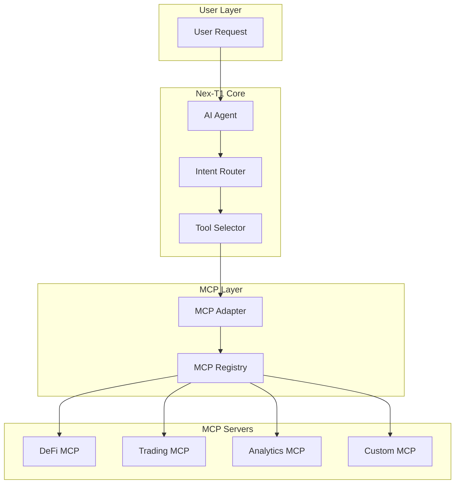

# MCP Integrations

<Info>
**Model Context Protocol (MCP)** is an open protocol that standardizes how AI models interact with external tools and data sources. Think of it as the USB-C of AI - a universal connector that enables seamless integration with any compatible service. Nex‑T1 fully embraces MCP to provide unlimited extensibility.
</Info>

## What is MCP?

<CardGroup cols={2}>
  <Card title="Universal Standard" icon="usb">
    MCP provides a standardized interface for AI-to-tool communication, similar to how USB-C standardizes device connections. Any MCP-compatible tool works instantly with Nex‑T1.
  </Card>
  <Card title="Ecosystem Power" icon="network-wired">
    Access a growing ecosystem of 100+ MCP servers for Web3, from DeFi protocols to blockchain infrastructure, without custom integration work.
  </Card>
  <Card title="Zero Lock-in" icon="unlock">
    MCP servers work across any MCP-compatible platform. Tools you build or integrate aren't locked to Nex‑T1 - true interoperability.
  </Card>
  <Card title="Developer Friendly" icon="code">
    Simple JSON-RPC protocol with TypeScript/Python SDKs. Build a new MCP server in hours, not weeks.
  </Card>
</CardGroup>

## How MCP Works in Nex‑T1



### Request Flow

1. **User Input**: Natural language request
2. **Intent Analysis**: AI understands what's needed
3. **Tool Selection**: Identifies required MCP servers
4. **MCP Invocation**: Calls appropriate server methods
5. **Response Processing**: Formats results for user

## Core MCP Servers

### DeFi Protocol Servers

<Tabs>
  <Tab title="Lending/Borrowing">
    **Aave MCP Server**
    ```env
    AAVE_MCP_BASE=https://aave-mcp.nex-t1.ai
    AAVE_MCP_TOKEN=your-token
    ```

    **Capabilities**:
    - Supply/withdraw assets
    - Borrow/repay loans
    - Check health factors
    - Monitor liquidations
    - APY calculations

    **Example Usage**:
    ```python
    # Check best lending rates
    result = await mcp.invoke(
        server="aave",
        method="get_supply_rates",
        params={"asset": "USDC"}
    )
    ```
  </Tab>
  <Tab title="DEX Trading">
    **Uniswap MCP Server**
    ```env
    UNISWAP_MCP_BASE=https://uniswap-mcp.nex-t1.ai
    UNISWAP_MCP_TOKEN=your-token
    ```

    **Capabilities**:
    - Token swaps
    - Liquidity provision
    - Pool analytics
    - Impermanent loss calculations
    - Fee tier optimization

    **Methods**:
    - `get_quote`: Get swap quotes
    - `execute_swap`: Perform token swap
    - `add_liquidity`: Provide liquidity
    - `get_pool_stats`: Pool analytics
  </Tab>
  <Tab title="Yield Aggregators">
    **Yearn MCP Server**
    ```env
    YEARN_MCP_BASE=https://yearn-mcp.nex-t1.ai
    YEARN_MCP_TOKEN=your-token
    ```

    **Capabilities**:
    - Vault deposits/withdrawals
    - Strategy performance
    - APY tracking
    - Risk scoring
    - Auto-compounding

    **Integration**:
    ```typescript
    const vault = await mcp.call({
        server: "yearn",
        method: "find_best_vault",
        params: {
            asset: "USDC",
            minAPY: 10,
            maxRisk: 5
        }
    });
    ```
  </Tab>
</Tabs>

### Analytics & Research Servers

<Accordion title="The Graph MCP">
**Configuration**:
```env
THEGRAPH_MCP_BASE=https://thegraph-mcp.nex-t1.ai
THEGRAPH_MCP_TOKEN=your-token
```

**Features**:
- Subgraph queries across 50+ protocols
- Real-time blockchain indexing
- Historical data retrieval
- Custom GraphQL queries
- WebSocket subscriptions

**Example Query**:
```graphql
query TopPools {
  pools(
    first: 10
    orderBy: totalValueLockedUSD
    orderDirection: desc
  ) {
    id
    token0 { symbol }
    token1 { symbol }
    totalValueLockedUSD
    volumeUSD
  }
}
```
</Accordion>

<Accordion title="Dune Analytics MCP">
**Configuration**:
```env
DUNE_MCP_BASE=https://dune-mcp.nex-t1.ai
DUNE_MCP_TOKEN=your-token
```

**Capabilities**:
- Execute SQL queries
- Access pre-built dashboards
- Create custom metrics
- Export data (CSV, JSON)
- Schedule recurring queries

**Usage Example**:
```python
# Get DEX volume analysis
analysis = await mcp.invoke(
    server="dune",
    method="execute_query",
    params={
        "query_id": 3421845,  # DEX volumes query
        "parameters": {
            "days_back": 30,
            "chain": "ethereum"
        }
    }
)
```
</Accordion>

<Accordion title="DeFiLlama MCP">
**Configuration**:
```env
DEFILLAMA_MCP_BASE=https://defillama-mcp.nex-t1.ai
DEFILLAMA_MCP_TOKEN=your-token
```

**Data Available**:
- TVL across all chains
- Protocol revenues
- Yield farming APYs
- Stablecoin metrics
- Chain comparison data

**Methods**:
- `get_tvl`: Total value locked
- `get_yields`: Yield opportunities
- `get_protocols`: Protocol listings
- `get_chains`: Chain analytics
</Accordion>

### Trading & Execution Servers

<CardGroup cols={2}>
  <Card title="0x Protocol MCP" icon="arrow-right-arrow-left">
    **Best Price Discovery**

    ```env
    ZEROX_MCP_BASE=https://0x-mcp.nex-t1.ai
    ```

    - Aggregated liquidity
    - RFQ system access
    - MEV protection
    - Gas optimization
  </Card>
  <Card title="Jupiter MCP" icon="planet-ringed">
    **Solana Trading**

    ```env
    JUPITER_MCP_BASE=https://jupiter-mcp.nex-t1.ai
    ```

    - Token swaps on Solana
    - Route optimization
    - Limit orders
    - DCA strategies
  </Card>
  <Card title="1inch MCP" icon="minimize">
    **Cross-chain Aggregation**

    ```env
    ONEINCH_MCP_BASE=https://1inch-mcp.nex-t1.ai
    ```

    - Multi-chain support
    - CHI gas tokens
    - Limit order protocol
    - P2P transactions
  </Card>
  <Card title="CoW Swap MCP" icon="cow">
    **MEV Protection**

    ```env
    COWSWAP_MCP_BASE=https://cowswap-mcp.nex-t1.ai
    ```

    - Batch auctions
    - MEV protection
    - Gasless trading
    - Surplus capturing
  </Card>
</CardGroup>

## Infrastructure MCP Servers

### Node & RPC Providers

<Tabs>
  <Tab title="Alchemy">
    ```env
    ALCHEMY_MCP_BASE=https://alchemy-mcp.nex-t1.ai
    ALCHEMY_API_KEY=your-api-key
    ```

    **Services**:
    - Enhanced APIs
    - NFT APIs
    - Webhook notifications
    - Debug tools
    - Trace APIs

    **Example**:
    ```javascript
    // Get token balances
    const balances = await mcp.call({
        server: "alchemy",
        method: "getTokenBalances",
        params: {
            address: "0x...",
            tokenContracts: ["0x..."]
        }
    });
    ```
  </Tab>
  <Tab title="Infura">
    ```env
    INFURA_MCP_BASE=https://infura-mcp.nex-t1.ai
    INFURA_PROJECT_ID=your-project-id
    ```

    **Features**:
    - Multi-chain RPC
    - IPFS gateway
    - Filecoin support
    - Archive data
    - WebSocket support
  </Tab>
  <Tab title="QuickNode">
    ```env
    QUICKNODE_MCP_BASE=https://quicknode-mcp.nex-t1.ai
    QUICKNODE_ENDPOINT=your-endpoint
    ```

    **Capabilities**:
    - Global node network
    - Custom chains
    - Trace methods
    - Debug namespace
    - GraphQL APIs
  </Tab>
</Tabs>

### Security & Monitoring

<CardGroup cols={2}>
  <Card title="Tenderly MCP" icon="shield">
    **Transaction Simulation**

    ```env
    TENDERLY_MCP_BASE=https://tenderly-mcp.nex-t1.ai
    ```

    - Simulate transactions
    - Debug reverts
    - Gas profiling
    - State diff analysis
  </Card>
  <Card title="Forta MCP" icon="radar">
    **Threat Detection**

    ```env
    FORTA_MCP_BASE=https://forta-mcp.nex-t1.ai
    ```

    - Real-time alerts
    - Anomaly detection
    - Exploit monitoring
    - Custom detection bots
  </Card>
</CardGroup>

## Exchange Integration MCPs

### Centralized Exchanges

<Accordion title="Binance MCP">
**Full Trading Suite**

```env
BINANCE_MCP_BASE=https://binance-mcp.nex-t1.ai
BINANCE_MCP_TOKEN=your-token
```

**Real-time Capabilities**:
```python
# Subscribe to market data
subscription = await mcp.invoke(
    server="binance",
    method="subscribe",
    params={
        "symbol": "BTCUSDT",
        "streams": ["trade", "depth", "kline"],
        "interval": "1m"
    }
)

# Place orders (with proper auth)
order = await mcp.invoke(
    server="binance",
    method="place_order",
    params={
        "symbol": "ETHUSDT",
        "side": "BUY",
        "type": "LIMIT",
        "price": 3000,
        "quantity": 0.1
    }
)
```

**Available Methods**:
- Market data streaming
- Order placement/cancellation
- Account balance queries
- Trade history
- Margin trading
- Futures operations
</Accordion>

<Accordion title="Coinbase MCP">
**Institutional Features**

```env
COINBASE_MCP_BASE=https://coinbase-mcp.nex-t1.ai
COINBASE_API_KEY=your-key
COINBASE_API_SECRET=your-secret
```

**Features**:
- Advanced order types
- Portfolio management
- Staking operations
- Custody integration
- Prime broker access
</Accordion>

## Custom MCP Development

### Building Your Own MCP Server

<Steps>
  <Step title="Define Your API">
    ```typescript
    // mcp-server.ts
    interface MyProtocolMCP {
      methods: {
        getBalance(address: string): Promise<BigNumber>;
        stake(amount: BigNumber): Promise<TxHash>;
        unstake(amount: BigNumber): Promise<TxHash>;
        getRewards(address: string): Promise<BigNumber>;
      }
    }
    ```
  </Step>
  <Step title="Implement the Server">
    ```typescript
    import { MCPServer } from '@modelcontextprotocol/sdk';

    class MyProtocolServer extends MCPServer {
      async getBalance(address: string) {
        // Your implementation
        const balance = await contract.balanceOf(address);
        return balance;
      }

      async stake(amount: BigNumber) {
        // Staking logic
        const tx = await contract.stake(amount);
        return tx.hash;
      }
    }
    ```
  </Step>
  <Step title="Configure Nex‑T1">
    ```env
    # Add to .env
    MYPROTOCOL_MCP_BASE=https://my-mcp-server.com
    MYPROTOCOL_MCP_TOKEN=secret-token
    ```
  </Step>
  <Step title="Register with Nex‑T1">
    ```python
    # app/core/integrations/mcp/myprotocol.py
    from app.core.integrations.mcp.base import MCPAdapter

    class MyProtocolMCP(MCPAdapter):
        def __init__(self):
            super().__init__(
                name="myprotocol",
                base_url=os.getenv("MYPROTOCOL_MCP_BASE"),
                token=os.getenv("MYPROTOCOL_MCP_TOKEN")
            )

        async def get_balance(self, address: str):
            return await self.invoke("getBalance", {"address": address})
    ```
  </Step>
</Steps>

### MCP Server Template

```python
# Basic MCP server template
from fastapi import FastAPI, HTTPException
from pydantic import BaseModel
import os

app = FastAPI(title="My MCP Server")

class MCPRequest(BaseModel):
    method: str
    params: dict

class MCPResponse(BaseModel):
    result: dict
    error: dict = None

@app.post("/mcp/invoke")
async def invoke(request: MCPRequest) -> MCPResponse:
    try:
        # Route to appropriate handler
        if request.method == "getBalance":
            result = await handle_get_balance(request.params)
        elif request.method == "executeAction":
            result = await handle_execute(request.params)
        else:
            raise HTTPException(404, f"Method {request.method} not found")

        return MCPResponse(result=result)
    except Exception as e:
        return MCPResponse(error={"message": str(e)})

async def handle_get_balance(params: dict):
    # Your implementation
    address = params.get("address")
    # Fetch balance logic
    return {"balance": "1000.0", "decimals": 18}
```

## Configuration Best Practices

### Environment Variables

<Tabs>
  <Tab title="Development">
    ```env
    # .env.development
    # Use testnet endpoints
    UNISWAP_MCP_BASE=https://testnet.uniswap-mcp.nex-t1.ai
    BINANCE_MCP_BASE=https://testnet-api.binance.com

    # Lower rate limits
    MCP_RATE_LIMIT=10
    MCP_TIMEOUT=30000

    # Debug mode
    MCP_DEBUG=true
    MCP_LOG_LEVEL=debug
    ```
  </Tab>
  <Tab title="Production">
    ```env
    # .env.production
    # Production endpoints
    UNISWAP_MCP_BASE=https://uniswap-mcp.nex-t1.ai
    BINANCE_MCP_BASE=https://api.binance.com

    # Production limits
    MCP_RATE_LIMIT=100
    MCP_TIMEOUT=10000

    # Production logging
    MCP_DEBUG=false
    MCP_LOG_LEVEL=info

    # Security
    MCP_REQUIRE_AUTH=true
    MCP_ALLOWED_ORIGINS=https://app.nex-t1.ai
    ```
  </Tab>
</Tabs>

### Security Considerations

<Warning>
**Critical Security Guidelines**:

1. **Never expose MCP tokens in client code**
2. **Always validate MCP server certificates**
3. **Implement rate limiting per MCP server**
4. **Use separate tokens for each environment**
5. **Rotate tokens regularly**
6. **Monitor unusual MCP server activity**
7. **Whitelist allowed MCP methods**
</Warning>

### Performance Optimization

```python
# MCP connection pooling
class MCPConnectionPool:
    def __init__(self, max_connections=10):
        self.pool = {}
        self.max_connections = max_connections

    async def get_connection(self, server_name: str):
        if server_name not in self.pool:
            self.pool[server_name] = await self.create_connection(server_name)
        return self.pool[server_name]

    async def create_connection(self, server_name: str):
        # Connection creation logic
        pass

# Caching MCP responses
from functools import lru_cache
import hashlib

@lru_cache(maxsize=1000)
async def cached_mcp_call(server: str, method: str, params_hash: str):
    # Cache frequently used MCP calls
    return await mcp.invoke(server, method, params)

def get_params_hash(params: dict) -> str:
    return hashlib.md5(str(params).encode()).hexdigest()
```

## Available MCP Servers Directory

### DeFi (30+ servers)
- Uniswap, SushiSwap, PancakeSwap, QuickSwap
- Aave, Compound, MakerDAO, Euler
- Curve, Balancer, Bancor
- Yearn, Convex, Harvest
- Synthetix, GMX, dYdX

### Infrastructure (20+ servers)
- Alchemy, Infura, QuickNode, Moralis
- The Graph, Covalent, Bitquery
- Chainlink, Band Protocol, API3
- IPFS, Arweave, Filecoin

### Analytics (15+ servers)
- Dune, DeFiLlama, Nansen, Glassnode
- Messari, Token Terminal, IntoTheBlock
- CoinGecko, CoinMarketCap, CryptoCompare

### Security (10+ servers)
- Tenderly, Forta, CertiK, PeckShield
- Etherscan, BscScan, PolygonScan
- Immunefi, Code4rena

## MCP Roadmap

<CardGroup cols={2}>
  <Card title="Coming Soon" icon="clock">
    - Cross-chain MCP orchestration
    - AI-powered MCP discovery
    - Automatic MCP composition
    - MCP marketplace
  </Card>
  <Card title="Future Vision" icon="rocket">
    - 1000+ MCP servers
    - Zero-code MCP creation
    - Decentralized MCP registry
    - MCP monetization layer
  </Card>
</CardGroup>

## Getting Help

<CardGroup cols={3}>
  <Card title="MCP SDK Docs" icon="book">
    Complete SDK documentation for building MCP servers
  </Card>
  <Card title="Server Examples" icon="github">
    GitHub repository with MCP server examples
  </Card>
  <Card title="Developer Support" icon="headset">
    Discord channel for MCP development support
  </Card>
</CardGroup>