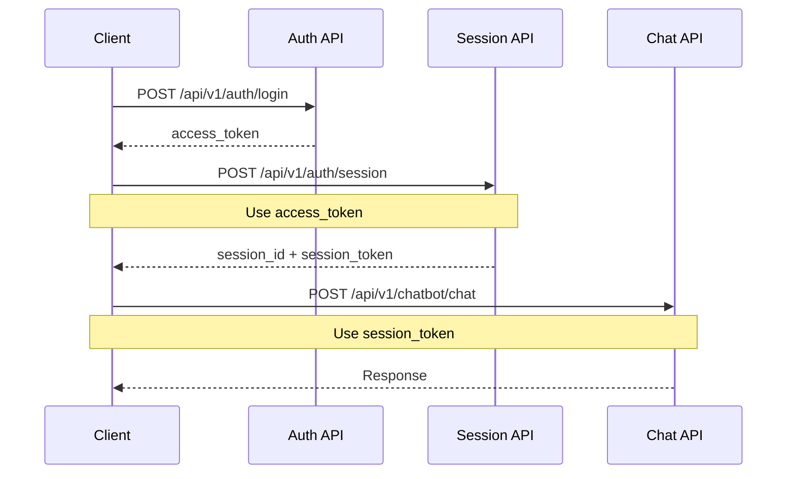

# API Usage

<Info>
Nex-T1 provides a comprehensive REST API with WebSocket support for real-time operations. All endpoints are documented with OpenAPI/Swagger specifications and include SDKs for Python and TypeScript.
</Info>

## Quick Start

<Steps>
  <Step title="Get API Key">
    Register at [app.nex-t1.ai](https://app.nex-t1.ai) to obtain your API key
  </Step>
  <Step title="Authenticate">
    Login to get a JWT access token for secure API access
  </Step>
  <Step title="Create Session">
    Create a chat session to maintain conversation context
  </Step>
  <Step title="Make Your First Call">
    ```bash
    curl -X POST https://api.nex-t1.ai/api/v1/chatbot/chat \
      -H "Authorization: Bearer SESSION_TOKEN" \
      -H "Content-Type: application/json" \
      -d '{"messages":[{"role":"user","content":"What is the current ETH price?"}]}'
    ```
  </Step>
</Steps>

## Base URLs

<Tabs>
  <Tab title="Production">
    ```
    https://api.nex-t1.ai
    ```
  </Tab>
  <Tab title="Development">
    ```
    http://localhost:8000
    ```
  </Tab>
</Tabs>

## Authentication

### Authentication Flow

Nex-T1 uses a two-tier authentication system:
1. **User Authentication**: JWT tokens for user login
2. **Session Authentication**: Session-scoped tokens for chat interactions



### Step 1: Register (Optional)

Register a new user account:

<CodeGroup>
```bash cURL
curl -X POST "https://api.nex-t1.ai/api/v1/auth/register" \
  -H "Content-Type: application/json" \
  -d '{
    "email": "user@example.com",
    "password": "SecurePass123!"
  }'
```

```python Python
import requests

response = requests.post(
    "https://api.nex-t1.ai/api/v1/auth/register",
    json={
        "email": "user@example.com",
        "password": "SecurePass123!"
    }
)

user_data = response.json()
print(f"User ID: {user_data['id']}")
print(f"Access Token: {user_data['token']['access_token']}")
```

```typescript TypeScript
const response = await fetch('https://api.nex-t1.ai/api/v1/auth/register', {
  method: 'POST',
  headers: { 'Content-Type': 'application/json' },
  body: JSON.stringify({
    email: 'user@example.com',
    password: 'SecurePass123!'
  })
});

const userData = await response.json();
console.log(`User ID: ${userData.id}`);
console.log(`Access Token: ${userData.token.access_token}`);
```
</CodeGroup>

**Response**:
```json
{
  "id": 123,
  "email": "user@example.com",
  "token": {
    "access_token": "eyJhbGciOiJIUzI1NiIs...",
    "token_type": "bearer",
    "expires_at": "2025-10-04T12:00:00Z"
  }
}
```

### Step 2: Login

Authenticate with your credentials to get an access token:

<CodeGroup>
```bash cURL
ACCESS_TOKEN=$(curl -sS -X POST "https://api.nex-t1.ai/api/v1/auth/login" \
  -H "Content-Type: application/x-www-form-urlencoded" \
  --data-urlencode "username=user@example.com" \
  --data-urlencode "password=SecurePass123!" \
  --data-urlencode "grant_type=password" | jq -r .access_token)

echo $ACCESS_TOKEN
```

```python Python
import requests

response = requests.post(
    "https://api.nex-t1.ai/api/v1/auth/login",
    data={
        "username": "user@example.com",
        "password": "SecurePass123!",
        "grant_type": "password"
    },
    headers={"Content-Type": "application/x-www-form-urlencoded"}
)

token_data = response.json()
access_token = token_data["access_token"]
expires_at = token_data["expires_at"]
```

```typescript TypeScript
const params = new URLSearchParams({
  username: 'user@example.com',
  password: 'SecurePass123!',
  grant_type: 'password'
});

const response = await fetch('https://api.nex-t1.ai/api/v1/auth/login', {
  method: 'POST',
  headers: { 'Content-Type': 'application/x-www-form-urlencoded' },
  body: params
});

const tokenData = await response.json();
const accessToken = tokenData.access_token;
```
</CodeGroup>

**Response**:
```json
{
  "access_token": "eyJhbGciOiJIUzI1NiIs...",
  "token_type": "bearer",
  "expires_at": "2025-10-04T12:00:00Z"
}
```

### Step 3: Create Chat Session

Create a session to maintain conversation context:

<CodeGroup>
```bash cURL
SESSION_JSON=$(curl -sS -X POST "https://api.nex-t1.ai/api/v1/auth/session" \
  -H "Authorization: Bearer $ACCESS_TOKEN")

SESSION_ID=$(echo "$SESSION_JSON" | jq -r .session_id)
SESSION_TOKEN=$(echo "$SESSION_JSON" | jq -r .token.access_token)

echo "Session ID: $SESSION_ID"
echo "Session Token: $SESSION_TOKEN"
```

```python Python
import requests

response = requests.post(
    "https://api.nex-t1.ai/api/v1/auth/session",
    headers={"Authorization": f"Bearer {access_token}"}
)

session_data = response.json()
session_id = session_data["session_id"]
session_token = session_data["token"]["access_token"]
```

```typescript TypeScript
const response = await fetch('https://api.nex-t1.ai/api/v1/auth/session', {
  method: 'POST',
  headers: { 'Authorization': `Bearer ${accessToken}` }
});

const sessionData = await response.json();
const sessionId = sessionData.session_id;
const sessionToken = sessionData.token.access_token;
```
</CodeGroup>

**Response**:
```json
{
  "session_id": "sess_abc123xyz",
  "name": "",
  "token": {
    "access_token": "eyJhbGciOiJIUzI1NiIs...",
    "token_type": "bearer",
    "expires_at": "2025-10-04T13:00:00Z"
  }
}
```

<Note>
Use the **session_token** (not the access_token) for all chat and multi-agent endpoints. The session token binds messages to a specific conversation context.
</Note>

### Session Management

<Accordion title="List User Sessions">
```bash
curl -X GET "https://api.nex-t1.ai/api/v1/auth/sessions" \
  -H "Authorization: Bearer $ACCESS_TOKEN"
```

**Response**:
```json
[
  {
    "session_id": "sess_abc123",
    "name": "ETH Trading Discussion",
    "token": {
      "access_token": "eyJ...",
      "token_type": "bearer",
      "expires_at": "2025-10-04T13:00:00Z"
    }
  }
]
```
</Accordion>

<Accordion title="Update Session Name">
```bash
curl -X PATCH "https://api.nex-t1.ai/api/v1/auth/session/$SESSION_ID/name" \
  -H "Authorization: Bearer $SESSION_TOKEN" \
  -H "Content-Type: application/x-www-form-urlencoded" \
  --data-urlencode "name=ETH Trading Discussion"
```
</Accordion>

<Accordion title="Delete Session">
```bash
curl -X DELETE "https://api.nex-t1.ai/api/v1/auth/session/$SESSION_ID" \
  -H "Authorization: Bearer $SESSION_TOKEN"
```
</Accordion>

## Core Endpoints

### Chat API

The main conversational interface powered by LangGraph for natural language interactions.

#### Non-Streaming Chat

<CodeGroup>
```bash cURL
curl -X POST "https://api.nex-t1.ai/api/v1/chatbot/chat" \
  -H "Authorization: Bearer $SESSION_TOKEN" \
  -H "Content-Type: application/json" \
  -d '{
    "messages": [
      {
        "role": "user",
        "content": "Give me a quick BTC update."
      }
    ]
  }'
```

```python Python
import requests

response = requests.post(
    "https://api.nex-t1.ai/api/v1/chatbot/chat",
    headers={
        "Authorization": f"Bearer {session_token}",
        "Content-Type": "application/json"
    },
    json={
        "messages": [
            {
                "role": "user",
                "content": "Give me a quick BTC update."
            }
        ]
    }
)

chat_response = response.json()
assistant_message = chat_response["messages"][-1]["content"]
print(assistant_message)
```

```typescript TypeScript
const response = await fetch('https://api.nex-t1.ai/api/v1/chatbot/chat', {
  method: 'POST',
  headers: {
    'Authorization': `Bearer ${sessionToken}`,
    'Content-Type': 'application/json'
  },
  body: JSON.stringify({
    messages: [
      {
        role: 'user',
        content: 'Give me a quick BTC update.'
      }
    ]
  })
});

const chatResponse = await response.json();
const assistantMessage = chatResponse.messages[chatResponse.messages.length - 1].content;
console.log(assistantMessage);
```
</CodeGroup>

**Request Schema**:
```json
{
  "messages": [
    {
      "role": "user | assistant | system",
      "content": "string (1-3000 chars)"
    }
  ]
}
```

**Response**:
```json
{
  "messages": [
    {
      "role": "user",
      "content": "Give me a quick BTC update."
    },
    {
      "role": "assistant",
      "content": "Bitcoin (BTC) is currently trading at $67,342..."
    }
  ]
}
```

#### Streaming Chat (Server-Sent Events)

Get real-time streaming responses for better user experience:

<CodeGroup>
```bash cURL (POST)
curl -N -X POST "https://api.nex-t1.ai/api/v1/chatbot/chat/stream" \
  -H "Authorization: Bearer $SESSION_TOKEN" \
  -H "Content-Type: application/json" \
  -d '{
    "messages": [
      {
        "role": "user",
        "content": "Two-sentence market recap."
      }
    ]
  }'
```

```python Python
import requests
import json

with requests.post(
    "https://api.nex-t1.ai/api/v1/chatbot/chat/stream",
    headers={
        "Authorization": f"Bearer {session_token}",
        "Content-Type": "application/json"
    },
    json={
        "messages": [
            {"role": "user", "content": "Two-sentence market recap."}
        ]
    },
    stream=True
) as response:
    for line in response.iter_lines():
        if line:
            chunk = json.loads(line)
            print(chunk.get("content", ""), end="", flush=True)
```

```javascript JavaScript (EventSource)
const es = new EventSource(
  `https://api.nex-t1.ai/api/v1/chatbot/chat/stream/sse?` +
  new URLSearchParams({
    q: "Hello",
    token: sessionToken
  })
);

es.onmessage = (event) => {
  const chunk = JSON.parse(event.data);
  if (chunk.done) {
    es.close();
  } else {
    process.stdout.write(chunk.content);
  }
};

es.onerror = (error) => {
  console.error('SSE Error:', error);
  es.close();
};
```
</CodeGroup>

#### Get Session Messages

Retrieve all messages in a session:

```bash
curl -X GET "https://api.nex-t1.ai/api/v1/chatbot/messages" \
  -H "Authorization: Bearer $SESSION_TOKEN"
```

#### Clear Chat History

Delete all messages in a session:

```bash
curl -X DELETE "https://api.nex-t1.ai/api/v1/chatbot/messages" \
  -H "Authorization: Bearer $SESSION_TOKEN"
```

**Response**:
```json
{
  "message": "Chat history cleared successfully"
}
```

## Multi-Agent APIs

Nex-T1's multi-agent system provides specialized capabilities for trading, research, risk analysis, and more.

### Intent Router & Preview

Routes user requests to appropriate specialized agents with intent detection and entity extraction.

<CodeGroup>
```bash cURL
curl -X POST "https://api.nex-t1.ai/api/v1/multi-agent/preview" \
  -H "Authorization: Bearer $SESSION_TOKEN" \
  -H "Content-Type: application/json" \
  -d '{
    "text": "Swap 1 ETH to USDC on Base"
  }'
```

```python Python
response = requests.post(
    "https://api.nex-t1.ai/api/v1/multi-agent/preview",
    headers={"Authorization": f"Bearer {session_token}"},
    json={"text": "Swap 1 ETH to USDC on Base"}
)

preview = response.json()
print(f"Intent: {preview['intent']}")
print(f"Team: {preview['team']}")
print(f"Entities: {preview['entities']}")
```

```typescript TypeScript
const response = await fetch('https://api.nex-t1.ai/api/v1/multi-agent/preview', {
  method: 'POST',
  headers: {
    'Authorization': `Bearer ${sessionToken}`,
    'Content-Type': 'application/json'
  },
  body: JSON.stringify({
    text: 'Swap 1 ETH to USDC on Base'
  })
});

const preview = await response.json();
console.log(`Intent: ${preview.intent}`);
console.log(`Team: ${preview.team}`);
```
</CodeGroup>

**Response**:
```json
{
  "intent": "swap_tokens",
  "entities": {
    "token_in": "ETH",
    "token_out": "USDC",
    "amount": "1",
    "chain": "base"
  },
  "team": "trading"
}
```

### Preview Run (End-to-End)

Execute a complete preview flow including routing, quote generation, and risk assessment:

<CodeGroup>
```bash cURL
curl -X POST "https://api.nex-t1.ai/api/v1/multi-agent/preview/run" \
  -H "Authorization: Bearer $SESSION_TOKEN" \
  -H "Content-Type: application/json" \
  -d '{
    "text": "Swap 1 ETH to USDC on Base",
    "evm_input": {
      "chain_id": 8453,
      "token_in_address": "0x4200000000000000000000000000000000000006",
      "token_out_address": "0x833589fCD6eDb6E08f4c7C32D4f71b54bdA02913",
      "amount_in": "1",
      "slippage_bps": 50
    },
    "thresholds": {
      "max_slippage_bps": 100,
      "max_price_impact_bps": 200
    }
  }'
```

```python Python
response = requests.post(
    "https://api.nex-t1.ai/api/v1/multi-agent/preview/run",
    headers={"Authorization": f"Bearer {session_token}"},
    json={
        "text": "Swap 1 ETH to USDC on Base",
        "evm_input": {
            "chain_id": 8453,
            "token_in_address": "0x4200000000000000000000000000000000000006",
            "token_out_address": "0x833589fCD6eDb6E08f4c7C32D4f71b54bdA02913",
            "amount_in": "1",
            "slippage_bps": 50
        },
        "thresholds": {
            "max_slippage_bps": 100,
            "max_price_impact_bps": 200
        }
    }
)

preview_run = response.json()
print(f"Summary: {preview_run['summary']}")
if preview_run.get('quote'):
    print(f"Expected Out: {preview_run['quote']['expected_out']}")
if preview_run.get('risk'):
    print(f"Risk Level: {preview_run['risk']['level']}")
```
</CodeGroup>

**Response**:
```json
{
  "intent": "swap_tokens",
  "team": "trading",
  "summary": "Swap 1 ETH to ~3,420 USDC on Base via Uniswap V3",
  "quote": {
    "route": ["Uniswap V3"],
    "expected_out": "3420.50",
    "price_impact_bps": 15,
    "slippage_bps": 50,
    "fees": {
      "swap_fee_bps": 30,
      "gas_estimate_usd": "0.15"
    },
    "gas_estimate": "150000",
    "venue": "Uniswap V3",
    "quote_id": "q_1234567890",
    "expires_at": "2025-10-03T12:05:00Z"
  },
  "risk": {
    "level": "low",
    "aggregate_score": 8.5,
    "checks": [
      {
        "type": "price_sanity",
        "passed": true,
        "details": "Price within expected range"
      }
    ],
    "flags": []
  }
}
```

### Research Agent

Aggregate data from multiple sources for comprehensive DeFi analysis.

<CodeGroup>
```bash cURL (DefiLlama TVL)
curl -X POST "https://api.nex-t1.ai/api/v1/multi-agent/research/preview" \
  -H "Authorization: Bearer $SESSION_TOKEN" \
  -H "Content-Type: application/json" \
  -d '{
    "tvl_chain": "ethereum",
    "pools_chain": "ethereum",
    "pools_limit": 10
  }'
```

```python Python (The Graph Query)
response = requests.post(
    "https://api.nex-t1.ai/api/v1/multi-agent/research/preview",
    headers={"Authorization": f"Bearer {session_token}"},
    json={
        "subgraph": "https://api.thegraph.com/subgraphs/name/uniswap/uniswap-v3",
        "gql": """
            query TopPools {
                pools(first: 10, orderBy: totalValueLockedUSD, orderDirection: desc) {
                    id
                    token0 { symbol }
                    token1 { symbol }
                    totalValueLockedUSD
                    volumeUSD
                    feeTier
                }
            }
        """
    }
)

research = response.json()
print(research['summary'])
```

```bash cURL (Dune Analytics)
curl -X POST "https://api.nex-t1.ai/api/v1/multi-agent/research/preview" \
  -H "Authorization: Bearer $SESSION_TOKEN" \
  -H "Content-Type: application/json" \
  -d '{
    "dune_query_id": 123456,
    "dune_params": {
      "chain": "ethereum",
      "days": 30
    }
  }'
```
</CodeGroup>

**Response**:
```json
{
  "graph_data": {
    "pools": [
      {
        "id": "0x88e6a0c2ddd26feeb64f039a2c41296fcb3f5640",
        "token0": { "symbol": "USDC" },
        "token1": { "symbol": "WETH" },
        "totalValueLockedUSD": "156789123.45",
        "volumeUSD": "89234567.89",
        "feeTier": "500"
      }
    ]
  },
  "summary": "Top 10 Uniswap V3 pools by TVL on Ethereum. USDC/WETH 0.05% leads with $156M TVL..."
}
```

### Trading Agent

Handle quotes, execution, and trade optimization across multiple DEXs.

#### Get Pseudo Quote (EVM)

Get a reference quote using Chainlink prices (non-executable):

<CodeGroup>
```bash cURL
curl -X POST "https://api.nex-t1.ai/api/v1/multi-agent/quote/evm/pseudo" \
  -H "Authorization: Bearer $SESSION_TOKEN" \
  -H "Content-Type: application/json" \
  -d '{
    "input": {
      "chain_id": 1,
      "token_in_address": "0xC02aaA39b223FE8D0A0e5C4F27eAD9083C756Cc2",
      "token_out_address": "0xA0b86991c6218b36c1d19D4a2e9Eb0cE3606eB48",
      "amount_in": "1.5",
      "slippage_bps": 50
    }
  }'
```

```python Python
response = requests.post(
    "https://api.nex-t1.ai/api/v1/multi-agent/quote/evm/pseudo",
    headers={"Authorization": f"Bearer {session_token}"},
    json={
        "input": {
            "chain_id": 1,
            "token_in_address": "0xC02aaA39b223FE8D0A0e5C4F27eAD9083C756Cc2",
            "token_out_address": "0xA0b86991c6218b36c1d19D4a2e9Eb0cE3606eB48",
            "amount_in": "1.5",
            "amount_in_currency": "token_units",
            "slippage_bps": 50
        }
    }
)

quote = response.json()
print(f"Expected Output: {quote['expected_out']} USDC")
print(f"Price Impact: {quote['price_impact_bps']/100}%")
```
</CodeGroup>

**Response**:
```json
{
  "route": ["Chainlink Reference"],
  "expected_out": "5130.75",
  "price_impact_bps": 0,
  "slippage_bps": 50,
  "fees": {},
  "gas_estimate": null,
  "venue": "chainlink-reference",
  "quote_id": "pseudo_q_1234567890",
  "expires_at": "2025-10-03T12:05:00Z"
}
```

#### Execute EVM Trade

Execute a trade with confirmation and risk checks:

<Warning>
Trade execution requires `confirm: true` and passes through risk assessment. Always verify the quote before execution.
</Warning>

<CodeGroup>
```bash cURL
curl -X POST "https://api.nex-t1.ai/api/v1/multi-agent/execute/evm" \
  -H "Authorization: Bearer $SESSION_TOKEN" \
  -H "Content-Type: application/json" \
  -d '{
    "input": {
      "chain_id": 1,
      "token_in_address": "0xC02aaA39b223FE8D0A0e5C4F27eAD9083C756Cc2",
      "token_out_address": "0xA0b86991c6218b36c1d19D4a2e9Eb0cE3606eB48",
      "amount_in": "1.0",
      "slippage_bps": 50,
      "simulate_only": false
    },
    "confirm": true,
    "wallet_ref": "main_wallet",
    "thresholds": {
      "max_slippage_bps": 100,
      "max_price_impact_bps": 200
    }
  }'
```

```python Python
response = requests.post(
    "https://api.nex-t1.ai/api/v1/multi-agent/execute/evm",
    headers={"Authorization": f"Bearer {session_token}"},
    json={
        "input": {
            "chain_id": 1,
            "token_in_address": "0xC02aaA39b223FE8D0A0e5C4F27eAD9083C756Cc2",
            "token_out_address": "0xA0b86991c6218b36c1d19D4a2e9Eb0cE3606eB48",
            "amount_in": "1.0",
            "slippage_bps": 50,
            "simulate_only": False
        },
        "confirm": True,
        "wallet_ref": "main_wallet",
        "thresholds": {
            "max_slippage_bps": 100,
            "max_price_impact_bps": 200
        }
    }
)

execution = response.json()
print(f"Transaction Hash: {execution['tx_hash']}")
print(f"Status: {execution['status']}")
print(f"Explorer: {execution['explorer_url']}")
```
</CodeGroup>

**Response**:
```json
{
  "tx": {
    "to": "0x...",
    "data": "0x...",
    "value": "0",
    "gas": "150000"
  },
  "tx_hash": "0xabcd1234...",
  "explorer_url": "https://etherscan.io/tx/0xabcd1234...",
  "status": "pending",
  "message": "Transaction submitted successfully"
}
```

### Risk Agent

Evaluate and manage transaction risks before execution.

<CodeGroup>
```bash cURL
curl -X POST "https://api.nex-t1.ai/api/v1/multi-agent/risk/preview" \
  -H "Authorization: Bearer $SESSION_TOKEN" \
  -H "Content-Type: application/json" \
  -d '{
    "quote": {
      "expected_out": "3420.50",
      "slippage_bps": 50,
      "price_impact_bps": 15,
      "venue": "Uniswap V3",
      "quote_id": "q_123",
      "expires_at": "2025-10-03T12:05:00Z"
    },
    "input": {
      "chain": "evm",
      "addresses": [
        "0x4200000000000000000000000000000000000006",
        "0x833589fCD6eDb6E08f4c7C32D4f71b54bdA02913"
      ],
      "checks": ["rug", "price_sanity", "gas_spike"]
    },
    "thresholds": {
      "max_slippage_bps": 100,
      "max_price_impact_bps": 200
    }
  }'
```

```python Python
response = requests.post(
    "https://api.nex-t1.ai/api/v1/multi-agent/risk/preview",
    headers={"Authorization": f"Bearer {session_token}"},
    json={
        "quote": {
            "expected_out": "3420.50",
            "slippage_bps": 50,
            "price_impact_bps": 15,
            "venue": "Uniswap V3",
            "quote_id": "q_123",
            "expires_at": "2025-10-03T12:05:00Z"
        },
        "input": {
            "chain": "evm",
            "addresses": [
                "0x4200000000000000000000000000000000000006",
                "0x833589fCD6eDb6E08f4c7C32D4f71b54bdA02913"
            ],
            "checks": ["rug", "price_sanity", "gas_spike"]
        },
        "thresholds": {
            "max_slippage_bps": 100,
            "max_price_impact_bps": 200
        }
    }
)

risk = response.json()
print(f"Risk Level: {risk['level']}")
print(f"Score: {risk['aggregate_score']}/10")
for flag in risk['flags']:
    print(f"⚠️ {flag}")
```
</CodeGroup>

**Response**:
```json
{
  "level": "low",
  "aggregate_score": 8.5,
  "checks": [
    {
      "type": "rug",
      "passed": true,
      "score": 9.0,
      "details": "No rug pull indicators detected"
    },
    {
      "type": "price_sanity",
      "passed": true,
      "score": 9.5,
      "details": "Price within expected range"
    },
    {
      "type": "gas_spike",
      "passed": true,
      "score": 7.0,
      "details": "Gas prices slightly elevated but acceptable"
    }
  ],
  "flags": []
}
```

**Risk Levels**:
| Level | Score | Description |
|-------|-------|-------------|
| `low` | 7-10 | Safe to proceed |
| `medium` | 4-6.9 | Review warnings carefully |
| `high` | 0-3.9 | Not recommended |
| `unknown` | N/A | Insufficient data |

## Tool Integration APIs

Nex-T1 integrates with multiple MCP servers and external tools.

### DefiLlama Tools

<Accordion title="List Available Tools">
```bash
curl -X GET "https://api.nex-t1.ai/api/v1/multi-agent/defillama/tools" \
  -H "Authorization: Bearer $SESSION_TOKEN"
```

**Response**:
```json
{
  "tools": [
    {
      "name": "tvl_protocols",
      "description": "Get TVL for all protocols",
      "parameters": {}
    },
    {
      "name": "tvl_chain",
      "description": "Get TVL for specific chain",
      "parameters": {
        "chain": "string"
      }
    }
  ]
}
```
</Accordion>

<Accordion title="Invoke Tool">
```bash
curl -X POST "https://api.nex-t1.ai/api/v1/multi-agent/defillama/invoke" \
  -H "Authorization: Bearer $SESSION_TOKEN" \
  -H "Content-Type: application/json" \
  -d '{
    "tool_name": "tvl_protocols",
    "arguments": {}
  }'
```
</Accordion>

### Binance Tools

<Accordion title="List Tools">
```bash
curl -X GET "https://api.nex-t1.ai/api/v1/multi-agent/binance/tools" \
  -H "Authorization: Bearer $SESSION_TOKEN"
```
</Accordion>

<Accordion title="Subscribe to Real-time Data">
```bash
curl -X POST "https://api.nex-t1.ai/api/v1/multi-agent/binance/subscribe" \
  -H "Authorization: Bearer $SESSION_TOKEN" \
  -H "Content-Type: application/json" \
  -d '{
    "symbol": "BTCUSDT",
    "market": "spot",
    "streams": ["aggTrade", "kline"],
    "interval": "1m"
  }'
```

**Response**:
```json
{
  "subscription_id": "sub_12345",
  "status": "subscribed",
  "streams": ["BTCUSDT@aggTrade", "BTCUSDT@kline_1m"]
}
```
</Accordion>

<Accordion title="Unsubscribe">
```bash
curl -X POST "https://api.nex-t1.ai/api/v1/multi-agent/binance/unsubscribe" \
  -H "Authorization: Bearer $SESSION_TOKEN" \
  -H "Content-Type: application/json" \
  -d '{
    "subscription_id": "sub_12345"
  }'
```
</Accordion>

### Bitcoin Tools

<Accordion title="List Tools">
```bash
curl -X GET "https://api.nex-t1.ai/api/v1/multi-agent/bitcoin/tools" \
  -H "Authorization: Bearer $SESSION_TOKEN"
```
</Accordion>

<Accordion title="Get Latest Block">
```bash
curl -X GET "https://api.nex-t1.ai/api/v1/multi-agent/bitcoin/latest-block" \
  -H "Authorization: Bearer $SESSION_TOKEN"
```
</Accordion>

<Accordion title="Decode Transaction">
```bash
curl -X POST "https://api.nex-t1.ai/api/v1/multi-agent/bitcoin/tx/decode" \
  -H "Authorization: Bearer $SESSION_TOKEN" \
  -H "Content-Type: application/json" \
  -d '{
    "raw_tx": "01000000..."
  }'
```
</Accordion>

<Accordion title="Validate Address">
```bash
curl -X POST "https://api.nex-t1.ai/api/v1/multi-agent/bitcoin/address/validate" \
  -H "Authorization: Bearer $SESSION_TOKEN" \
  -H "Content-Type: application/json" \
  -d '{
    "address": "bc1qxy2kgdygjrsqtzq2n0yrf2493p83kkfjhx0wlh"
  }'
```
</Accordion>

### Chainlink Tools

Get real-time price feeds from Chainlink oracles:

<CodeGroup>
```bash cURL
curl -X POST "https://api.nex-t1.ai/api/v1/multi-agent/chainlink/price" \
  -H "Authorization: Bearer $SESSION_TOKEN" \
  -H "Content-Type: application/json" \
  -d '{
    "chain": "ethereum",
    "pair": "ETH/USD"
  }'
```

```python Python
response = requests.post(
    "https://api.nex-t1.ai/api/v1/multi-agent/chainlink/price",
    headers={"Authorization": f"Bearer {session_token}"},
    json={
        "chain": "ethereum",
        "pair": "ETH/USD"
    }
)

price_data = response.json()
print(f"ETH/USD: ${price_data['price']}")
```
</CodeGroup>

### Exa MCP (Optional)

<Note>
Exa MCP server must be configured in your environment. See [EXA_MCP.md](https://github.com/next1/api-docs) for setup instructions.
</Note>

<Accordion title="List Exa Tools">
```bash
curl -X GET "https://api.nex-t1.ai/api/v1/multi-agent/exa/tools" \
  -H "Authorization: Bearer $SESSION_TOKEN"
```
</Accordion>

<Accordion title="Invoke Exa Tool">
```bash
curl -X POST "https://api.nex-t1.ai/api/v1/multi-agent/exa/invoke" \
  -H "Authorization: Bearer $SESSION_TOKEN" \
  -H "Content-Type: application/json" \
  -d '{
    "tool_name": "search",
    "arguments": {
      "query": "Latest DeFi protocols 2025"
    }
  }'
```
</Accordion>

<Accordion title="Refresh Exa Connection">
```bash
curl -X POST "https://api.nex-t1.ai/api/v1/multi-agent/exa/refresh" \
  -H "Authorization: Bearer $SESSION_TOKEN"
```
</Accordion>

### DexScreener Tools

<Accordion title="List Tools">
```bash
curl -X GET "https://api.nex-t1.ai/api/v1/multi-agent/dexscreener/tools" \
  -H "Authorization: Bearer $SESSION_TOKEN"
```
</Accordion>

<Accordion title="Invoke Tool">
```bash
curl -X POST "https://api.nex-t1.ai/api/v1/multi-agent/dexscreener/invoke" \
  -H "Authorization: Bearer $SESSION_TOKEN" \
  -H "Content-Type: application/json" \
  -d '{
    "tool_name": "search_pairs",
    "arguments": {
      "query": "ETH/USDC"
    }
  }'
```
</Accordion>

### Wallet Management

<Accordion title="Get EVM Wallet Balance">
```bash
curl -X POST "https://api.nex-t1.ai/api/v1/multi-agent/wallet/evm/balance" \
  -H "Authorization: Bearer $SESSION_TOKEN" \
  -H "Content-Type: application/json" \
  -d '{
    "address": "0x742d35Cc6634C0532925a3b844Bc9e7595f0bEb"
  }'
```

**Response**:
```json
{
  "address": "0x742d35Cc6634C0532925a3b844Bc9e7595f0bEb",
  "balance": "1.234567890123456789",
  "balance_usd": "4234.56",
  "chain_id": 1,
  "tokens": [
    {
      "address": "0xA0b86991c6218b36c1d19D4a2e9Eb0cE3606eB48",
      "symbol": "USDC",
      "balance": "1000.0",
      "balance_usd": "1000.0"
    }
  ]
}
```
</Accordion>

## Metrics & Analytics APIs

Track volume, PnL, TVL, and position data.

### Volume Metrics

<CodeGroup>
```bash cURL
curl -X GET "https://api.nex-t1.ai/api/v1/metrics/volume?start=2025-10-01T00:00:00Z&end=2025-10-03T23:59:59Z&agent=trading" \
  -H "Authorization: Bearer $SESSION_TOKEN"
```

```python Python
response = requests.get(
    "https://api.nex-t1.ai/api/v1/metrics/volume",
    headers={"Authorization": f"Bearer {session_token}"},
    params={
        "start": "2025-10-01T00:00:00Z",
        "end": "2025-10-03T23:59:59Z",
        "agent": "trading"
    }
)

volume_data = response.json()
print(f"Total Volume: ${volume_data['total_volume_usd']:,.2f}")
```
</CodeGroup>

**Response**:
```json
{
  "total_volume_usd": 1234567.89,
  "by_agent": [
    {
      "key": "trading",
      "value": 987654.32
    },
    {
      "key": "research",
      "value": 246913.57
    }
  ]
}
```

### PnL Metrics

<Accordion title="Realized PnL">
```bash
curl -X GET "https://api.nex-t1.ai/api/v1/metrics/pnl?start=2025-10-01T00:00:00Z&end=2025-10-03T23:59:59Z" \
  -H "Authorization: Bearer $SESSION_TOKEN"
```

**Response**:
```json
{
  "realized_pnl_usd": 12345.67,
  "by_agent": [
    {
      "key": "trading",
      "value": 10000.50
    },
    {
      "key": "research",
      "value": 2345.17
    }
  ]
}
```
</Accordion>

<Accordion title="Unrealized PnL">
```bash
curl -X GET "https://api.nex-t1.ai/api/v1/metrics/pnl/unrealized?agent=trading" \
  -H "Authorization: Bearer $SESSION_TOKEN"
```

**Response**:
```json
{
  "unrealized_pnl_usd": 5432.10,
  "by_agent": [
    {
      "key": "trading",
      "value": 5432.10
    }
  ]
}
```
</Accordion>

### TVL Metrics

<Accordion title="Agent TVL">
```bash
curl -X GET "https://api.nex-t1.ai/api/v1/metrics/tvl?mode=agents&agent=trading" \
  -H "Authorization: Bearer $SESSION_TOKEN"
```
</Accordion>

<Accordion title="DefiLlama TVL">
```bash
curl -X GET "https://api.nex-t1.ai/api/v1/metrics/tvl?mode=defillama&chain=ethereum" \
  -H "Authorization: Bearer $SESSION_TOKEN"
```
</Accordion>

### Position Management

<Accordion title="List Positions">
```bash
curl -X GET "https://api.nex-t1.ai/api/v1/positions?agent=trading&wallet_address=0x..." \
  -H "Authorization: Bearer $SESSION_TOKEN"
```

**Response**:
```json
[
  {
    "id": 1,
    "agent": "trading",
    "wallet_address": "0x742d35Cc6634C0532925a3b844Bc9e7595f0bEb",
    "chain_id": 1,
    "token_address": "0xC02aaA39b223FE8D0A0e5C4F27eAD9083C756Cc2",
    "token_symbol": "WETH",
    "quantity": 10.5,
    "cost_basis_usd_per_unit": 3200.00,
    "realized_pnl_usd": 2500.00,
    "last_price_usd": 3420.00,
    "market_value_usd": 35910.00,
    "unrealized_pnl_usd": 2310.00,
    "updated_at": "2025-10-03T12:00:00Z"
  }
]
```
</Accordion>

<Accordion title="Mark to Market">
```bash
curl -X POST "https://api.nex-t1.ai/api/v1/positions/mark-to-market" \
  -H "Authorization: Bearer $SESSION_TOKEN" \
  -H "Content-Type: application/json" \
  -d '{
    "agent": "trading",
    "chain": "ethereum"
  }'
```
</Accordion>

<Accordion title="Snapshot Wallet">
```bash
curl -X POST "https://api.nex-t1.ai/api/v1/metrics/wallets/snapshot" \
  -H "Authorization: Bearer $SESSION_TOKEN" \
  -H "Content-Type: application/json" \
  -d '{
    "agent": "trading",
    "wallet_address": "0x742d35Cc6634C0532925a3b844Bc9e7595f0bEb",
    "chain_id": 1,
    "holdings": [
      {
        "token_address": "0xC02aaA39b223FE8D0A0e5C4F27eAD9083C756Cc2",
        "token_symbol": "WETH",
        "quantity": 10.5,
        "usd_value": 35910.00
      }
    ]
  }'
```
</Accordion>

<Accordion title="Ingest Trade">
```bash
curl -X POST "https://api.nex-t1.ai/api/v1/metrics/trades" \
  -H "Authorization: Bearer $SESSION_TOKEN" \
  -H "Content-Type: application/json" \
  -d '{
    "agent": "trading",
    "wallet_address": "0x742d35Cc6634C0532925a3b844Bc9e7595f0bEb",
    "chain_id": 1,
    "venue": "Uniswap V3",
    "token_in_address": "0xC02aaA39b223FE8D0A0e5C4F27eAD9083C756Cc2",
    "token_out_address": "0xA0b86991c6218b36c1d19D4a2e9Eb0cE3606eB48",
    "token_in_symbol": "WETH",
    "token_out_symbol": "USDC",
    "amount_in": "1.0",
    "amount_out": "3420.50",
    "amount_in_usd": 3420.00,
    "amount_out_usd": 3420.50,
    "price_in_usd_per_unit": 3420.00,
    "price_out_usd_per_unit": 1.00,
    "fees_usd": 10.26,
    "status": "success",
    "simulated": false,
    "tx_hash": "0xabcd1234..."
  }'
```
</Accordion>

## Error Handling

### Error Response Format

All API errors follow a consistent format:

```json
{
  "detail": [
    {
      "type": "value_error",
      "loc": ["body", "messages", 0, "content"],
      "msg": "Content must be between 1 and 3000 characters",
      "input": "",
      "ctx": {
        "error": "validation_error"
      }
    }
  ]
}
```

### HTTP Status Codes

| Status | Code | Description |
|--------|------|-------------|
| 200 | OK | Request successful |
| 400 | Bad Request | Invalid request parameters |
| 401 | Unauthorized | Missing or invalid authentication token |
| 403 | Forbidden | Insufficient permissions |
| 404 | Not Found | Resource not found |
| 422 | Unprocessable Entity | Validation error |
| 429 | Too Many Requests | Rate limit exceeded |
| 500 | Internal Server Error | Server error |
| 503 | Service Unavailable | Temporary outage |

### Error Handling Examples

<CodeGroup>
```python Python
import requests
from requests.exceptions import HTTPError

try:
    response = requests.post(
        "https://api.nex-t1.ai/api/v1/chatbot/chat",
        headers={"Authorization": f"Bearer {session_token}"},
        json={"messages": [{"role": "user", "content": "Hello"}]}
    )
    response.raise_for_status()
    data = response.json()
except HTTPError as e:
    if e.response.status_code == 401:
        print("Authentication failed. Please login again.")
    elif e.response.status_code == 422:
        print(f"Validation error: {e.response.json()}")
    elif e.response.status_code == 429:
        print("Rate limit exceeded. Please wait and retry.")
    else:
        print(f"Error {e.response.status_code}: {e.response.text}")
```

```typescript TypeScript
try {
  const response = await fetch('https://api.nex-t1.ai/api/v1/chatbot/chat', {
    method: 'POST',
    headers: {
      'Authorization': `Bearer ${sessionToken}`,
      'Content-Type': 'application/json'
    },
    body: JSON.stringify({
      messages: [{ role: 'user', content: 'Hello' }]
    })
  });

  if (!response.ok) {
    const error = await response.json();
    switch (response.status) {
      case 401:
        console.error('Authentication failed. Please login again.');
        break;
      case 422:
        console.error('Validation error:', error);
        break;
      case 429:
        console.error('Rate limit exceeded. Please wait and retry.');
        break;
      default:
        console.error(`Error ${response.status}:`, error);
    }
    throw new Error(`HTTP ${response.status}`);
  }

  const data = await response.json();
} catch (error) {
  console.error('Request failed:', error);
}
```
</CodeGroup>

## Rate Limiting

Nex-T1 uses `slowapi` for rate limiting to ensure fair usage and system stability.

### Rate Limit Behavior

- Rate limits are applied per endpoint
- Exceeded limits return HTTP 429 status
- Retry after the specified backoff period

### Best Practices

<CardGroup cols={2}>
  <Card title="Implement Exponential Backoff" icon="clock">
    Retry failed requests with increasing delays (1s, 2s, 4s, 8s...)
  </Card>
  <Card title="Cache Responses" icon="database">
    Cache frequently accessed data like prices and TVL to reduce API calls
  </Card>
  <Card title="Use Streaming" icon="stream">
    Use streaming endpoints for chat to reduce multiple request overhead
  </Card>
  <Card title="Batch Operations" icon="layer-group">
    Combine multiple operations when possible (e.g., preview/run)
  </Card>
</CardGroup>

### Retry Example

```python
import time
import requests
from requests.adapters import HTTPAdapter
from urllib3.util.retry import Retry

# Configure retry strategy
retry_strategy = Retry(
    total=3,
    backoff_factor=1,  # 1s, 2s, 4s
    status_forcelist=[429, 500, 502, 503, 504],
    allowed_methods=["GET", "POST"]
)

adapter = HTTPAdapter(max_retries=retry_strategy)
session = requests.Session()
session.mount("https://", adapter)

# Make request with automatic retries
response = session.post(
    "https://api.nex-t1.ai/api/v1/chatbot/chat",
    headers={"Authorization": f"Bearer {session_token}"},
    json={"messages": [{"role": "user", "content": "Hello"}]}
)
```

## Health Check

Monitor API health and status:

<Tabs>
  <Tab title="API Health">
    ```bash
    curl -X GET "https://api.nex-t1.ai/api/v1/health"
    ```

    **Response**:
    ```json
    {
      "status": "healthy",
      "version": "1.0.0",
      "timestamp": "2025-10-03T12:00:00Z"
    }
    ```
  </Tab>
  <Tab title="Root Health">
    ```bash
    curl -X GET "https://api.nex-t1.ai/health"
    ```

    **Response**:
    ```json
    {
      "status": "healthy",
      "environment": "production",
      "version": "1.0.0",
      "uptime": "12d 5h 23m"
    }
    ```
  </Tab>
</Tabs>

## MCP Server Integration

Nex-T1 exposes MCP (Model Context Protocol) endpoints for integration with MCP clients.

### SSE Endpoint

```bash
curl -X GET "https://api.nex-t1.ai/mcp/sse"
```

### Messages Endpoint

```bash
curl -X POST "https://api.nex-t1.ai/mcp/messages" \
  -H "Content-Type: application/json" \
  -d '{
    "method": "tools/list",
    "params": {}
  }'
```

## API Limits and Quotas

### Request Size Limits

- Maximum request body size: 10MB
- Maximum message content: 3,000 characters
- Maximum response size: 50MB

### Timeout Limits

- Standard endpoints: 30 seconds
- Chat streaming: Connection timeout after 5 minutes of inactivity
- Research endpoints: 120 seconds
- Execution endpoints: 60 seconds

## OpenAPI Documentation

Interactive API documentation is available through OpenAPI/Swagger:

<CardGroup cols={2}>
  <Card title="Swagger UI" icon="book-open">
    Visit [https://api.nex-t1.ai/docs](https://api.nex-t1.ai/docs) for interactive API documentation
  </Card>
  <Card title="OpenAPI Spec" icon="file-code">
    Download the spec: [https://api.nex-t1.ai/openapi.json](https://api.nex-t1.ai/openapi.json)
  </Card>
</CardGroup>

```bash
# Download OpenAPI specification
curl https://api.nex-t1.ai/openapi.json > nex-t1-openapi.json
```

## Best Practices

<CardGroup cols={2}>
  <Card title="Use Session Tokens" icon="key">
    Always use session tokens (not access tokens) for chat and multi-agent endpoints to maintain context
  </Card>
  <Card title="Validate Input" icon="shield-check">
    Validate all input parameters client-side before making API calls
  </Card>
  <Card title="Handle Errors Gracefully" icon="circle-exclamation">
    Implement proper error handling with user-friendly messages
  </Card>
  <Card title="Test in Sandbox" icon="flask">
    Use development environment for testing before production deployment
  </Card>
  <Card title="Monitor Token Expiry" icon="clock">
    Track token expiration times and refresh before expiry
  </Card>
  <Card title="Secure Credentials" icon="lock">
    Never expose API keys or tokens in client-side code or version control
  </Card>
</CardGroup>

## Code Examples Repository

For complete working examples, visit our GitHub repository:

<Card title="Nex-T1 API Examples" icon="github" href="https://github.com/next1/api-examples">
  Browse full integration examples in Python, TypeScript, Go, and more
</Card>

## Support

<CardGroup cols={3}>
  <Card title="API Status" icon="signal">
    Check [status.nex-t1.ai](https://status.nex-t1.ai) for current API status and incidents
  </Card>
  <Card title="Developer Discord" icon="discord">
    Join our [Discord](https://discord.gg/next1) for real-time support and community discussions
  </Card>
  <Card title="GitHub Issues" icon="github">
    Report bugs and request features on [GitHub](https://github.com/next1/api-issues)
  </Card>
</CardGroup>
