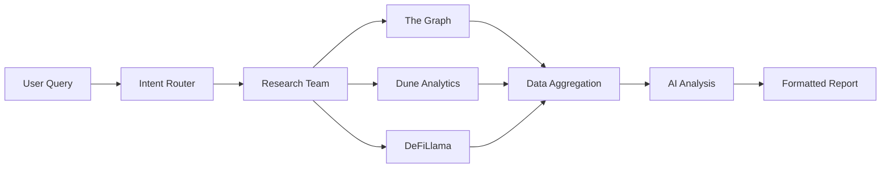

# Use Cases

<Info>
Nex‑T1 transforms complex blockchain interactions into simple, intelligent workflows. From individual traders to enterprise teams, discover how our platform accelerates Web3 adoption and automation.
</Info>

## Primary Use Cases

### 1. DeFi Research & Analytics

<CardGroup cols={2}>
  <Card title="Yield Optimization" icon="percentage">
    **Challenge**: Finding the best yields across hundreds of DeFi protocols is time-consuming and complex.

    **Solution**: Nex‑T1 aggregates yield data from all major protocols, analyzes risk factors, and presents optimized strategies.

    **Example Query**:
    ```
    "Find the top 5 stablecoin yields above 10% APY with low risk"
    ```

    **Result**: Comprehensive report with TVL, audit status, historical performance, and entry strategies.
  </Card>
  <Card title="Protocol Comparison" icon="scale-balanced">
    **Challenge**: Comparing protocols requires accessing multiple data sources and understanding complex metrics.

    **Solution**: AI agents compile data from The Graph, Dune, and DeFiLlama for instant comparisons.

    **Example Query**:
    ```
    "Compare Aave vs Compound for USDC lending rates and safety"
    ```

    **Result**: Side-by-side comparison with rates, TVL, liquidation risks, and recommendations.
  </Card>
</CardGroup>

#### Research Assistant Workflow



**Endpoint**: `/api/v1/multi-agent/research/preview`

<CodeGroup>
```python Python Example
import requests

response = requests.post(
    "http://localhost:8000/api/v1/multi-agent/research/preview",
    headers={"Authorization": "Bearer YOUR_TOKEN"},
    json={
        "query": "Analyze TVL trends for top 10 DeFi protocols this month",
        "include_sources": ["thegraph", "dune", "defillama"],
        "format": "detailed"
    }
)

research_data = response.json()
```

```typescript TypeScript Example
const response = await fetch(
    "http://localhost:8000/api/v1/multi-agent/research/preview",
    {
        method: "POST",
        headers: {
            "Authorization": "Bearer YOUR_TOKEN",
            "Content-Type": "application/json"
        },
        body: JSON.stringify({
            query: "Analyze TVL trends for top 10 DeFi protocols this month",
            include_sources: ["thegraph", "dune", "defillama"],
            format: "detailed"
        })
    }
);

const researchData = await response.json();
```
</CodeGroup>

### 2. Automated Trading

<Tabs>
  <Tab title="DEX Trading">
    **Smart Order Routing**

    Nex‑T1 finds optimal trade paths across multiple DEXs:

    1. **Quote Generation**: Compare prices across Uniswap, 0x, 1inch
    2. **Route Optimization**: Find the best path with minimal slippage
    3. **Gas Estimation**: Calculate total costs including gas
    4. **MEV Protection**: Use flashbots or private pools when needed

    **Example Flow**:
    ```
    User: "Swap 10 ETH to USDC with best rates"

    Nex‑T1:
    1. Fetches quotes from all DEX aggregators
    2. Calculates price impact and gas costs
    3. Shows preview with savings comparison
    4. Executes via selected route on approval
    ```
  </Tab>
  <Tab title="Arbitrage">
    **Cross-DEX Arbitrage**

    Identify and execute profitable arbitrage opportunities:

    ```python
    # Monitor price differences
    arbitrage_config = {
        "pairs": ["ETH/USDC", "WBTC/USDT"],
        "min_profit": 50,  # USD
        "max_gas": 100,    # USD
        "exchanges": ["uniswap", "sushiswap", "curve"]
    }

    # Nex‑T1 monitors and alerts on opportunities
    ```

    **Features**:
    - Real-time price monitoring
    - Profit calculation after fees
    - Atomic transaction execution
    - Failed transaction protection
  </Tab>
  <Tab title="DCA Strategies">
    **Dollar-Cost Averaging**

    Automate periodic purchases with intelligent timing:

    ```
    "Set up $500 weekly BTC purchases when RSI < 40"
    ```

    **Execution Logic**:
    1. Monitor technical indicators
    2. Check liquidity across venues
    3. Execute when conditions met
    4. Track performance metrics
  </Tab>
</Tabs>

**Trading Preview Endpoint**: `/api/v1/multi-agent/preview`

### 3. Risk Management

<CardGroup cols={2}>
  <Card title="Transaction Validation" icon="shield-check">
    **Pre-execution Checks**:
    - Token contract verification
    - Liquidity depth analysis
    - Price impact calculation
    - Slippage protection
    - Gas price optimization

    **Example**:
    ```json
    {
      "action": "swap",
      "token_in": "ETH",
      "token_out": "UNKNOWN_TOKEN",
      "risk_assessment": {
        "status": "HIGH_RISK",
        "issues": [
          "Unverified contract",
          "Low liquidity ($50k)",
          "High price impact (15%)"
        ],
        "recommendation": "DO_NOT_PROCEED"
      }
    }
    ```
  </Card>
  <Card title="Portfolio Monitoring" icon="chart-pie">
    **Real-time Alerts**:
    - Large price movements
    - Liquidity changes
    - Protocol exploits
    - Governance proposals

    **Configuration**:
    ```python
    monitoring_rules = {
        "price_alerts": [
            {"token": "ETH", "threshold": -10, "type": "percent"},
            {"token": "AAVE", "threshold": 250, "type": "absolute"}
        ],
        "defi_positions": [
            {"protocol": "compound", "alert_on": "liquidation_risk"}
        ]
    }
    ```
  </Card>
</CardGroup>

**Risk Endpoint**: `/api/v1/multi-agent/risk/preview`

### 4. Market Data & Intelligence

#### Real-time Market Monitoring

<Tabs>
  <Tab title="Price Tracking">
    **Multi-Source Price Aggregation**

    ```python
    # Get reliable price data
    price_request = {
        "tokens": ["ETH", "BTC", "SOL"],
        "sources": ["chainlink", "coingecko", "binance"],
        "aggregate_method": "median"
    }

    # Returns consolidated price with confidence score
    ```
  </Tab>
  <Tab title="Whale Watching">
    **Large Transaction Monitoring**

    ```
    "Alert me on BTC transactions over 100 BTC"
    ```

    Nex‑T1 monitors and provides context:
    - Sender/receiver analysis
    - Historical patterns
    - Market impact assessment
    - Exchange flow tracking
  </Tab>
  <Tab title="Social Sentiment">
    **Sentiment Analysis**

    Track social metrics and sentiment:
    - Twitter mentions and sentiment
    - Reddit activity
    - GitHub commits
    - News sentiment

    ```json
    {
      "token": "LINK",
      "sentiment_score": 0.75,
      "social_volume": "high",
      "trending_rank": 5,
      "notable_mentions": ["Chainlink VRF v2 launch"]
    }
    ```
  </Tab>
</Tabs>

### 5. Cross-Chain Operations

<CardGroup cols={2}>
  <Card title="Bridge Aggregation" icon="bridge">
    Find the best bridge for cross-chain transfers:

    ```
    "Bridge 1000 USDC from Ethereum to Arbitrum"
    ```

    **Comparison Factors**:
    - Bridge fees
    - Transfer time
    - Security model
    - Liquidity available
    - Historical reliability
  </Card>
  <Card title="Multi-Chain Portfolio" icon="layer-group">
    Unified view across all chains:

    ```
    "Show my total portfolio value across all chains"
    ```

    **Aggregates**:
    - EVM chains (Ethereum, BSC, Polygon, etc.)
    - Solana positions
    - Bitcoin holdings
    - DeFi positions
    - NFT valuations
  </Card>
</CardGroup>

## Industry-Specific Applications

### For Traders

<Accordion title="Day Trading Assistant">
  **Features**:
  - Real-time order book analysis
  - Technical indicator alerts
  - Automated trade execution
  - P&L tracking

  **Example Session**:
  ```
  Trader: "Monitor ETH/USDC for breakout above $3500 with volume"

  Nex‑T1: Sets up monitoring...

  [Alert triggered]
  Nex‑T1: "ETH broke $3500 with 2x average volume.
           Current: $3502, 24h volume: $2.5B
           Momentum: Strong bullish
           Execute buy order?"

  Trader: "Buy 5 ETH with 1% slippage max"

  Nex‑T1: [Executes via best route]
  ```
</Accordion>

<Accordion title="Yield Farmer">
  **Automated Farming**:
  - Harvest optimization
  - Compound frequency calculation
  - IL (Impermanent Loss) tracking
  - APY vs APR calculations

  **Workflow**:
  1. Identify high-yield opportunities
  2. Analyze risk factors
  3. Calculate optimal position size
  4. Monitor and auto-compound
  5. Exit strategy recommendations
</Accordion>

### For Developers

<Accordion title="Bot Development">
  **Build Trading Bots**:

  ```python
  from next1 import TradingBot

  bot = TradingBot(
      strategy="momentum",
      pairs=["ETH/USDC", "BTC/USDT"],
      risk_limit=1000,  # USD
      execution_mode="preview"  # or "live"
  )

  # Bot uses Nex‑T1 APIs for:
  # - Market data feeds
  # - Trade execution
  # - Risk checks
  # - Performance tracking
  ```
</Accordion>

<Accordion title="DApp Integration">
  **Enhance Your DApp**:

  ```javascript
  // Add AI-powered features to your DApp
  import { NexT1SDK } from '@next1/sdk';

  const nex = new NexT1SDK({ apiKey: 'YOUR_KEY' });

  // Add natural language trading
  const result = await nex.chat({
      message: userInput,
      context: {
          wallet: userWallet,
          chainId: 1
      }
  });

  // Display AI response and actions
  showResponse(result.message);
  if (result.actions) {
      await executeActions(result.actions);
  }
  ```
</Accordion>

### For Institutions

<Accordion title="Enterprise Treasury">
  **Treasury Management**:
  - Multi-sig integration
  - Approval workflows
  - Compliance reporting
  - Audit trails

  **Features**:
  - Automated rebalancing
  - Risk limits enforcement
  - Regulatory compliance
  - Custom reporting
</Accordion>

<Accordion title="Research Teams">
  **Market Research Platform**:

  - Custom data pipelines
  - Automated report generation
  - Backtesting frameworks
  - Collaborative workspaces

  **Example Report Automation**:
  ```python
  # Daily DeFi report generation
  report_config = {
      "frequency": "daily",
      "sections": [
          "tvl_changes",
          "yield_opportunities",
          "risk_alerts",
          "governance_updates"
      ],
      "distribution": ["research@team.com"],
      "format": "pdf"
  }
  ```
</Accordion>

## Success Stories

### Case Study 1: DeFi Fund

<Card title="40% Efficiency Gain" icon="rocket">
**Challenge**: Manual research across 50+ protocols taking 6 hours daily

**Solution**: Automated research pipeline with Nex‑T1

**Results**:
- Research time: 6 hours → 1 hour
- Opportunities identified: 3x increase
- Execution speed: 10x faster
- ROI improvement: 25%
</Card>

### Case Study 2: Trading Desk

<Card title="$2M Additional Profit" icon="dollar-sign">
**Challenge**: Missed arbitrage opportunities due to manual monitoring

**Solution**: Real-time arbitrage detection and execution

**Results**:
- Opportunities captured: 95% vs 30%
- Average profit per trade: $500
- Failed transactions: < 1%
- Annual additional profit: $2M+
</Card>

### Case Study 3: Protocol Integration

<Card title="90% Faster Integration" icon="plug">
**Challenge**: 3-month timeline to integrate multiple DeFi protocols

**Solution**: Used Nex‑T1's unified API and MCP adapters

**Results**:
- Integration time: 3 months → 1 week
- Protocols supported: 30+ instantly
- Maintenance overhead: 80% reduction
- Time to market: 10x faster
</Card>

## Implementation Patterns

### Pattern 1: Research → Decision → Execute

```python
async def defi_investment_flow(amount_usd: float):
    # 1. Research
    research = await nex.research({
        "query": f"Best stablecoin yields for ${amount_usd}",
        "risk_tolerance": "medium"
    })

    # 2. Risk Assessment
    risk = await nex.assess_risk({
        "protocol": research.top_recommendation,
        "amount": amount_usd
    })

    # 3. Preview
    preview = await nex.preview_transaction({
        "action": "deposit",
        "protocol": research.top_recommendation,
        "amount": amount_usd
    })

    # 4. Execute (with approval)
    if user_approves(preview):
        result = await nex.execute(preview.transaction)
        return result
```

### Pattern 2: Continuous Monitoring

```python
async def portfolio_monitor():
    rules = {
        "price_alerts": {...},
        "liquidation_monitoring": {...},
        "yield_optimization": {...}
    }

    async for alert in nex.monitor(rules):
        if alert.severity == "high":
            await notify_user(alert)

        if alert.action_required:
            suggestion = await nex.suggest_action(alert)
            await present_to_user(suggestion)
```

### Pattern 3: Automated Strategies

```python
class YieldStrategy:
    def __init__(self, nex_client):
        self.nex = nex_client
        self.positions = []

    async def optimize_yields(self):
        # Find opportunities
        opportunities = await self.nex.find_yields({
            "min_apy": 10,
            "max_risk": 5,
            "chains": ["ethereum", "arbitrum"]
        })

        # Rank by risk-adjusted returns
        ranked = self.calculate_sharpe_ratios(opportunities)

        # Rebalance portfolio
        rebalance_plan = self.generate_rebalance(ranked)

        # Execute rebalancing
        for action in rebalance_plan:
            await self.nex.execute(action)
```

## Getting Started with Use Cases

<Steps>
  <Step title="Identify Your Use Case">
    Determine which category fits your needs: Research, Trading, Risk Management, or Custom
  </Step>
  <Step title="Set Up Authentication">
    Get your API key and configure authentication
  </Step>
  <Step title="Start with Preview Mode">
    Test your workflows with preview endpoints before enabling execution
  </Step>
  <Step title="Implement Gradually">
    Begin with simple queries and progressively add complexity
  </Step>
  <Step title="Monitor and Optimize">
    Use analytics to track performance and optimize your implementation
  </Step>
</Steps>

## Support for Your Use Case

<CardGroup cols={3}>
  <Card title="Examples Repository" icon="github">
    Browse our GitHub for complete implementation examples
  </Card>
  <Card title="Discord Community" icon="discord">
    Connect with other users building similar applications
  </Card>
  <Card title="Custom Solutions" icon="wrench">
    Contact our team for enterprise or custom use case support
  </Card>
</CardGroup>