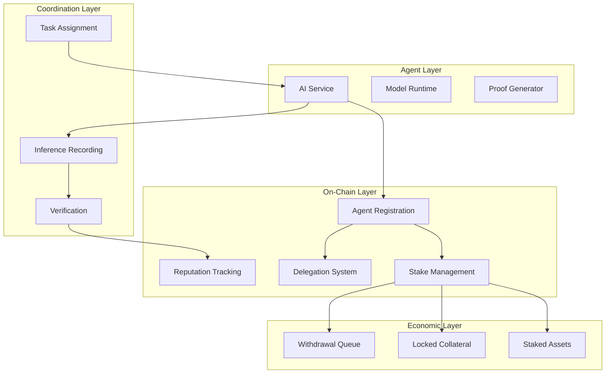
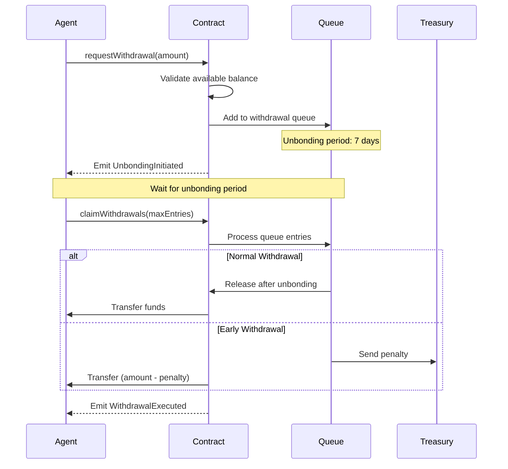
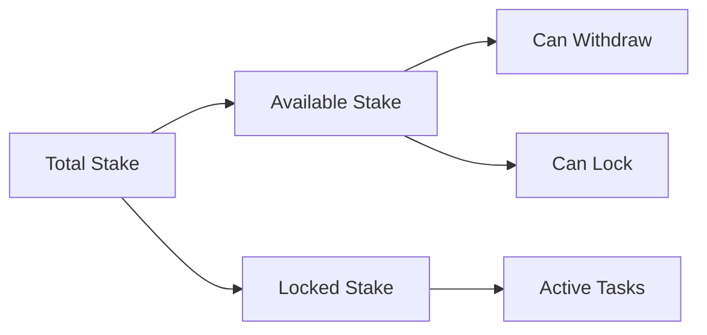

## Introduction

AI Agents on Nexis Appchain are registered entities that provide inference services with cryptographic proof-of-work and economic security guarantees. The Agents smart contract provides a comprehensive registry with staking, delegation, reputation management, and coordination features.

<CardGroup cols={2}>
  <Card title="Agent Registration" icon="user-plus">
    Register your AI agent with metadata and service endpoints
  </Card>
  <Card title="Staking & Security" icon="shield">
    Provide economic guarantees through multi-asset staking
  </Card>
  <Card title="Reputation System" icon="star">
    Build trust through multi-dimensional reputation tracking
  </Card>
  <Card title="Delegation" icon="users">
    Enable teams to manage agents with permission-based access
  </Card>
</CardGroup>

## Agent Architecture



## Agent Registration

### Registration Process

Registering an agent creates an on-chain identity with metadata and service information:

<CodeGroup>

```typescript TypeScript
import { ethers } from "ethers";
import { NexisAgents } from "@nexis-network/sdk";

async function registerAgent(
  agentId: bigint,
  metadata: {
    name: string;
    description: string;
    capabilities: string[];
    models: string[];
  },
  serviceURI: string
) {
  // 1. Prepare metadata (typically stored on IPFS)
  const metadataJSON = JSON.stringify(metadata);
  const metadataURI = await uploadToIPFS(metadataJSON);

  // 2. Initialize contract
  const provider = new ethers.providers.JsonRpcProvider("https://rpc.nexis.network");
  const signer = new ethers.Wallet(process.env.PRIVATE_KEY, provider);
  const agents = new NexisAgents(AGENTS_ADDRESS, signer);

  // 3. Register agent
  const tx = await agents.register(agentId, metadataURI, serviceURI);
  const receipt = await tx.wait();

  console.log(`Agent ${agentId} registered successfully!`);
  console.log(`Transaction hash: ${receipt.transactionHash}`);

  return {
    agentId,
    metadataURI,
    serviceURI,
    owner: signer.address,
    transactionHash: receipt.transactionHash
  };
}

// Example usage
await registerAgent(
  12345n,
  {
    name: "Stable Diffusion Agent",
    description: "High-quality image generation service",
    capabilities: ["text-to-image", "image-to-image", "inpainting"],
    models: ["stable-diffusion-v2.1", "stable-diffusion-xl"]
  },
  "https://api.myagent.com/inference"
);
```

```python Python
from web3 import Web3
from nexis_sdk import NexisAgents
import json
import ipfshttpclient

def register_agent(
    agent_id: int,
    metadata: dict,
    service_uri: str
) -> dict:
    """Register an AI agent on Nexis Appchain."""

    # 1. Prepare metadata
    metadata_json = json.dumps(metadata)
    metadata_uri = upload_to_ipfs(metadata_json)

    # 2. Initialize contract
    w3 = Web3(Web3.HTTPProvider("https://rpc.nexis.network"))
    account = w3.eth.account.from_key(os.environ["PRIVATE_KEY"])
    agents = NexisAgents(AGENTS_ADDRESS, w3, account)

    # 3. Register agent
    tx_hash = agents.register(agent_id, metadata_uri, service_uri)
    receipt = w3.eth.wait_for_transaction_receipt(tx_hash)

    print(f"Agent {agent_id} registered successfully!")
    print(f"Transaction hash: {tx_hash.hex()}")

    return {
        "agentId": agent_id,
        "metadataURI": metadata_uri,
        "serviceURI": service_uri,
        "owner": account.address,
        "transactionHash": tx_hash.hex()
    }

# Example usage
register_agent(
    12345,
    {
        "name": "Stable Diffusion Agent",
        "description": "High-quality image generation service",
        "capabilities": ["text-to-image", "image-to-image", "inpainting"],
        "models": ["stable-diffusion-v2.1", "stable-diffusion-xl"]
    },
    "https://api.myagent.com/inference"
)

def upload_to_ipfs(data: str) -> str:
    """Upload data to IPFS and return URI."""
    client = ipfshttpclient.connect()
    result = client.add_str(data)
    return f"ipfs://{result}"
```

```solidity Solidity - Contract Function
function register(
    uint256 agentId,
    string calldata metadata,
    string calldata serviceURI
) external whenNotPaused {
    if (agentOwner[agentId] != address(0)) {
        revert AgentAlreadyRegistered(agentId, agentOwner[agentId]);
    }

    agentOwner[agentId] = msg.sender;
    agentMetadata[agentId] = metadata;
    _serviceURI[agentId] = serviceURI;

    _agentIndexLookup[agentId] = _agentIndex.length + 1;
    _agentIndex.push(agentId);

    emit AgentRegistered(msg.sender, agentId, metadata, serviceURI);
}
```

</CodeGroup>

### Agent Metadata Structure

The metadata URI should point to a JSON structure on IPFS:

```json
{
  "version": "1.0",
  "name": "Stable Diffusion Agent",
  "description": "High-quality image generation service powered by Stable Diffusion models",
  "owner": {
    "name": "Acme AI Services",
    "website": "https://acme-ai.com",
    "contact": "support@acme-ai.com"
  },
  "capabilities": [
    "text-to-image",
    "image-to-image",
    "inpainting",
    "style-transfer"
  ],
  "models": [
    {
      "name": "stable-diffusion-v2.1",
      "version": "2.1",
      "type": "text-to-image",
      "description": "Latest Stable Diffusion model",
      "checksum": "sha256:abc123..."
    },
    {
      "name": "stable-diffusion-xl",
      "version": "1.0",
      "type": "text-to-image",
      "description": "High resolution image generation",
      "checksum": "sha256:def456..."
    }
  ],
  "pricing": {
    "currency": "NEXIS",
    "per_inference": "0.01",
    "bulk_discount": {
      "100+": "0.008",
      "1000+": "0.005"
    }
  },
  "sla": {
    "uptime": "99.9%",
    "response_time_ms": 5000,
    "support": "24/7"
  },
  "technical": {
    "api_version": "v1",
    "rate_limit": "100/minute",
    "max_concurrent": 10,
    "supported_formats": ["png", "jpg", "webp"]
  }
}
```

### Updating Agent Metadata

<CodeGroup>

```typescript TypeScript
async function updateMetadata(agentId: bigint, newMetadata: any) {
  const metadataJSON = JSON.stringify(newMetadata);
  const metadataURI = await uploadToIPFS(metadataJSON);

  const tx = await agents.updateMetadata(agentId, metadataURI);
  await tx.wait();

  console.log(`Metadata updated for agent ${agentId}`);
}

async function updateServiceURI(agentId: bigint, newServiceURI: string) {
  const tx = await agents.updateServiceURI(agentId, newServiceURI);
  await tx.wait();

  console.log(`Service URI updated for agent ${agentId}`);
}
```

```python Python
def update_metadata(agent_id: int, new_metadata: dict):
    """Update agent metadata."""
    metadata_json = json.dumps(new_metadata)
    metadata_uri = upload_to_ipfs(metadata_json)

    tx_hash = agents.update_metadata(agent_id, metadata_uri)
    w3.eth.wait_for_transaction_receipt(tx_hash)

    print(f"Metadata updated for agent {agent_id}")

def update_service_uri(agent_id: int, new_service_uri: str):
    """Update agent service URI."""
    tx_hash = agents.update_service_uri(agent_id, new_service_uri)
    w3.eth.wait_for_transaction_receipt(tx_hash)

    print(f"Service URI updated for agent {agent_id}")
```

</CodeGroup>

## Staking System

### Multi-Asset Staking

Agents can stake both ETH and ERC20 tokens to provide economic security:

<CodeGroup>

```typescript Stake ETH
async function stakeETH(agentId: bigint, amount: string) {
  const amountWei = ethers.utils.parseEther(amount);

  const tx = await agents.stakeETH(agentId, {
    value: amountWei
  });

  const receipt = await tx.wait();
  console.log(`Staked ${amount} ETH for agent ${agentId}`);

  // Get updated stake balance
  const stakeBalance = await agents.stakedBalance(agentId, ethers.constants.AddressZero);
  console.log(`Total ETH stake: ${ethers.utils.formatEther(stakeBalance)} ETH`);

  return receipt;
}

// Example: Stake 1 ETH
await stakeETH(12345n, "1.0");
```

```typescript Stake ERC20 Tokens
async function stakeERC20(
  agentId: bigint,
  tokenAddress: string,
  amount: string
) {
  // 1. Get token contract
  const token = new ethers.Contract(
    tokenAddress,
    ["function approve(address spender, uint256 amount) returns (bool)"],
    signer
  );

  // 2. Approve Agents contract to spend tokens
  const amountWei = ethers.utils.parseUnits(amount, 18);
  const approveTx = await token.approve(AGENTS_ADDRESS, amountWei);
  await approveTx.wait();
  console.log("Token approval confirmed");

  // 3. Stake tokens
  const stakeTx = await agents.stakeERC20(agentId, tokenAddress, amountWei);
  const receipt = await stakeTx.wait();
  console.log(`Staked ${amount} tokens for agent ${agentId}`);

  // 4. Get updated stake balance
  const stakeBalance = await agents.stakedBalance(agentId, tokenAddress);
  console.log(`Total token stake: ${ethers.utils.formatUnits(stakeBalance, 18)}`);

  return receipt;
}

// Example: Stake 1000 USDC
const USDC_ADDRESS = "0x...";
await stakeERC20(12345n, USDC_ADDRESS, "1000.0");
```

```python Python - Stake ETH
def stake_eth(agent_id: int, amount_eth: float):
    """Stake ETH for an agent."""
    amount_wei = Web3.to_wei(amount_eth, 'ether')

    tx_hash = agents.stake_eth(agent_id, value=amount_wei)
    receipt = w3.eth.wait_for_transaction_receipt(tx_hash)

    print(f"Staked {amount_eth} ETH for agent {agent_id}")

    # Get updated balance
    eth_address = "0x0000000000000000000000000000000000000000"
    stake_balance = agents.staked_balance(agent_id, eth_address)
    print(f"Total ETH stake: {Web3.from_wei(stake_balance, 'ether')} ETH")

    return receipt

# Example
stake_eth(12345, 1.0)
```

```python Python - Stake ERC20
def stake_erc20(agent_id: int, token_address: str, amount: float):
    """Stake ERC20 tokens for an agent."""
    # 1. Get token contract
    token_contract = w3.eth.contract(
        address=token_address,
        abi=[{
            "inputs": [{"name": "spender", "type": "address"}, {"name": "amount", "type": "uint256"}],
            "name": "approve",
            "outputs": [{"name": "", "type": "bool"}],
            "stateMutability": "nonpayable",
            "type": "function"
        }]
    )

    # 2. Approve tokens
    amount_wei = Web3.to_wei(amount, 'ether')
    approve_tx = token_contract.functions.approve(AGENTS_ADDRESS, amount_wei).transact()
    w3.eth.wait_for_transaction_receipt(approve_tx)
    print("Token approval confirmed")

    # 3. Stake tokens
    tx_hash = agents.stake_erc20(agent_id, token_address, amount_wei)
    receipt = w3.eth.wait_for_transaction_receipt(tx_hash)
    print(f"Staked {amount} tokens for agent {agent_id}")

    return receipt
```

</CodeGroup>

### Stake Balances

Query different stake states:

<CodeGroup>

```typescript TypeScript
async function getStakeInfo(agentId: bigint, asset: string) {
  // Get detailed stake view
  const stakeView = await agents.stakeBalances(agentId, asset);

  console.log(`Agent ${agentId} stake for ${asset}:`);
  console.log(`  Total: ${ethers.utils.formatEther(stakeView.total)}`);
  console.log(`  Locked: ${ethers.utils.formatEther(stakeView.locked)}`);
  console.log(`  Available: ${ethers.utils.formatEther(stakeView.available)}`);

  return stakeView;
}

// Get ETH stake info
const ETH_ADDRESS = ethers.constants.AddressZero;
await getStakeInfo(12345n, ETH_ADDRESS);
```

```python Python
def get_stake_info(agent_id: int, asset: str):
    """Get detailed stake information."""
    stake_view = agents.stake_balances(agent_id, asset)

    print(f"Agent {agent_id} stake for {asset}:")
    print(f"  Total: {Web3.from_wei(stake_view['total'], 'ether')}")
    print(f"  Locked: {Web3.from_wei(stake_view['locked'], 'ether')}")
    print(f"  Available: {Web3.from_wei(stake_view['available'], 'ether')}")

    return stake_view

# Get ETH stake info
ETH_ADDRESS = "0x0000000000000000000000000000000000000000"
get_stake_info(12345, ETH_ADDRESS)
```

</CodeGroup>

### Withdrawal Process

The withdrawal process includes an unbonding period for security:



<CodeGroup>

```typescript Request Withdrawal
async function requestWithdrawal(
  agentId: bigint,
  asset: string,
  amount: string
) {
  const amountWei = ethers.utils.parseEther(amount);

  const tx = await agents.requestWithdrawal(agentId, asset, amountWei);
  const receipt = await tx.wait();

  // Extract release time from event
  const event = receipt.events?.find(e => e.event === "UnbondingInitiated");
  const releaseTime = event?.args?.releaseTime;

  console.log(`Withdrawal requested for ${amount}`);
  console.log(`Release time: ${new Date(releaseTime * 1000).toISOString()}`);

  return { releaseTime, transactionHash: receipt.transactionHash };
}

// Example
await requestWithdrawal(12345n, ETH_ADDRESS, "0.5");
```

```typescript Claim Withdrawals
async function claimWithdrawals(
  agentId: bigint,
  asset: string,
  maxEntries: number = 10,
  receiver?: string,
  forceEarly: boolean = false
) {
  const receiverAddress = receiver || signer.address;

  const tx = await agents.claimWithdrawals(
    agentId,
    asset,
    maxEntries,
    receiverAddress,
    forceEarly
  );

  const receipt = await tx.wait();

  // Parse results from transaction receipt
  let releasedAmount = ethers.BigNumber.from(0);
  let penaltyAmount = ethers.BigNumber.from(0);

  if (forceEarly) {
    const event = receipt.events?.find(e => e.event === "EarlyWithdrawal");
    if (event) {
      releasedAmount = event.args?.amount;
      penaltyAmount = event.args?.penalty;
    }
  } else {
    const event = receipt.events?.find(e => e.event === "WithdrawalExecuted");
    if (event) {
      releasedAmount = event.args?.amount;
    }
  }

  console.log(`Released: ${ethers.utils.formatEther(releasedAmount)}`);
  if (penaltyAmount.gt(0)) {
    console.log(`Penalty: ${ethers.utils.formatEther(penaltyAmount)}`);
  }

  return { releasedAmount, penaltyAmount, receipt };
}

// Claim after unbonding period
await claimWithdrawals(12345n, ETH_ADDRESS, 10);

// Early withdrawal with penalty
await claimWithdrawals(12345n, ETH_ADDRESS, 10, undefined, true);
```

```typescript Cancel Withdrawal
async function cancelWithdrawal(
  agentId: bigint,
  asset: string,
  queueIndex: number
) {
  const tx = await agents.cancelWithdrawal(agentId, asset, queueIndex);
  await tx.wait();

  console.log(`Cancelled withdrawal at index ${queueIndex}`);
}
```

```python Python - Request Withdrawal
def request_withdrawal(agent_id: int, asset: str, amount: float):
    """Request withdrawal with unbonding period."""
    amount_wei = Web3.to_wei(amount, 'ether')

    tx_hash = agents.request_withdrawal(agent_id, asset, amount_wei)
    receipt = w3.eth.wait_for_transaction_receipt(tx_hash)

    # Parse UnbondingInitiated event
    event = parse_unbonding_event(receipt)
    release_time = event['releaseTime']

    print(f"Withdrawal requested for {amount}")
    print(f"Release time: {datetime.fromtimestamp(release_time)}")

    return release_time
```

</CodeGroup>

### Viewing Pending Withdrawals

```typescript
async function viewPendingWithdrawals(agentId: bigint, asset: string) {
  const count = await agents.pendingWithdrawalCount(agentId, asset);
  console.log(`Pending withdrawals: ${count}`);

  for (let i = 0; i < count.toNumber(); i++) {
    const withdrawal = await agents.pendingWithdrawalAt(agentId, asset, i);
    const releaseDate = new Date(withdrawal.releaseTime * 1000);
    const isReady = Date.now() >= releaseDate.getTime();

    console.log(`\nWithdrawal ${i}:`);
    console.log(`  Amount: ${ethers.utils.formatEther(withdrawal.amount)}`);
    console.log(`  Release: ${releaseDate.toISOString()}`);
    console.log(`  Status: ${isReady ? "Ready" : "Locked"}`);
  }
}
```

## Locked Stake

Stake can be locked by the Tasks contract during task execution:



<CodeGroup>

```typescript Query Locked Stake
async function getLockedStake(agentId: bigint, asset: string) {
  const locked = await agents.lockedBalance(agentId, asset);
  console.log(`Locked stake: ${ethers.utils.formatEther(locked)}`);
  return locked;
}
```

```solidity Lock/Unlock (Task Module Only)
// These functions can only be called by the Tasks contract
function lockStake(uint256 agentId, address asset, uint256 amount)
    external
    onlyRole(TASK_MODULE_ROLE)
{
    _requireAgentExists(agentId);
    if (amount == 0) revert ZeroAmount();
    StakeView memory balances = stakeBalances(agentId, asset);
    if (amount > balances.available) revert AmountTooLarge(amount, balances.available);
    _lockedStake[agentId][asset] = balances.locked + amount;
    emit StakeLocked(agentId, asset, amount, _lockedStake[agentId][asset]);
}

function unlockStake(uint256 agentId, address asset, uint256 amount)
    external
    onlyRole(TASK_MODULE_ROLE)
{
    _requireAgentExists(agentId);
    if (amount == 0) revert ZeroAmount();
    uint256 locked = _lockedStake[agentId][asset];
    if (amount > locked) revert AmountTooLarge(amount, locked);
    _lockedStake[agentId][asset] = locked - amount;
    emit StakeUnlocked(agentId, asset, amount, _lockedStake[agentId][asset]);
}
```

</CodeGroup>

## Delegation System

The delegation system enables permission-based access control:

### Permission Types

```solidity
bytes32 public constant PERMISSION_METADATA = keccak256("PERMISSION_METADATA");
bytes32 public constant PERMISSION_INFERENCE = keccak256("PERMISSION_INFERENCE");
bytes32 public constant PERMISSION_WITHDRAW = keccak256("PERMISSION_WITHDRAW");
```

<CodeGroup>

```typescript TypeScript Constants
export const PERMISSIONS = {
  METADATA: ethers.utils.id("PERMISSION_METADATA"),
  INFERENCE: ethers.utils.id("PERMISSION_INFERENCE"),
  WITHDRAW: ethers.utils.id("PERMISSION_WITHDRAW")
} as const;
```

```python Python Constants
PERMISSIONS = {
    "METADATA": Web3.keccak(text="PERMISSION_METADATA"),
    "INFERENCE": Web3.keccak(text="PERMISSION_INFERENCE"),
    "WITHDRAW": Web3.keccak(text="PERMISSION_WITHDRAW")
}
```

</CodeGroup>

### Permission Descriptions

| Permission | Description | Functions Enabled |
|------------|-------------|-------------------|
| `PERMISSION_METADATA` | Update agent metadata and service URI | `updateMetadata()`, `updateServiceURI()` |
| `PERMISSION_INFERENCE` | Record inference commitments | `recordInference()` |
| `PERMISSION_WITHDRAW` | Manage stake withdrawals | `requestWithdrawal()`, `claimWithdrawals()`, `cancelWithdrawal()` |

### Setting Delegates

<CodeGroup>

```typescript TypeScript
async function setDelegate(
  agentId: bigint,
  delegateAddress: string,
  permission: string,
  enabled: boolean
) {
  const tx = await agents.setDelegate(
    agentId,
    delegateAddress,
    permission,
    enabled
  );
  await tx.wait();

  console.log(`Delegate ${delegateAddress} ${enabled ? "granted" : "revoked"} ${permission}`);
}

// Grant inference permission to operator
await setDelegate(
  12345n,
  "0xOperatorAddress...",
  PERMISSIONS.INFERENCE,
  true
);

// Grant metadata permission to developer
await setDelegate(
  12345n,
  "0xDeveloperAddress...",
  PERMISSIONS.METADATA,
  true
);

// Revoke withdrawal permission
await setDelegate(
  12345n,
  "0xOldOperatorAddress...",
  PERMISSIONS.WITHDRAW,
  false
);
```

```python Python
def set_delegate(
    agent_id: int,
    delegate_address: str,
    permission: bytes,
    enabled: bool
):
    """Set delegation permission for an address."""
    tx_hash = agents.set_delegate(
        agent_id,
        delegate_address,
        permission,
        enabled
    )
    w3.eth.wait_for_transaction_receipt(tx_hash)

    status = "granted" if enabled else "revoked"
    print(f"Delegate {delegate_address} {status} {permission.hex()}")

# Grant inference permission
set_delegate(
    12345,
    "0xOperatorAddress...",
    PERMISSIONS["INFERENCE"],
    True
)
```

</CodeGroup>

### Checking Permissions

```typescript
async function checkPermission(
  agentId: bigint,
  operatorAddress: string,
  permission: string
): Promise<boolean> {
  const hasPermission = await agents.hasDelegatedPermission(
    agentId,
    operatorAddress,
    permission
  );

  console.log(`${operatorAddress} has ${permission}: ${hasPermission}`);
  return hasPermission;
}

// Check if operator can record inference
const canRecordInference = await checkPermission(
  12345n,
  "0xOperatorAddress...",
  PERMISSIONS.INFERENCE
);
```

## Reputation System

### Multi-Dimensional Reputation

Nexis tracks agent reputation across four dimensions:

```typescript
export const REPUTATION_DIMENSIONS = {
  RELIABILITY: ethers.utils.id("reliability"),
  ACCURACY: ethers.utils.id("accuracy"),
  PERFORMANCE: ethers.utils.id("performance"),
  TRUSTWORTHINESS: ethers.utils.id("trustworthiness")
} as const;
```

### Dimension Meanings

<CardGroup cols={2}>
  <Card title="Reliability" icon="clock">
    Consistency in completing tasks and meeting deadlines. Tracks uptime, completion rate, and deadline adherence.
  </Card>
  <Card title="Accuracy" icon="bullseye">
    Quality and correctness of inference outputs. Based on verification success rate and user feedback.
  </Card>
  <Card title="Performance" icon="gauge">
    Speed and efficiency of execution. Measures response time, throughput, and resource efficiency.
  </Card>
  <Card title="Trustworthiness" icon="shield-check">
    Overall behavior and community standing. Considers slashing history, disputes, and peer reviews.
  </Card>
</CardGroup>

### Querying Reputation

<CodeGroup>

```typescript TypeScript
async function getReputationScores(agentId: bigint) {
  const reliability = await agents.getReputation(
    agentId,
    REPUTATION_DIMENSIONS.RELIABILITY
  );
  const accuracy = await agents.getReputation(
    agentId,
    REPUTATION_DIMENSIONS.ACCURACY
  );
  const performance = await agents.getReputation(
    agentId,
    REPUTATION_DIMENSIONS.PERFORMANCE
  );
  const trustworthiness = await agents.getReputation(
    agentId,
    REPUTATION_DIMENSIONS.TRUSTWORTHINESS
  );

  console.log(`\nReputation scores for agent ${agentId}:`);
  console.log(`  Reliability: ${reliability}`);
  console.log(`  Accuracy: ${accuracy}`);
  console.log(`  Performance: ${performance}`);
  console.log(`  Trustworthiness: ${trustworthiness}`);

  // Get weighted aggregate
  const aggregated = await agents.aggregatedReputation(agentId);
  console.log(`  Aggregated: ${aggregated}`);

  return {
    reliability,
    accuracy,
    performance,
    trustworthiness,
    aggregated
  };
}

await getReputationScores(12345n);
```

```python Python
def get_reputation_scores(agent_id: int):
    """Get all reputation scores for an agent."""
    reliability = agents.get_reputation(agent_id, REPUTATION_DIMENSIONS["RELIABILITY"])
    accuracy = agents.get_reputation(agent_id, REPUTATION_DIMENSIONS["ACCURACY"])
    performance = agents.get_reputation(agent_id, REPUTATION_DIMENSIONS["PERFORMANCE"])
    trustworthiness = agents.get_reputation(agent_id, REPUTATION_DIMENSIONS["TRUSTWORTHINESS"])

    print(f"\nReputation scores for agent {agent_id}:")
    print(f"  Reliability: {reliability}")
    print(f"  Accuracy: {accuracy}")
    print(f"  Performance: {performance}")
    print(f"  Trustworthiness: {trustworthiness}")

    # Get weighted aggregate
    aggregated = agents.aggregated_reputation(agent_id)
    print(f"  Aggregated: {aggregated}")

    return {
        "reliability": reliability,
        "accuracy": accuracy,
        "performance": performance,
        "trustworthiness": trustworthiness,
        "aggregated": aggregated
    }
```

</CodeGroup>

### Reputation Updates

Reputation is updated automatically during verification:

```typescript
// In attestInference(), verifiers provide reputation deltas
const deltas: ReputationDelta[] = [
  {
    dimension: REPUTATION_DIMENSIONS.ACCURACY,
    delta: 10,  // Positive for successful verification
    reason: "Successful inference verification"
  },
  {
    dimension: REPUTATION_DIMENSIONS.RELIABILITY,
    delta: 5,
    reason: "Timely submission"
  }
];

await agents.connect(verifier).attestInference(
  inferenceId,
  true,
  attestationURI,
  deltas
);
```

### Reputation Weights

Administrators can adjust the weight of each dimension:

```typescript
// Query current weights
async function getReputationWeights() {
  const dimensions = await agents.reputationDimensions();

  for (const dim of dimensions) {
    const weight = await agents.reputationWeights(dim);
    console.log(`${dim}: ${weight} basis points`);
  }
}

// Admin: Update weights (requires DEFAULT_ADMIN_ROLE)
async function updateWeight(dimension: string, weightBps: number) {
  const tx = await agents.updateReputationWeight(dimension, weightBps);
  await tx.wait();
  console.log(`Updated weight for ${dimension} to ${weightBps} bps`);
}

// Example: Increase accuracy weight to 40%
await updateWeight(REPUTATION_DIMENSIONS.ACCURACY, 4000);
```

## Recording Inference

Agents record inference commitments with cryptographic proofs:

<CodeGroup>

```typescript Complete Flow
async function performAndRecordInference(
  agentId: bigint,
  input: any,
  taskId: bigint = 0n
) {
  // 1. Execute inference (your AI model)
  const output = await runModel(input);

  // 2. Compute hashes
  const inputHash = computeInputHash(input);
  const outputHash = computeOutputHash(output);
  const modelHash = computeModelHash({
    name: "stable-diffusion",
    version: "v2.1"
  });

  // 3. Prepare proof artifact
  const proofArtifact = {
    input,
    output,
    model: {
      name: "stable-diffusion",
      version: "v2.1"
    },
    metadata: {
      timestamp: Date.now(),
      executionTime: 1234
    }
  };

  // 4. Upload to IPFS
  const proofURI = await uploadToIPFS(proofArtifact);

  // 5. Record on-chain
  const tx = await agents.recordInference(
    agentId,
    inputHash,
    outputHash,
    modelHash,
    taskId,
    proofURI
  );

  const receipt = await tx.wait();
  const event = receipt.events?.find(e => e.event === "InferenceRecorded");
  const inferenceId = event?.args?.inferenceId;

  console.log(`Inference recorded: ${inferenceId}`);
  return { inferenceId, output };
}
```

```python Python
def perform_and_record_inference(
    agent_id: int,
    input_data: dict,
    task_id: int = 0
):
    """Execute inference and record on-chain."""

    # 1. Execute inference
    output = run_model(input_data)

    # 2. Compute hashes
    input_hash = compute_input_hash(input_data)
    output_hash = compute_output_hash(output)
    model_hash = compute_model_hash("stable-diffusion", "v2.1")

    # 3. Prepare proof artifact
    proof_artifact = {
        "input": input_data,
        "output": output,
        "model": {
            "name": "stable-diffusion",
            "version": "v2.1"
        },
        "metadata": {
            "timestamp": int(time.time()),
            "executionTime": 1234
        }
    }

    # 4. Upload to IPFS
    proof_uri = upload_to_ipfs(proof_artifact)

    # 5. Record on-chain
    tx_hash = agents.record_inference(
        agent_id,
        input_hash,
        output_hash,
        model_hash,
        task_id,
        proof_uri
    )

    receipt = w3.eth.wait_for_transaction_receipt(tx_hash)
    inference_id = extract_inference_id(receipt)

    print(f"Inference recorded: {inference_id.hex()}")
    return inference_id, output
```

</CodeGroup>

## Discovery & Querying

### List All Agents

```typescript
async function listAgents(offset: number = 0, limit: number = 10) {
  const agents = await agentsContract.listAgents(offset, limit);

  console.log(`\nAgents (${offset} to ${offset + agents.length}):`);
  for (const agent of agents) {
    console.log(`\nAgent ${agent.agentId}:`);
    console.log(`  Owner: ${agent.owner}`);
    console.log(`  Metadata: ${agent.metadata}`);
    console.log(`  Service URI: ${agent.serviceURI}`);
    console.log(`  Total Stake: ${ethers.utils.formatEther(agent.totalStake)}`);
    console.log(`  Locked Stake: ${ethers.utils.formatEther(agent.lockedStake)}`);
    console.log(`  Reputation: ${agent.weightedReputation}`);
  }

  return agents;
}
```

### Aggregated Statistics

```typescript
async function getAggregatedStats() {
  const stats = await agentsContract.aggregatedStats();

  console.log(`\nAggregated Statistics:`);
  console.log(`  Total Agents: ${stats.totalAgents}`);
  console.log(`  Tracked Assets:`);

  for (let i = 0; i < stats.assets.length; i++) {
    const asset = stats.assets[i];
    const total = stats.totalStakedPerAsset[i];
    const assetName = asset === ethers.constants.AddressZero ? "ETH" : asset;
    console.log(`    ${assetName}: ${ethers.utils.formatEther(total)}`);
  }

  return stats;
}
```

## Best Practices

### Minimum Stake Requirements

<Tip>
Set minimum stake requirements proportional to the value of tasks your agent will execute.
</Tip>

```typescript
// Example: Require 1 ETH minimum stake
const MIN_STAKE = ethers.utils.parseEther("1.0");

async function ensureMinimumStake(agentId: bigint) {
  const currentStake = await agents.stakedBalance(agentId, ETH_ADDRESS);

  if (currentStake.lt(MIN_STAKE)) {
    const needed = MIN_STAKE.sub(currentStake);
    await agents.stakeETH(agentId, { value: needed });
    console.log(`Added ${ethers.utils.formatEther(needed)} ETH stake`);
  }
}
```

### Delegation Security

<Warning>
Only delegate permissions to trusted addresses. Use separate addresses for different roles.
</Warning>

**Recommended Setup**:
- **Owner Address**: Cold wallet, rarely used
- **Metadata Address**: For updating service information
- **Inference Address**: Hot wallet for recording inferences
- **Withdrawal Address**: Multi-sig for financial operations

### Monitoring Reputation

```typescript
// Set up reputation monitoring
async function monitorReputation(agentId: bigint, threshold: number = -50) {
  const aggregated = await agents.aggregatedReputation(agentId);

  if (aggregated < threshold) {
    console.warn(`⚠️ Low reputation: ${aggregated}. Investigate issues!`);
    // Send alert, pause operations, etc.
  }
}
```

### Proof Artifact Best Practices

1. **Include Sufficient Detail**: Store all necessary information for verification
2. **Use Compression**: Reduce IPFS storage costs with gzip
3. **Pin Critical Data**: Ensure proofs remain accessible
4. **Include Timestamps**: Track inference timing
5. **Version Metadata**: Include schema version for compatibility

## Next Steps

<CardGroup cols={2}>
  <Card title="LangGraph Integration" icon="diagram-project" href="/ai-ml/langgraph">
    Build complex workflows with agent coordination
  </Card>
  <Card title="Complete Examples" icon="code" href="/ai-ml/examples">
    View full implementation examples
  </Card>
  <Card title="Tasks System" icon="list-check" href="/contracts/tasks">
    Learn about the task execution framework
  </Card>
  <Card title="API Reference" icon="book" href="/api-reference/agents-api">
    Explore the complete API documentation
  </Card>
</CardGroup>