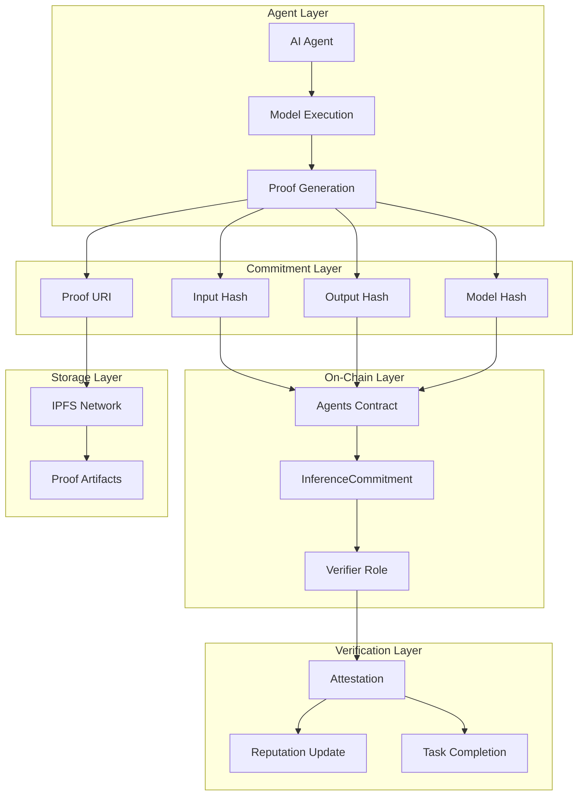
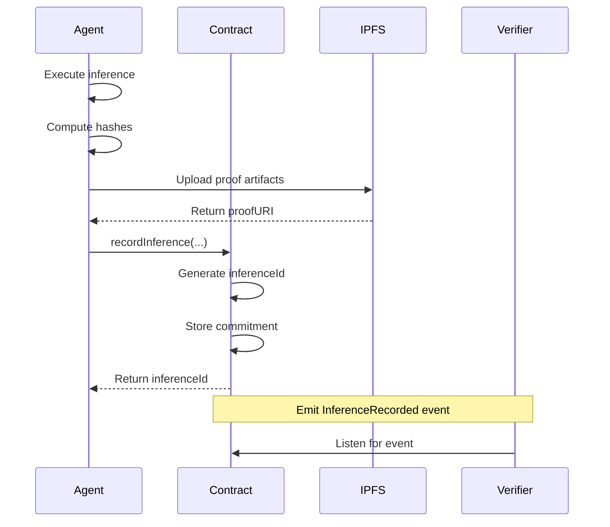
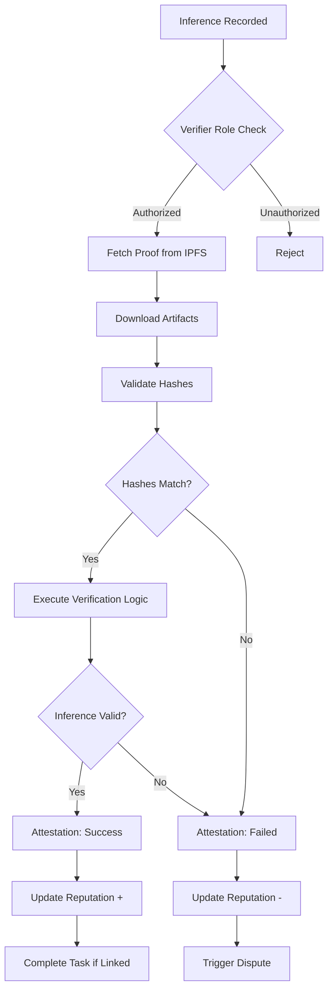
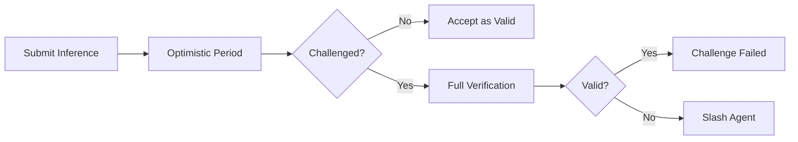

## Overview

Proof-of-Inference (PoI) is a cryptographic verification system that enables trustless verification of AI model outputs on the blockchain. By creating hash-based commitments for inputs, outputs, and model identifiers, Nexis ensures that inference results can be verified without requiring the full computation to be replicated on-chain.

<CardGroup cols={2}>
  <Card title="Cryptographic Commitments" icon="fingerprint">
    Hash-based commitments for inputs, outputs, and models
  </Card>
  <Card title="IPFS Integration" icon="database">
    Decentralized storage for proof artifacts
  </Card>
  <Card title="On-Chain Verification" icon="check-circle">
    Smart contract attestation and validation
  </Card>
  <Card title="Economic Security" icon="shield">
    Stake-backed guarantees with slashing
  </Card>
</CardGroup>

## Architecture

The Proof-of-Inference system consists of several interconnected components:



## InferenceCommitment Structure

The core data structure for proof-of-inference is the `InferenceCommitment` struct:

<CodeGroup>

```solidity Solidity Definition
struct InferenceCommitment {
    uint256 agentId;        // Unique agent identifier
    bytes32 inputHash;      // keccak256 hash of input data
    bytes32 outputHash;     // keccak256 hash of inference output
    bytes32 modelHash;      // keccak256 hash of model identifier
    uint256 taskId;         // Associated task ID (0 if standalone)
    address reporter;       // Address that submitted the commitment
    string proofURI;        // IPFS URI containing full proof artifacts
    uint64 timestamp;       // Block timestamp of commitment
}
```

```typescript TypeScript Interface
interface InferenceCommitment {
  agentId: bigint;
  inputHash: string;      // 0x-prefixed hex string (32 bytes)
  outputHash: string;     // 0x-prefixed hex string (32 bytes)
  modelHash: string;      // 0x-prefixed hex string (32 bytes)
  taskId: bigint;
  reporter: string;       // Ethereum address
  proofURI: string;       // IPFS URI (ipfs://...)
  timestamp: bigint;      // Unix timestamp in seconds
}
```

```python Python Type
from typing import TypedDict
from web3.types import HexBytes, ChecksumAddress

class InferenceCommitment(TypedDict):
    agentId: int
    inputHash: HexBytes         # 32 bytes
    outputHash: HexBytes        # 32 bytes
    modelHash: HexBytes         # 32 bytes
    taskId: int
    reporter: ChecksumAddress
    proofURI: str              # IPFS URI
    timestamp: int             # Unix timestamp
```

</CodeGroup>

### Field Descriptions

| Field | Type | Description | Purpose |
|-------|------|-------------|---------|
| `agentId` | uint256 | Unique identifier for the AI agent | Links commitment to registered agent |
| `inputHash` | bytes32 | keccak256 hash of input data | Commitment to input without revealing it |
| `outputHash` | bytes32 | keccak256 hash of inference result | Commitment to output for verification |
| `modelHash` | bytes32 | Hash of model identifier/version | Ensures specific model was used |
| `taskId` | uint256 | Associated task ID (0 if none) | Links to task execution framework |
| `reporter` | address | Submitter's Ethereum address | Authorization and accountability |
| `proofURI` | string | IPFS URI to proof artifacts | Reference to detailed verification data |
| `timestamp` | uint64 | Block timestamp | Temporal ordering and deadlines |

## Hash Commitment Scheme

### Input Hash

The input hash is a cryptographic commitment to the input data:

<CodeGroup>

```typescript TypeScript
import { ethers } from "ethers";

function computeInputHash(inputData: any): string {
  // Serialize input data to JSON
  const serialized = JSON.stringify(inputData, Object.keys(inputData).sort());

  // Compute keccak256 hash
  const inputHash = ethers.utils.keccak256(
    ethers.utils.toUtf8Bytes(serialized)
  );

  return inputHash;
}

// Example usage
const input = {
  prompt: "Generate an image of a sunset",
  parameters: {
    width: 512,
    height: 512,
    steps: 50
  }
};

const inputHash = computeInputHash(input);
console.log(`Input Hash: ${inputHash}`);
```

```python Python
import json
import hashlib
from web3 import Web3

def compute_input_hash(input_data: dict) -> bytes:
    """Compute keccak256 hash of input data."""
    # Serialize to JSON with sorted keys for consistency
    serialized = json.dumps(input_data, sort_keys=True)

    # Compute keccak256 hash
    input_hash = Web3.keccak(text=serialized)

    return input_hash

# Example usage
input_data = {
    "prompt": "Generate an image of a sunset",
    "parameters": {
        "width": 512,
        "height": 512,
        "steps": 50
    }
}

input_hash = compute_input_hash(input_data)
print(f"Input Hash: {input_hash.hex()}")
```

```javascript JavaScript
const { keccak256, toUtf8Bytes } = require("ethers").utils;

function computeInputHash(inputData) {
  // Serialize input data to JSON with sorted keys
  const serialized = JSON.stringify(inputData, Object.keys(inputData).sort());

  // Compute keccak256 hash
  const inputHash = keccak256(toUtf8Bytes(serialized));

  return inputHash;
}

// Example usage
const input = {
  prompt: "Generate an image of a sunset",
  parameters: {
    width: 512,
    height: 512,
    steps: 50
  }
};

const inputHash = computeInputHash(input);
console.log(`Input Hash: ${inputHash}`);
```

</CodeGroup>

### Output Hash

The output hash commits to the inference result:

<CodeGroup>

```typescript TypeScript
function computeOutputHash(output: any): string {
  if (typeof output === "string") {
    // For text outputs
    return ethers.utils.keccak256(ethers.utils.toUtf8Bytes(output));
  } else if (output instanceof Uint8Array || Buffer.isBuffer(output)) {
    // For binary outputs (images, audio, etc.)
    return ethers.utils.keccak256(output);
  } else if (typeof output === "object") {
    // For structured outputs
    const serialized = JSON.stringify(output, Object.keys(output).sort());
    return ethers.utils.keccak256(ethers.utils.toUtf8Bytes(serialized));
  } else {
    throw new Error("Unsupported output type");
  }
}

// Example: Text output
const textOutput = "The sunset paints the sky in brilliant orange and pink hues.";
const textHash = computeOutputHash(textOutput);

// Example: Image output (binary data)
const imageBuffer = fs.readFileSync("generated_sunset.png");
const imageHash = computeOutputHash(imageBuffer);

// Example: Structured output
const structuredOutput = {
  result: "success",
  data: {
    classification: "sunset",
    confidence: 0.98
  }
};
const structuredHash = computeOutputHash(structuredOutput);
```

```python Python
import hashlib
from typing import Union
from web3 import Web3

def compute_output_hash(output: Union[str, bytes, dict]) -> bytes:
    """Compute keccak256 hash of inference output."""
    if isinstance(output, str):
        # For text outputs
        return Web3.keccak(text=output)
    elif isinstance(output, bytes):
        # For binary outputs
        return Web3.keccak(output)
    elif isinstance(output, dict):
        # For structured outputs
        serialized = json.dumps(output, sort_keys=True)
        return Web3.keccak(text=serialized)
    else:
        raise TypeError("Unsupported output type")

# Example: Text output
text_output = "The sunset paints the sky in brilliant orange and pink hues."
text_hash = compute_output_hash(text_output)

# Example: Image output (binary data)
with open("generated_sunset.png", "rb") as f:
    image_data = f.read()
image_hash = compute_output_hash(image_data)

# Example: Structured output
structured_output = {
    "result": "success",
    "data": {
        "classification": "sunset",
        "confidence": 0.98
    }
}
structured_hash = compute_output_hash(structured_output)
```

</CodeGroup>

### Model Hash

The model hash identifies the specific model version used:

<CodeGroup>

```typescript TypeScript
function computeModelHash(modelInfo: {
  name: string;
  version: string;
  checksum?: string;
}): string {
  // Create unique model identifier
  const identifier = `${modelInfo.name}:${modelInfo.version}`;

  // If model checksum is available, include it
  const fullIdentifier = modelInfo.checksum
    ? `${identifier}:${modelInfo.checksum}`
    : identifier;

  return ethers.utils.keccak256(ethers.utils.toUtf8Bytes(fullIdentifier));
}

// Example usage
const modelHash = computeModelHash({
  name: "stable-diffusion",
  version: "v2.1",
  checksum: "sha256:abc123..."
});

console.log(`Model Hash: ${modelHash}`);
```

```python Python
def compute_model_hash(
    name: str,
    version: str,
    checksum: str = None
) -> bytes:
    """Compute keccak256 hash of model identifier."""
    # Create unique model identifier
    identifier = f"{name}:{version}"

    # Include checksum if available
    if checksum:
        identifier = f"{identifier}:{checksum}"

    return Web3.keccak(text=identifier)

# Example usage
model_hash = compute_model_hash(
    name="stable-diffusion",
    version="v2.1",
    checksum="sha256:abc123..."
)

print(f"Model Hash: {model_hash.hex()}")
```

</CodeGroup>

## Recording Inference

The `recordInference` function creates an on-chain commitment:



### Implementation

<CodeGroup>

```typescript TypeScript
import { ethers } from "ethers";
import { NexisAgents } from "@nexis-network/sdk";

async function recordInference(
  agentId: bigint,
  inputData: any,
  outputData: any,
  modelInfo: { name: string; version: string },
  taskId: bigint = 0n
) {
  // 1. Compute hashes
  const inputHash = computeInputHash(inputData);
  const outputHash = computeOutputHash(outputData);
  const modelHash = computeModelHash(modelInfo);

  // 2. Prepare proof artifacts
  const proofArtifact = {
    input: inputData,
    output: outputData,
    model: modelInfo,
    metadata: {
      timestamp: Date.now(),
      agentId: agentId.toString(),
      executionTime: 1234, // milliseconds
      gpuModel: "NVIDIA A100",
      framework: "PyTorch 2.0"
    }
  };

  // 3. Upload to IPFS
  const proofURI = await uploadToIPFS(proofArtifact);
  console.log(`Proof uploaded to: ${proofURI}`);

  // 4. Record on-chain
  const agents = new NexisAgents(AGENTS_ADDRESS, signer);
  const tx = await agents.recordInference(
    agentId,
    inputHash,
    outputHash,
    modelHash,
    taskId,
    proofURI
  );

  const receipt = await tx.wait();

  // 5. Extract inference ID from event
  const event = receipt.events?.find(e => e.event === "InferenceRecorded");
  const inferenceId = event?.args?.inferenceId;

  console.log(`Inference recorded with ID: ${inferenceId}`);
  return inferenceId;
}

// Helper function to upload to IPFS
async function uploadToIPFS(data: any): Promise<string> {
  const response = await fetch("https://ipfs.infura.io:5001/api/v0/add", {
    method: "POST",
    body: JSON.stringify(data),
    headers: {
      "Content-Type": "application/json",
      "Authorization": `Basic ${Buffer.from(
        `${INFURA_PROJECT_ID}:${INFURA_PROJECT_SECRET}`
      ).toString("base64")}`
    }
  });

  const result = await response.json();
  return `ipfs://${result.Hash}`;
}
```

```python Python
from web3 import Web3
from nexis_sdk import NexisAgents
import ipfshttpclient
import json
from datetime import datetime

def record_inference(
    agent_id: int,
    input_data: dict,
    output_data: any,
    model_info: dict,
    task_id: int = 0
) -> bytes:
    """Record inference commitment on-chain."""

    # 1. Compute hashes
    input_hash = compute_input_hash(input_data)
    output_hash = compute_output_hash(output_data)
    model_hash = compute_model_hash(
        model_info["name"],
        model_info["version"],
        model_info.get("checksum")
    )

    # 2. Prepare proof artifacts
    proof_artifact = {
        "input": input_data,
        "output": output_data,
        "model": model_info,
        "metadata": {
            "timestamp": int(datetime.now().timestamp()),
            "agentId": agent_id,
            "executionTime": 1234,  # milliseconds
            "gpuModel": "NVIDIA A100",
            "framework": "PyTorch 2.0"
        }
    }

    # 3. Upload to IPFS
    client = ipfshttpclient.connect("/ip4/127.0.0.1/tcp/5001")
    result = client.add_json(proof_artifact)
    proof_uri = f"ipfs://{result}"
    print(f"Proof uploaded to: {proof_uri}")

    # 4. Record on-chain
    agents = NexisAgents(AGENTS_ADDRESS, w3, account)
    tx_hash = agents.record_inference(
        agent_id,
        input_hash,
        output_hash,
        model_hash,
        task_id,
        proof_uri
    )

    receipt = w3.eth.wait_for_transaction_receipt(tx_hash)

    # 5. Extract inference ID from event logs
    inference_id = extract_inference_id(receipt)
    print(f"Inference recorded with ID: {inference_id.hex()}")

    return inference_id

def extract_inference_id(receipt) -> bytes:
    """Extract inference ID from transaction receipt."""
    # Parse InferenceRecorded event logs
    event_signature = Web3.keccak(text="InferenceRecorded(uint256,bytes32,bytes32,bytes32,bytes32,uint256,address,string)")

    for log in receipt.logs:
        if log.topics[0] == event_signature:
            # Second topic is the inferenceId
            return log.topics[1]

    raise ValueError("InferenceRecorded event not found in receipt")
```

</CodeGroup>

### Event Emission

When an inference is recorded, the contract emits an event:

```solidity
event InferenceRecorded(
    uint256 indexed agentId,
    bytes32 indexed inferenceId,
    bytes32 indexed inputHash,
    bytes32 outputHash,
    bytes32 modelHash,
    uint256 taskId,
    address reporter,
    string proofURI
);
```

This event can be indexed and listened to by verifiers, task systems, and monitoring tools.

## Verification Process

The verification process involves multiple steps:



### Attestation Implementation

<CodeGroup>

```typescript TypeScript - Verifier
import { ethers } from "ethers";
import { NexisAgents } from "@nexis-network/sdk";
import fetch from "node-fetch";

interface ReputationDelta {
  dimension: string;
  delta: number;
  reason: string;
}

async function attestInference(
  inferenceId: string,
  verifyResult: boolean,
  attestationURI: string,
  reputationDeltas: ReputationDelta[]
) {
  // 1. Fetch the inference commitment
  const agents = new NexisAgents(AGENTS_ADDRESS, signer);
  const [commitment, _] = await agents.getInference(inferenceId);

  console.log(`Verifying inference ${inferenceId} for agent ${commitment.agentId}`);

  // 2. Download proof artifacts from IPFS
  const proofData = await fetchFromIPFS(commitment.proofURI);

  // 3. Validate hash commitments
  const inputHashValid = computeInputHash(proofData.input) === commitment.inputHash;
  const outputHashValid = computeOutputHash(proofData.output) === commitment.outputHash;
  const modelHashValid = computeModelHash(proofData.model) === commitment.modelHash;

  if (!inputHashValid || !outputHashValid || !modelHashValid) {
    console.error("Hash validation failed!");
    verifyResult = false;
  }

  // 4. Perform domain-specific verification
  // (This is where custom verification logic goes)
  const customVerificationPassed = await performCustomVerification(proofData);

  // 5. Prepare reputation deltas
  const deltas: ReputationDelta[] = [];

  if (verifyResult && customVerificationPassed) {
    deltas.push({
      dimension: ethers.utils.id("accuracy"),
      delta: 10,
      reason: "Successful inference verification"
    });
    deltas.push({
      dimension: ethers.utils.id("reliability"),
      delta: 5,
      reason: "Timely submission"
    });
  } else {
    deltas.push({
      dimension: ethers.utils.id("accuracy"),
      delta: -20,
      reason: "Failed verification"
    });
    deltas.push({
      dimension: ethers.utils.id("trustworthiness"),
      delta: -10,
      reason: "Invalid inference commitment"
    });
  }

  // 6. Submit attestation on-chain
  const tx = await agents.attestInference(
    inferenceId,
    verifyResult && customVerificationPassed,
    attestationURI,
    deltas
  );

  await tx.wait();
  console.log(`Attestation submitted for inference ${inferenceId}`);
}

async function fetchFromIPFS(uri: string): Promise<any> {
  const cid = uri.replace("ipfs://", "");
  const response = await fetch(`https://ipfs.io/ipfs/${cid}`);
  return await response.json();
}

async function performCustomVerification(proofData: any): Promise<boolean> {
  // Custom verification logic
  // Examples:
  // - Re-run the model with same inputs
  // - Check output format and validity
  // - Validate against known constraints
  // - Compare with ensemble predictions

  return true; // Placeholder
}
```

```python Python - Verifier
from web3 import Web3
from nexis_sdk import NexisAgents
import ipfshttpclient
from typing import List, Dict

def attest_inference(
    inference_id: bytes,
    verify_result: bool,
    attestation_uri: str,
    reputation_deltas: List[Dict]
) -> str:
    """Submit attestation for inference verification."""

    # 1. Fetch the inference commitment
    agents = NexisAgents(AGENTS_ADDRESS, w3, account)
    commitment, _ = agents.get_inference(inference_id)

    print(f"Verifying inference {inference_id.hex()} for agent {commitment['agentId']}")

    # 2. Download proof artifacts from IPFS
    proof_data = fetch_from_ipfs(commitment["proofURI"])

    # 3. Validate hash commitments
    input_hash_valid = compute_input_hash(proof_data["input"]) == commitment["inputHash"]
    output_hash_valid = compute_output_hash(proof_data["output"]) == commitment["outputHash"]
    model_hash_valid = compute_model_hash(
        proof_data["model"]["name"],
        proof_data["model"]["version"]
    ) == commitment["modelHash"]

    if not all([input_hash_valid, output_hash_valid, model_hash_valid]):
        print("Hash validation failed!")
        verify_result = False

    # 4. Perform domain-specific verification
    custom_verification_passed = perform_custom_verification(proof_data)

    # 5. Prepare reputation deltas
    deltas = []

    if verify_result and custom_verification_passed:
        deltas.append({
            "dimension": Web3.keccak(text="accuracy"),
            "delta": 10,
            "reason": "Successful inference verification"
        })
        deltas.append({
            "dimension": Web3.keccak(text="reliability"),
            "delta": 5,
            "reason": "Timely submission"
        })
    else:
        deltas.append({
            "dimension": Web3.keccak(text="accuracy"),
            "delta": -20,
            "reason": "Failed verification"
        })
        deltas.append({
            "dimension": Web3.keccak(text="trustworthiness"),
            "delta": -10,
            "reason": "Invalid inference commitment"
        })

    # 6. Submit attestation on-chain
    tx_hash = agents.attest_inference(
        inference_id,
        verify_result and custom_verification_passed,
        attestation_uri,
        deltas
    )

    receipt = w3.eth.wait_for_transaction_receipt(tx_hash)
    print(f"Attestation submitted for inference {inference_id.hex()}")

    return tx_hash.hex()

def fetch_from_ipfs(uri: str) -> dict:
    """Fetch data from IPFS."""
    cid = uri.replace("ipfs://", "")
    client = ipfshttpclient.connect()
    return client.get_json(cid)

def perform_custom_verification(proof_data: dict) -> bool:
    """Perform domain-specific verification logic."""
    # Custom verification implementation
    return True
```

</CodeGroup>

### Attestation Event

```solidity
event InferenceAttested(
    bytes32 indexed inferenceId,
    uint256 indexed agentId,
    uint256 indexed taskId,
    address verifier,
    bool success,
    string uri
);
```

## IPFS Integration

### Proof Artifact Structure

The proof URI points to a comprehensive artifact on IPFS:

```json
{
  "version": "1.0",
  "inference": {
    "inferenceId": "0x1234...",
    "agentId": "12345",
    "timestamp": 1234567890
  },
  "input": {
    "data": "...",
    "format": "json",
    "hash": "0xabcd..."
  },
  "output": {
    "data": "...",
    "format": "json|binary",
    "hash": "0xef12..."
  },
  "model": {
    "name": "stable-diffusion",
    "version": "v2.1",
    "checksum": "sha256:...",
    "hash": "0x3456...",
    "framework": "PyTorch",
    "weights_uri": "ipfs://Qm..."
  },
  "execution": {
    "start_time": 1234567890,
    "end_time": 1234567900,
    "duration_ms": 10000,
    "gpu_model": "NVIDIA A100",
    "gpu_memory_used": "12GB",
    "framework_version": "2.0.1"
  },
  "verification": {
    "reproducibility": {
      "seed": 42,
      "deterministic": true,
      "environment": "..."
    },
    "metrics": {
      "confidence": 0.98,
      "alternative_outputs": []
    }
  }
}
```

### Uploading to IPFS

<CodeGroup>

```typescript TypeScript - Infura
import FormData from "form-data";
import fetch from "node-fetch";

async function uploadToInfuraIPFS(data: any): Promise<string> {
  const auth = Buffer.from(
    `${process.env.INFURA_PROJECT_ID}:${process.env.INFURA_PROJECT_SECRET}`
  ).toString("base64");

  const form = new FormData();
  form.append("file", JSON.stringify(data));

  const response = await fetch("https://ipfs.infura.io:5001/api/v0/add", {
    method: "POST",
    headers: {
      "Authorization": `Basic ${auth}`
    },
    body: form
  });

  const result = await response.json();
  return `ipfs://${result.Hash}`;
}
```

```typescript TypeScript - Pinata
async function uploadToPinataIPFS(data: any): Promise<string> {
  const response = await fetch("https://api.pinata.cloud/pinning/pinJSONToIPFS", {
    method: "POST",
    headers: {
      "Content-Type": "application/json",
      "Authorization": `Bearer ${process.env.PINATA_JWT}`
    },
    body: JSON.stringify({
      pinataContent: data,
      pinataMetadata: {
        name: "inference-proof"
      }
    })
  });

  const result = await response.json();
  return `ipfs://${result.IpfsHash}`;
}
```

```python Python - IPFS Client
import ipfshttpclient

def upload_to_ipfs(data: dict) -> str:
    """Upload proof artifact to IPFS."""
    client = ipfshttpclient.connect("/dns/ipfs.infura.io/tcp/5001/https")
    result = client.add_json(data)
    return f"ipfs://{result}"
```

</CodeGroup>

## Security Considerations

### Hash Collision Resistance

<Warning>
Always use keccak256 (SHA-3) for hash commitments. Never use deprecated hash functions like SHA-1 or MD5.
</Warning>

The keccak256 hash function provides:
- **Collision Resistance**: Computationally infeasible to find two inputs with same hash
- **Pre-image Resistance**: Cannot reverse hash to recover original input
- **Second Pre-image Resistance**: Cannot find different input with same hash

### Timestamp Validation

<Tip>
Always validate timestamps against block timestamps to prevent replay attacks.
</Tip>

```solidity
// In Agents.sol
timestamp: uint64(block.timestamp)
```

This ensures:
- Temporal ordering of inferences
- Deadline enforcement
- Replay attack prevention

### Proof URI Integrity

<Warning>
Validate IPFS URIs and implement redundant pinning to prevent data loss.
</Warning>

Best practices:
1. **Pin to Multiple Services**: Use Infura, Pinata, and local nodes
2. **Verify CID**: Recompute content hash and compare with URI
3. **Set Expiry**: Implement proof retention policies
4. **Backup Critical Data**: Archive important proofs off IPFS

## Advanced Patterns

### Batch Verification

Verify multiple inferences in a single transaction:

```typescript
async function batchAttest(inferenceIds: string[]) {
  const attestations = await Promise.all(
    inferenceIds.map(async id => {
      const [commitment] = await agents.getInference(id);
      const proofData = await fetchFromIPFS(commitment.proofURI);
      const valid = await verifyProof(proofData);
      return { id, valid, deltas: computeDeltas(valid) };
    })
  );

  // Submit batch attestation
  for (const att of attestations) {
    await agents.attestInference(att.id, att.valid, "", att.deltas);
  }
}
```

### Probabilistic Verification

Reduce costs by verifying a random sample:

```typescript
async function probabilisticVerification(
  inferenceIds: string[],
  sampleRate: number = 0.1
) {
  // Randomly sample inferences
  const sampled = inferenceIds.filter(() => Math.random() < sampleRate);

  // Verify sample
  await batchAttest(sampled);

  // Assume rest are valid if sample passes
  // (with reputation decay if not verified)
}
```

### Optimistic Verification

Assume valid unless challenged:



## Performance Optimization

### Gas Optimization

<Tip>
Minimize on-chain storage by storing only hashes, not full data.
</Tip>

```solidity
// ✅ Efficient: Store only hash
bytes32 inputHash;

// ❌ Expensive: Store full data on-chain
string inputData;
```

### IPFS Optimization

1. **Use CDN Gateways**: Cache frequently accessed proofs
2. **Implement Lazy Loading**: Load proofs only when needed
3. **Compress Artifacts**: Use gzip compression for JSON data
4. **Batch Uploads**: Combine multiple proofs in single IPFS object

### Event Indexing

Use The Graph or similar service for efficient event querying:

```graphql
query RecentInferences($agentId: BigInt!) {
  inferenceRecordeds(
    where: { agentId: $agentId }
    orderBy: timestamp
    orderDirection: desc
    first: 10
  ) {
    inferenceId
    inputHash
    outputHash
    modelHash
    taskId
    proofURI
    timestamp
  }
}
```

## Testing & Development

### Local Testing

<CodeGroup>

```typescript Hardhat Test
import { expect } from "chai";
import { ethers } from "hardhat";

describe("Proof-of-Inference", function () {
  it("should record and verify inference", async function () {
    const [owner, agent, verifier] = await ethers.getSigners();

    // Deploy contracts
    const Agents = await ethers.getContractFactory("Agents");
    const agents = await Agents.deploy();
    await agents.initialize(owner.address, treasury.address);

    // Grant verifier role
    await agents.grantRole(await agents.VERIFIER_ROLE(), verifier.address);

    // Register agent
    await agents.connect(agent).register(1, "metadata", "serviceURI");

    // Record inference
    const inputHash = ethers.utils.id("input");
    const outputHash = ethers.utils.id("output");
    const modelHash = ethers.utils.id("model");

    const tx = await agents.connect(agent).recordInference(
      1,
      inputHash,
      outputHash,
      modelHash,
      0,
      "ipfs://proof"
    );

    const receipt = await tx.wait();
    const event = receipt.events?.find(e => e.event === "InferenceRecorded");
    const inferenceId = event?.args?.inferenceId;

    // Verify inference
    await agents.connect(verifier).attestInference(
      inferenceId,
      true,
      "ipfs://attestation",
      []
    );

    // Check commitment
    const [commitment] = await agents.getInference(inferenceId);
    expect(commitment.inputHash).to.equal(inputHash);
    expect(commitment.outputHash).to.equal(outputHash);
    expect(commitment.modelHash).to.equal(modelHash);
  });
});
```

</CodeGroup>

## Troubleshooting

### Common Issues

<AccordionGroup>
  <Accordion title="Hash Mismatch Errors">
    **Problem**: Computed hashes don't match on-chain commitments

    **Solutions**:
    - Ensure consistent serialization (sort JSON keys)
    - Use same encoding (UTF-8 for strings)
    - Verify byte order for binary data
  </Accordion>

  <Accordion title="IPFS Upload Failures">
    **Problem**: Cannot upload proof artifacts to IPFS

    **Solutions**:
    - Check IPFS node connectivity
    - Verify API credentials (Infura/Pinata)
    - Reduce artifact size if too large
    - Use alternative IPFS service
  </Accordion>

  <Accordion title="Verification Timeouts">
    **Problem**: Attestation takes too long or times out

    **Solutions**:
    - Implement async verification queue
    - Use probabilistic sampling for large batches
    - Optimize IPFS gateway performance
    - Cache frequently accessed proofs
  </Accordion>

  <Accordion title="Unauthorized Attestation">
    **Problem**: Transaction reverts with "UnauthorizedDelegate"

    **Solutions**:
    - Verify VERIFIER_ROLE is granted
    - Check signer address matches verifier
    - Ensure contract is not paused
  </Accordion>
</AccordionGroup>

## Next Steps

<CardGroup cols={2}>
  <Card title="AI Agents Guide" icon="robot" href="/ai-ml/ai-agents">
    Learn about agent registration and management
  </Card>
  <Card title="LangGraph Integration" icon="diagram-project" href="/ai-ml/langgraph">
    Build complex workflows with state machines
  </Card>
  <Card title="Complete Examples" icon="code" href="/ai-ml/examples">
    View full implementation examples
  </Card>
  <Card title="API Reference" icon="book" href="/api-reference/agents-api">
    Explore the complete API documentation
  </Card>
</CardGroup>