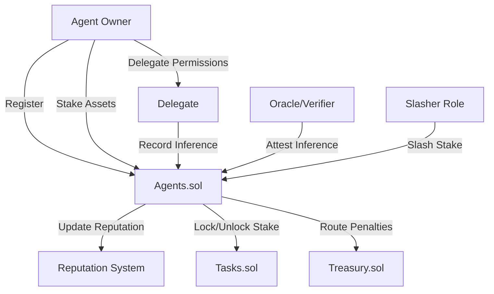

# Agents.sol

## Overview

The **Agents.sol** contract is the core registry and economic coordination layer for Nexis AI agents. It manages agent registration, staking mechanisms, reputation systems, proof-of-inference recording, and delegation permissions. The contract is implemented as an upgradeable (UUPS) module with role-based access control.

**Contract Location:** `/nexis-appchain/packages/contracts-bedrock/contracts/Agents.sol`

### Key Features

- **Agent Registration**: Decentralized registry for AI agents with metadata and service endpoints
- **Multi-Asset Staking**: Support for ETH and ERC20 token staking with unbonding periods
- **Reputation System**: Multi-dimensional reputation tracking across reliability, accuracy, performance, and trustworthiness
- **Proof of Inference**: On-chain commitment and attestation of AI model outputs
- **Delegation Framework**: Granular permission delegation for metadata, inference, and withdrawal operations
- **Treasury Integration**: Automated routing of slashed stakes and penalties to treasury pools

---

## Architecture



---

## Contract Roles

### Access Control Roles

| Role | Bytes32 Identifier | Description |
|------|-------------------|-------------|
| `DEFAULT_ADMIN_ROLE` | `0x00` | Administrative control over contract configuration |
| `SLASHER_ROLE` | `keccak256("SLASHER_ROLE")` | Authority to slash agent stakes for violations |
| `REPUTATION_ROLE` | `keccak256("REPUTATION_ROLE")` | Permission to adjust agent reputation scores |
| `ORACLE_ROLE` | `keccak256("ORACLE_ROLE")` | Can record inferences without explicit delegation |
| `CONTRIBUTION_ROLE` | `keccak256("CONTRIBUTION_ROLE")` | Log contributions to agent development |
| `VERIFIER_ROLE` | `keccak256("VERIFIER_ROLE")` | Attest to inference validity and quality |
| `TASK_MODULE_ROLE` | `keccak256("TASK_MODULE_ROLE")` | Lock/unlock stakes (typically Tasks.sol) |

### Delegation Permissions

| Permission | Bytes32 Identifier | Description |
|-----------|-------------------|-------------|
| `PERMISSION_METADATA` | `keccak256("PERMISSION_METADATA")` | Update agent metadata and service URI |
| `PERMISSION_INFERENCE` | `keccak256("PERMISSION_INFERENCE")` | Record inference commitments |
| `PERMISSION_WITHDRAW` | `keccak256("PERMISSION_WITHDRAW")` | Request and claim withdrawals |

---

## Core Data Structures

### AgentSummary

```solidity
struct AgentSummary {
    uint256 agentId;           // Unique agent identifier
    address owner;             // Agent owner address
    string metadata;           // IPFS/Arweave URI with agent details
    string serviceURI;         // Service endpoint (API URL, gRPC, etc.)
    uint256 totalStake;        // Total staked across all assets
    uint256 lockedStake;       // Stake locked in active tasks
    int256 weightedReputation; // Aggregated reputation score
}
```

### InferenceCommitment

```solidity
struct InferenceCommitment {
    uint256 agentId;      // Agent performing inference
    bytes32 inputHash;    // Hash of input data
    bytes32 outputHash;   // Hash of output/prediction
    bytes32 modelHash;    // Hash of model version/weights
    uint256 taskId;       // Associated task ID (0 if none)
    address reporter;     // Address that recorded the inference
    string proofURI;      // URI to proof artifacts (ZK proof, etc.)
    uint64 timestamp;     // Recording timestamp
}
```

### StakeView

```solidity
struct StakeView {
    uint256 total;     // Total staked amount
    uint256 locked;    // Amount locked in tasks
    uint256 available; // Amount available for withdrawal/locking
}
```

### PendingWithdrawal

```solidity
struct PendingWithdrawal {
    uint256 amount;       // Withdrawal amount
    uint64 releaseTime;   // Timestamp when withdrawal becomes claimable
}
```

### ReputationDelta

```solidity
struct ReputationDelta {
    bytes32 dimension;  // Reputation dimension (reliability, accuracy, etc.)
    int256 delta;       // Change to apply (positive or negative)
    string reason;      // Human-readable justification
}
```

---

## Agent Registration & Metadata

### register

Register a new agent in the registry.

```solidity
function register(
    uint256 agentId,
    string calldata metadata,
    string calldata serviceURI
) external whenNotPaused
```

**Parameters:**
- `agentId`: Unique identifier for the agent (chosen by registrant)
- `metadata`: IPFS/Arweave URI containing agent description, capabilities, model info
- `serviceURI`: Service endpoint for invoking the agent (HTTP API, gRPC, WebSocket, etc.)

**Emits:** `AgentRegistered(address indexed owner, uint256 indexed agentId, string metadata, string serviceURI)`

**Example:**

```javascript
// JavaScript (ethers.js)
const agentsContract = new ethers.Contract(AGENTS_ADDRESS, AGENTS_ABI, signer);

const agentId = ethers.utils.keccak256(ethers.utils.toUtf8Bytes("my-agent-v1"));
const metadata = "ipfs://QmXyZ..."; // Agent description, model details
const serviceURI = "https://api.myagent.com/v1/inference";

const tx = await agentsContract.register(agentId, metadata, serviceURI);
await tx.wait();
console.log(`Agent registered with ID: ${agentId}`);
```

**Reverts:**
- `AgentAlreadyRegistered(uint256 agentId, address currentOwner)` if agent ID is taken

---

### updateMetadata

Update agent metadata URI (owner or metadata delegate only).

```solidity
function updateMetadata(
    uint256 agentId,
    string calldata metadata
) external onlyOwnerOrDelegate(agentId, PERMISSION_METADATA)
```

**Example:**

```javascript
const newMetadata = "ipfs://QmNewHash...";
await agentsContract.updateMetadata(agentId, newMetadata);
```

---

### updateServiceURI

Update agent service endpoint.

```solidity
function updateServiceURI(
    uint256 agentId,
    string calldata serviceURI
) external onlyOwnerOrDelegate(agentId, PERMISSION_METADATA)
```

---

### transferAgentOwnership

Transfer agent ownership to a new address.

```solidity
function transferAgentOwnership(
    uint256 agentId,
    address newOwner
) external onlyAgentOwner(agentId)
```

**Emits:** `AgentOwnershipTransferred(uint256 indexed agentId, address indexed previousOwner, address indexed newOwner)`

---

## Staking System

### stakeETH

Stake native ETH to an agent.

```solidity
function stakeETH(uint256 agentId) external payable nonReentrant whenNotPaused
```

**Parameters:**
- `agentId`: Agent to stake for
- `msg.value`: Amount of ETH to stake

**Emits:** `StakeIncreased(uint256 indexed agentId, address indexed asset, address indexed staker, uint256 amount, uint256 totalStaked)`

**Example:**

```javascript
const stakeAmount = ethers.utils.parseEther("10.0"); // 10 ETH
const tx = await agentsContract.stakeETH(agentId, { value: stakeAmount });
await tx.wait();
```

---

### stakeERC20

Stake ERC20 tokens to an agent.

```solidity
function stakeERC20(
    uint256 agentId,
    address token,
    uint256 amount
) external nonReentrant whenNotPaused
```

**Parameters:**
- `agentId`: Agent to stake for
- `token`: ERC20 token address
- `amount`: Token amount (in token's smallest unit)

**Prerequisites:**
- Caller must approve Agents contract to spend tokens

**Example:**

```javascript
// 1. Approve token spending
const tokenContract = new ethers.Contract(TOKEN_ADDRESS, ERC20_ABI, signer);
const stakeAmount = ethers.utils.parseUnits("1000", 18); // 1000 tokens
await tokenContract.approve(AGENTS_ADDRESS, stakeAmount);

// 2. Stake tokens
await agentsContract.stakeERC20(agentId, TOKEN_ADDRESS, stakeAmount);
```

---

### requestWithdrawal

Initiate unbonding period for stake withdrawal.

```solidity
function requestWithdrawal(
    uint256 agentId,
    address asset,
    uint256 amount
) external whenNotPaused onlyOwnerOrDelegate(agentId, PERMISSION_WITHDRAW)
```

**Parameters:**
- `agentId`: Agent ID
- `asset`: Asset address (`address(0)` for ETH)
- `amount`: Amount to withdraw

**Behavior:**
- Immediately reduces active stake
- Creates pending withdrawal entry with release timestamp
- Release time = `block.timestamp + unbondingPeriod[asset]`

**Emits:** `UnbondingInitiated(uint256 indexed agentId, address indexed asset, uint256 amount, uint64 releaseTime)`

**Example:**

```javascript
const withdrawAmount = ethers.utils.parseEther("5.0");
const ethAsset = ethers.constants.AddressZero;

await agentsContract.requestWithdrawal(agentId, ethAsset, withdrawAmount);
```

---

### claimWithdrawals

Claim matured withdrawals (or force early exit with penalty).

```solidity
function claimWithdrawals(
    uint256 agentId,
    address asset,
    uint256 maxEntries,
    address receiver,
    bool forceEarly
) external nonReentrant whenNotPaused onlyOwnerOrDelegate(agentId, PERMISSION_WITHDRAW)
    returns (uint256 releasedAmount, uint256 penaltyAmount)
```

**Parameters:**
- `agentId`: Agent ID
- `asset`: Asset address
- `maxEntries`: Maximum withdrawal queue entries to process (0 = unlimited)
- `receiver`: Recipient address (`address(0)` = agent owner)
- `forceEarly`: If true, claim withdrawals before unbonding period ends (incurs penalty)

**Returns:**
- `releasedAmount`: Amount transferred to receiver
- `penaltyAmount`: Penalty deducted (sent to treasury)

**Emits:**
- `WithdrawalExecuted(...)` for normal withdrawals
- `EarlyWithdrawal(...)` if `forceEarly` is true

**Example:**

```javascript
// Claim all matured withdrawals
const [released, penalty] = await agentsContract.callStatic.claimWithdrawals(
    agentId,
    ethers.constants.AddressZero,
    0,  // maxEntries
    ethers.constants.AddressZero,  // receiver (defaults to owner)
    false  // forceEarly
);

const tx = await agentsContract.claimWithdrawals(
    agentId,
    ethers.constants.AddressZero,
    0,
    ethers.constants.AddressZero,
    false
);
await tx.wait();
console.log(`Claimed ${ethers.utils.formatEther(released)} ETH`);
```

---

### cancelWithdrawal

Cancel a pending withdrawal and restore stake.

```solidity
function cancelWithdrawal(
    uint256 agentId,
    address asset,
    uint256 queueIndex
) external whenNotPaused onlyOwnerOrDelegate(agentId, PERMISSION_WITHDRAW)
```

**Parameters:**
- `queueIndex`: Index in withdrawal queue (relative to head)

**Emits:** `WithdrawalCancelled(uint256 indexed agentId, address indexed asset, uint256 amount)`

---

### stakeBalances

Query stake amounts for an agent.

```solidity
function stakeBalances(
    uint256 agentId,
    address asset
) public view returns (StakeView memory)
```

**Returns:**
```solidity
struct StakeView {
    uint256 total;     // Total staked
    uint256 locked;    // Locked in tasks
    uint256 available; // Available for withdrawal/locking
}
```

**Example:**

```javascript
const balances = await agentsContract.stakeBalances(agentId, ethers.constants.AddressZero);
console.log(`Total: ${ethers.utils.formatEther(balances.total)} ETH`);
console.log(`Locked: ${ethers.utils.formatEther(balances.locked)} ETH`);
console.log(`Available: ${ethers.utils.formatEther(balances.available)} ETH`);
```

---

## Stake Locking (Task Integration)

### lockStake

Lock stake for task execution (callable by Tasks contract via `TASK_MODULE_ROLE`).

```solidity
function lockStake(
    uint256 agentId,
    address asset,
    uint256 amount
) external onlyRole(TASK_MODULE_ROLE)
```

**Emits:** `StakeLocked(uint256 indexed agentId, address indexed asset, uint256 amount, uint256 newLockedBalance)`

---

### unlockStake

Unlock stake after task completion.

```solidity
function unlockStake(
    uint256 agentId,
    address asset,
    uint256 amount
) external onlyRole(TASK_MODULE_ROLE)
```

**Emits:** `StakeUnlocked(uint256 indexed agentId, address indexed asset, uint256 amount, uint256 newLockedBalance)`

---

## Slashing

### slashStake

Slash agent stake as penalty (callable by `SLASHER_ROLE`).

```solidity
function slashStake(
    uint256 agentId,
    address asset,
    uint256 amount
) external nonReentrant onlyRole(SLASHER_ROLE)
```

**Behavior:**
- Reduces agent's staked balance
- Transfers slashed amount to Treasury
- Treasury distributes across pools (40% treasury, 30% insurance, 30% rewards)

**Emits:** `StakeSlashed(uint256 indexed agentId, address indexed asset, uint256 amount)`

**Example:**

```javascript
// Admin/slasher account
const slashAmount = ethers.utils.parseEther("2.0");
await agentsContract.slashStake(agentId, ethers.constants.AddressZero, slashAmount);
```

---

## Reputation System

### Reputation Dimensions

Nexis agents are evaluated across four default dimensions:

| Dimension | Bytes32 Key | Description |
|-----------|------------|-------------|
| Reliability | `keccak256("reliability")` | Uptime, response consistency, SLA adherence |
| Accuracy | `keccak256("accuracy")` | Inference correctness, prediction quality |
| Performance | `keccak256("performance")` | Latency, throughput, resource efficiency |
| Trustworthiness | `keccak256("trustworthiness")` | Security, data privacy, ethical behavior |

Each dimension is weighted equally by default (2500 BPS each = 25%).

---

### adjustReputation

Adjust agent reputation in a specific dimension (callable by `REPUTATION_ROLE`).

```solidity
function adjustReputation(
    uint256 agentId,
    bytes32 dimension,
    int256 delta,
    string calldata reason
) external onlyRole(REPUTATION_ROLE)
```

**Parameters:**
- `dimension`: Reputation dimension identifier
- `delta`: Reputation change (positive or negative)
- `reason`: Human-readable justification

**Emits:** `ReputationAdjusted(uint256 indexed agentId, bytes32 indexed dimension, int256 newScore, string reason)`

**Example:**

```javascript
const RELIABILITY_DIM = ethers.utils.keccak256(ethers.utils.toUtf8Bytes("reliability"));
const delta = 50; // Increase by 50 points
const reason = "Achieved 99.9% uptime for Q1 2025";

await agentsContract.adjustReputation(agentId, RELIABILITY_DIM, delta, reason);
```

---

### aggregatedReputation

Calculate weighted aggregate reputation score.

```solidity
function aggregatedReputation(uint256 agentId) public view returns (int256 weighted)
```

**Formula:**
```
weighted = Σ(dimension_score × dimension_weight) / Σ(dimension_weight)
```

**Returns:** Weighted average reputation score (can be negative)

**Example:**

```javascript
const reputation = await agentsContract.aggregatedReputation(agentId);
console.log(`Agent reputation: ${reputation.toString()}`);
```

---

### updateReputationWeight

Update weighting for a reputation dimension (admin only).

```solidity
function updateReputationWeight(
    bytes32 dimension,
    uint256 weight
) external onlyRole(DEFAULT_ADMIN_ROLE)
```

**Parameters:**
- `weight`: Weight in basis points (0-10000)

---

## Inference Recording & Verification

### recordInference

Record proof-of-inference commitment on-chain.

```solidity
function recordInference(
    uint256 agentId,
    bytes32 inputHash,
    bytes32 outputHash,
    bytes32 modelHash,
    uint256 taskId,
    string calldata proofURI
) external whenNotPaused returns (bytes32 inferenceId)
```

**Parameters:**
- `inputHash`: Hash of inference input data
- `outputHash`: Hash of model output/prediction
- `modelHash`: Hash identifying model version
- `taskId`: Associated task ID (0 if none)
- `proofURI`: URI to proof artifacts (ZK proof, execution trace, etc.)

**Returns:** Unique inference ID (`keccak256(agentId, nonce, inputHash, outputHash)`)

**Authorization:** Agent owner, inference delegate, or `ORACLE_ROLE`

**Emits:** `InferenceRecorded(...)`

**Example:**

```javascript
const inputData = { prompt: "Analyze sentiment", context: "..." };
const inputHash = ethers.utils.keccak256(ethers.utils.toUtf8Bytes(JSON.stringify(inputData)));

const output = { result: "positive", confidence: 0.92 };
const outputHash = ethers.utils.keccak256(ethers.utils.toUtf8Bytes(JSON.stringify(output)));

const modelHash = ethers.utils.keccak256(ethers.utils.toUtf8Bytes("gpt-4-sentiment-v2"));
const proofURI = "ipfs://QmProof...";

const inferenceId = await agentsContract.callStatic.recordInference(
    agentId,
    inputHash,
    outputHash,
    modelHash,
    0, // taskId (0 if not task-related)
    proofURI
);

await agentsContract.recordInference(agentId, inputHash, outputHash, modelHash, 0, proofURI);
console.log(`Inference recorded: ${inferenceId}`);
```

---

### attestInference

Attest to inference validity (callable by `VERIFIER_ROLE`).

```solidity
function attestInference(
    bytes32 inferenceId,
    bool success,
    string calldata uri,
    ReputationDelta[] calldata deltas
) external onlyRole(VERIFIER_ROLE)
```

**Parameters:**
- `inferenceId`: Inference to attest
- `success`: Whether inference passed verification
- `uri`: URI to attestation report/details
- `deltas`: Reputation adjustments to apply

**Behavior:**
- Records attestation on-chain
- Applies reputation deltas
- If associated with a task, triggers `Tasks.onInferenceVerified()`

**Emits:** `InferenceAttested(...)`

**Example:**

```solidity
// Solidity (verifier contract)
ReputationDelta[] memory deltas = new ReputationDelta[](2);
deltas[0] = ReputationDelta({
    dimension: keccak256("accuracy"),
    delta: int256(10),
    reason: "Correct prediction verified"
});
deltas[1] = ReputationDelta({
    dimension: keccak256("performance"),
    delta: int256(5),
    reason: "Fast response time"
});

agents.attestInference(inferenceId, true, "ipfs://QmAttestation...", deltas);
```

---

### getInference

Retrieve inference commitment and attestation.

```solidity
function getInference(bytes32 inferenceId)
    external view
    returns (
        InferenceCommitment memory commitment,
        VerifierAttestation memory attestation
    )
```

**Example:**

```javascript
const [commitment, attestation] = await agentsContract.getInference(inferenceId);
console.log("Agent ID:", commitment.agentId.toString());
console.log("Task ID:", commitment.taskId.toString());
console.log("Proof URI:", commitment.proofURI);
console.log("Verified:", attestation.success);
```

---

## Delegation

### setDelegate

Grant or revoke delegation permissions.

```solidity
function setDelegate(
    uint256 agentId,
    address delegate,
    bytes32 permission,
    bool enabled
) external onlyAgentOwner(agentId)
```

**Parameters:**
- `delegate`: Address to grant/revoke permissions
- `permission`: `PERMISSION_METADATA`, `PERMISSION_INFERENCE`, or `PERMISSION_WITHDRAW`
- `enabled`: `true` to grant, `false` to revoke

**Emits:** `DelegateUpdated(uint256 indexed agentId, address indexed delegate, bytes32 indexed permission, bool enabled)`

**Example:**

```javascript
const PERMISSION_INFERENCE = await agentsContract.PERMISSION_INFERENCE();
const delegateAddress = "0x1234...";

// Grant inference permission to delegate
await agentsContract.setDelegate(agentId, delegateAddress, PERMISSION_INFERENCE, true);

// Revoke permission
await agentsContract.setDelegate(agentId, delegateAddress, PERMISSION_INFERENCE, false);
```

---

### hasDelegatedPermission

Check if an address has delegated permission.

```solidity
function hasDelegatedPermission(
    uint256 agentId,
    address operator,
    bytes32 permission
) public view returns (bool)
```

**Example:**

```javascript
const PERMISSION_WITHDRAW = await agentsContract.PERMISSION_WITHDRAW();
const hasPermission = await agentsContract.hasDelegatedPermission(
    agentId,
    operatorAddress,
    PERMISSION_WITHDRAW
);
```

---

## Discovery & Aggregation

### listAgents

List agents with pagination.

```solidity
function listAgents(
    uint256 offset,
    uint256 limit
) external view returns (AgentSummary[] memory)
```

**Parameters:**
- `offset`: Starting index
- `limit`: Maximum results (0 = all remaining)

**Example:**

```javascript
// Fetch first 100 agents
const agents = await agentsContract.listAgents(0, 100);

agents.forEach((agent, index) => {
    console.log(`Agent ${index}:`, {
        id: agent.agentId.toString(),
        owner: agent.owner,
        totalStake: ethers.utils.formatEther(agent.totalStake),
        reputation: agent.weightedReputation.toString()
    });
});
```

---

### aggregatedStats

Get network-wide statistics.

```solidity
function aggregatedStats() external view returns (AggregatedStats memory)
```

**Returns:**
```solidity
struct AggregatedStats {
    uint256 totalAgents;
    address[] assets;
    uint256[] totalStakedPerAsset;
}
```

**Example:**

```javascript
const stats = await agentsContract.aggregatedStats();
console.log(`Total agents: ${stats.totalAgents.toString()}`);

stats.assets.forEach((asset, i) => {
    const amount = stats.totalStakedPerAsset[i];
    console.log(`Asset ${asset}: ${ethers.utils.formatEther(amount)} staked`);
});
```

---

## Admin Functions

### pause / unpause

Emergency pause contract operations.

```solidity
function pause() external onlyRole(DEFAULT_ADMIN_ROLE)
function unpause() external onlyRole(DEFAULT_ADMIN_ROLE)
```

---

### setTreasury

Update treasury contract address.

```solidity
function setTreasury(address newTreasury) external onlyRole(DEFAULT_ADMIN_ROLE)
```

---

### setTasksContract

Set Tasks contract for inference verification callbacks.

```solidity
function setTasksContract(address newTasksContract) external onlyRole(DEFAULT_ADMIN_ROLE)
```

---

### setUnbondingPeriod

Configure unbonding period for an asset.

```solidity
function setUnbondingPeriod(
    address asset,
    uint64 period
) external onlyRole(DEFAULT_ADMIN_ROLE)
```

**Example:**

```javascript
// Set 14 day unbonding for USDC
const USDC_ADDRESS = "0xA0b8...";
const period = 14 * 24 * 60 * 60; // 14 days in seconds

await agentsContract.setUnbondingPeriod(USDC_ADDRESS, period);
```

---

### setEarlyExitPenalty

Set early withdrawal penalty in basis points.

```solidity
function setEarlyExitPenalty(
    address asset,
    uint16 bps
) external onlyRole(DEFAULT_ADMIN_ROLE)
```

**Parameters:**
- `bps`: Penalty in basis points (0-10000, e.g., 500 = 5%)

---

## Events Reference

### Agent Lifecycle

```solidity
event AgentRegistered(
    address indexed owner,
    uint256 indexed agentId,
    string metadata,
    string serviceURI
);

event AgentMetadataUpdated(uint256 indexed agentId, string metadata);
event AgentServiceURIUpdated(uint256 indexed agentId, string serviceURI);
event AgentOwnershipTransferred(
    uint256 indexed agentId,
    address indexed previousOwner,
    address indexed newOwner
);
```

### Staking Events

```solidity
event StakeIncreased(
    uint256 indexed agentId,
    address indexed asset,
    address indexed staker,
    uint256 amount,
    uint256 totalStaked
);

event StakeLocked(
    uint256 indexed agentId,
    address indexed asset,
    uint256 amount,
    uint256 newLockedBalance
);

event StakeUnlocked(
    uint256 indexed agentId,
    address indexed asset,
    uint256 amount,
    uint256 newLockedBalance
);

event UnbondingInitiated(
    uint256 indexed agentId,
    address indexed asset,
    uint256 amount,
    uint64 releaseTime
);

event WithdrawalExecuted(
    uint256 indexed agentId,
    address indexed asset,
    uint256 amount,
    address indexed receiver
);

event EarlyWithdrawal(
    uint256 indexed agentId,
    address indexed asset,
    uint256 amount,
    uint256 penalty,
    address receiver
);

event StakeSlashed(
    uint256 indexed agentId,
    address indexed asset,
    uint256 amount
);
```

### Inference Events

```solidity
event InferenceRecorded(
    uint256 indexed agentId,
    bytes32 indexed inferenceId,
    bytes32 indexed inputHash,
    bytes32 outputHash,
    bytes32 modelHash,
    uint256 taskId,
    address reporter,
    string proofURI
);

event InferenceAttested(
    bytes32 indexed inferenceId,
    uint256 indexed agentId,
    uint256 indexed taskId,
    address verifier,
    bool success,
    string uri
);
```

### Reputation Events

```solidity
event ReputationAdjusted(
    uint256 indexed agentId,
    bytes32 indexed dimension,
    int256 newScore,
    string reason
);

event ReputationWeightUpdated(bytes32 indexed dimension, uint256 weight);
```

### Delegation Events

```solidity
event DelegateUpdated(
    uint256 indexed agentId,
    address indexed delegate,
    bytes32 indexed permission,
    bool enabled
);
```

---

## Integration Examples

### Full Agent Lifecycle

```javascript
// 1. Register agent
const agentId = ethers.utils.keccak256(ethers.utils.toUtf8Bytes("my-agent"));
await agentsContract.register(
    agentId,
    "ipfs://QmMetadata...",
    "https://api.myagent.com/v1"
);

// 2. Stake ETH
await agentsContract.stakeETH(agentId, {
    value: ethers.utils.parseEther("10")
});

// 3. Delegate inference permission to oracle
const oracleAddress = "0x5678...";
const PERMISSION_INFERENCE = await agentsContract.PERMISSION_INFERENCE();
await agentsContract.setDelegate(agentId, oracleAddress, PERMISSION_INFERENCE, true);

// 4. Record inference (as oracle)
const inferenceId = await oracleContract.recordInferenceForAgent(agentId, ...);

// 5. Verifier attests
// (Handled by verifier role account)

// 6. Check reputation
const reputation = await agentsContract.aggregatedReputation(agentId);
console.log("Agent reputation:", reputation.toString());

// 7. Request withdrawal
await agentsContract.requestWithdrawal(
    agentId,
    ethers.constants.AddressZero,
    ethers.utils.parseEther("2")
);

// 8. Wait for unbonding period...

// 9. Claim withdrawal
await agentsContract.claimWithdrawals(
    agentId,
    ethers.constants.AddressZero,
    0,
    ethers.constants.AddressZero,
    false
);
```

---

## Security Considerations

### Reentrancy Protection

All external functions handling value transfers are protected with `nonReentrant` modifier.

### Access Control

- Critical functions use role-based access control
- Agent owners must explicitly delegate permissions
- Delegation is granular (metadata, inference, withdrawal)

### Upgradeability

- UUPS proxy pattern for upgrades
- Only `DEFAULT_ADMIN_ROLE` can authorize upgrades

### Stake Safety

- Locked stake cannot be withdrawn
- Unbonding periods prevent instant exits
- Early exit penalties discourage premature withdrawal

---

## Gas Optimization Tips

1. **Batch Withdrawals**: Use `maxEntries` parameter to limit gas costs
2. **Queue Management**: Cancel unwanted withdrawals to avoid processing costs
3. **Delegation**: Use delegates for frequent operations instead of owner multisig
4. **View Functions**: Always use `callStatic` for queries to avoid unnecessary transactions

---

## Related Contracts

- **[Tasks.sol](/contracts/tasks)** - Task marketplace with agent stake locking
- **[Treasury.sol](/contracts/treasury)** - Receives slashed stakes and penalties
- **[Subscriptions.sol](/contracts/subscriptions)** - Recurring payments to agents

---

## ABI & Deployment

**ABI Location:** `/nexis-appchain/packages/contracts-bedrock/artifacts/contracts/Agents.sol/Agents.json`

**Network Addresses:**

| Network | Contract Address | Explorer |
|---------|-----------------|----------|
| Nexis Mainnet | `0x...` | [View Contract](https://explorer.nex-t1.ai/address/0x...) |
| Nexis Testnet | `0x...` | [View Contract](https://testnet.nex-t1.ai/address/0x...) |

---

## Support & Resources

- **GitHub:** [nexis-network/nexis-appchain](https://github.com/nexis-network/nexis-appchain)
- **Discord:** [Nexis Community](https://discord.gg/nexis)
- **Documentation:** [nex-t1.ai](https://nex-t1.ai)
