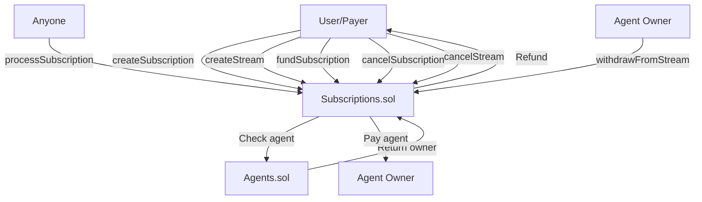

# Subscriptions.sol

## Overview

The **Subscriptions.sol** contract provides two payment models for continuous AI agent services on Nexis: **epoch-based subscriptions** (periodic fixed payments) and **rate-based streams** (continuous per-second payments). This dual-model approach supports both traditional subscription patterns and novel streaming payment use cases.

**Contract Location:** `/nexis-appchain/packages/contracts-bedrock/contracts/Subscriptions.sol`

### Key Features

- **Epoch Subscriptions**: Fixed amount payments at regular intervals (daily, weekly, monthly)
- **Payment Streams**: Continuous per-second payment flows with on-demand withdrawals
- **Multi-Asset Support**: ETH and ERC20 token payments
- **Prefunding**: Optional upfront funding for multiple periods
- **Flexible Cancellation**: Cancel anytime with automatic refunds
- **Agent Integration**: Direct payments to agent owners via Agents.sol

---

## Architecture



---

## Payment Models Comparison

| Feature | Epoch Subscriptions | Rate-Based Streams |
|---------|-------------------|-------------------|
| **Payment Frequency** | Fixed intervals (1 day, 1 week, 1 month) | Continuous (per second) |
| **Processing** | Manual `processSubscription()` call | Automatic accrual, manual withdrawal |
| **Typical Use Case** | Monthly API access, tier-based services | Pay-per-use, metered billing, real-time services |
| **Prefunding** | Multiple epochs upfront | Full duration upfront |
| **Withdrawal** | Automatic on processing | Agent withdraws accrued amount anytime |
| **Cancellation** | Refund unused balance | Refund unstreamed portion |
| **Gas Efficiency** | Lower (batch processing) | Higher (continuous calculation) |

---

## Core Data Structures

### Subscription

```solidity
struct Subscription {
    address payer;          // Subscription payer
    uint256 agentId;        // Agent receiving payments
    address asset;          // Payment asset (address(0) for ETH)
    uint256 amountPerEpoch; // Payment amount per epoch
    uint64 epochDuration;   // Duration of each epoch in seconds
    uint64 nextCharge;      // Timestamp of next charge
    uint256 balance;        // Prepaid balance
    bool active;            // Subscription status
    string metadataURI;     // Subscription details (IPFS/Arweave)
}
```

---

### Stream

```solidity
struct Stream {
    address payer;         // Stream payer
    uint256 agentId;       // Agent receiving payments
    address asset;         // Payment asset
    uint256 ratePerSecond; // Payment rate per second
    uint64 start;          // Stream start timestamp
    uint64 end;            // Stream end timestamp
    uint256 deposited;     // Total deposited amount
    uint256 withdrawn;     // Amount already withdrawn
    bool active;           // Stream status
    string integrationURI; // Integration details
}
```

---

## Contract Roles

| Role | Bytes32 Identifier | Description |
|------|-------------------|-------------|
| `DEFAULT_ADMIN_ROLE` | `0x00` | Administrative control, can cancel subscriptions/streams |
| `PAUSER_ROLE` | `keccak256("PAUSER_ROLE")` | Emergency pause capability |

---

## Epoch-Based Subscriptions

### createSubscription

Create a new epoch-based subscription to an agent.

```solidity
function createSubscription(
    uint256 agentId,
    address asset,
    uint256 amountPerEpoch,
    uint64 epochDuration,
    uint8 prefundEpochs,
    string calldata metadataURI
) external payable whenNotPaused returns (uint256 subscriptionId)
```

**Parameters:**

| Parameter | Type | Description |
|-----------|------|-------------|
| `agentId` | `uint256` | Agent to subscribe to |
| `asset` | `address` | Payment asset (`address(0)` for ETH) |
| `amountPerEpoch` | `uint256` | Payment amount per epoch |
| `epochDuration` | `uint64` | Epoch duration in seconds (e.g., 86400 = 1 day) |
| `prefundEpochs` | `uint8` | Number of epochs to prepay (0-255) |
| `metadataURI` | `string` | Subscription details (service tier, features, etc.) |

**Returns:** `subscriptionId` - Unique subscription identifier

**Payment:**
- For ETH: `msg.value` must equal `amountPerEpoch × prefundEpochs`
- For ERC20: Caller must approve contract to spend `amountPerEpoch × prefundEpochs`

**Emits:**
- `SubscriptionCreated(...)`
- `SubscriptionFunded(...)` (if prefunded)

**Example (Daily ETH Subscription):**

```javascript
const subscriptionsContract = new ethers.Contract(SUBSCRIPTIONS_ADDRESS, SUBSCRIPTIONS_ABI, signer);
const agentsContract = new ethers.Contract(AGENTS_ADDRESS, AGENTS_ABI, signer);

// Daily subscription: 0.1 ETH per day, prefund 30 days
const amountPerDay = ethers.utils.parseEther("0.1");
const oneDay = 86400; // seconds
const prefundDays = 30;

const tx = await subscriptionsContract.createSubscription(
    agentId,
    ethers.constants.AddressZero,  // ETH
    amountPerDay,
    oneDay,
    prefundDays,
    "ipfs://QmSubscriptionMetadata...",
    { value: amountPerDay.mul(prefundDays) }  // 3 ETH upfront
);

const receipt = await tx.wait();
const subscriptionId = receipt.events.find(e => e.event === 'SubscriptionCreated').args.subscriptionId;
console.log(`Subscription created: ${subscriptionId.toString()}`);
console.log(`Funded for ${prefundDays} days`);
```

**Example (Monthly USDC Subscription):**

```javascript
// Monthly subscription: 100 USDC per month, prefund 3 months
const usdcContract = new ethers.Contract(USDC_ADDRESS, ERC20_ABI, signer);
const amountPerMonth = ethers.utils.parseUnits("100", 6); // USDC has 6 decimals
const oneMonth = 30 * 86400; // 30 days
const prefundMonths = 3;

// 1. Approve
await usdcContract.approve(SUBSCRIPTIONS_ADDRESS, amountPerMonth.mul(prefundMonths));

// 2. Create subscription
const tx = await subscriptionsContract.createSubscription(
    agentId,
    USDC_ADDRESS,
    amountPerMonth,
    oneMonth,
    prefundMonths,
    "ipfs://QmMetadata..."
);
await tx.wait();
```

---

### fundSubscription

Add funds to an existing subscription.

```solidity
function fundSubscription(
    uint256 subscriptionId,
    uint8 epochs
) external payable whenNotPaused
```

**Parameters:**
- `subscriptionId`: Subscription ID
- `epochs`: Number of epochs to fund

**Requirements:**
- Subscription must be active

**Emits:** `SubscriptionFunded(uint256 indexed subscriptionId, uint256 amount, address indexed funder)`

**Example:**

```javascript
// Add 10 more days of funding
const subscription = await subscriptionsContract.getSubscription(subscriptionId);
const additionalFunding = subscription.amountPerEpoch.mul(10);

await subscriptionsContract.fundSubscription(
    subscriptionId,
    10,
    { value: additionalFunding }  // For ETH subscriptions
);

console.log("Added 10 days of funding");
```

---

### processSubscription

Process a subscription payment (can be called by anyone).

```solidity
function processSubscription(uint256 subscriptionId) external whenNotPaused
```

**Requirements:**
- Subscription is active
- Current time >= `nextCharge`
- Balance >= `amountPerEpoch`

**Behavior:**
1. Deducts `amountPerEpoch` from balance
2. Increments `nextCharge` by `epochDuration`
3. Transfers payment to agent owner
4. Emits `SubscriptionProcessed`

**Emits:** `SubscriptionProcessed(uint256 indexed subscriptionId, address indexed recipient, uint256 amount, uint64 nextCharge)`

**Example (Manual Processing):**

```javascript
const subscription = await subscriptionsContract.getSubscription(subscriptionId);
const now = Math.floor(Date.now() / 1000);

if (now >= subscription.nextCharge && subscription.active) {
    await subscriptionsContract.processSubscription(subscriptionId);
    console.log("Subscription payment processed");
} else if (now < subscription.nextCharge) {
    const timeUntilNext = subscription.nextCharge - now;
    console.log(`Next payment in ${timeUntilNext} seconds`);
} else {
    console.log("Subscription inactive or insufficient balance");
}
```

**Example (Automated Processing Bot):**

```javascript
// Bot that monitors and processes subscriptions
async function subscriptionProcessorBot() {
    // Get active subscriptions (would need additional indexing in practice)
    const subscriptionIds = []; // Array of subscription IDs to monitor

    for (const subId of subscriptionIds) {
        try {
            const sub = await subscriptionsContract.getSubscription(subId);
            const now = Math.floor(Date.now() / 1000);

            if (sub.active && now >= sub.nextCharge && sub.balance.gte(sub.amountPerEpoch)) {
                console.log(`Processing subscription ${subId}...`);
                const tx = await subscriptionsContract.processSubscription(subId);
                await tx.wait();
                console.log(`✓ Processed subscription ${subId}`);
            }
        } catch (error) {
            console.error(`Error processing subscription ${subId}:`, error);
        }
    }
}

// Run every 5 minutes
setInterval(subscriptionProcessorBot, 5 * 60 * 1000);
```

---

### cancelSubscription

Cancel a subscription and refund remaining balance.

```solidity
function cancelSubscription(uint256 subscriptionId) external nonReentrant
```

**Authorization:** Subscription payer or `DEFAULT_ADMIN_ROLE`

**Behavior:**
- Sets subscription to inactive
- Refunds remaining balance to payer

**Emits:** `SubscriptionCancelled(uint256 indexed subscriptionId, address indexed payer, uint256 refundedAmount)`

**Example:**

```javascript
await subscriptionsContract.cancelSubscription(subscriptionId);
console.log("Subscription cancelled, balance refunded");
```

---

### getSubscription

Query subscription details.

```solidity
function getSubscription(uint256 subscriptionId) external view returns (Subscription memory)
```

**Example:**

```javascript
const sub = await subscriptionsContract.getSubscription(subscriptionId);

console.log("Subscription Details:");
console.log(`  Payer: ${sub.payer}`);
console.log(`  Agent ID: ${sub.agentId.toString()}`);
console.log(`  Amount per epoch: ${ethers.utils.formatEther(sub.amountPerEpoch)} ETH`);
console.log(`  Epoch duration: ${sub.epochDuration} seconds (${sub.epochDuration / 86400} days)`);
console.log(`  Next charge: ${new Date(sub.nextCharge * 1000).toISOString()}`);
console.log(`  Balance: ${ethers.utils.formatEther(sub.balance)} ETH`);
console.log(`  Active: ${sub.active}`);

// Calculate remaining epochs
const remainingEpochs = sub.balance.div(sub.amountPerEpoch);
console.log(`  Remaining epochs: ${remainingEpochs.toString()}`);
```

---

## Rate-Based Payment Streams

### createStream

Create a continuous payment stream to an agent.

```solidity
function createStream(
    uint256 agentId,
    address asset,
    uint256 totalAmount,
    uint64 start,
    uint64 end,
    string calldata integrationURI
) external payable whenNotPaused returns (uint256 streamId)
```

**Parameters:**

| Parameter | Type | Description |
|-----------|------|-------------|
| `agentId` | `uint256` | Agent receiving stream |
| `asset` | `address` | Payment asset |
| `totalAmount` | `uint256` | Total stream amount |
| `start` | `uint64` | Stream start timestamp |
| `end` | `uint64` | Stream end timestamp |
| `integrationURI` | `string` | Integration details, API keys, etc. |

**Requirements:**
- `totalAmount % (end - start) == 0` (evenly divisible rate)
- `end > start`

**Calculation:**
```
ratePerSecond = totalAmount / (end - start)
```

**Payment:**
- Full `totalAmount` must be provided upfront

**Emits:** `StreamCreated(...)`

**Example (7-Day Stream):**

```javascript
// Stream 7 ETH over 7 days (1 ETH per day)
const totalAmount = ethers.utils.parseEther("7");
const now = Math.floor(Date.now() / 1000);
const start = now;
const end = now + (7 * 86400); // 7 days

const tx = await subscriptionsContract.createStream(
    agentId,
    ethers.constants.AddressZero,
    totalAmount,
    start,
    end,
    "ipfs://QmStreamMetadata...",
    { value: totalAmount }
);

const receipt = await tx.wait();
const streamId = receipt.events.find(e => e.event === 'StreamCreated').args.streamId;

const stream = await subscriptionsContract.getStream(streamId);
console.log(`Stream created: ${streamId.toString()}`);
console.log(`Rate: ${ethers.utils.formatEther(stream.ratePerSecond)} ETH/second`);
console.log(`Duration: ${(end - start) / 86400} days`);
```

**Example (Hourly Rate Stream):**

```javascript
// 0.01 ETH per hour for 100 hours
const hourlyRate = ethers.utils.parseEther("0.01");
const hours = 100;
const duration = hours * 3600; // seconds
const totalAmount = hourlyRate.mul(hours);

const now = Math.floor(Date.now() / 1000);
const tx = await subscriptionsContract.createStream(
    agentId,
    ethers.constants.AddressZero,
    totalAmount,
    now,
    now + duration,
    "ipfs://QmHourlyStream...",
    { value: totalAmount }
);
await tx.wait();
```

---

### withdrawFromStream

Withdraw accrued stream payments (agent owner only).

```solidity
function withdrawFromStream(uint256 streamId) external nonReentrant whenNotPaused
```

**Authorization:** Agent owner (from Agents.sol)

**Behavior:**
- Calculates withdrawable amount based on elapsed time
- Transfers to agent owner
- Updates `withdrawn` amount

**Formula:**
```
elapsed = min(currentTime, endTime) - startTime
maxClaimable = ratePerSecond × elapsed
withdrawable = maxClaimable - alreadyWithdrawn
```

**Emits:** `StreamWithdrawn(uint256 indexed streamId, address indexed recipient, uint256 amount)`

**Example:**

```javascript
// Agent owner withdraws accrued payments
const agentOwnerSigner = await ethers.getSigner(agentOwnerAddress);
const subscriptionsAsOwner = subscriptionsContract.connect(agentOwnerSigner);

const streamBefore = await subscriptionsContract.getStream(streamId);
console.log(`Withdrawn so far: ${ethers.utils.formatEther(streamBefore.withdrawn)} ETH`);

// Calculate withdrawable amount
const now = Math.floor(Date.now() / 1000);
const elapsed = Math.min(now, streamBefore.end) - streamBefore.start;
const maxClaimable = streamBefore.ratePerSecond.mul(elapsed);
const withdrawable = maxClaimable.sub(streamBefore.withdrawn);

console.log(`Withdrawable now: ${ethers.utils.formatEther(withdrawable)} ETH`);

// Withdraw
await subscriptionsAsOwner.withdrawFromStream(streamId);

const streamAfter = await subscriptionsContract.getStream(streamId);
console.log(`Total withdrawn: ${ethers.utils.formatEther(streamAfter.withdrawn)} ETH`);
```

---

### cancelStream

Cancel a stream and refund unstreamed portion.

```solidity
function cancelStream(uint256 streamId) external nonReentrant
```

**Authorization:** Stream payer or `DEFAULT_ADMIN_ROLE`

**Behavior:**
1. Calculates and transfers any withdrawable amount to agent owner
2. Calculates unstreamed amount
3. Refunds unstreamed amount to payer
4. Sets stream inactive

**Emits:**
- `StreamWithdrawn(...)` (if withdrawable > 0)
- `StreamCancelled(uint256 indexed streamId, address indexed payer, uint256 refundedAmount)`

**Example:**

```javascript
// Payer cancels stream mid-way
const streamBefore = await subscriptionsContract.getStream(streamId);
const now = Math.floor(Date.now() / 1000);
const elapsed = now - streamBefore.start;
const streamed = streamBefore.ratePerSecond.mul(elapsed);
const unstreamed = streamBefore.deposited.sub(streamed);

console.log(`Deposited: ${ethers.utils.formatEther(streamBefore.deposited)} ETH`);
console.log(`Streamed: ${ethers.utils.formatEther(streamed)} ETH`);
console.log(`Unstreamed (refund): ${ethers.utils.formatEther(unstreamed)} ETH`);

await subscriptionsContract.cancelStream(streamId);
console.log("Stream cancelled");
```

---

### getStream

Query stream details.

```solidity
function getStream(uint256 streamId) external view returns (Stream memory)
```

**Example:**

```javascript
const stream = await subscriptionsContract.getStream(streamId);

console.log("Stream Details:");
console.log(`  Payer: ${stream.payer}`);
console.log(`  Agent ID: ${stream.agentId.toString()}`);
console.log(`  Rate: ${ethers.utils.formatEther(stream.ratePerSecond)} ETH/second`);
console.log(`  Start: ${new Date(stream.start * 1000).toISOString()}`);
console.log(`  End: ${new Date(stream.end * 1000).toISOString()}`);
console.log(`  Deposited: ${ethers.utils.formatEther(stream.deposited)} ETH`);
console.log(`  Withdrawn: ${ethers.utils.formatEther(stream.withdrawn)} ETH`);
console.log(`  Active: ${stream.active}`);

// Calculate current state
const now = Math.floor(Date.now() / 1000);
const elapsed = Math.min(now, stream.end) - stream.start;
const streamed = stream.ratePerSecond.mul(Math.max(0, elapsed));
const withdrawable = streamed.sub(stream.withdrawn);

console.log(`  Streamed so far: ${ethers.utils.formatEther(streamed)} ETH`);
console.log(`  Withdrawable now: ${ethers.utils.formatEther(withdrawable)} ETH`);

// Calculate progress
const totalDuration = stream.end - stream.start;
const progress = Math.min(100, (elapsed / totalDuration) * 100);
console.log(`  Progress: ${progress.toFixed(2)}%`);
```

---

## Events Reference

### Subscription Events

```solidity
event SubscriptionCreated(
    uint256 indexed subscriptionId,
    address indexed payer,
    uint256 indexed agentId,
    address asset,
    uint256 amountPerEpoch,
    uint64 epochDuration,
    string metadataURI
);

event SubscriptionFunded(
    uint256 indexed subscriptionId,
    uint256 amount,
    address indexed funder
);

event SubscriptionProcessed(
    uint256 indexed subscriptionId,
    address indexed recipient,
    uint256 amount,
    uint64 nextCharge
);

event SubscriptionCancelled(
    uint256 indexed subscriptionId,
    address indexed payer,
    uint256 refundedAmount
);
```

### Stream Events

```solidity
event StreamCreated(
    uint256 indexed streamId,
    address indexed payer,
    uint256 indexed agentId,
    address asset,
    uint256 ratePerSecond,
    uint64 start,
    uint64 end,
    string integrationURI
);

event StreamWithdrawn(
    uint256 indexed streamId,
    address indexed recipient,
    uint256 amount
);

event StreamCancelled(
    uint256 indexed streamId,
    address indexed payer,
    uint256 refundedAmount
);
```

---

## Use Cases & Examples

### Use Case 1: SaaS API Subscription

```javascript
// Monthly API access: $99/month in USDC
const monthlyPrice = ethers.utils.parseUnits("99", 6); // USDC
const oneMonth = 30 * 86400;

// Approve and create
await usdcContract.approve(SUBSCRIPTIONS_ADDRESS, monthlyPrice.mul(12));
await subscriptionsContract.createSubscription(
    agentId,
    USDC_ADDRESS,
    monthlyPrice,
    oneMonth,
    12,  // Prepay 1 year
    "ipfs://QmAPISubscription..." // Contains: tier, rate limits, features
);
```

---

### Use Case 2: Pay-Per-Inference (Streaming)

```javascript
// Budget: 1 ETH for inference services over 30 days
// Agent withdraws as they process requests
const budget = ethers.utils.parseEther("1");
const now = Math.floor(Date.now() / 1000);
const duration = 30 * 86400;

await subscriptionsContract.createStream(
    agentId,
    ethers.constants.AddressZero,
    budget,
    now,
    now + duration,
    "ipfs://QmInferenceContract...",
    { value: budget }
);

// Agent processes requests and withdraws periodically
// Rate: 1 ETH / 30 days = 0.0000003858 ETH/second
```

---

### Use Case 3: Tiered Subscription with Auto-Renewal

```javascript
// Tier 1: 0.01 ETH/day
// Tier 2: 0.05 ETH/day
// Tier 3: 0.1 ETH/day

async function subscribeToTier(tier) {
    const rates = {
        1: ethers.utils.parseEther("0.01"),
        2: ethers.utils.parseEther("0.05"),
        3: ethers.utils.parseEther("0.1")
    };

    const dailyRate = rates[tier];
    const prefundDays = 30;

    await subscriptionsContract.createSubscription(
        agentId,
        ethers.constants.AddressZero,
        dailyRate,
        86400,
        prefundDays,
        `ipfs://QmTier${tier}Subscription...`,
        { value: dailyRate.mul(prefundDays) }
    );
}

// Subscribe to Tier 2
await subscribeToTier(2);

// Later: Check balance and refund if needed
const sub = await subscriptionsContract.getSubscription(subscriptionId);
if (sub.balance.lt(sub.amountPerEpoch.mul(5))) { // Less than 5 days left
    console.log("Low balance, funding for 30 more days...");
    await subscriptionsContract.fundSubscription(subscriptionId, 30, {
        value: sub.amountPerEpoch.mul(30)
    });
}
```

---

### Use Case 4: Escrow with Time-Release

```javascript
// Release 10 ETH to agent over 10 days (linear vesting)
const totalAmount = ethers.utils.parseEther("10");
const now = Math.floor(Date.now() / 1000);
const duration = 10 * 86400;

await subscriptionsContract.createStream(
    agentId,
    ethers.constants.AddressZero,
    totalAmount,
    now,
    now + duration,
    "ipfs://QmEscrowDetails...",
    { value: totalAmount }
);

// Agent can withdraw proportionally to time elapsed
// Day 1: 1 ETH available
// Day 5: 5 ETH available
// Day 10: 10 ETH available
```

---

## Admin Functions

### pause / unpause

Emergency pause contract operations.

```solidity
function pause() external onlyRole(PAUSER_ROLE)
function unpause() external onlyRole(PAUSER_ROLE)
```

---

### setAgents

Update Agents.sol contract reference.

```solidity
function setAgents(address newAgents) external onlyRole(DEFAULT_ADMIN_ROLE)
```

---

## Integration Patterns

### Subscription Dashboard

```javascript
async function getSubscriptionDashboard(userAddress) {
    // Note: In practice, you'd index SubscriptionCreated events
    const subscriptionIds = []; // Array of user's subscription IDs

    console.log(`\nSubscriptions for ${userAddress}:\n`);

    for (const subId of subscriptionIds) {
        const sub = await subscriptionsContract.getSubscription(subId);

        if (!sub.active) continue;

        const remainingEpochs = sub.balance.div(sub.amountPerEpoch);
        const daysPerEpoch = sub.epochDuration / 86400;
        const daysRemaining = remainingEpochs.toNumber() * daysPerEpoch;

        console.log(`Subscription ${subId}:`);
        console.log(`  Agent: ${sub.agentId.toString()}`);
        console.log(`  Rate: ${ethers.utils.formatEther(sub.amountPerEpoch)} ETH per ${daysPerEpoch} day(s)`);
        console.log(`  Next charge: ${new Date(sub.nextCharge * 1000).toLocaleDateString()}`);
        console.log(`  Days remaining: ${daysRemaining.toFixed(1)}`);
        console.log(`  Balance: ${ethers.utils.formatEther(sub.balance)} ETH`);
        console.log();
    }
}
```

---

### Stream Dashboard

```javascript
async function getStreamDashboard(userAddress) {
    const streamIds = []; // Array of user's stream IDs

    console.log(`\nStreams for ${userAddress}:\n`);

    for (const streamId of streamIds) {
        const stream = await subscriptionsContract.getStream(streamId);

        if (!stream.active) continue;

        const now = Math.floor(Date.now() / 1000);
        const elapsed = Math.min(now, stream.end) - stream.start;
        const totalDuration = stream.end - stream.start;
        const progress = (elapsed / totalDuration) * 100;

        const streamed = stream.ratePerSecond.mul(elapsed);
        const remaining = stream.deposited.sub(streamed);

        console.log(`Stream ${streamId}:`);
        console.log(`  Agent: ${stream.agentId.toString()}`);
        console.log(`  Rate: ${ethers.utils.formatEther(stream.ratePerSecond)} ETH/second`);
        console.log(`  Progress: ${progress.toFixed(2)}%`);
        console.log(`  Streamed: ${ethers.utils.formatEther(streamed)} ETH`);
        console.log(`  Remaining: ${ethers.utils.formatEther(remaining)} ETH`);
        console.log(`  Withdrawn: ${ethers.utils.formatEther(stream.withdrawn)} ETH`);
        console.log(`  End date: ${new Date(stream.end * 1000).toLocaleDateString()}`);
        console.log();
    }
}
```

---

## Security Considerations

### Reentrancy Protection

All state-changing functions with transfers use `nonReentrant` modifier.

### Rate Calculation

- Stream rates must divide evenly (`totalAmount % duration == 0`)
- Prevents rounding errors and dust amounts

### Authorization

- Only agent owners can withdraw from streams
- Only payers (or admin) can cancel subscriptions/streams

### Time Manipulation

- Uses `block.timestamp` for time calculations
- Miners can manipulate up to ~15 seconds
- Not critical for hourly/daily payments

---

## Gas Optimization

1. **Subscription Processing**: Use bots to batch-process multiple subscriptions
2. **Stream Withdrawals**: Agents should withdraw periodically (e.g., weekly) rather than frequently
3. **Prefunding**: Pay for multiple epochs upfront to reduce transaction costs

---

## Related Contracts

- **[Agents.sol](/contracts/agents)** - Validates agent existence and retrieves owner addresses
- **[Tasks.sol](/contracts/tasks)** - Alternative one-time payment model
- **[Treasury.sol](/contracts/treasury)** - Could integrate for protocol fees on subscriptions

---

## ABI & Deployment

**ABI Location:** `/nexis-appchain/packages/contracts-bedrock/artifacts/contracts/Subscriptions.sol/Subscriptions.json`

**Network Addresses:**

| Network | Contract Address | Explorer |
|---------|-----------------|----------|
| Nexis Mainnet | `0x...` | [View Contract](https://explorer.nex-t1.ai/address/0x...) |
| Nexis Testnet | `0x...` | [View Contract](https://testnet.nex-t1.ai/address/0x...) |

---

## Support & Resources

- **GitHub:** [nexis-network/nexis-appchain](https://github.com/nexis-network/nexis-appchain)
- **Discord:** [Nexis Community](https://discord.gg/nexis)
- **Documentation:** [nex-t1.ai](https://nex-t1.ai)