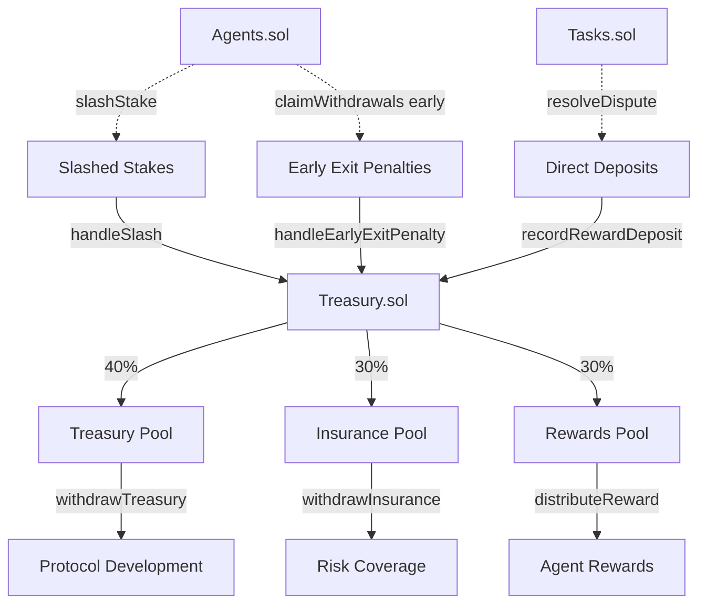
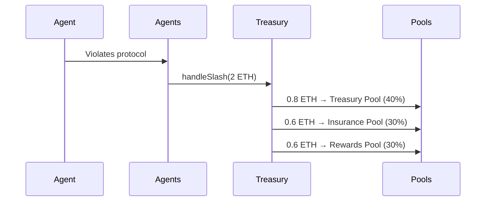
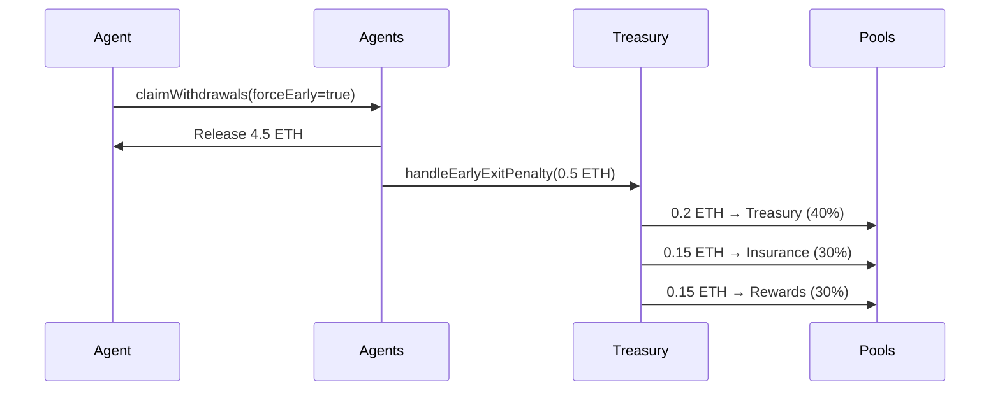
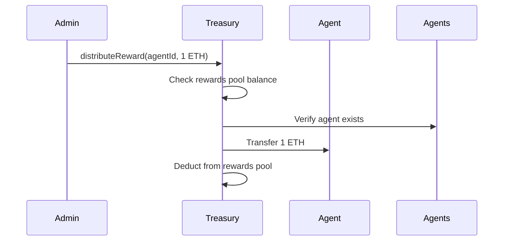

# Treasury.sol

## Overview

The **Treasury.sol** contract is the central economic management system for the Nexis Appchain. It implements a **40/30/30 distribution model** that automatically allocates incoming funds (from slashing, penalties, and direct deposits) across three strategic pools: Treasury (40%), Insurance (30%), and Rewards (30%).

**Contract Location:** `/nexis-appchain/packages/contracts-bedrock/contracts/Treasury.sol`

### Key Features

- **Automated Distribution**: All inflows automatically split across three pools
- **Multi-Asset Support**: Manage ETH and ERC20 tokens separately
- **Role-Based Access**: Granular control over deposits, withdrawals, and reward distribution
- **Slashing Integration**: Receive and distribute slashed stakes from Agents.sol
- **Penalty Collection**: Handle early withdrawal penalties with automatic pooling
- **Reward Distribution**: Controlled payout system for agent incentives

---

## Architecture



---

## Distribution Model

### 40/30/30 Split

| Pool | Allocation | Purpose | Access |
|------|-----------|---------|--------|
| **Treasury** | 40% | Protocol development, operations, governance | `WITHDRAW_ROLE` |
| **Insurance** | 30% | Risk coverage, emergency funds, user protection | `WITHDRAW_ROLE` |
| **Rewards** | 30% | Agent incentives, performance bonuses, ecosystem growth | `REWARDS_ROLE` |

**Formula:**
```
For amount X:
- Treasury Pool += X × 0.40
- Insurance Pool += X × 0.30
- Rewards Pool += X × 0.30
```

---

## Core Data Structures

### DistributionConfig

```solidity
struct DistributionConfig {
    uint16 treasuryBps;   // Treasury allocation in basis points (default: 4000 = 40%)
    uint16 insuranceBps;  // Insurance allocation in basis points (default: 3000 = 30%)
    uint16 rewardsBps;    // Rewards allocation in basis points (default: 3000 = 30%)
}
```

**Note:** Total must equal 10,000 BPS (100%)

---

### PoolBalances

```solidity
struct PoolBalances {
    uint256 treasury;   // Treasury pool balance
    uint256 insurance;  // Insurance pool balance
    uint256 rewards;    // Rewards pool balance
}
```

---

## Contract Roles

| Role | Bytes32 Identifier | Description |
|------|-------------------|-------------|
| `DEFAULT_ADMIN_ROLE` | `0x00` | Administrative control over contract configuration |
| `REWARDS_ROLE` | `keccak256("REWARDS_ROLE")` | Distribute rewards from rewards pool |
| `WITHDRAW_ROLE` | `keccak256("WITHDRAW_ROLE")` | Withdraw from treasury and insurance pools |
| `INFLOW_ROLE` | `keccak256("INFLOW_ROLE")` | Handle slashing and penalty inflows (typically Agents.sol) |

---

## Inflow Methods

### handleSlash

Receive and distribute slashed stakes from Agents.sol.

```solidity
function handleSlash(
    uint256 agentId,
    address asset,
    uint256 amount
) external payable onlyRole(INFLOW_ROLE)
```

**Parameters:**
- `agentId`: Agent whose stake was slashed
- `asset`: Asset address (`address(0)` for ETH)
- `amount`: Slashed amount

**Payment:**
- For ETH: `msg.value` must equal `amount`
- For ERC20: Tokens must be transferred before calling

**Behavior:**
- Splits `amount` according to distribution config (40/30/30)
- Updates respective pool balances

**Emits:** `SlashHandled(uint256 indexed agentId, address indexed asset, uint256 amount, uint256 treasuryShare, uint256 insuranceShare, uint256 rewardsShare)`

**Example (Called by Agents.sol):**

```solidity
// In Agents.sol slashStake function:
if (asset == ETH_ASSET) {
    treasury.handleSlash{value: amount}(agentId, asset, amount);
} else {
    IERC20(asset).safeTransfer(address(treasury), amount);
    treasury.handleSlash(agentId, asset, amount);
}
```

---

### handleEarlyExitPenalty

Receive and distribute early withdrawal penalties.

```solidity
function handleEarlyExitPenalty(
    uint256 agentId,
    address asset,
    uint256 amount
) external payable onlyRole(INFLOW_ROLE)
```

**Parameters:**
- `agentId`: Agent who exited early
- `asset`: Asset address
- `amount`: Penalty amount

**Payment:**
- Same as `handleSlash`

**Emits:** `EarlyExitHandled(uint256 indexed agentId, address indexed asset, uint256 amount, uint256 treasuryShare, uint256 insuranceShare, uint256 rewardsShare)`

**Example (Called by Agents.sol):**

```solidity
// In Agents.sol claimWithdrawals function:
if (penaltyAmount > 0) {
    if (asset == ETH_ASSET) {
        treasury.handleEarlyExitPenalty{value: penaltyAmount}(agentId, asset, penaltyAmount);
    } else {
        IERC20(asset).safeTransfer(address(treasury), penaltyAmount);
        treasury.handleEarlyExitPenalty(agentId, asset, penaltyAmount);
    }
}
```

---

### recordRewardDeposit

Record direct deposits to rewards pool (e.g., from dispute resolutions, fundraising).

```solidity
function recordRewardDeposit(
    address asset,
    uint256 amount
) external payable
```

**Parameters:**
- `asset`: Asset address
- `amount`: Deposit amount

**Payment:**
- For ETH: `msg.value` must equal `amount`
- For ERC20: Tokens must be transferred before calling

**Behavior:**
- Adds full `amount` to rewards pool (no distribution split)

**Emits:** `RewardsDeposited(address indexed source, address indexed asset, uint256 amount)`

**Example (Manual Deposit):**

```javascript
const treasuryContract = new ethers.Contract(TREASURY_ADDRESS, TREASURY_ABI, signer);

// Deposit ETH to rewards pool
const depositAmount = ethers.utils.parseEther("10.0");
await treasuryContract.recordRewardDeposit(
    ethers.constants.AddressZero,
    depositAmount,
    { value: depositAmount }
);

console.log("10 ETH deposited to rewards pool");
```

**Example (From Tasks.sol Dispute Resolution):**

```solidity
// In Tasks.sol resolveDispute function:
if (!refundCreator && task.reward > 0) {
    if (task.asset == ETH_ASSET) {
        treasury.recordRewardDeposit{value: task.reward}(task.asset, task.reward);
    } else {
        IERC20(task.asset).safeTransfer(address(treasury), task.reward);
        treasury.recordRewardDeposit(task.asset, task.reward);
    }
}
```

---

## Outflow Methods

### distributeReward

Distribute rewards from rewards pool to an agent.

```solidity
function distributeReward(
    uint256 agentId,
    address asset,
    uint256 amount,
    address recipient,
    string calldata reason
) external nonReentrant onlyRole(REWARDS_ROLE)
```

**Parameters:**
- `agentId`: Agent receiving reward
- `asset`: Asset address
- `amount`: Reward amount
- `recipient`: Recipient address (`address(0)` = agent owner)
- `reason`: Human-readable justification

**Requirements:**
- Agent must be registered in Agents.sol
- Rewards pool must have sufficient balance

**Emits:** `RewardPaid(uint256 indexed agentId, address indexed asset, address indexed recipient, uint256 amount, string reason)`

**Example:**

```javascript
const rewardAmount = ethers.utils.parseEther("0.5");
const reason = "Top performer in Q1 2025";

await treasuryContract.distributeReward(
    agentId,
    ethers.constants.AddressZero,  // ETH
    rewardAmount,
    ethers.constants.AddressZero,  // recipient = agent owner
    reason
);

console.log(`Distributed ${ethers.utils.formatEther(rewardAmount)} ETH to agent ${agentId}`);
```

**Use Cases:**
- Performance bonuses for high-reputation agents
- Ecosystem growth incentives
- Bug bounty rewards
- Competition prizes

---

### withdrawTreasury

Withdraw from treasury pool (governance/development funds).

```solidity
function withdrawTreasury(
    address asset,
    uint256 amount,
    address to
) external nonReentrant onlyRole(WITHDRAW_ROLE)
```

**Parameters:**
- `asset`: Asset address
- `amount`: Withdrawal amount
- `to`: Recipient address

**Requirements:**
- Treasury pool must have sufficient balance

**Emits:** `PoolWithdrawn(bytes32 indexed pool, address indexed asset, address indexed to, uint256 amount)`

**Example:**

```javascript
// Withdraw 100 ETH for protocol development
const withdrawAmount = ethers.utils.parseEther("100");
const devWallet = "0xDev...";

await treasuryContract.withdrawTreasury(
    ethers.constants.AddressZero,
    withdrawAmount,
    devWallet
);
```

---

### withdrawInsurance

Withdraw from insurance pool (risk coverage, emergency funds).

```solidity
function withdrawInsurance(
    address asset,
    uint256 amount,
    address to
) external nonReentrant onlyRole(WITHDRAW_ROLE)
```

**Parameters:**
- Same as `withdrawTreasury`

**Emits:** `PoolWithdrawn(...)`

**Example:**

```javascript
// Emergency withdrawal for exploit coverage
const coverageAmount = ethers.utils.parseEther("50");
const claimantAddress = "0xUser...";

await treasuryContract.withdrawInsurance(
    ethers.constants.AddressZero,
    coverageAmount,
    claimantAddress
);
```

---

## View Functions

### poolBalances

Query pool balances for a specific asset.

```solidity
function poolBalances(address asset) external view returns (PoolBalances memory)
```

**Returns:**
```solidity
struct PoolBalances {
    uint256 treasury;
    uint256 insurance;
    uint256 rewards;
}
```

**Example:**

```javascript
const balances = await treasuryContract.poolBalances(ethers.constants.AddressZero);

console.log("Treasury Pool ETH Balances:");
console.log(`  Treasury:  ${ethers.utils.formatEther(balances.treasury)} ETH`);
console.log(`  Insurance: ${ethers.utils.formatEther(balances.insurance)} ETH`);
console.log(`  Rewards:   ${ethers.utils.formatEther(balances.rewards)} ETH`);

// Calculate totals
const total = balances.treasury.add(balances.insurance).add(balances.rewards);
console.log(`  Total:     ${ethers.utils.formatEther(total)} ETH`);

// Calculate percentages
const treasuryPct = balances.treasury.mul(100).div(total);
const insurancePct = balances.insurance.mul(100).div(total);
const rewardsPct = balances.rewards.mul(100).div(total);

console.log(`\nAllocation: ${treasuryPct}% / ${insurancePct}% / ${rewardsPct}%`);
```

---

### rewardsBalance

Query rewards pool balance for an asset.

```solidity
function rewardsBalance(address asset) external view returns (uint256)
```

**Example:**

```javascript
const rewardsETH = await treasuryContract.rewardsBalance(ethers.constants.AddressZero);
console.log(`Available for rewards: ${ethers.utils.formatEther(rewardsETH)} ETH`);
```

---

## Admin Functions

### setDistribution

Update distribution configuration (must sum to 10,000 BPS).

```solidity
function setDistribution(
    uint16 treasuryBps,
    uint16 insuranceBps,
    uint16 rewardsBps
) external onlyRole(DEFAULT_ADMIN_ROLE)
```

**Parameters:**
- `treasuryBps`: Treasury allocation (0-10000)
- `insuranceBps`: Insurance allocation (0-10000)
- `rewardsBps`: Rewards allocation (0-10000)

**Requirements:**
- `treasuryBps + insuranceBps + rewardsBps == 10000`

**Emits:** `DistributionUpdated(uint16 treasuryBps, uint16 insuranceBps, uint16 rewardsBps)`

**Example:**

```javascript
// Change to 50/25/25 split
await treasuryContract.setDistribution(
    5000,  // 50% treasury
    2500,  // 25% insurance
    2500   // 25% rewards
);

console.log("Distribution updated to 50/25/25");
```

**Governance Considerations:**
- Changes apply to future inflows only (existing balances unchanged)
- Consider community governance for distribution changes
- Document rationale for changes on-chain or IPFS

---

### setAgents

Update Agents.sol contract reference.

```solidity
function setAgents(address newAgents) external onlyRole(DEFAULT_ADMIN_ROLE)
```

**Parameters:**
- `newAgents`: New Agents contract address

**Example:**

```javascript
const newAgentsAddress = "0xNewAgents...";
await treasuryContract.setAgents(newAgentsAddress);
```

---

## Events Reference

### DistributionUpdated

```solidity
event DistributionUpdated(
    uint16 treasuryBps,
    uint16 insuranceBps,
    uint16 rewardsBps
);
```

### SlashHandled

```solidity
event SlashHandled(
    uint256 indexed agentId,
    address indexed asset,
    uint256 amount,
    uint256 treasuryShare,
    uint256 insuranceShare,
    uint256 rewardsShare
);
```

### EarlyExitHandled

```solidity
event EarlyExitHandled(
    uint256 indexed agentId,
    address indexed asset,
    uint256 amount,
    uint256 treasuryShare,
    uint256 insuranceShare,
    uint256 rewardsShare
);
```

### RewardsDeposited

```solidity
event RewardsDeposited(
    address indexed source,
    address indexed asset,
    uint256 amount
);
```

### RewardPaid

```solidity
event RewardPaid(
    uint256 indexed agentId,
    address indexed asset,
    address indexed recipient,
    uint256 amount,
    string reason
);
```

### PoolWithdrawn

```solidity
event PoolWithdrawn(
    bytes32 indexed pool,
    address indexed asset,
    address indexed to,
    uint256 amount
);
```

---

## Economic Flow Diagrams

### Slashing Flow



### Early Exit Flow



### Reward Distribution Flow



---

## Integration Examples

### Monitor Treasury Activity

```javascript
// Monitor slash events
treasuryContract.on("SlashHandled", (agentId, asset, amount, treasury, insurance, rewards, event) => {
    console.log(`Agent ${agentId} slashed: ${ethers.utils.formatEther(amount)} ETH`);
    console.log(`  Treasury: ${ethers.utils.formatEther(treasury)}`);
    console.log(`  Insurance: ${ethers.utils.formatEther(insurance)}`);
    console.log(`  Rewards: ${ethers.utils.formatEther(rewards)}`);
});

// Monitor reward distributions
treasuryContract.on("RewardPaid", (agentId, asset, recipient, amount, reason, event) => {
    console.log(`Reward paid to agent ${agentId}: ${ethers.utils.formatEther(amount)} ETH`);
    console.log(`Reason: ${reason}`);
    console.log(`Recipient: ${recipient}`);
});

// Monitor withdrawals
treasuryContract.on("PoolWithdrawn", (pool, asset, to, amount, event) => {
    const poolName = pool === ethers.utils.formatBytes32String("TREASURY") ? "Treasury" : "Insurance";
    console.log(`${poolName} withdrawal: ${ethers.utils.formatEther(amount)} ETH to ${to}`);
});
```

---

### Treasury Dashboard

```javascript
async function getTreasuryDashboard() {
    const assets = [
        { name: "ETH", address: ethers.constants.AddressZero },
        { name: "USDC", address: USDC_ADDRESS },
        { name: "USDT", address: USDT_ADDRESS }
    ];

    for (const asset of assets) {
        const balances = await treasuryContract.poolBalances(asset.address);
        const total = balances.treasury.add(balances.insurance).add(balances.rewards);

        console.log(`\n${asset.name} Treasury:`);
        console.log(`  Treasury Pool:  ${formatAmount(balances.treasury, asset)}`);
        console.log(`  Insurance Pool: ${formatAmount(balances.insurance, asset)}`);
        console.log(`  Rewards Pool:   ${formatAmount(balances.rewards, asset)}`);
        console.log(`  Total:          ${formatAmount(total, asset)}`);
    }

    // Check distribution config
    const config = await treasuryContract.distribution();
    console.log(`\nDistribution Config: ${config.treasuryBps / 100}% / ${config.insuranceBps / 100}% / ${config.rewardsBps / 100}%`);
}

function formatAmount(amount, asset) {
    if (asset.name === "ETH") {
        return ethers.utils.formatEther(amount) + " ETH";
    } else {
        return ethers.utils.formatUnits(amount, 6) + " " + asset.name; // Assuming USDC/USDT have 6 decimals
    }
}

// Run dashboard
await getTreasuryDashboard();
```

---

### Automated Reward Distribution

```javascript
async function distributePerformanceRewards() {
    const agentsContract = new ethers.Contract(AGENTS_ADDRESS, AGENTS_ABI, signer);
    const treasuryContract = new ethers.Contract(TREASURY_ADDRESS, TREASURY_ABI, signer);

    // Get top agents by reputation
    const agents = await agentsContract.listAgents(0, 100);
    const sortedAgents = agents
        .sort((a, b) => b.weightedReputation - a.weightedReputation)
        .slice(0, 10);  // Top 10 agents

    // Calculate rewards (e.g., 10 ETH pool distributed proportionally)
    const totalRewardPool = ethers.utils.parseEther("10");
    const totalReputation = sortedAgents.reduce(
        (sum, agent) => sum + Math.max(0, agent.weightedReputation),
        0
    );

    for (const agent of sortedAgents) {
        if (agent.weightedReputation <= 0) continue;

        const rewardShare = totalRewardPool
            .mul(agent.weightedReputation)
            .div(totalReputation);

        await treasuryContract.distributeReward(
            agent.agentId,
            ethers.constants.AddressZero,
            rewardShare,
            ethers.constants.AddressZero,
            "Q1 2025 Performance Reward - Top 10 Agent"
        );

        console.log(`Rewarded agent ${agent.agentId}: ${ethers.utils.formatEther(rewardShare)} ETH`);
    }
}
```

---

## Security Considerations

### Reentrancy Protection

All withdrawal and distribution functions use `nonReentrant` modifier to prevent reentrancy attacks.

### Role-Based Access Control

- **Separation of Duties**: Withdraw role cannot distribute rewards, and vice versa
- **INFLOW_ROLE**: Typically granted only to Agents.sol
- **Multi-sig Recommended**: Use Gnosis Safe or similar for admin roles

### Balance Integrity

- Distribution always sums to 100% (enforced by BPS check)
- Pool balances tracked per asset independently
- No cross-asset contamination

### Upgrade Safety

- UUPS proxy pattern for upgrades
- Only `DEFAULT_ADMIN_ROLE` can authorize upgrades

---

## Gas Optimization

1. **Batch Rewards**: Distribute multiple rewards in a single transaction
2. **Asset Grouping**: Withdraw multiple assets in sequence to amortize setup costs
3. **Event Monitoring**: Use indexed event parameters for efficient filtering

---

## Governance Considerations

### Distribution Adjustments

**Scenario 1: Bear Market (Prioritize Treasury)**
```javascript
await treasuryContract.setDistribution(
    6000,  // 60% treasury (increased reserves)
    2000,  // 20% insurance
    2000   // 20% rewards
);
```

**Scenario 2: Growth Phase (Prioritize Rewards)**
```javascript
await treasuryContract.setDistribution(
    3000,  // 30% treasury
    2000,  // 20% insurance
    5000   // 50% rewards (incentivize growth)
);
```

**Scenario 3: High Risk Period (Prioritize Insurance)**
```javascript
await treasuryContract.setDistribution(
    3000,  // 30% treasury
    5000,  // 50% insurance (increased coverage)
    2000   // 20% rewards
);
```

---

## Related Contracts

- **[Agents.sol](/contracts/agents)** - Sends slashed stakes and penalties to treasury
- **[Tasks.sol](/contracts/tasks)** - Sends disputed task rewards to treasury
- **[Subscriptions.sol](/contracts/subscriptions)** - May integrate for protocol fee collection

---

## ABI & Deployment

**ABI Location:** `/nexis-appchain/packages/contracts-bedrock/artifacts/contracts/Treasury.sol/Treasury.json`

**Network Addresses:**

| Network | Contract Address | Explorer |
|---------|-----------------|----------|
| Nexis Mainnet | `0x...` | [View Contract](https://explorer.nex-t1.ai/address/0x...) |
| Nexis Testnet | `0x...` | [View Contract](https://testnet.nex-t1.ai/address/0x...) |

---

## Support & Resources

- **GitHub:** [nexis-network/nexis-appchain](https://github.com/nexis-network/nexis-appchain)
- **Discord:** [Nexis Community](https://discord.gg/nexis)
- **Documentation:** [nex-t1.ai](https://nex-t1.ai)