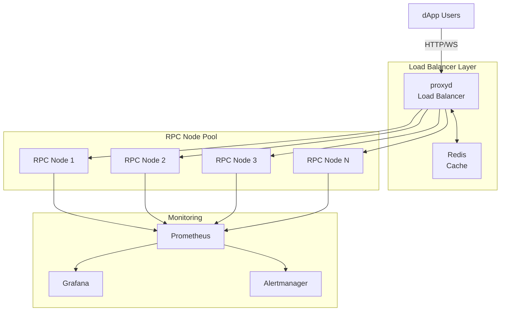

# RPC Node Infrastructure Guide

Complete guide to deploying production-grade RPC infrastructure for Nexis Appchain. Learn how to run op-geth, configure proxyd load balancer, implement caching, and scale horizontally.

## What is an RPC Node?

RPC (Remote Procedure Call) nodes serve blockchain data to applications without participating in consensus:

<CardGroup cols={2}>
  <Card title="Serve dApps" icon="globe">
    Provide data to decentralized applications
  </Card>
  <Card title="No Staking Required" icon="coins">
    Run without capital requirements
  </Card>
  <Card title="Scalable" icon="arrows-maximize">
    Easily scale horizontally
  </Card>
  <Card title="Monetizable" icon="dollar">
    Offer as a service to developers
  </Card>
</CardGroup>

## RPC Node vs Validator

| Feature | RPC Node | Validator Node |
|---------|----------|----------------|
| **Purpose** | Serve API requests | Validate blocks |
| **Stake** | None | 10,000 NZT minimum |
| **Slashing Risk** | None | Yes |
| **Uptime** | 95%+ | 99%+ |
| **Revenue** | API fees | Block rewards + fees |
| **Hardware** | Medium | High |
| **Scaling** | Easy (horizontal) | Limited by stake |

## Architecture Overview



## Hardware Requirements

### Per RPC Node

| Component | Minimum | Recommended | Notes |
|-----------|---------|-------------|-------|
| **CPU** | 4 cores | 8+ cores | Modern x86-64 |
| **RAM** | 16 GB | 32+ GB | More cache = better |
| **Storage** | 500 GB SSD | 1 TB NVMe | Archive needs 2-4 TB |
| **Network** | 100 Mbps | 1+ Gbps | Symmetric up/down |
| **Bandwidth** | 2 TB/month | 5+ TB/month | Monitor usage |

### Load Balancer Server

| Component | Specification |
|-----------|--------------|
| **CPU** | 2 cores |
| **RAM** | 4 GB |
| **Storage** | 50 GB SSD |
| **Network** | 1 Gbps |

### Cost Estimates

**Single RPC Node (Hetzner):**
```yaml
Server: CPX31
CPU: 4 vCPU
RAM: 8 GB
Storage: 160 GB NVMe
Traffic: 20 TB
Cost: ~$20/month
```

**Production Setup (3 RPC nodes + Load Balancer):**
```yaml
3x RPC nodes: $60/month
1x Load balancer: $10/month
Redis cache: $15/month
Monitoring: $10/month
Total: ~$95/month
```

## Installation

### 1. System Preparation

```bash
# Update system
sudo apt update && sudo apt upgrade -y

# Install dependencies
sudo apt install -y \
  build-essential \
  git \
  curl \
  wget \
  jq \
  nginx \
  redis-server \
  certbot \
  python3-certbot-nginx

# Install Docker
curl -fsSL https://get.docker.com -o get-docker.sh
sudo sh get-docker.sh

# Install Docker Compose
sudo curl -L "https://github.com/docker/compose/releases/download/v2.20.0/docker-compose-$(uname -s)-$(uname -m)" -o /usr/local/bin/docker-compose
sudo chmod +x /usr/local/bin/docker-compose

# Create user
sudo useradd -m -s /bin/bash nexis-rpc
sudo usermod -aG docker nexis-rpc

# Setup directories
sudo mkdir -p /opt/nexis-rpc/{data,config,logs}
sudo chown -R nexis-rpc:nexis-rpc /opt/nexis-rpc
```

### 2. Install op-geth

```bash
# Clone and build op-geth
cd /opt/nexis-rpc
git clone https://github.com/ethereum-optimism/op-geth.git
cd op-geth
git checkout v1.101315.1

make geth
sudo cp build/bin/geth /usr/local/bin/op-geth

# Verify
op-geth version
```

### 3. Install op-node

```bash
# Clone optimism
cd /opt/nexis-rpc
git clone https://github.com/ethereum-optimism/optimism.git
cd optimism
git checkout op-node/v1.7.0

# Build
cd op-node
make op-node
sudo cp bin/op-node /usr/local/bin/

# Verify
op-node --version
```

### 4. Install proxyd (Load Balancer)

```bash
# Clone proxyd
cd /opt/nexis-rpc
git clone https://github.com/ethereum-optimism/optimism.git
cd optimism/proxyd

# Build
go build -o proxyd ./cmd/proxyd

# Copy to system
sudo cp proxyd /usr/local/bin/

# Verify
proxyd --version
```

## Configuration

### RPC Node Configuration

#### op-geth Config

```bash
# /opt/nexis-rpc/config/geth.toml
cat > /opt/nexis-rpc/config/geth.toml << 'EOF'
[Eth]
NetworkId = 84532
SyncMode = "snap"
NoPruning = false  # Set true for archive node

[Eth.TxPool]
Locals = []
NoLocals = false
Journal = "transactions.rlp"
Rejournal = 3600000000000
PriceLimit = 1
PriceBump = 10
AccountSlots = 16
GlobalSlots = 5120
AccountQueue = 64
GlobalQueue = 1024

[Node]
DataDir = "/opt/nexis-rpc/data/geth"
HTTPHost = "0.0.0.0"
HTTPPort = 8545
HTTPVirtualHosts = ["*"]
HTTPModules = ["eth", "net", "web3", "txpool"]
HTTPCors = ["*"]
HTTPPathPrefix = ""

WSHost = "0.0.0.0"
WSPort = 8546
WSModules = ["eth", "net", "web3"]
WSOrigins = ["*"]

[Node.P2P]
MaxPeers = 100
NoDiscovery = false
ListenAddr = ":30303"

[Node.HTTPTimeouts]
ReadTimeout = 30000000000
WriteTimeout = 30000000000
IdleTimeout = 120000000000

[Metrics]
Enabled = true
HTTP = "0.0.0.0"
Port = 6060
EOF
```

#### op-node Config

```bash
# /opt/nexis-rpc/config/node.env
cat > /opt/nexis-rpc/config/node.env << 'EOF'
# Network
OP_NODE_NETWORK=nexis-testnet
OP_NODE_L1_ETH_RPC=https://sepolia.base.org
OP_NODE_L1_BEACON=https://sepolia-beacon.base.org

# L2 Engine
OP_NODE_L2_ENGINE_RPC=http://localhost:8551
OP_NODE_L2_ENGINE_AUTH=/opt/nexis-rpc/data/geth/geth/jwtsecret

# Rollup Config
OP_NODE_ROLLUP_CONFIG=/opt/nexis-rpc/config/rollup.json

# P2P
OP_NODE_P2P_LISTEN_IP=0.0.0.0
OP_NODE_P2P_LISTEN_TCP_PORT=9222
OP_NODE_P2P_LISTEN_UDP_PORT=9222
OP_NODE_P2P_BOOTNODES=<BOOTNODE_ENRS>

# RPC (disabled for RPC-only nodes)
OP_NODE_SEQUENCER_ENABLED=false

# RPC Server
OP_NODE_RPC_ADDR=0.0.0.0
OP_NODE_RPC_PORT=9545

# Metrics
OP_NODE_METRICS_ENABLED=true
OP_NODE_METRICS_ADDR=0.0.0.0
OP_NODE_METRICS_PORT=7300

# Logging
OP_NODE_LOG_LEVEL=info
EOF
```

### Load Balancer Configuration (proxyd)

```toml
# /opt/nexis-rpc/config/proxyd.toml
[server]
rpc_host = "0.0.0.0"
rpc_port = 8080
ws_host = "0.0.0.0"
ws_port = 8081
max_body_size_bytes = 10485760  # 10MB
max_concurrent_rpcs = 1000
log_level = "info"

[metrics]
enabled = true
host = "0.0.0.0"
port = 9090

[backend]
response_timeout_seconds = 30
max_retries = 3
out_of_service_seconds = 600

[redis]
url = "redis://localhost:6379"

[cache]
enabled = true

[rate_limit]
enabled = true
max_requests_per_second = 100
exemptions = []

# Define backend groups
[backend_groups]
[backend_groups.main]
consensus_aware = true
consensus_ban_period_seconds = 120
consensus_max_block_lag = 10
consensus_max_block_range = 1000

# Backend RPC nodes
[[backends]]
rpc_url = "http://rpc1.internal:8545"
ws_url = "ws://rpc1.internal:8546"
max_retries = 3
max_response_time_seconds = 5
group = "main"

[[backends]]
rpc_url = "http://rpc2.internal:8545"
ws_url = "ws://rpc2.internal:8546"
max_retries = 3
max_response_time_seconds = 5
group = "main"

[[backends]]
rpc_url = "http://rpc3.internal:8545"
ws_url = "ws://rpc3.internal:8546"
max_retries = 3
max_response_time_seconds = 5
group = "main"

# Method routing
[[rpc_method_mappings]]
method = "*"
backend_groups = ["main"]

# Caching rules
[[cache.method_overrides]]
method = "eth_blockNumber"
ttl = "1s"

[[cache.method_overrides]]
method = "eth_getBlockByNumber"
ttl = "never"  # Only cache if historical block

[[cache.method_overrides]]
method = "eth_getBalance"
ttl = "5s"

[[cache.method_overrides]]
method = "eth_call"
ttl = "1s"

# Consensus polling
[consensus]
enabled = true
poll_interval = "2s"
consensus_method = "eth_getBlockByNumber"
```

### Redis Configuration

```bash
# /etc/redis/redis.conf
# Memory
maxmemory 2gb
maxmemory-policy allkeys-lru

# Persistence (optional)
save 900 1
save 300 10
save 60 10000

# Network
bind 127.0.0.1
port 6379
tcp-backlog 511

# Performance
tcp-keepalive 300
timeout 0
```

## Running with Docker Compose

```yaml
# /opt/nexis-rpc/docker-compose.yml
version: '3.8'

services:
  # RPC Node 1
  geth-1:
    image: us-docker.pkg.dev/oplabs-tools-artifacts/images/op-geth:v1.101315.1
    container_name: nexis-geth-1
    restart: unless-stopped
    ports:
      - "8545:8545"
      - "8546:8546"
      - "8551:8551"
    volumes:
      - ./data/geth-1:/data
      - ./config/geth.toml:/config/geth.toml:ro
      - ./data/geth-1/jwtsecret:/jwtsecret:ro
    command:
      - --config=/config/geth.toml
      - --datadir=/data
      - --authrpc.addr=0.0.0.0
      - --authrpc.port=8551
      - --authrpc.jwtsecret=/jwtsecret
    logging:
      driver: "json-file"
      options:
        max-size: "100m"
        max-file: "10"

  node-1:
    image: us-docker.pkg.dev/oplabs-tools-artifacts/images/op-node:v1.7.0
    container_name: nexis-node-1
    restart: unless-stopped
    depends_on:
      - geth-1
    volumes:
      - ./config/rollup.json:/rollup.json:ro
      - ./data/geth-1/jwtsecret:/jwtsecret:ro
    env_file:
      - ./config/node.env
    environment:
      - OP_NODE_L2_ENGINE_RPC=http://geth-1:8551

  # RPC Node 2
  geth-2:
    image: us-docker.pkg.dev/oplabs-tools-artifacts/images/op-geth:v1.101315.1
    container_name: nexis-geth-2
    restart: unless-stopped
    ports:
      - "8645:8545"
      - "8646:8546"
      - "8651:8551"
    volumes:
      - ./data/geth-2:/data
      - ./config/geth.toml:/config/geth.toml:ro
      - ./data/geth-2/jwtsecret:/jwtsecret:ro
    command:
      - --config=/config/geth.toml
      - --datadir=/data
      - --authrpc.addr=0.0.0.0
      - --authrpc.port=8551
      - --authrpc.jwtsecret=/jwtsecret

  node-2:
    image: us-docker.pkg.dev/oplabs-tools-artifacts/images/op-node:v1.7.0
    container_name: nexis-node-2
    restart: unless-stopped
    depends_on:
      - geth-2
    volumes:
      - ./config/rollup.json:/rollup.json:ro
      - ./data/geth-2/jwtsecret:/jwtsecret:ro
    env_file:
      - ./config/node.env
    environment:
      - OP_NODE_L2_ENGINE_RPC=http://geth-2:8551

  # RPC Node 3
  geth-3:
    image: us-docker.pkg.dev/oplabs-tools-artifacts/images/op-geth:v1.101315.1
    container_name: nexis-geth-3
    restart: unless-stopped
    ports:
      - "8745:8545"
      - "8746:8546"
      - "8751:8551"
    volumes:
      - ./data/geth-3:/data
      - ./config/geth.toml:/config/geth.toml:ro
      - ./data/geth-3/jwtsecret:/jwtsecret:ro
    command:
      - --config=/config/geth.toml
      - --datadir=/data
      - --authrpc.addr=0.0.0.0
      - --authrpc.port=8551
      - --authrpc.jwtsecret=/jwtsecret

  node-3:
    image: us-docker.pkg.dev/oplabs-tools-artifacts/images/op-node:v1.7.0
    container_name: nexis-node-3
    restart: unless-stopped
    depends_on:
      - geth-3
    volumes:
      - ./config/rollup.json:/rollup.json:ro
      - ./data/geth-3/jwtsecret:/jwtsecret:ro
    env_file:
      - ./config/node.env
    environment:
      - OP_NODE_L2_ENGINE_RPC=http://geth-3:8551

  # Load Balancer
  proxyd:
    build:
      context: ./proxyd
      dockerfile: Dockerfile
    container_name: nexis-proxyd
    restart: unless-stopped
    depends_on:
      - redis
      - geth-1
      - geth-2
      - geth-3
    ports:
      - "80:8080"
      - "443:8081"
      - "9090:9090"
    volumes:
      - ./config/proxyd.toml:/etc/proxyd.toml:ro
    command: ["/usr/local/bin/proxyd", "/etc/proxyd.toml"]

  # Redis Cache
  redis:
    image: redis:7-alpine
    container_name: nexis-redis
    restart: unless-stopped
    ports:
      - "6379:6379"
    volumes:
      - ./data/redis:/data
    command: redis-server --maxmemory 2gb --maxmemory-policy allkeys-lru

  # Monitoring
  prometheus:
    image: prom/prometheus:latest
    container_name: nexis-prometheus
    restart: unless-stopped
    ports:
      - "9091:9090"
    volumes:
      - ./config/prometheus.yml:/etc/prometheus/prometheus.yml:ro
      - ./data/prometheus:/prometheus
    command:
      - '--config.file=/etc/prometheus/prometheus.yml'
      - '--storage.tsdb.path=/prometheus'
      - '--storage.tsdb.retention.time=30d'

  grafana:
    image: grafana/grafana:latest
    container_name: nexis-grafana
    restart: unless-stopped
    ports:
      - "3000:3000"
    volumes:
      - ./data/grafana:/var/lib/grafana
      - ./config/grafana:/etc/grafana/provisioning:ro
    environment:
      - GF_SECURITY_ADMIN_PASSWORD=admin
      - GF_INSTALL_PLUGINS=grafana-clock-panel

  # Node Exporter (system metrics)
  node-exporter:
    image: prom/node-exporter:latest
    container_name: nexis-node-exporter
    restart: unless-stopped
    ports:
      - "9100:9100"
    command:
      - '--path.procfs=/host/proc'
      - '--path.sysfs=/host/sys'
      - '--collector.filesystem.mount-points-exclude=^/(sys|proc|dev|host|etc)($$|/)'
    volumes:
      - /proc:/host/proc:ro
      - /sys:/host/sys:ro
      - /:/rootfs:ro

networks:
  default:
    name: nexis-rpc-network
```

### Start the Infrastructure

```bash
cd /opt/nexis-rpc

# Generate JWT secrets for each node
mkdir -p data/geth-{1,2,3}
openssl rand -hex 32 > data/geth-1/jwtsecret
openssl rand -hex 32 > data/geth-2/jwtsecret
openssl rand -hex 32 > data/geth-3/jwtsecret

# Download genesis
curl -o config/genesis.json \
  https://raw.githubusercontent.com/nexis-network/nexis-base-appchain/main/genesis.json

# Download rollup config
curl -o config/rollup.json \
  https://raw.githubusercontent.com/nexis-network/nexis-base-appchain/main/rollup.json

# Initialize each geth instance
docker run --rm \
  -v $(pwd)/data/geth-1:/data \
  -v $(pwd)/config/genesis.json:/genesis.json \
  us-docker.pkg.dev/oplabs-tools-artifacts/images/op-geth:v1.101315.1 \
  init --datadir=/data /genesis.json

# Repeat for geth-2 and geth-3...

# Start all services
docker-compose up -d

# Check logs
docker-compose logs -f proxyd
docker-compose logs -f geth-1
```

## SSL/TLS Configuration

### Using Certbot (Let's Encrypt)

```bash
# Install Nginx
sudo apt install nginx

# Configure Nginx as reverse proxy
cat > /etc/nginx/sites-available/nexis-rpc << 'EOF'
upstream nexis_rpc {
    server localhost:8080;
}

upstream nexis_ws {
    server localhost:8081;
}

# HTTP redirect to HTTPS
server {
    listen 80;
    server_name rpc.example.com;
    return 301 https://$server_name$request_uri;
}

# HTTPS RPC endpoint
server {
    listen 443 ssl http2;
    server_name rpc.example.com;

    ssl_certificate /etc/letsencrypt/live/rpc.example.com/fullchain.pem;
    ssl_certificate_key /etc/letsencrypt/live/rpc.example.com/privkey.pem;

    ssl_protocols TLSv1.2 TLSv1.3;
    ssl_ciphers HIGH:!aNULL:!MD5;
    ssl_prefer_server_ciphers on;

    location / {
        proxy_pass http://nexis_rpc;
        proxy_set_header Host $host;
        proxy_set_header X-Real-IP $remote_addr;
        proxy_set_header X-Forwarded-For $proxy_add_x_forwarded_for;
        proxy_set_header X-Forwarded-Proto $scheme;

        # Timeouts
        proxy_connect_timeout 60s;
        proxy_send_timeout 60s;
        proxy_read_timeout 60s;

        # Buffer
        proxy_buffering off;
        proxy_request_buffering off;
    }
}

# WebSocket endpoint
server {
    listen 443 ssl http2;
    server_name ws.example.com;

    ssl_certificate /etc/letsencrypt/live/ws.example.com/fullchain.pem;
    ssl_certificate_key /etc/letsencrypt/live/ws.example.com/privkey.pem;

    location / {
        proxy_pass http://nexis_ws;
        proxy_http_version 1.1;
        proxy_set_header Upgrade $http_upgrade;
        proxy_set_header Connection "upgrade";
        proxy_set_header Host $host;
        proxy_set_header X-Real-IP $remote_addr;

        # Timeouts for WebSocket
        proxy_connect_timeout 7d;
        proxy_send_timeout 7d;
        proxy_read_timeout 7d;
    }
}
EOF

# Enable site
sudo ln -s /etc/nginx/sites-available/nexis-rpc /etc/nginx/sites-enabled/
sudo nginx -t
sudo systemctl reload nginx

# Get SSL certificate
sudo certbot --nginx -d rpc.example.com -d ws.example.com

# Auto-renewal
sudo certbot renew --dry-run
```

## Advanced Caching Strategies

### Multi-Level Caching

```toml
# Enhanced proxyd caching configuration
[cache]
enabled = true
ttl = "5s"

# Method-specific caching
[[cache.method_overrides]]
method = "eth_blockNumber"
ttl = "1s"

[[cache.method_overrides]]
method = "eth_chainId"
ttl = "never"  # Never expires

[[cache.method_overrides]]
method = "eth_getBlockByNumber"
# Cache historical blocks forever, recent blocks 5s
ttl_fn = """
function(params) {
  local block = params[1]
  if block == "latest" or block == "pending" then
    return "5s"
  else
    return "never"
  end
}
"""

[[cache.method_overrides]]
method = "eth_getBalance"
ttl = "10s"

[[cache.method_overrides]]
method = "eth_call"
# Cache by block number
ttl = "5s"
cache_key_fn = """
function(params) {
  return params[1].to .. params[1].data .. (params[2] or "latest")
}
"""
```

### Redis Optimization

```bash
# /etc/redis/redis-optimized.conf
# Memory
maxmemory 4gb
maxmemory-policy allkeys-lru

# Eviction
maxmemory-samples 10

# Persistence (disable for pure cache)
save ""
appendonly no

# Performance
tcp-backlog 511
timeout 0
tcp-keepalive 300

# Threading (Redis 6+)
io-threads 4
io-threads-do-reads yes

# Lazy freeing
lazyfree-lazy-eviction yes
lazyfree-lazy-expire yes
lazyfree-lazy-server-del yes
```

## Rate Limiting

### Per-IP Rate Limiting

```toml
# proxyd.toml rate limiting
[rate_limit]
enabled = true
max_requests_per_second = 100

# IP-based limits
[[rate_limit.ip_limits]]
ip = "0.0.0.0/0"  # Default for all IPs
max_requests_per_second = 10

[[rate_limit.ip_limits]]
ip = "192.168.1.0/24"  # Internal network
max_requests_per_second = 1000

# Exemptions (whitelisted IPs)
exemptions = [
  "203.0.113.1",
  "203.0.113.2"
]
```

### API Key Rate Limiting

```bash
# Custom API key middleware
cat > /opt/nexis-rpc/middleware/ratelimit.lua << 'EOF'
local redis = require "resty.redis"
local red = redis:new()

red:set_timeout(1000)
red:connect("127.0.0.1", 6379)

-- Extract API key from header
local api_key = ngx.var.http_x_api_key

if not api_key then
    ngx.status = 401
    ngx.say('{"error":"API key required"}')
    return ngx.exit(401)
end

-- Check rate limit
local key = "ratelimit:" .. api_key
local current = red:incr(key)

if current == 1 then
    red:expire(key, 60)  -- 1 minute window
end

-- Get tier limits
local limit = 100  -- Default
if api_key == "premium_key" then
    limit = 1000
end

if current > limit then
    ngx.status = 429
    ngx.say('{"error":"Rate limit exceeded"}')
    return ngx.exit(429)
end

-- Allow request
ngx.header["X-RateLimit-Limit"] = limit
ngx.header["X-RateLimit-Remaining"] = limit - current
EOF
```

## Monitoring and Alerting

### Prometheus Configuration

```yaml
# /opt/nexis-rpc/config/prometheus.yml
global:
  scrape_interval: 15s
  evaluation_interval: 15s

alerting:
  alertmanagers:
    - static_configs:
        - targets: ['localhost:9093']

rule_files:
  - "alerts.yml"

scrape_configs:
  # RPC Nodes
  - job_name: 'geth-1'
    static_configs:
      - targets: ['geth-1:6060']
        labels:
          node: 'geth-1'

  - job_name: 'geth-2'
    static_configs:
      - targets: ['geth-2:6060']
        labels:
          node: 'geth-2'

  - job_name: 'geth-3'
    static_configs:
      - targets: ['geth-3:6060']
        labels:
          node: 'geth-3'

  # Load Balancer
  - job_name: 'proxyd'
    static_configs:
      - targets: ['proxyd:9090']

  # System Metrics
  - job_name: 'node-exporter'
    static_configs:
      - targets: ['node-exporter:9100']

  # Redis
  - job_name: 'redis'
    static_configs:
      - targets: ['redis-exporter:9121']
```

### Alert Rules

```yaml
# /opt/nexis-rpc/config/alerts.yml
groups:
  - name: rpc_alerts
    interval: 30s
    rules:
      # Node sync alerts
      - alert: RPCNodeOutOfSync
        expr: op_node_sync_lag > 10
        for: 2m
        labels:
          severity: critical
        annotations:
          summary: "RPC node {{ $labels.node }} out of sync"
          description: "Node is {{ $value }} blocks behind"

      # High latency
      - alert: HighRPCLatency
        expr: histogram_quantile(0.95, rate(rpc_request_duration_seconds_bucket[5m])) > 1
        for: 5m
        labels:
          severity: warning
        annotations:
          summary: "High RPC latency on {{ $labels.node }}"
          description: "95th percentile latency is {{ $value }}s"

      # Error rate
      - alert: HighErrorRate
        expr: rate(rpc_errors_total[5m]) > 0.1
        for: 5m
        labels:
          severity: warning
        annotations:
          summary: "High error rate on {{ $labels.node }}"
          description: "Error rate is {{ $value }} errors/second"

      # Cache hit rate
      - alert: LowCacheHitRate
        expr: rate(cache_hits_total[5m]) / rate(cache_requests_total[5m]) < 0.5
        for: 10m
        labels:
          severity: warning
        annotations:
          summary: "Low cache hit rate"
          description: "Cache hit rate is {{ $value }}"

      # Disk space
      - alert: LowDiskSpace
        expr: (node_filesystem_avail_bytes / node_filesystem_size_bytes) < 0.2
        for: 5m
        labels:
          severity: warning
        annotations:
          summary: "Low disk space on {{ $labels.instance }}"
          description: "Only {{ $value | humanizePercentage }} available"

      # Memory usage
      - alert: HighMemoryUsage
        expr: (1 - (node_memory_MemAvailable_bytes / node_memory_MemTotal_bytes)) > 0.9
        for: 5m
        labels:
          severity: warning
        annotations:
          summary: "High memory usage on {{ $labels.instance }}"
          description: "Memory usage is {{ $value | humanizePercentage }}"
```

### Grafana Dashboards

```bash
# Import pre-built dashboards
curl -o /opt/nexis-rpc/config/grafana/dashboards/rpc-overview.json \
  https://raw.githubusercontent.com/nexis-network/monitoring/main/grafana/rpc-dashboard.json

curl -o /opt/nexis-rpc/config/grafana/dashboards/geth-metrics.json \
  https://grafana.com/api/dashboards/15364/revisions/1/download
```

## Horizontal Scaling

### Adding More RPC Nodes

```bash
# Add new node to docker-compose.yml
cat >> docker-compose.yml << 'EOF'
  geth-4:
    image: us-docker.pkg.dev/oplabs-tools-artifacts/images/op-geth:v1.101315.1
    container_name: nexis-geth-4
    restart: unless-stopped
    ports:
      - "8845:8545"
    volumes:
      - ./data/geth-4:/data
      - ./config/geth.toml:/config/geth.toml:ro
    command:
      - --config=/config/geth.toml
      - --datadir=/data
EOF

# Add to proxyd config
cat >> config/proxyd.toml << 'EOF'
[[backends]]
rpc_url = "http://geth-4:8545"
ws_url = "ws://geth-4:8546"
max_retries = 3
max_response_time_seconds = 5
group = "main"
EOF

# Restart
docker-compose up -d geth-4
docker-compose restart proxyd
```

### Kubernetes Deployment

```yaml
# k8s/rpc-deployment.yaml
apiVersion: apps/v1
kind: Deployment
metadata:
  name: nexis-rpc
  namespace: nexis
spec:
  replicas: 3
  selector:
    matchLabels:
      app: nexis-rpc
  template:
    metadata:
      labels:
        app: nexis-rpc
    spec:
      containers:
      - name: op-geth
        image: us-docker.pkg.dev/oplabs-tools-artifacts/images/op-geth:v1.101315.1
        ports:
        - containerPort: 8545
          name: rpc
        - containerPort: 8546
          name: ws
        volumeMounts:
        - name: data
          mountPath: /data
        resources:
          requests:
            memory: "16Gi"
            cpu: "4"
          limits:
            memory: "32Gi"
            cpu: "8"
      volumes:
      - name: data
        persistentVolumeClaim:
          claimName: nexis-rpc-pvc
---
apiVersion: v1
kind: Service
metadata:
  name: nexis-rpc-service
  namespace: nexis
spec:
  type: LoadBalancer
  selector:
    app: nexis-rpc
  ports:
  - name: rpc
    port: 8545
    targetPort: 8545
  - name: ws
    port: 8546
    targetPort: 8546
```

## Performance Tuning

### op-geth Optimization

```toml
# High-performance geth config
[Eth]
DatabaseCache = 8192  # 8GB cache
TrieCache = 2048
TrieTimeout = 60

[Eth.TxPool]
GlobalSlots = 10240
GlobalQueue = 2048

[Node.P2P]
MaxPeers = 100

[Node.HTTPTimeouts]
ReadTimeout = 30000000000
WriteTimeout = 30000000000
IdleTimeout = 120000000000
```

### System-level Optimization

```bash
# /etc/sysctl.d/99-nexis-rpc.conf
# Network
net.core.rmem_max = 134217728
net.core.wmem_max = 134217728
net.ipv4.tcp_rmem = 4096 87380 134217728
net.ipv4.tcp_wmem = 4096 65536 134217728
net.core.netdev_max_backlog = 5000

# File handles
fs.file-max = 1000000

# Apply
sudo sysctl -p /etc/sysctl.d/99-nexis-rpc.conf

# Increase limits
cat >> /etc/security/limits.conf << 'EOF'
nexis-rpc soft nofile 1000000
nexis-rpc hard nofile 1000000
EOF
```

## Backup and Disaster Recovery

### Automated Backup Script

```bash
#!/bin/bash
# /opt/nexis-rpc/scripts/backup.sh

BACKUP_DIR="/backup/nexis-rpc"
DATE=$(date +%Y%m%d_%H%M%S)
RETENTION_DAYS=7

# Stop services
docker-compose stop geth-1 geth-2 geth-3

# Backup databases
for i in 1 2 3; do
    echo "Backing up geth-$i..."
    tar -czf $BACKUP_DIR/geth-${i}_${DATE}.tar.gz \
        /opt/nexis-rpc/data/geth-$i/geth/chaindata
done

# Backup config
tar -czf $BACKUP_DIR/config_${DATE}.tar.gz /opt/nexis-rpc/config

# Restart services
docker-compose start geth-1 geth-2 geth-3

# Upload to S3
aws s3 sync $BACKUP_DIR s3://my-backup-bucket/nexis-rpc/

# Clean old backups
find $BACKUP_DIR -mtime +$RETENTION_DAYS -delete

echo "Backup completed: $DATE"
```

## Cost Optimization

### Reduce Bandwidth Costs

```bash
# Implement aggressive caching
# Use CloudFlare or Fastly CDN
# Compress responses

# Nginx compression
gzip on;
gzip_types application/json;
gzip_min_length 1000;
```

### Archive Node Optimization

```toml
# For archive nodes, use separate disk
[Node]
DataDir = "/mnt/archive/geth"  # Use cheaper HDD for older data

# Separate ancient data
AncientDir = "/mnt/archive/ancient"
```

## Troubleshooting

### High Latency

```bash
# Check cache hit rate
redis-cli INFO stats | grep hit_rate

# Check backend health
curl localhost:9090/metrics | grep backend_latency

# Check system resources
htop
iotop

# Check network
iftop
```

### Out of Sync

```bash
# Check sync status
curl -X POST http://localhost:8545 \
  -H "Content-Type: application/json" \
  -d '{"jsonrpc":"2.0","method":"eth_syncing","params":[],"id":1}'

# Check peer count
curl -X POST http://localhost:8545 \
  -H "Content-Type: application/json" \
  -d '{"jsonrpc":"2.0","method":"net_peerCount","params":[],"id":1}'

# Force resync
docker-compose stop geth-1
docker-compose start geth-1
```

## Resources

<CardGroup cols={2}>
  <Card title="Validator Node" icon="server" href="/developers/validator-node">
    Run a validator node
  </Card>
  <Card title="RPC API Reference" icon="code" href="/developers/rpc-calls">
    Complete RPC methods
  </Card>
  <Card title="Infrastructure Overview" icon="diagram-project" href="/infrastructure/rpc-nodes">
    Architecture details
  </Card>
  <Card title="Discord Support" icon="discord" href="https://discord.gg/nexis">
    Get help from operators
  </Card>
</CardGroup>

---

<Tip>
**Performance Tip**: Use SSD/NVMe storage and allocate at least 8GB to geth cache for optimal performance.
</Tip>

<Note>
For production deployments, consider using managed Kubernetes services (GKE, EKS, AKS) for easier scaling and maintenance.
</Note>

<Warning>
Monitor your bandwidth usage closely. RPC nodes can use 5-10 TB/month under heavy load. Use caching aggressively!
</Warning>