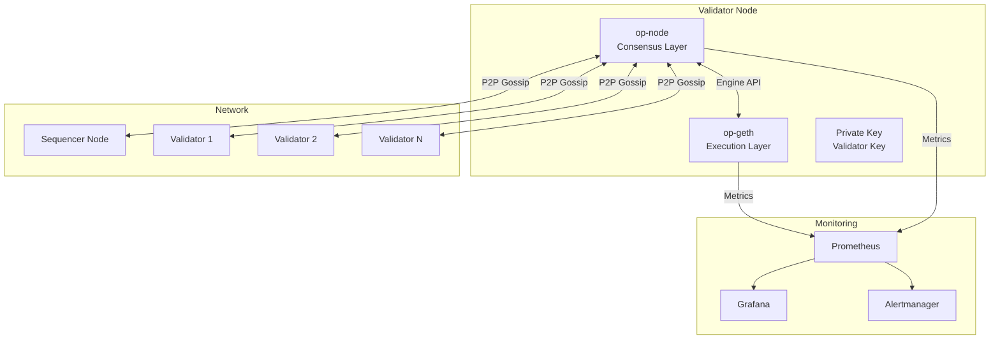

# Validator Node Setup Guide

Comprehensive guide to running a validator node on Nexis Appchain. Validators secure the network, propose blocks, and earn rewards for their participation.

## What is a Validator Node?

Validators on Nexis perform critical network functions:

<CardGroup cols={2}>
  <Card title="Block Validation" icon="cube">
    Verify transactions and state transitions
  </Card>
  <Card title="Network Security" icon="shield">
    Secure the network through stake-backed consensus
  </Card>
  <Card title="Earn Rewards" icon="coins">
    Receive block rewards and transaction fees
  </Card>
  <Card title="Governance" icon="gavel">
    Participate in network governance decisions
  </Card>
</CardGroup>

## Validator vs RPC Node

| Feature | Validator Node | RPC Node |
|---------|---------------|----------|
| **Purpose** | Validate blocks, earn rewards | Serve RPC requests |
| **Stake Required** | 10,000 NZT minimum | None |
| **Slashing Risk** | Yes | No |
| **Block Production** | Yes | No |
| **Uptime Requirement** | 99%+ | 95%+ |
| **Rewards** | Block rewards + fees | None |
| **Hardware** | High-performance | Medium-performance |

## Staking Requirements

### Minimum Stake

| Network | Minimum Stake | Current APY |
|---------|--------------|-------------|
| **Testnet** | 1,000 NZT | N/A (testing) |
| **Mainnet** | 10,000 NZT | 8-12% (estimated) |

### Economic Model

- **Block Rewards**: 2 NZT per block
- **Transaction Fees**: Variable (base fee + priority fee)
- **Slashing**: Up to 100% for malicious behavior
- **Validator Set**: Top 100 by stake (initially)

## Hardware Requirements

### Minimum Requirements

| Component | Minimum | Recommended | Notes |
|-----------|---------|-------------|-------|
| **CPU** | 8 cores | 16+ cores | Modern Intel Xeon or AMD EPYC |
| **RAM** | 32 GB | 64+ GB | DDR4/DDR5 ECC recommended |
| **Storage** | 1 TB NVMe | 2+ TB NVMe | High IOPS critical |
| **Network** | 500 Mbps | 1+ Gbps | Symmetric up/down |
| **Bandwidth** | 5 TB/month | Unlimited | Monitor closely |

### Recommended Specifications

```yaml
# Production validator server
CPU: AMD EPYC 7443P (24 cores @ 2.85 GHz)
RAM: 128 GB DDR4 ECC
Storage: 2x 2TB NVMe in RAID 1
Network: 10 Gbps dedicated
Operating System: Ubuntu 22.04 LTS
```

### Cloud Provider Options

**AWS:**
```yaml
Instance: c6i.8xlarge
vCPUs: 32
RAM: 64 GB
Storage: 2TB gp3 (16,000 IOPS)
Cost: ~$1,200/month
```

**Google Cloud:**
```yaml
Instance: c2-standard-30
vCPUs: 30
RAM: 120 GB
Storage: 2TB SSD persistent disk
Cost: ~$1,400/month
```

**Hetzner (Cost-effective):**
```yaml
Server: AX102
CPU: AMD Ryzen 9 5950X (16 cores)
RAM: 128 GB DDR4 ECC
Storage: 2x 3.84TB NVMe
Cost: ~$200/month
```

## Architecture Overview



## Installation

### 1. System Preparation

```bash
# Update system
sudo apt update && sudo apt upgrade -y

# Install dependencies
sudo apt install -y \
  build-essential \
  git \
  curl \
  wget \
  jq \
  make \
  gcc \
  libc6-dev \
  golang-go \
  ca-certificates \
  gnupg \
  lsb-release

# Install Docker (optional but recommended)
curl -fsSL https://get.docker.com -o get-docker.sh
sudo sh get-docker.sh

# Install Docker Compose
sudo curl -L "https://github.com/docker/compose/releases/download/v2.20.0/docker-compose-$(uname -s)-$(uname -m)" -o /usr/local/bin/docker-compose
sudo chmod +x /usr/local/bin/docker-compose

# Create nexis user
sudo useradd -m -s /bin/bash nexis
sudo usermod -aG docker nexis

# Setup directories
sudo mkdir -p /opt/nexis/{data,config,logs}
sudo chown -R nexis:nexis /opt/nexis
```

### 2. Install op-geth (Execution Client)

```bash
# Clone op-geth
cd /opt/nexis
git clone https://github.com/ethereum-optimism/op-geth.git
cd op-geth
git checkout v1.101315.1 # Use latest stable

# Build
make geth

# Copy binary
sudo cp build/bin/geth /usr/local/bin/op-geth

# Verify installation
op-geth version
```

### 3. Install op-node (Consensus Client)

```bash
# Clone optimism monorepo
cd /opt/nexis
git clone https://github.com/ethereum-optimism/optimism.git
cd optimism
git checkout op-node/v1.7.0 # Use latest stable

# Build op-node
cd op-node
make op-node

# Copy binary
sudo cp bin/op-node /usr/local/bin/

# Verify installation
op-node --version
```

### 4. Configuration

#### op-geth Configuration

```bash
# /opt/nexis/config/geth.toml
cat > /opt/nexis/config/geth.toml << 'EOF'
[Eth]
NetworkId = 84532
SyncMode = "snap"
NoPruning = false

[Eth.Miner]
Etherbase = "YOUR_VALIDATOR_ADDRESS"
GasFloor = 30000000
GasCeil = 30000000

[Node]
DataDir = "/opt/nexis/data/geth"
HTTPHost = "0.0.0.0"
HTTPPort = 8545
HTTPVirtualHosts = ["*"]
HTTPModules = ["eth", "net", "web3", "debug", "txpool"]

WSHost = "0.0.0.0"
WSPort = 8546
WSModules = ["eth", "net", "web3"]

[Node.P2P]
MaxPeers = 50
NoDiscovery = false
ListenAddr = ":30303"

[Metrics]
Enabled = true
HTTP = "0.0.0.0"
Port = 6060
EOF
```

#### op-node Configuration

```bash
# /opt/nexis/config/node.env
cat > /opt/nexis/config/node.env << 'EOF'
# Network Configuration
OP_NODE_NETWORK=nexis-testnet
OP_NODE_L1_ETH_RPC=https://sepolia.base.org
OP_NODE_L1_BEACON=https://sepolia-beacon.base.org

# L2 Configuration
OP_NODE_L2_ENGINE_RPC=http://localhost:8551
OP_NODE_L2_ENGINE_AUTH=/opt/nexis/data/geth/geth/jwtsecret

# Rollup Configuration
OP_NODE_ROLLUP_CONFIG=/opt/nexis/config/rollup.json

# P2P Configuration
OP_NODE_P2P_LISTEN_IP=0.0.0.0
OP_NODE_P2P_LISTEN_TCP_PORT=9222
OP_NODE_P2P_LISTEN_UDP_PORT=9222
OP_NODE_P2P_BOOTNODES=<BOOTNODE_ENRS>

# Sequencer Mode (Enable for validator)
OP_NODE_SEQUENCER_ENABLED=true
OP_NODE_SEQUENCER_L1_CONFS=4

# RPC Configuration
OP_NODE_RPC_ADDR=0.0.0.0
OP_NODE_RPC_PORT=9545

# Metrics
OP_NODE_METRICS_ENABLED=true
OP_NODE_METRICS_ADDR=0.0.0.0
OP_NODE_METRICS_PORT=7300

# Logging
OP_NODE_LOG_LEVEL=info
EOF
```

#### Rollup Configuration

```bash
# /opt/nexis/config/rollup.json
cat > /opt/nexis/config/rollup.json << 'EOF'
{
  "genesis": {
    "l1": {
      "hash": "0x...",
      "number": 1234567
    },
    "l2": {
      "hash": "0x...",
      "number": 0
    },
    "l2_time": 1234567890,
    "system_config": {
      "batcherAddr": "0x...",
      "overhead": "0x834",
      "scalar": "0xf4240",
      "gasLimit": 30000000
    }
  },
  "block_time": 2,
  "max_sequencer_drift": 600,
  "seq_window_size": 3600,
  "channel_timeout": 300,
  "l1_chain_id": 84532,
  "l2_chain_id": 84532,
  "regolith_time": 0,
  "canyon_time": 0,
  "delta_time": 0,
  "ecotone_time": 0,
  "batch_inbox_address": "0xff...",
  "deposit_contract_address": "0x...",
  "l1_system_config_address": "0x..."
}
EOF
```

### 5. Generate JWT Secret

```bash
# Generate JWT secret for Engine API
openssl rand -hex 32 > /opt/nexis/data/geth/geth/jwtsecret
chmod 600 /opt/nexis/data/geth/geth/jwtsecret
```

### 6. Initialize Genesis

```bash
# Download genesis file
curl -o /opt/nexis/config/genesis.json \
  https://raw.githubusercontent.com/nexis-network/nexis-base-appchain/main/genesis.json

# Initialize op-geth
op-geth init \
  --datadir /opt/nexis/data/geth \
  /opt/nexis/config/genesis.json
```

## Running the Validator

### Using Systemd Services

#### op-geth Service

```bash
# /etc/systemd/system/op-geth.service
sudo tee /etc/systemd/system/op-geth.service > /dev/null << 'EOF'
[Unit]
Description=Optimism Execution Client (op-geth)
After=network.target
Wants=network.target

[Service]
Type=simple
User=nexis
Group=nexis
Restart=always
RestartSec=5
TimeoutStopSec=300

ExecStart=/usr/local/bin/op-geth \
  --config /opt/nexis/config/geth.toml \
  --datadir /opt/nexis/data/geth \
  --authrpc.addr 0.0.0.0 \
  --authrpc.port 8551 \
  --authrpc.jwtsecret /opt/nexis/data/geth/geth/jwtsecret \
  --rollup.sequencerhttp https://sequencer.nex-t1.ai \
  --rollup.disabletxpoolgossip=false

StandardOutput=journal
StandardError=journal

[Install]
WantedBy=multi-user.target
EOF
```

#### op-node Service

```bash
# /etc/systemd/system/op-node.service
sudo tee /etc/systemd/system/op-node.service > /dev/null << 'EOF'
[Unit]
Description=Optimism Consensus Client (op-node)
After=network.target op-geth.service
Wants=network.target
Requires=op-geth.service

[Service]
Type=simple
User=nexis
Group=nexis
Restart=always
RestartSec=5
TimeoutStopSec=120

EnvironmentFile=/opt/nexis/config/node.env

ExecStart=/usr/local/bin/op-node

StandardOutput=journal
StandardError=journal

[Install]
WantedBy=multi-user.target
EOF
```

#### Enable and Start Services

```bash
# Reload systemd
sudo systemctl daemon-reload

# Enable services
sudo systemctl enable op-geth
sudo systemctl enable op-node

# Start services
sudo systemctl start op-geth
sudo systemctl start op-node

# Check status
sudo systemctl status op-geth
sudo systemctl status op-node

# View logs
sudo journalctl -u op-geth -f
sudo journalctl -u op-node -f
```

### Using Docker Compose

```yaml
# /opt/nexis/docker-compose.yml
version: '3.8'

services:
  geth:
    image: us-docker.pkg.dev/oplabs-tools-artifacts/images/op-geth:v1.101315.1
    container_name: nexis-geth
    restart: unless-stopped
    ports:
      - "8545:8545"
      - "8546:8546"
      - "8551:8551"
      - "30303:30303"
      - "30303:30303/udp"
    volumes:
      - ./data/geth:/data
      - ./config/geth.toml:/config/geth.toml:ro
      - ./data/geth/geth/jwtsecret:/jwtsecret:ro
    command:
      - --config=/config/geth.toml
      - --datadir=/data
      - --authrpc.addr=0.0.0.0
      - --authrpc.port=8551
      - --authrpc.jwtsecret=/jwtsecret
      - --rollup.sequencerhttp=https://sequencer.nex-t1.ai
    logging:
      driver: "json-file"
      options:
        max-size: "100m"
        max-file: "10"

  node:
    image: us-docker.pkg.dev/oplabs-tools-artifacts/images/op-node:v1.7.0
    container_name: nexis-node
    restart: unless-stopped
    depends_on:
      - geth
    ports:
      - "9222:9222"
      - "9222:9222/udp"
      - "9545:9545"
      - "7300:7300"
    volumes:
      - ./config/rollup.json:/rollup.json:ro
      - ./data/geth/geth/jwtsecret:/jwtsecret:ro
    env_file:
      - ./config/node.env
    logging:
      driver: "json-file"
      options:
        max-size: "100m"
        max-file: "10"

  prometheus:
    image: prom/prometheus:latest
    container_name: nexis-prometheus
    restart: unless-stopped
    ports:
      - "9090:9090"
    volumes:
      - ./config/prometheus.yml:/etc/prometheus/prometheus.yml:ro
      - ./data/prometheus:/prometheus
    command:
      - '--config.file=/etc/prometheus/prometheus.yml'
      - '--storage.tsdb.path=/prometheus'
      - '--storage.tsdb.retention.time=30d'

  grafana:
    image: grafana/grafana:latest
    container_name: nexis-grafana
    restart: unless-stopped
    ports:
      - "3000:3000"
    volumes:
      - ./data/grafana:/var/lib/grafana
      - ./config/grafana-dashboards:/etc/grafana/provisioning/dashboards:ro
    environment:
      - GF_SECURITY_ADMIN_PASSWORD=admin
      - GF_INSTALL_PLUGINS=grafana-clock-panel

networks:
  default:
    name: nexis-network
```

```bash
# Start with Docker Compose
cd /opt/nexis
docker-compose up -d

# View logs
docker-compose logs -f geth
docker-compose logs -f node

# Stop
docker-compose down
```

## Staking Your Validator

### 1. Prepare Your Wallet

```javascript
// stake-validator.js
const { ethers } = require('ethers');

async function stakeValidator() {
  const provider = new ethers.JsonRpcProvider('https://testnet-rpc.nex-t1.ai');
  const wallet = new ethers.Wallet(process.env.VALIDATOR_PRIVATE_KEY, provider);

  const AGENTS_CONTRACT = '0x1234567890123456789012345678901234567890';
  const AGENTS_ABI = [...]; // Import from @nexis-network/contracts

  const agents = new ethers.Contract(AGENTS_CONTRACT, AGENTS_ABI, wallet);

  // Register validator as an agent
  const agentId = ethers.keccak256(ethers.toUtf8Bytes('validator-node-1'));

  const metadata = {
    type: 'validator',
    name: 'My Validator Node',
    location: 'US-East-1',
    operator: wallet.address,
  };

  const metadataURI = await uploadToIPFS(metadata);

  console.log('Registering validator agent...');
  const registerTx = await agents.register(
    agentId,
    metadataURI,
    'https://validator.example.com'
  );
  await registerTx.wait();

  // Stake minimum amount
  const stakeAmount = ethers.parseEther('10000'); // 10,000 NZT for mainnet

  console.log('Staking', ethers.formatEther(stakeAmount), 'NZT...');
  const stakeTx = await agents.stakeETH(agentId, {
    value: stakeAmount,
  });
  await stakeTx.wait();

  console.log('Validator staked successfully!');
  console.log('Agent ID:', agentId);
  console.log('Stake:', ethers.formatEther(stakeAmount), 'NZT');

  return agentId;
}

stakeValidator().catch(console.error);
```

```bash
# Run staking script
VALIDATOR_PRIVATE_KEY=0xYourPrivateKey node stake-validator.js
```

### 2. Configure Validator Key

```bash
# Import validator private key into op-geth
op-geth account import \
  --datadir /opt/nexis/data/geth \
  --password /opt/nexis/config/password.txt \
  /path/to/validator-key.txt

# Update geth.toml with validator address
sed -i 's/YOUR_VALIDATOR_ADDRESS/0xYourValidatorAddress/' \
  /opt/nexis/config/geth.toml

# Restart services
sudo systemctl restart op-geth op-node
```

## Monitoring

### Prometheus Configuration

```yaml
# /opt/nexis/config/prometheus.yml
global:
  scrape_interval: 15s
  evaluation_interval: 15s

scrape_configs:
  - job_name: 'op-geth'
    static_configs:
      - targets: ['localhost:6060']

  - job_name: 'op-node'
    static_configs:
      - targets: ['localhost:7300']

  - job_name: 'node-exporter'
    static_configs:
      - targets: ['localhost:9100']
```

### Key Metrics to Monitor

| Metric | Target | Alert Threshold |
|--------|--------|----------------|
| **Sync Status** | Latest block | > 10 blocks behind |
| **Peer Count** | 25+ peers | < 5 peers |
| **CPU Usage** | < 80% | > 90% for 5 min |
| **Memory Usage** | < 80% | > 90% for 5 min |
| **Disk Usage** | < 80% | > 85% |
| **Network In/Out** | Stable | Spikes or drops |
| **Block Validation Time** | < 1s | > 2s |
| **Missed Blocks** | 0 | > 1 per hour |

### Grafana Dashboards

```bash
# Import pre-built Nexis validator dashboard
curl -o /opt/nexis/config/grafana-dashboards/nexis-validator.json \
  https://raw.githubusercontent.com/nexis-network/monitoring/main/grafana/validator-dashboard.json
```

### Alerting Rules

```yaml
# /opt/nexis/config/alertmanager.yml
groups:
  - name: validator_alerts
    interval: 30s
    rules:
      - alert: ValidatorOutOfSync
        expr: op_node_sync_lag > 10
        for: 2m
        annotations:
          summary: "Validator is out of sync"
          description: "Validator is {{ $value }} blocks behind"

      - alert: LowPeerCount
        expr: op_node_peer_count < 5
        for: 5m
        annotations:
          summary: "Low peer count"
          description: "Only {{ $value }} peers connected"

      - alert: HighCPUUsage
        expr: node_cpu_usage > 90
        for: 5m
        annotations:
          summary: "High CPU usage"
          description: "CPU usage is {{ $value }}%"

      - alert: MissedBlocks
        expr: rate(validator_missed_blocks[1h]) > 0
        annotations:
          summary: "Validator missing blocks"
          description: "Validator has missed {{ $value }} blocks"
```

## Maintenance

### Regular Tasks

**Daily:**
- Check sync status
- Monitor resource usage
- Review logs for errors

**Weekly:**
- Update monitoring dashboards
- Check disk space
- Review performance metrics

**Monthly:**
- Apply security updates
- Review and optimize configuration
- Check for software updates

### Backup Strategies

```bash
#!/bin/bash
# /opt/nexis/scripts/backup.sh

BACKUP_DIR="/backup/nexis"
DATE=$(date +%Y%m%d_%H%M%S)

# Stop services
systemctl stop op-node op-geth

# Backup validator key
cp /opt/nexis/data/geth/keystore/* $BACKUP_DIR/keystore_$DATE/

# Backup configuration
tar -czf $BACKUP_DIR/config_$DATE.tar.gz /opt/nexis/config/

# Backup state (optional, very large)
# tar -czf $BACKUP_DIR/state_$DATE.tar.gz /opt/nexis/data/geth/geth/chaindata/

# Restart services
systemctl start op-geth op-node

# Upload to S3 or remote storage
# aws s3 sync $BACKUP_DIR s3://my-backup-bucket/nexis/

# Keep only last 7 days
find $BACKUP_DIR -mtime +7 -delete

echo "Backup completed: $BACKUP_DIR"
```

### Upgrading

```bash
#!/bin/bash
# /opt/nexis/scripts/upgrade.sh

echo "Starting validator upgrade..."

# Stop services
sudo systemctl stop op-node op-geth

# Backup current binaries
sudo cp /usr/local/bin/op-geth /usr/local/bin/op-geth.backup
sudo cp /usr/local/bin/op-node /usr/local/bin/op-node.backup

# Pull latest code
cd /opt/nexis/op-geth
git fetch --all
git checkout v1.101315.2 # New version

# Rebuild
make geth
sudo cp build/bin/geth /usr/local/bin/op-geth

cd /opt/nexis/optimism/op-node
git fetch --all
git checkout op-node/v1.7.1 # New version

make op-node
sudo cp bin/op-node /usr/local/bin/

# Restart services
sudo systemctl start op-geth op-node

# Monitor for 10 minutes
echo "Monitoring for 10 minutes..."
for i in {1..10}; do
  echo "Minute $i/10"
  sudo systemctl status op-geth op-node
  sleep 60
done

echo "Upgrade completed successfully"
```

## Troubleshooting

### Node Not Syncing

```bash
# Check sync status
curl -X POST http://localhost:9545 \
  -H "Content-Type: application/json" \
  -d '{"jsonrpc":"2.0","method":"optimism_syncStatus","params":[],"id":1}'

# Check logs
sudo journalctl -u op-node -f | grep sync

# Verify L1 connection
curl -X POST $OP_NODE_L1_ETH_RPC \
  -H "Content-Type: application/json" \
  -d '{"jsonrpc":"2.0","method":"eth_blockNumber","params":[],"id":1}'

# Reset if necessary (WARNING: Full resync)
sudo systemctl stop op-node op-geth
rm -rf /opt/nexis/data/geth/geth/chaindata/*
op-geth init --datadir /opt/nexis/data/geth /opt/nexis/config/genesis.json
sudo systemctl start op-geth op-node
```

### Low Peer Count

```bash
# Add static peers
cat > /opt/nexis/config/static-nodes.json << 'EOF'
[
  "enode://abc...@1.2.3.4:30303",
  "enode://def...@5.6.7.8:30303"
]
EOF

# Update geth config to use static nodes
op-geth attach http://localhost:8545
> admin.addPeer("enode://...")
```

### High Resource Usage

```bash
# Check resource usage
htop
iotop -o

# Optimize geth cache
# Edit geth.toml:
[Node.Eth]
DatabaseCache = 4096  # Increase cache
TrieCache = 1024
TrieTimeout = 60

# Restart
sudo systemctl restart op-geth
```

### Validator Not Proposing Blocks

```bash
# Check validator key
op-geth account list --datadir /opt/nexis/data/geth

# Verify stake
curl -X POST http://localhost:8545 \
  -H "Content-Type: application/json" \
  -d '{
    "jsonrpc":"2.0",
    "method":"eth_call",
    "params":[{
      "to":"0x1234...",
      "data":"0x..."
    },"latest"],
    "id":1
  }'

# Check sequencer mode
grep SEQUENCER_ENABLED /opt/nexis/config/node.env
```

## Security Best Practices

### Firewall Configuration

```bash
# Install UFW
sudo apt install ufw

# Default policies
sudo ufw default deny incoming
sudo ufw default allow outgoing

# Allow SSH (change port if needed)
sudo ufw allow 22/tcp

# Allow P2P
sudo ufw allow 30303/tcp
sudo ufw allow 30303/udp
sudo ufw allow 9222/tcp
sudo ufw allow 9222/udp

# Allow monitoring (restrict to internal network)
sudo ufw allow from 10.0.0.0/8 to any port 9090
sudo ufw allow from 10.0.0.0/8 to any port 3000

# Enable firewall
sudo ufw enable
```

### SSH Hardening

```bash
# /etc/ssh/sshd_config
PermitRootLogin no
PasswordAuthentication no
PubkeyAuthentication yes
Port 2222  # Non-standard port

# Restart SSH
sudo systemctl restart sshd
```

### Key Management

```bash
# Never store private keys in plain text
# Use hardware security modules (HSM) for production

# Encrypt keystore
gpg --symmetric --cipher-algo AES256 validator-key.json

# Secure permissions
chmod 600 /opt/nexis/data/geth/keystore/*
chown nexis:nexis /opt/nexis/data/geth/keystore/*
```

## Validator Economics

### Revenue Streams

**Block Rewards:**
- 2 NZT per block
- ~43,200 blocks per day (2s block time)
- ~86,400 NZT per day total network rewards

**Transaction Fees:**
- Variable based on network usage
- Average 0.1-0.5 NZT per block
- ~4,320-21,600 NZT per day

### Cost Analysis

**Monthly Operating Costs:**
```
Server (Hetzner AX102): $200
Bandwidth: $50
Monitoring services: $20
Backup storage: $30
Total: ~$300/month
```

**Break-even Analysis:**
```
Stake: 10,000 NZT
Expected APY: 10%
Annual rewards: 1,000 NZT
Monthly rewards: 83.33 NZT

At $10/NZT: $833/month revenue
Operating costs: $300/month
Net profit: $533/month (64% margin)

ROI: (533 * 12) / (10,000 * 10) = 6.4% net APY
```

### Slashing Risks

| Violation | Penalty | Prevention |
|-----------|---------|------------|
| **Double signing** | 100% stake | Use single validator key |
| **Long downtime** | 0.1% per day | Monitor uptime (99%+) |
| **Invalid attestation** | 1-10% | Keep node synced |
| **Sync issues** | 0.01% per hour | Monitor sync status |

## Resources

<CardGroup cols={2}>
  <Card title="RPC Node Guide" icon="server" href="/developers/rpc-node">
    Setup RPC infrastructure
  </Card>
  <Card title="Monitoring Guide" icon="chart-line" href="/infrastructure/overview">
    Advanced monitoring setup
  </Card>
  <Card title="Discord Support" icon="discord" href="https://discord.gg/nexis">
    Get help from validators
  </Card>
  <Card title="GitHub" icon="github" href="https://github.com/nexis-network/nexis-base-appchain">
    Source code and issues
  </Card>
</CardGroup>

---

<Warning>
**Mainnet validators**: Ensure you test extensively on testnet before staking on mainnet. Slashing penalties can result in significant loss of stake.
</Warning>

<Tip>
Join the [Validators Discord channel](https://discord.gg/nexis) to connect with other node operators and stay updated on network changes.
</Tip>

<Note>
Validator rewards and economics are subject to change based on network governance decisions. Always check the latest documentation before staking.
</Note>