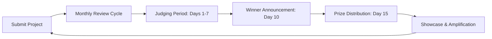

# Nexis Year-Round Hackathon Program

**Build. Ship. Earn. Repeat.** The Nexis Hackathon is a continuous, rolling program designed to reward builders creating the next generation of AI-powered blockchain applications. Whether you're developing AI agents, decentralized ML platforms, or innovative crypto-AI integrations, we provide the resources, mentorship, and incentives to bring your vision to life.

<Info>
**Program Launch**: The Nexis Year-Round Hackathon is live! Submit your project anytime and compete in monthly judging rounds for prizes up to $50,000.
</Info>

## Why Participate?

<CardGroup cols={3}>
  <Card title="Monthly Prizes" icon="sack-dollar">
    $50,000+ in monthly prize pools across multiple categories
  </Card>
  <Card title="Grant Opportunities" icon="hand-holding-dollar">
    Top projects eligible for follow-on grants up to $250,000
  </Card>
  <Card title="Ecosystem Support" icon="users">
    Technical mentorship, infrastructure credits, and partner introductions
  </Card>
  <Card title="Fast-Track Funding" icon="rocket">
    Direct pathway to VC introductions and ecosystem fund allocations
  </Card>
  <Card title="Community Recognition" icon="star">
    Featured projects, social amplification, and builder spotlight
  </Card>
  <Card title="Continuous Learning" icon="graduation-cap">
    Workshops, office hours, and direct access to core team
  </Card>
</CardGroup>

## Program Structure

### Rolling Submission Model

Unlike traditional hackathons with fixed deadlines, **Nexis operates a continuous submission model**:

- **Submit Anytime**: Projects accepted 24/7/365
- **Monthly Judging**: Submissions grouped into monthly cohorts
- **Quarterly Showcases**: Top projects featured in community showcases
- **Annual Summit**: Best builders invited to Nexis Summit with travel covered

### Judging Timeline



**Example Schedule:**
- **Jan 1-31**: Submissions accepted for January cohort
- **Feb 1-7**: Judging period
- **Feb 10**: Winners announced
- **Feb 15**: Prizes distributed
- **Feb 20**: Monthly showcase event

## Prize Categories & Rewards

### Grand Prize Track ($20,000/month)

**Best Overall Project**: Most innovative, technically sound, and impactful application

**Requirements:**
- Production-ready deployment on Nexis Appchain
- Open-source codebase
- Comprehensive documentation
- Demonstrated user adoption or clear go-to-market strategy

### Category Prizes ($5,000 each/month)

#### 1. AI Agent Innovation
Build the most creative or impactful AI agent leveraging Nexis's proof-of-inference

**Examples:**
- Autonomous trading agents
- Content creation AI with verifiable outputs
- AI-powered data analysis agents
- Multi-agent coordination systems

#### 2. DeFi x AI Integration
Combine decentralized finance with AI intelligence

**Examples:**
- AI-powered yield optimization
- Predictive market-making
- Intelligent liquidity management
- Risk assessment AI agents

#### 3. Infrastructure & Tooling
Build developer tools, SDKs, or infrastructure components

**Examples:**
- Agent monitoring dashboards
- Testing frameworks
- Deployment automation
- Analytics platforms

#### 4. Gaming & Entertainment
AI-powered games, metaverse applications, or entertainment platforms

**Examples:**
- AI NPCs with verifiable behavior
- Dynamic game economies
- Procedural content generation
- Interactive AI companions

#### 5. Social Impact
Applications addressing real-world problems in healthcare, education, sustainability, etc.

**Examples:**
- Medical diagnosis AI with proof
- Educational AI tutors
- Climate data analysis
- Accessibility tools

### Special Recognition Awards ($2,500 each)

- **Best First-Time Builder**: Best project from a first-time Nexis developer
- **Most Creative Use Case**: Most innovative application of AI x Blockchain
- **Community Choice**: Winner of community voting
- **Best Documentation**: Most comprehensive and helpful documentation

## Eligibility Requirements

### Who Can Participate?

<Accordion title="Individuals & Teams">
  - Solo developers welcome
  - Teams of any size accepted
  - International participants eligible (verify your jurisdiction)
  - Students, professionals, and hobbyists all encouraged
</Accordion>

<Accordion title="Project Requirements">
  - Must deploy on Nexis Appchain (testnet or mainnet)
  - Must be open-source (MIT, Apache 2.0, or GPL)
  - Must include comprehensive README and documentation
  - Must not violate intellectual property rights
  - Must comply with all applicable laws
</Accordion>

<Accordion title="Restricted Jurisdictions">
  Projects from the following jurisdictions are not eligible:
  - Countries under OFAC sanctions
  - Jurisdictions where crypto/blockchain development is prohibited
  - Areas with active trade restrictions

  When in doubt, consult legal counsel in your jurisdiction.
</Accordion>

## Submission Guidelines

### Required Deliverables

<Steps>
  <Step title="GitHub Repository">
    Public repository with complete source code and commit history
  </Step>
  <Step title="Deployment">
    Live deployment on Nexis Appchain with public endpoint (testnet OK for early-stage)
  </Step>
  <Step title="Documentation">
    README with:
    - Project description and vision
    - Technical architecture
    - Setup and deployment instructions
    - Usage examples
    - Demo video or screenshots
  </Step>
  <Step title="Submission Form">
    Complete the online submission form with:
    - Team information
    - Project category
    - Elevator pitch (280 characters)
    - Links to repo, deployment, demo
    - Contract addresses used
  </Step>
</Steps>

### Submission Form Template

```markdown
# Nexis Hackathon Submission

## Project Information
- **Project Name**:
- **Category**: [AI Agent Innovation | DeFi x AI | Infrastructure | Gaming | Social Impact]
- **Team Name**:
- **Team Members**: (GitHub handles)

## Elevator Pitch
[280 characters max - What problem does your project solve?]

## Links
- **GitHub**:
- **Live Demo**:
- **Video Demo**: (YouTube, Loom, or similar)
- **Documentation**:

## Technical Details
- **Nexis Contract Addresses**:
- **AI Models Used**:
- **Agent IDs**:
- **External APIs/Services**:

## Impact & Metrics
- **Users/Transactions**:
- **Value Locked**:
- **AI Inferences Processed**:

## Future Plans
[What's next for the project after the hackathon?]
```

### Code Quality Standards

Your submission will be evaluated on:

<Tabs>
  <Tab title="Code Quality">
    - Clean, readable, and well-commented code
    - Follows Solidity style guide for smart contracts
    - TypeScript/JavaScript best practices for frontend
    - Proper error handling and edge case management
    - Comprehensive unit tests (50%+ coverage preferred)
  </Tab>
  <Tab title="Security">
    - No critical vulnerabilities (run Slither, MythX, or similar)
    - Access controls properly implemented
    - Reentrancy protections where applicable
    - Input validation on all user-facing functions
    - Proper handling of user funds/data
  </Tab>
  <Tab title="Documentation">
    - Clear README with setup instructions
    - Architecture diagrams (bonus points)
    - API documentation if applicable
    - Inline code comments explaining complex logic
    - User guide or tutorial
  </Tab>
  <Tab title="Innovation">
    - Novel use of Nexis features
    - Creative problem-solving
    - Practical real-world applicability
    - Technical sophistication
    - User experience considerations
  </Tab>
</Tabs>

## Judging Criteria

Projects evaluated on a 100-point scale:

| Criterion | Weight | Description |
|-----------|--------|-------------|
| **Innovation** | 25 pts | Novelty of idea, creative use of Nexis features, technical sophistication |
| **Implementation** | 25 pts | Code quality, architecture, security, completeness |
| **Impact** | 20 pts | Potential user base, real-world applicability, problem-solution fit |
| **Design** | 15 pts | User experience, interface design, accessibility |
| **Documentation** | 10 pts | README quality, code comments, deployment guides |
| **Presentation** | 5 pts | Demo video quality, pitch clarity, visual materials |

### Evaluation Process

<Steps>
  <Step title="Initial Screening">
    Technical team verifies all requirements met and project deploys successfully
  </Step>
  <Step title="Technical Review">
    Core developers evaluate code quality, security, and architecture
  </Step>
  <Step title="Panel Judging">
    Panel of 5 judges (core team + ecosystem partners) scores projects
  </Step>
  <Step title="Community Voting">
    Community votes for "Community Choice" award (separate from main judging)
  </Step>
  <Step title="Final Deliberation">
    Judges meet to finalize winners and provide feedback
  </Step>
</Steps>

### Judge Panel

Rotating panel of industry experts including:
- Nexis core developers
- VC partners from leading crypto funds
- Ecosystem project founders
- AI/ML researchers
- Security auditors

## Resources & Support

### Developer Resources

<CardGroup cols={2}>
  <Card title="Documentation" icon="book" href="/introduction">
    Complete technical documentation
  </Card>
  <Card title="Code Examples" icon="code" href="/tutorials/deploy-contract">
    20+ comprehensive tutorials
  </Card>
  <Card title="SDK & Tools" icon="toolbox" href="/developers/overview">
    TypeScript SDK, CLI tools, templates
  </Card>
  <Card title="API Reference" icon="brackets-curly" href="/api-reference/introduction">
    Complete contract and RPC API docs
  </Card>
</CardGroup>

### Infrastructure Credits

All hackathon participants receive:
- **RPC Credits**: $500 in free RPC calls (via Alchemy/Infura partnership)
- **Testnet Tokens**: Unlimited testnet NZT for testing
- **IPFS Storage**: 100GB free via Pinata or NFT.Storage
- **AI API Credits**: $200 in OpenAI/Anthropic credits
- **Domain & Hosting**: Free domain + Vercel/Netlify hosting for 1 year

### Mentorship & Office Hours

- **Weekly Office Hours**: Live Q&A sessions with core team (Thursdays 2pm EST)
- **Discord Support**: Dedicated #hackathon channel with <2hr response time
- **1-on-1 Mentorship**: Top 20 projects get dedicated mentor pairing
- **Technical Workshops**: Monthly deep-dives on AI agents, proof-of-inference, etc.

### Ecosystem Partner Benefits

Selected projects gain access to:
- **VC Introductions**: Direct intros to 15+ partner VCs
- **Audit Credits**: $10,000 in audit credits from CertiK, Trail of Bits, Quantstamp
- **Marketing Support**: Social amplification, blog features, case studies
- **Accelerator Fast-Track**: Priority admission to partner accelerators

## Past Winners & Inspiration

<Note>
The Nexis Hackathon launched in Q1 2025. Check back for featured winners and case studies!
</Note>

### Exemplary Project Ideas

To spark inspiration, here are project ideas that would score highly:

**1. Autonomous DeFi Manager**
- AI agent that manages user portfolios across DEXs
- Proof-of-inference for every trade decision
- Reputation-based agent marketplace
- *Why it wins*: High impact, complex AI, clear UX

**2. Verifiable AI Content Platform**
- Social media platform where all AI-generated content is verifiable
- Creators stake on content quality
- User reputation system for fact-checking
- *Why it wins*: Solves real problem, innovative use case

**3. Multi-Agent Task Marketplace**
- Platform where complex tasks get decomposed and distributed
- Agent specialization and coordination
- Automatic payment splitting
- *Why it wins*: Technical sophistication, ecosystem benefit

**4. AI-Powered Prediction Markets**
- Prediction markets with AI analysis agents
- Verifiable model outputs inform market prices
- Sentiment analysis from multiple sources
- *Why it wins*: DeFi + AI integration, clear monetization

## FAQ

<AccordionGroup>
  <Accordion title="Can I submit multiple projects?">
    Yes! You can submit as many projects as you'd like. Each project is judged independently.
  </Accordion>

  <Accordion title="Can I use existing code or open-source libraries?">
    Yes, but you must clearly attribute external code and demonstrate substantial original work. Projects that are mostly copied code will be disqualified.
  </Accordion>

  <Accordion title="Do I need to deploy on mainnet?">
    No, testnet deployments are acceptable, especially for early-stage projects. However, mainnet deployments with real usage will score higher.
  </Accordion>

  <Accordion title="Can I continue developing after submission?">
    Yes! You can continue iterating. Judges evaluate the state of the project at the cohort deadline, but showing continued development is a positive signal.
  </Accordion>

  <Accordion title="What if my project doesn't win?">
    You still benefit from:
    - Feedback from expert judges
    - Community exposure
    - Infrastructure credits
    - Resubmit improved version next month!
  </Accordion>

  <Accordion title="How are prizes distributed?">
    Prizes paid in USDC to wallet address provided. Winners must complete KYC for prizes $2,500+. International wire transfers available if needed.
  </Accordion>

  <Accordion title="Can I get feedback on my project idea before building?">
    Yes! Join weekly office hours or post in #hackathon Discord channel. We're happy to provide guidance.
  </Accordion>

  <Accordion title="Are there team size limits?">
    No hard limits, but remember prizes are fixed regardless of team size. Typical winning teams are 2-4 people.
  </Accordion>
</AccordionGroup>

## Get Started

<Steps>
  <Step title="Join Discord">
    Join the [Nexis Discord](https://discord.gg/nexis) and introduce yourself in #hackathon
  </Step>
  <Step title="Read Documentation">
    Familiarize yourself with [Nexis architecture](/introduction) and [AI features](/ai-ml/overview)
  </Step>
  <Step title="Explore Examples">
    Review [tutorials](/tutorials/deploy-contract) and [code examples](/ai-ml/examples)
  </Step>
  <Step title="Get Testnet Tokens">
    Use the [faucet](/tutorials/use-faucet) to get testnet NZT
  </Step>
  <Step title="Start Building">
    Deploy your first contract and register an AI agent
  </Step>
  <Step title="Submit Project">
    Complete submission form when ready (or monthly deadline)
  </Step>
</Steps>

<Card title="Submit Your Project" icon="paper-plane" href="https://nexis.network/hackathon/submit">
  Ready to submit? Complete the official submission form here.
</Card>

## Community & Support

- **Discord**: [discord.gg/nexis](https://discord.gg/nexis) - #hackathon channel
- **Twitter**: [@nexis_network](https://twitter.com/nexis_network) - Use #NexisHackathon
- **Email**: hackathon@nexis.network - For inquiries
- **Office Hours**: Thursdays 2pm EST - [Zoom link](https://nexis.network/officehours)

---

## Legal Terms

By submitting to the Nexis Hackathon, you agree to:

- Your project is your original work or properly attributed
- You grant Nexis the right to showcase your project (with attribution)
- You waive eligibility if you violate any program rules
- Prizes are subject to tax obligations in your jurisdiction
- Nexis reserves the right to modify program terms with 30 days notice
- Disputes resolved through arbitration per terms of service

<Warning>
**Disclaimer**: This hackathon is for educational and community-building purposes. Nexis (NZT) is not an investment contract or security. Participants are responsible for complying with all applicable laws in their jurisdiction.
</Warning>

**Build the future. Ship verifiable AI. Win big. 🚀**