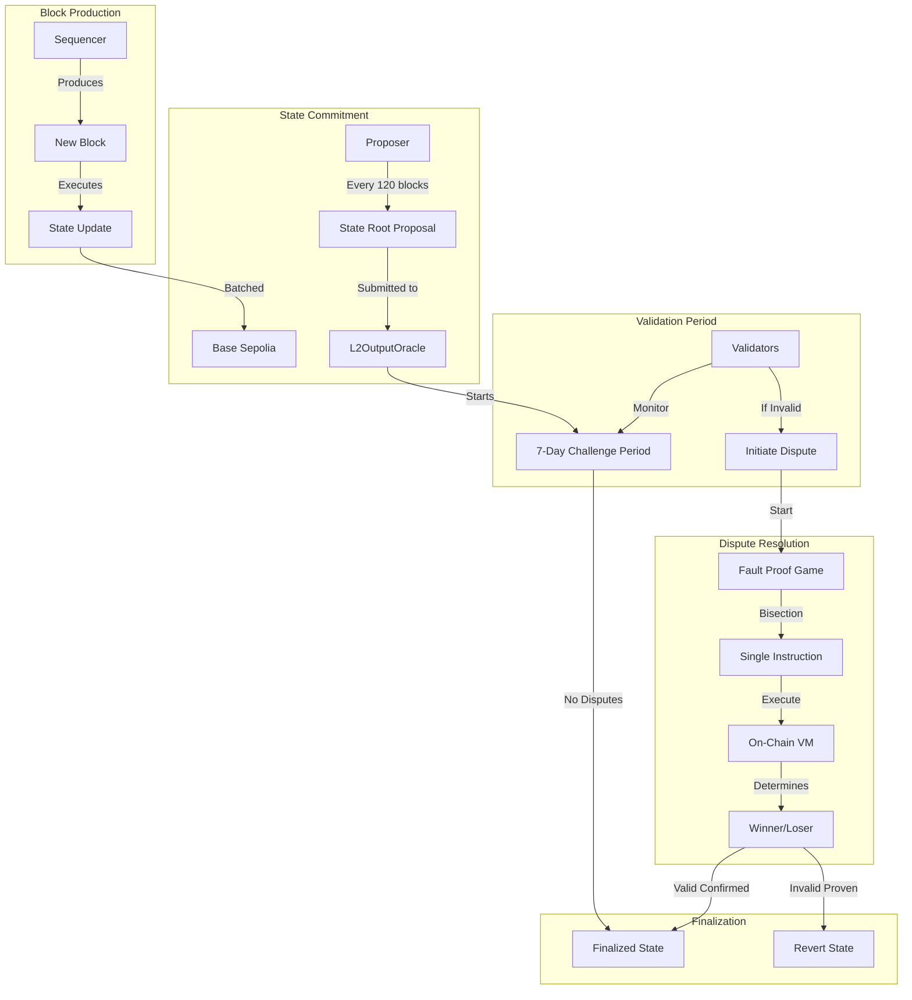

# Block Validation

Nexis Appchain uses the OP Stack fault proof system to ensure all blocks are valid. Unlike traditional consensus where nodes vote on validity, Nexis uses an optimistic approach: blocks are assumed valid unless proven otherwise.

## Overview

<CardGroup cols={2}>
  <Card title="Optimistic Validation" icon="circle-check">
    Blocks are assumed valid by default, executed immediately
  </Card>
  <Card title="Challenge Period" icon="clock">
    7-day window for anyone to dispute invalid state
  </Card>
  <Card title="Fault Proof Game" icon="chess">
    Bisection game narrows disputes to single instruction
  </Card>
  <Card title="Economic Security" icon="shield-dollar">
    Bonds ensure honest behavior from proposers and challengers
  </Card>
</CardGroup>

## Validation Architecture



## State Proposal System

### Output Root Submission

The proposer periodically submits state root commitments to Base L2:

```solidity
// L2OutputOracle.sol on Base Sepolia
contract L2OutputOracle {
    struct OutputProposal {
        bytes32 outputRoot;
        uint128 timestamp;
        uint128 l2BlockNumber;
    }

    mapping(uint256 => OutputProposal) public proposals;
    uint256 public latestProposalIndex;

    uint256 public constant SUBMISSION_INTERVAL = 120; // blocks
    uint256 public constant FINALIZATION_PERIOD = 7 days;
    uint256 public constant PROPOSAL_BOND = 1 ether;

    event OutputProposed(
        bytes32 indexed outputRoot,
        uint256 indexed l2BlockNumber,
        uint256 indexed proposalIndex,
        uint256 timestamp
    );

    function proposeL2Output(
        bytes32 _outputRoot,
        uint256 _l2BlockNumber,
        bytes32 _l1BlockHash,
        uint256 _l1BlockNumber
    ) external payable {
        require(msg.value == PROPOSAL_BOND, "Insufficient bond");
        require(
            _l2BlockNumber == latestProposalL2Block() + SUBMISSION_INTERVAL,
            "Invalid block number"
        );

        uint256 proposalIndex = ++latestProposalIndex;
        proposals[proposalIndex] = OutputProposal({
            outputRoot: _outputRoot,
            timestamp: uint128(block.timestamp),
            l2BlockNumber: uint128(_l2BlockNumber)
        });

        emit OutputProposed(
            _outputRoot,
            _l2BlockNumber,
            proposalIndex,
            block.timestamp
        );
    }

    function isFinalized(uint256 proposalIndex) public view returns (bool) {
        OutputProposal memory proposal = proposals[proposalIndex];
        return block.timestamp >= proposal.timestamp + FINALIZATION_PERIOD;
    }
}
```

### Output Root Calculation

The output root is a commitment to the L3 state at a specific block:

```go
// Output root structure
type OutputRoot struct {
    Version       [32]byte  // Always 0x0000...0000
    StateRoot     [32]byte  // L3 state root
    MessagePasser [32]byte  // Withdrawal storage root
    BlockHash     [32]byte  // L3 block hash
}

// Compute output root
func ComputeOutputRoot(block *types.Block) common.Hash {
    output := OutputRoot{
        Version:       [32]byte{},
        StateRoot:     block.Root(),
        MessagePasser: getMessagePasserRoot(block),
        BlockHash:     block.Hash(),
    }

    // Hash all components
    return crypto.Keccak256Hash(
        output.Version[:],
        output.StateRoot[:],
        output.MessagePasser[:],
        output.BlockHash[:],
    )
}
```

## Derivation and Verification

Any validator can independently derive the correct state and check proposals:

### Derivation Process

```python
class BlockValidator:
    def __init__(self, l2_rpc, l3_rpc):
        self.l2 = Web3(Web3.HTTPProvider(l2_rpc))
        self.l3 = Web3(Web3.HTTPProvider(l3_rpc))
        self.output_oracle = self.l2.eth.contract(
            address=OUTPUT_ORACLE_ADDRESS,
            abi=OUTPUT_ORACLE_ABI
        )

    def validate_proposal(self, proposal_index):
        """Validate a state root proposal"""
        # 1. Get proposed output
        proposal = self.output_oracle.functions.proposals(proposal_index).call()
        proposed_root = proposal[0]
        l2_block = proposal[2]

        print(f"Validating proposal {proposal_index} for block {l2_block}")

        # 2. Derive correct state from L2 data
        derived_state = self.derive_state(l2_block)

        # 3. Compute correct output root
        correct_root = self.compute_output_root(derived_state)

        # 4. Compare
        if proposed_root != correct_root:
            print(f"❌ INVALID PROPOSAL DETECTED!")
            print(f"   Proposed: {proposed_root.hex()}")
            print(f"   Correct:  {correct_root.hex()}")
            return False
        else:
            print(f"✅ Proposal is valid")
            return True

    def derive_state(self, target_block):
        """Derive L3 state from L2 batches"""
        # Get all batch transactions from L2
        batches = self.get_batches_up_to(target_block)

        # Reconstruct L3 blocks
        l3_blocks = []
        for batch in batches:
            # Decompress and decode
            decompressed = zlib.decompress(batch['data'])
            transactions = rlp.decode_list(decompressed)

            # Group into blocks (every 2 seconds)
            blocks = self.group_into_blocks(transactions)
            l3_blocks.extend(blocks)

        # Execute all blocks to get state
        state = self.execute_blocks(l3_blocks)
        return state

    def compute_output_root(self, state):
        """Compute output root from state"""
        return Web3.keccak(
            state['version'] +
            state['state_root'] +
            state['message_passer_root'] +
            state['block_hash']
        )
```

### Automatic Monitoring

Validators run continuous monitoring to detect invalid proposals:

```javascript
// Validator monitoring service
class ProposalMonitor {
  constructor(l2Provider, l3Provider) {
    this.l2 = l2Provider;
    this.l3 = l3Provider;
    this.oracle = new ethers.Contract(
      OUTPUT_ORACLE_ADDRESS,
      OUTPUT_ORACLE_ABI,
      l2Provider
    );
  }

  async start() {
    console.log('Starting proposal monitoring...');

    // Listen for new proposals
    this.oracle.on('OutputProposed', async (
      outputRoot,
      l2BlockNumber,
      proposalIndex,
      timestamp
    ) => {
      console.log(`New proposal ${proposalIndex} for block ${l2BlockNumber}`);

      // Validate in background
      this.validateProposal(proposalIndex, outputRoot, l2BlockNumber)
        .catch(console.error);
    });

    // Also check existing pending proposals
    setInterval(() => this.checkPendingProposals(), 60000); // Every minute
  }

  async validateProposal(index, proposedRoot, l2Block) {
    // Derive correct state
    const derivedState = await this.deriveState(l2Block);
    const correctRoot = this.computeOutputRoot(derivedState);

    // Compare
    if (proposedRoot !== correctRoot) {
      console.error(`🚨 INVALID PROPOSAL ${index}!`);
      console.error(`Proposed: ${proposedRoot}`);
      console.error(`Correct:  ${correctRoot}`);

      // Initiate dispute
      await this.initiateDispute(index, correctRoot);
    } else {
      console.log(`✅ Proposal ${index} is valid`);
    }
  }

  async initiateDispute(proposalIndex, correctRoot) {
    // Submit challenge with bond
    const disputeGame = new ethers.Contract(
      DISPUTE_GAME_ADDRESS,
      DISPUTE_GAME_ABI,
      this.l2.getSigner()
    );

    const tx = await disputeGame.challenge(
      proposalIndex,
      correctRoot,
      { value: ethers.parseEther('1') } // Challenge bond
    );

    await tx.wait();
    console.log(`Dispute initiated: ${tx.hash}`);
  }
}
```

## Fault Proof Game

When a validator challenges an invalid proposal, a bisection game begins:

### Game Phases

<Steps>
  <Step title="Claim Submission">
    Challenger submits their claimed correct output root with a bond
  </Step>
  <Step title="Bisection">
    Proposer and challenger iteratively narrow down the point of disagreement
  </Step>
  <Step title="Single Step Proof">
    Game converges to a single instruction execution
  </Step>
  <Step title="On-Chain Execution">
    Disputed instruction is executed on-chain in a VM
  </Step>
  <Step title="Resolution">
    Winner receives both bonds, loser is slashed
  </Step>
</Steps>

### Bisection Algorithm

```solidity
// DisputeGame.sol
contract DisputeGame {
    struct Claim {
        uint128 position;  // Position in execution trace
        bytes32 claim;     // State hash at this position
        address claimant;
        uint256 bond;
    }

    mapping(uint256 => Claim[]) public claims;
    uint256 public constant MAX_DEPTH = 73; // log2(9_000_000_000_000_000)

    function attack(
        uint256 gameId,
        uint256 claimIndex,
        bytes32 counterClaim
    ) external payable {
        Claim memory parent = claims[gameId][claimIndex];
        uint128 newPosition = parent.position / 2; // Bisect

        claims[gameId].push(Claim({
            position: newPosition,
            claim: counterClaim,
            claimant: msg.sender,
            bond: msg.value
        }));

        emit Attacked(gameId, claimIndex, newPosition, counterClaim);

        // If at max depth, execute single step
        if (depth(gameId) >= MAX_DEPTH) {
            executeSingleStep(gameId);
        }
    }

    function executeSingleStep(uint256 gameId) internal {
        // Get the leaf claims (deepest in tree)
        Claim memory claim1 = getLeaf(gameId, 0);
        Claim memory claim2 = getLeaf(gameId, 1);

        // Load execution trace at disputed step
        bytes memory preState = loadPreState(claim1.position);

        // Execute one instruction in on-chain VM
        bytes32 postState = VM.executeStep(preState);

        // Determine winner
        address winner;
        if (postState == claim1.claim) {
            winner = claim1.claimant;
        } else if (postState == claim2.claim) {
            winner = claim2.claimant;
        } else {
            revert("Neither claim is correct");
        }

        // Resolve game
        resolveGame(gameId, winner);
    }

    function resolveGame(uint256 gameId, address winner) internal {
        // Transfer both bonds to winner
        uint256 totalBond = getTotalBonds(gameId);
        payable(winner).transfer(totalBond);

        // Update output oracle
        if (winner == challenger) {
            outputOracle.deleteProposal(gameId);
        }

        emit GameResolved(gameId, winner);
    }
}
```

### Bisection Example

Let's trace through a dispute:

```
Initial disagreement:
  Position 0:     Block 1000 -> Proposer claims: 0xAAA...
  Position 100:   Block 1100 -> Challenger claims: 0xBBB...

Round 1: Bisect at position 50
  Proposer: State at block 1050 = 0xCCC...
  Challenger: State at block 1050 = 0xDDD...
  → Disagreement is in first half (blocks 1000-1050)

Round 2: Bisect at position 25
  Proposer: State at block 1025 = 0xEEE...
  Challenger: State at block 1025 = 0xEEE... (agree!)
  → Disagreement is in blocks 1025-1050

Round 3: Bisect at position 37
  Proposer: State at block 1037 = 0xFFF...
  Challenger: State at block 1037 = 0xGGG...
  → Continue narrowing...

... 73 rounds later ...

Final: Single block (e.g., block 1033)
  Proposer claims executing block 1033 results in state 0xXXX...
  Challenger claims it results in state 0xYYY...

  → Execute block 1033 on-chain in VM
  → Actual result: 0xYYY...
  → Challenger wins, gets both bonds
```

## Challenge Period

All proposals must survive a 7-day challenge period before finalization:

### Timeline

```
Day 0:  Proposer submits output root
        Challenge period begins

Day 0-7: Anyone can challenge if invalid
         - Must post 1 ETH bond
         - Bisection game starts
         - Can take hours to days

Day 7+:  If no valid challenges:
         - Proposal finalizes
         - Withdrawals can proceed
         - State is "finalized"
```

### Finalization Check

```solidity
// Check if a proposal is finalized
function canFinalize(uint256 proposalIndex) public view returns (bool) {
    OutputProposal memory proposal = proposals[proposalIndex];

    // Check time passed
    if (block.timestamp < proposal.timestamp + FINALIZATION_PERIOD) {
        return false;
    }

    // Check no active disputes
    if (hasActiveDispute(proposalIndex)) {
        return false;
    }

    return true;
}

// Process withdrawal (only after finalization)
function finalizeWithdrawal(
    uint256 proposalIndex,
    WithdrawalTransaction memory withdrawal
) external {
    require(canFinalize(proposalIndex), "Not finalized");

    // Verify withdrawal was included in finalized state
    bytes32 outputRoot = proposals[proposalIndex].outputRoot;
    require(verifyWithdrawal(withdrawal, outputRoot), "Invalid withdrawal");

    // Execute withdrawal
    (bool success, ) = withdrawal.target.call{value: withdrawal.value}(
        withdrawal.data
    );
    require(success, "Withdrawal failed");
}
```

## Withdrawal Delays

Due to the challenge period, withdrawing from Nexis L3 to Base L2 (and subsequently to Ethereum L1) requires waiting:

### Withdrawal Process

<Steps>
  <Step title="Initiate on L3">
    User calls `L2ToL1MessagePasser.initiateWithdrawal()` on Nexis
  </Step>
  <Step title="Wait for Proposal">
    Wait for proposer to include withdrawal in a state root (~4 minutes)
  </Step>
  <Step title="Challenge Period">
    Wait 7 days for challenge period to pass
  </Step>
  <Step title="Prove on L2">
    Submit Merkle proof of withdrawal to Base L2
  </Step>
  <Step title="Finalize">
    Claim withdrawal after proof verification
  </Step>
</Steps>

### Withdrawal Example

```solidity
// Step 1: Initiate withdrawal on L3
interface IL2ToL1MessagePasser {
    function initiateWithdrawal(
        address _target,
        uint256 _gasLimit,
        bytes memory _data
    ) external payable;
}

// User initiates
l2ToL1MessagePasser.initiateWithdrawal{value: 1 ether}(
    userAddress,  // Receive on L2
    100000,       // Gas limit
    ""            // No calldata
);

// Step 2-3: Wait 7 days + 4 minutes

// Step 4: Prove withdrawal on L2
interface IOptimismPortal {
    function proveWithdrawalTransaction(
        Types.WithdrawalTransaction memory _tx,
        uint256 _l2OutputIndex,
        Types.OutputRootProof calldata _outputRootProof,
        bytes[] calldata _withdrawalProof
    ) external;
}

// Submit proof
optimismPortal.proveWithdrawalTransaction(
    withdrawalTx,
    outputIndex,
    outputRootProof,
    merkleProof
);

// Step 5: Finalize (immediately after proof)
optimismPortal.finalizeWithdrawalTransaction(withdrawalTx);
```

### Fast Withdrawal Services

To avoid 7-day delays, users can use fast withdrawal services (liquidity providers):

```javascript
// Fast withdrawal using a liquidity provider
class FastWithdrawalService {
  async withdraw(amount, l3Address) {
    // 1. User initiates withdrawal on L3
    const withdrawalTx = await l3Contract.initiateWithdrawal(
      amount,
      { from: l3Address }
    );

    // 2. Liquidity provider immediately pays user on L2
    const lpPayment = await this.requestLiquidity(
      l3Address,
      amount,
      withdrawalTx.hash
    );

    // 3. LP waits 7 days and claims the withdrawal
    // (User gets funds immediately, LP gets reimbursed after delay)

    return {
      immediate: lpPayment,
      finalizes: Date.now() + 7 * 24 * 60 * 60 * 1000
    };
  }

  async requestLiquidity(user, amount, withdrawalHash) {
    // User pays small fee (e.g., 0.1%) to LP
    const fee = amount * 0.001;
    const netAmount = amount - fee;

    // LP pays user on L2 immediately
    const tx = await this.l2Contract.transfer(user, netAmount);

    // LP records the withdrawal to claim later
    await this.db.recordPendingClaim(withdrawalHash, amount);

    return tx;
  }
}
```

## Security Considerations

### Economic Security

The fault proof system is secured by economic incentives:

| Role | Bond | Risk | Reward |
|------|------|------|--------|
| **Proposer** | 1 ETH | Slashed if invalid | Keep bond if valid |
| **Challenger** | 1 ETH | Lost if wrong challenge | Earn proposer's bond |

**Attack Cost**: To finalize an invalid state, attacker must:
1. Post 1 ETH bond as proposer
2. Defeat all challengers in bisection games
3. Wait 7 days without valid challenges

**Defense Cost**: Any honest validator can challenge with 1 ETH

### Validator Incentives

Running a validator is currently altruistic, but benefits include:
- Protect your own assets/contracts
- Earn trust as a verifier
- Future: Direct rewards for successful challenges

### Griefing Resistance

The system is designed to resist griefing attacks:

```solidity
// Anti-griefing measures
contract DisputeGame {
    uint256 public constant MIN_BOND = 1 ether;
    uint256 public constant MAX_GAME_DURATION = 30 days;
    uint256 public constant MOVE_DEADLINE = 3 days;

    // Griefer must keep posting bonds
    function requireBond() internal {
        require(msg.value >= MIN_BOND, "Insufficient bond");
        // Bond is locked until game resolves
    }

    // Game expires if griefer stops responding
    function checkTimeout(uint256 gameId) public {
        Game memory game = games[gameId];
        if (block.timestamp > game.lastMove + MOVE_DEADLINE) {
            // Griefer didn't respond, they lose
            resolveByTimeout(gameId);
        }
    }
}
```

## Monitoring Tools

### Validator Dashboard

```javascript
// Real-time validation monitoring
class ValidationDashboard {
  async getStatus() {
    const latest = await this.oracle.latestProposalIndex();
    const proposals = [];

    for (let i = latest; i > latest - 10; i--) {
      const proposal = await this.oracle.proposals(i);
      const age = Date.now() - proposal.timestamp * 1000;
      const finalized = age > 7 * 24 * 60 * 60 * 1000;

      // Validate if not finalized
      const valid = finalized ? null : await this.validate(i);

      proposals.push({
        index: i,
        block: proposal.l2BlockNumber,
        age: this.formatDuration(age),
        finalized,
        valid
      });
    }

    return proposals;
  }

  render() {
    const status = await this.getStatus();
    console.table(status);
  }
}
```

## Learn More

<CardGroup cols={2}>
  <Card title="Fault Proofs Deep Dive" icon="chess-board" href="/infrastructure/fault-proofs">
    Detailed mechanics of the dispute game
  </Card>
  <Card title="Run a Validator" icon="server" href="/developers/validator-node">
    Setup guide for running your own validator
  </Card>
  <Card title="Consensus Mechanism" icon="cubes" href="/infrastructure/consensus">
    How blocks are produced and ordered
  </Card>
  <Card title="Infrastructure Overview" icon="diagram-project" href="/infrastructure/overview">
    Complete architecture documentation
  </Card>
</CardGroup>

---

<Warning>
**Always wait for finalization before processing high-value operations!** The 7-day challenge period is a critical security feature.
</Warning>