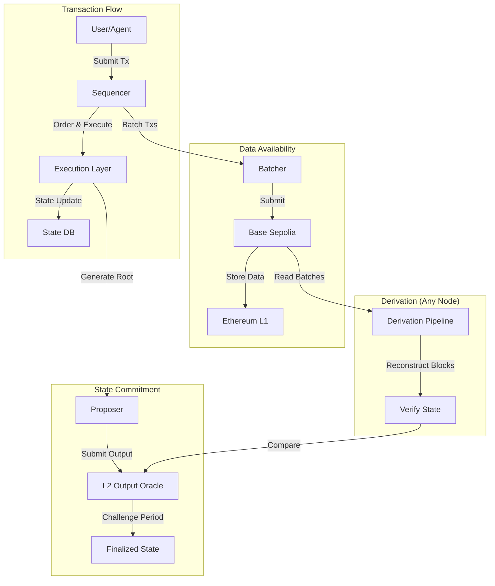

# Consensus Mechanism

Nexis Appchain uses the Optimism (OP Stack) rollup consensus mechanism, which differs fundamentally from traditional proof-of-work or proof-of-stake consensus. Instead of nodes voting on blocks, consensus is achieved through **deterministic derivation** from L2 (Base Sepolia) data.

## Overview

<CardGroup cols={2}>
  <Card title="Derivation Pipeline" icon="diagram-project">
    Blocks are derived deterministically from L2 batch data
  </Card>
  <Card title="Sequencer Authority" icon="crown">
    Single sequencer orders transactions (temporarily centralized)
  </Card>
  <Card title="Fault Proof Security" icon="shield">
    Invalid state transitions are challenged and proven wrong
  </Card>
  <Card title="Three Finality Levels" icon="layer-group">
    Unsafe, safe, and finalized heads provide different guarantees
  </Card>
</CardGroup>

## Consensus Architecture



## Derivation Pipeline

The derivation pipeline is the core of OP Stack consensus. Any node can independently derive the canonical L3 chain by following this deterministic process:

### Pipeline Stages

<Steps>
  <Step title="Fetch L2 Data">
    Read batch transactions from Base Sepolia that contain L3 data
  </Step>
  <Step title="Decompress Batches">
    Decompress and decode the batched transaction calldata
  </Step>
  <Step title="Parse Transactions">
    Extract individual L3 transactions from batch format
  </Step>
  <Step title="Build Blocks">
    Group transactions into 2-second blocks with proper ordering
  </Step>
  <Step title="Execute State Transitions">
    Apply each transaction and update the state database
  </Step>
  <Step title="Generate Output Roots">
    Compute state roots and compare with proposed outputs
  </Step>
</Steps>

### Implementation

```go
// Derivation pipeline in op-node
type DerivationPipeline struct {
    l2Source    L2DataSource
    l3Chain     *core.BlockChain
    engineAPI   EngineAPI
    config      *rollup.Config
}

// Main derivation loop
func (dp *DerivationPipeline) Step() error {
    // 1. Fetch next batch from L2
    batch, err := dp.l2Source.NextBatch()
    if err != nil {
        return err
    }

    // 2. Decompress batch data
    decompressed, err := zlib.Decompress(batch.Data)
    if err != nil {
        return fmt.Errorf("failed to decompress: %w", err)
    }

    // 3. Parse transactions
    txs, err := rlp.DecodeList(decompressed)
    if err != nil {
        return fmt.Errorf("failed to decode txs: %w", err)
    }

    // 4. Build block attributes
    attrs := &eth.PayloadAttributes{
        Timestamp:    dp.nextBlockTime(),
        Random:       batch.PrevRandao,
        Transactions: txs,
    }

    // 5. Execute block via engine API
    payload, err := dp.engineAPI.ForkchoiceUpdated(
        dp.l3Chain.CurrentHeader().Hash(),
        attrs,
    )
    if err != nil {
        return fmt.Errorf("execution failed: %w", err)
    }

    // 6. Validate state root
    if payload.StateRoot != batch.ExpectedStateRoot {
        return fmt.Errorf("state root mismatch: %s != %s",
            payload.StateRoot, batch.ExpectedStateRoot)
    }

    return nil
}

// Determine next block timestamp (2-second intervals)
func (dp *DerivationPipeline) nextBlockTime() uint64 {
    prevTime := dp.l3Chain.CurrentHeader().Time
    return prevTime + dp.config.BlockTime // 2 seconds
}
```

### Derivation Example

Let's trace how a user transaction flows through the system:

```javascript
// 1. User submits transaction to sequencer
const tx = {
  from: "0xUser",
  to: "0xAgentsContract",
  data: "registerAgent(...)",
  gasLimit: 250000,
  gasPrice: 1000000000 // 1 gwei
};

// 2. Sequencer receives and validates
sequencer.validateTransaction(tx);
sequencer.addToMempool(tx);

// 3. Sequencer builds next block (at 2-second mark)
const block = sequencer.buildBlock({
  timestamp: Math.floor(Date.now() / 1000),
  transactions: sequencer.selectTransactions(),
  parentHash: previousBlock.hash
});

// 4. Execute block and update state
const receipt = await opGeth.executeBlock(block);

// 5. Broadcast to network
p2pNetwork.broadcast(block);

// 6. Batcher collects for L2 submission
batcher.addBlock(block);

// 7. After 60 seconds, submit batch to Base
const batchTx = await baseSepolia.sendTransaction({
  to: BATCH_INBOX_ADDRESS,
  data: zlib.compress([block1, block2, ..., block30])
});

// 8. Any node can now derive the same blocks
const derivedBlock = derivationPipeline.deriveFrom(batchTx);
assert(derivedBlock.hash === block.hash); // Deterministic!
```

## Sequencer Operations

The sequencer is currently a centralized component responsible for transaction ordering and block production. Understanding its role is critical to understanding Nexis consensus.

### Sequencer Responsibilities

1. **Transaction Acceptance**: Receive and validate transactions via JSON-RPC
2. **Mempool Management**: Maintain pending transaction pool with priority ordering
3. **Block Production**: Create blocks every 2 seconds with optimal transaction packing
4. **State Execution**: Apply transactions and update state through op-geth
5. **Network Propagation**: Broadcast blocks to all nodes via P2P gossip
6. **Batch Coordination**: Send blocks to batcher for L2 submission

### Block Production Algorithm

```python
class NexisSequencer:
    BLOCK_TIME = 2  # seconds
    MAX_GAS_PER_BLOCK = 30_000_000

    def produce_block(self):
        """Produce a new block every 2 seconds"""
        start_time = time.time()

        # 1. Get pending transactions from mempool
        pending = self.mempool.get_pending()

        # 2. Prioritize agent operations
        priority_txs = self.prioritize_transactions(pending)

        # 3. Pack transactions until gas limit
        selected = []
        total_gas = 0

        for tx in priority_txs:
            if total_gas + tx.gas_limit > self.MAX_GAS_PER_BLOCK:
                break
            selected.append(tx)
            total_gas += tx.gas_limit

        # 4. Build block attributes
        block = {
            'number': self.latest_block + 1,
            'timestamp': int(start_time),
            'transactions': selected,
            'parent_hash': self.latest_hash,
            'gas_limit': self.MAX_GAS_PER_BLOCK,
            'base_fee': self.calculate_base_fee()
        }

        # 5. Execute via op-geth
        result = self.op_geth.execute_block(block)

        # 6. Update local state
        self.latest_block = result['number']
        self.latest_hash = result['hash']
        self.latest_state_root = result['state_root']

        # 7. Broadcast to network
        self.p2p.broadcast_block(result)

        # 8. Send to batcher
        self.batcher.add_block(result)

        # 9. Schedule next block
        elapsed = time.time() - start_time
        sleep_time = max(0, self.BLOCK_TIME - elapsed)
        time.sleep(sleep_time)

        return result

    def prioritize_transactions(self, txs):
        """Sort transactions by priority"""
        def priority_score(tx):
            # Agent operations get highest priority
            if self.is_agent_operation(tx):
                return (3, tx.gas_price)
            # Proof submissions are second
            elif self.is_proof_submission(tx):
                return (2, tx.gas_price)
            # Everything else by gas price
            else:
                return (1, tx.gas_price)

        return sorted(txs, key=priority_score, reverse=True)

    def is_agent_operation(self, tx):
        """Check if tx interacts with Agents contract"""
        return tx.to in [AGENTS_CONTRACT, TASKS_CONTRACT, TREASURY_CONTRACT]

    def is_proof_submission(self, tx):
        """Check if tx is submitting inference proof"""
        return tx.to == TASKS_CONTRACT and tx.data.startswith('0x1234') # submitProof selector
```

### Sequencer Configuration

```toml
# sequencer.toml
[sequencer]
enabled = true
l1_confs = 4  # Wait for 4 L2 confirmations before finalizing

[sequencer.mempool]
max_size = 10000
max_tx_size = 128000  # bytes
ttl = 3600  # seconds

[sequencer.prioritization]
agent_ops_multiplier = 2.0
proof_submission_multiplier = 1.5
min_gas_price = 1000000000  # 1 gwei

[sequencer.block_building]
target_gas_usage = 0.95  # Target 95% of gas limit
max_block_time = 1900  # ms (leave 100ms buffer)
```

## Finality Levels

Nexis provides three levels of finality, each with different trust assumptions and latency:

### 1. Unsafe Head

The **unsafe head** is the latest block produced by the sequencer, before it's submitted to L2.

**Characteristics:**
- **Latency**: ~2 seconds
- **Trust**: Must trust the sequencer
- **Reversibility**: Sequencer could reorg
- **Use Case**: Fast UI updates, optimistic UX

```javascript
// Query unsafe head
const unsafeHead = await provider.send('optimism_syncStatus', []);
console.log('Unsafe block:', unsafeHead.unsafe_l2.number);

// Subscribe to unsafe blocks
provider.on('block', (blockNumber) => {
  console.log('New unsafe block:', blockNumber);
  // Update UI optimistically
  updateUIWithNewBlock(blockNumber);
});
```

<Warning>
**Unsafe head can be reorged!** Only use for optimistic UI updates. Never finalize critical operations (payments, withdrawals) based on unsafe head.
</Warning>

### 2. Safe Head

The **safe head** is the latest block that has been submitted to Base L2 and confirmed.

**Characteristics:**
- **Latency**: ~4 minutes (30 blocks batched + L2 confirmation)
- **Trust**: Trust Base L2 validators
- **Reversibility**: Only if Base L2 reorgs (very rare)
- **Use Case**: Standard transaction confirmations

```javascript
// Query safe head
const syncStatus = await provider.send('optimism_syncStatus', []);
console.log('Safe block:', syncStatus.safe_l2.number);

// Wait for safe confirmation
async function waitForSafeConfirmation(txHash) {
  const receipt = await provider.getTransactionReceipt(txHash);
  const txBlock = receipt.blockNumber;

  while (true) {
    const status = await provider.send('optimism_syncStatus', []);
    if (status.safe_l2.number >= txBlock) {
      console.log('Transaction is safe!');
      return true;
    }
    await new Promise(r => setTimeout(r, 5000)); // Wait 5s
  }
}
```

### 3. Finalized Head

The **finalized head** is the latest block for which the challenge period has expired without successful disputes.

**Characteristics:**
- **Latency**: ~15 minutes (after Base L2 finalization)
- **Trust**: Trust Ethereum L1
- **Reversibility**: Only if Ethereum reorgs (practically impossible)
- **Use Case**: High-value transactions, bridges, custody

```javascript
// Query finalized head
const syncStatus = await provider.send('optimism_syncStatus', []);
console.log('Finalized block:', syncStatus.finalized_l2.number);

// Wait for finalization (important for withdrawals)
async function waitForFinalization(txHash) {
  const receipt = await provider.getTransactionReceipt(txHash);
  const txBlock = receipt.blockNumber;

  console.log('Waiting for block', txBlock, 'to finalize...');

  while (true) {
    const status = await provider.send('optimism_syncStatus', []);
    if (status.finalized_l2.number >= txBlock) {
      console.log('Transaction is finalized!');
      return true;
    }
    await new Promise(r => setTimeout(r, 30000)); // Wait 30s
  }
}
```

### Finality Comparison

| Level | Latency | Reversibility | Trust Assumption | Use Case |
|-------|---------|---------------|------------------|----------|
| **Unsafe** | 2s | High | Sequencer | UI updates |
| **Safe** | 4m | Low | Base L2 | Standard txs |
| **Finalized** | 15m | Negligible | Ethereum L1 | High-value ops |

## Reorg Protection

Nexis inherits reorg protection from the OP Stack architecture:

### Sequencer-Level Protection

```javascript
class SequencerReorgProtection {
  // Sequencer maintains consistency by never reorging its own blocks
  async buildBlock(txs) {
    const parent = this.chainHead;

    // Always build on latest sequencer head (no reorgs)
    const block = {
      parent: parent.hash,
      number: parent.number + 1,
      transactions: txs
    };

    // Once published, this block is canonical
    await this.publishBlock(block);

    // Update head atomically
    this.chainHead = block;

    return block;
  }
}
```

### L2 Batch Protection

Once a batch is submitted to Base L2:
1. The batch data is permanently stored on L2
2. Validators can derive blocks from this data
3. Any deviation from derived blocks can be challenged
4. Sequencer cannot unilaterally reorg batched blocks

### Fault Proof Protection

The ultimate reorg protection comes from fault proofs:

```solidity
// If sequencer tries to reorg batched blocks
contract FaultProver {
    function challengeInvalidReorg(
        uint256 reorgedBlockNumber,
        bytes32 claimedStateRoot,
        bytes32 correctStateRoot,
        bytes calldata proof
    ) external {
        // Derive correct state root from L2 data
        bytes32 derived = deriveStateRoot(reorgedBlockNumber);

        // Prove sequencer's state root is wrong
        require(claimedStateRoot != derived, "No reorg detected");
        require(correctStateRoot == derived, "Invalid proof");

        // Slash sequencer and reject their state
        slashSequencer(msg.sender);
        revertToCorrectState(correctStateRoot);
    }
}
```

## Censorship Resistance

While the sequencer can temporarily censor transactions, users have escape hatches:

### Force Inclusion via L2

Users can force transaction inclusion by submitting directly to Base L2:

```solidity
// On Base Sepolia
contract L2CrossDomainMessenger {
    function sendMessage(
        address _target,    // L3 contract address
        bytes calldata _message,
        uint32 _gasLimit
    ) external payable {
        // This transaction MUST be included in L3
        // Sequencer cannot censor it
        emit MessageSent(_target, msg.sender, _message, _gasLimit);
    }
}
```

```javascript
// User submits censored tx via L2
async function forceInclude(censoredTx) {
  const l2Messenger = new ethers.Contract(
    L2_MESSENGER_ADDRESS,
    L2_MESSENGER_ABI,
    l2Signer
  );

  // Submit to L2, forcing L3 inclusion
  const tx = await l2Messenger.sendMessage(
    censoredTx.to,
    censoredTx.data,
    censoredTx.gasLimit,
    { value: ethers.parseEther('0.01') } // Extra fee for L2
  );

  await tx.wait();
  console.log('Forced inclusion via L2:', tx.hash);
}
```

### Sequencer Rotation (Future)

Nexis will implement sequencer rotation to further reduce censorship risk:

```go
// Planned sequencer rotation
type SequencerSet struct {
    Active     []common.Address
    Rotation   time.Duration // 1 hour
    MinStake   *big.Int     // 100,000 NZT
}

func (s *SequencerSet) NextSequencer() common.Address {
    epoch := time.Now().Unix() / int64(s.Rotation.Seconds())
    index := epoch % int64(len(s.Active))
    return s.Active[index]
}
```

## Comparison to Other Consensus Mechanisms

| Mechanism | Block Time | Finality | Trust | Decentralization |
|-----------|-----------|----------|-------|------------------|
| **Nexis (OP Stack)** | 2s | 15min | Sequencer + Fault Proofs | Centralized sequencer (for now) |
| **Ethereum PoS** | 12s | 15min | 2/3 validators | Highly decentralized |
| **Polygon PoS** | 2s | ~30s | 2/3 validators | ~100 validators |
| **Arbitrum** | ~0.25s | 7d | Sequencer + Fraud Proofs | Centralized sequencer |

## Learn More

<CardGroup cols={2}>
  <Card title="Block Validation" icon="check-circle" href="/infrastructure/block-validation">
    How blocks are validated and secured
  </Card>
  <Card title="Fault Proofs" icon="shield" href="/infrastructure/fault-proofs">
    Deep dive into the security mechanism
  </Card>
  <Card title="Run a Validator" icon="server" href="/developers/validator-node">
    Participate in block derivation
  </Card>
  <Card title="Infrastructure Overview" icon="diagram-project" href="/infrastructure/overview">
    Complete architecture documentation
  </Card>
</CardGroup>

---

<Note>
**Questions about consensus?** Join the discussion in our [Discord #consensus](https://discord.gg/nexis) channel.
</Note>