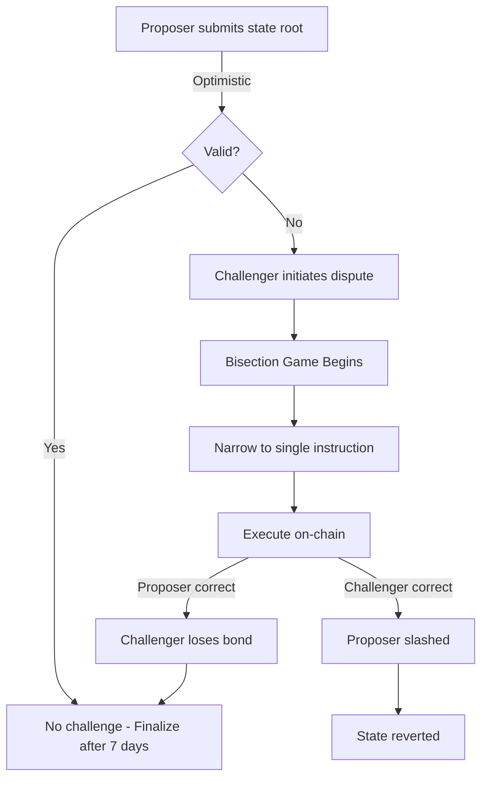

# Fault Proofs

Nexis Appchain's security model relies on fault proofs, a mechanism that allows anyone to challenge invalid state transitions. This document explains the technical details of how the fault proof game works.

## Overview

<CardGroup cols={2}>
  <Card title="Optimistic Security" icon="shield-check">
    State roots are assumed valid unless proven wrong
  </Card>
  <Card title="Bisection Game" icon="chess-board">
    Binary search to narrow disputes to a single instruction
  </Card>
  <Card title="73-Step Depth" icon="stairs">
    Maximum game depth allows 2^73 instruction traces
  </Card>
  <Card title="Economic Bonds" icon="lock-dollar">
    Both parties stake ETH, winner takes all
  </Card>
</CardGroup>

## How Fault Proofs Work

### The Problem

Traditional blockchains validate every transaction on every node. This is secure but expensive. Rollups optimize by executing transactions off-chain and only posting commitments on-chain. But how do we ensure these commitments are correct?

**Fault Proofs**: Instead of validating everything, we optimistically assume correctness and allow anyone to prove incorrectness.

### The Solution



## The Fault Proof Game

### Game Structure

The fault proof game is a **turn-based bisection protocol** that narrows a disagreement over an entire execution trace to a dispute over a single instruction.

**Players:**
- **Proposer**: Claims state root X is correct at block N
- **Challenger**: Claims state root Y is correct at block N

**Goal:**
- Identify the exact instruction where they disagree
- Execute that instruction on-chain to determine who's right

### Game Tree

```
Round 0: Dispute over entire trace (2^73 instructions)
  Proposer: "State at step 2^73 is X"
  Challenger: "State at step 2^73 is Y"

Round 1: Bisect at 2^72
  Proposer: "State at step 2^72 is A"
  Challenger: "State at step 2^72 is B"
  → Disagreement is in first half

Round 2: Bisect at 2^71
  Proposer: "State at step 2^71 is C"
  Challenger: "State at step 2^71 is C" (agree!)
  → Disagreement is in second quarter

... 73 rounds ...

Round 73: Single instruction at step S
  Proposer: "Executing instruction S produces state X"
  Challenger: "Executing instruction S produces state Y"
  → Execute instruction on-chain to determine truth
```

### Bisection Depth

Why 73 levels?

```javascript
// Maximum instructions in a single block
const MAX_GAS = 30_000_000;
const MIN_GAS_PER_INSTRUCTION = 3; // Simplest opcodes
const MAX_INSTRUCTIONS = MAX_GAS / MIN_GAS_PER_INSTRUCTION; // ~10 million

// For an entire batch (30 blocks @ 2s = 60s)
const BLOCKS_PER_BATCH = 30;
const MAX_INSTRUCTIONS_PER_BATCH = MAX_INSTRUCTIONS * BLOCKS_PER_BATCH;
// ~300 million instructions

// Need enough depth to bisect this many steps
const DEPTH = Math.ceil(Math.log2(MAX_INSTRUCTIONS_PER_BATCH));
// log2(300,000,000) ≈ 28 bits per block
// For safety, use 73 total depth

console.log('Max instructions:', Math.pow(2, 73)); // 9.44 * 10^21
```

The 73-level tree can accommodate up to 2^73 ≈ 9.44 quintillion instructions - far more than any realistic execution trace.

## Implementation

### Dispute Game Contract

```solidity
// DisputeGameFactory.sol - Creates new games
contract DisputeGameFactory {
    enum GameType {
        CANNON,      // MIPS VM for actual execution
        PERMISSIONED // Governance override
    }

    struct GameParams {
        GameType gameType;
        bytes32 rootClaim;
        bytes extraData;
    }

    mapping(bytes32 => IDisputeGame) public games;

    event DisputeGameCreated(
        address indexed game,
        GameType indexed gameType,
        bytes32 indexed rootClaim
    );

    function create(
        GameType gameType,
        bytes32 rootClaim,
        bytes calldata extraData
    ) external payable returns (IDisputeGame game) {
        // Create new game instance
        game = _createGame(gameType, rootClaim, extraData);

        // Require bond from creator
        require(msg.value == BOND_AMOUNT, "Incorrect bond");

        // Initialize game
        game.initialize{value: msg.value}(msg.sender);

        emit DisputeGameCreated(address(game), gameType, rootClaim);
    }
}
```

### Fault Dispute Game

```solidity
// FaultDisputeGame.sol - The actual bisection game
contract FaultDisputeGame is IDisputeGame {
    uint256 public constant MAX_GAME_DEPTH = 73;
    uint256 public constant BOND_AMOUNT = 1 ether;

    struct ClaimData {
        uint32 parentIndex;
        bool countered;
        bytes32 claim;
        Position position;
        Clock clock;
    }

    struct Position {
        uint128 depth;     // Current depth in game tree
        uint128 indexAtDepth; // Index at this depth
    }

    ClaimData[] public claims;
    mapping(uint256 => uint256) public credit; // Bonds held

    // Root claim (proposer's initial claim)
    bytes32 public immutable rootClaim;

    // Absolute prestate (starting state)
    bytes32 public immutable absolutePrestate;

    // L2 block number being disputed
    uint256 public immutable l2BlockNumber;

    constructor(
        bytes32 _rootClaim,
        uint256 _l2BlockNumber,
        bytes32 _absolutePrestate
    ) {
        rootClaim = _rootClaim;
        l2BlockNumber = _l2BlockNumber;
        absolutePrestate = _absolutePrestate;

        // Initialize with root claim at depth 0
        claims.push(ClaimData({
            parentIndex: 0,
            countered: false,
            claim: _rootClaim,
            position: Position(0, 0),
            clock: Clock.wrap(0)
        }));
    }

    // Challenge a claim
    function attack(
        uint256 parentIndex,
        bytes32 claim
    ) external payable {
        require(msg.value == BOND_AMOUNT, "Incorrect bond");

        ClaimData memory parent = claims[parentIndex];
        require(!parent.countered, "Already countered");

        // New claim is one level deeper
        Position memory position = Position({
            depth: parent.position.depth + 1,
            indexAtDepth: parent.position.indexAtDepth * 2 // Left child
        });

        require(position.depth <= MAX_GAME_DEPTH, "Max depth reached");

        // Add claim
        claims.push(ClaimData({
            parentIndex: uint32(parentIndex),
            countered: false,
            claim: claim,
            position: position,
            clock: Clock.wrap(uint64(block.timestamp))
        }));

        // Mark parent as countered
        claims[parentIndex].countered = true;

        // Hold bond
        credit[msg.sender] += msg.value;

        emit Attack(parentIndex, claims.length - 1, claim);

        // Check if game can be resolved
        if (position.depth == MAX_GAME_DEPTH) {
            _resolve();
        }
    }

    // Defend a claim
    function defend(
        uint256 parentIndex,
        bytes32 claim
    ) external payable {
        require(msg.value == BOND_AMOUNT, "Incorrect bond");

        ClaimData memory parent = claims[parentIndex];

        // New claim is at same level, right sibling
        Position memory position = Position({
            depth: parent.position.depth + 1,
            indexAtDepth: parent.position.indexAtDepth * 2 + 1 // Right child
        });

        require(position.depth <= MAX_GAME_DEPTH, "Max depth reached");

        claims.push(ClaimData({
            parentIndex: uint32(parentIndex),
            countered: false,
            claim: claim,
            position: position,
            clock: Clock.wrap(uint64(block.timestamp))
        }));

        credit[msg.sender] += msg.value;

        emit Defend(parentIndex, claims.length - 1, claim);

        if (position.depth == MAX_GAME_DEPTH) {
            _resolve();
        }
    }

    // Execute single step to resolve leaf claim
    function step(
        uint256 claimIndex,
        bool isAttack,
        bytes calldata stateData,
        bytes calldata proof
    ) external {
        ClaimData memory claim = claims[claimIndex];
        require(claim.position.depth == MAX_GAME_DEPTH, "Not at max depth");

        // Load pre-state from the claim
        bytes32 preState = isAttack ? claim.claim : claims[claim.parentIndex].claim;

        // Execute single instruction using MIPS VM
        bytes32 postState = MIPS_VM.step(stateData, proof);

        // Determine winner
        address winner;
        if (isAttack && postState == claim.claim) {
            // Attacker was correct
            winner = _getCoinbase(claimIndex);
        } else if (!isAttack && postState == claims[claim.parentIndex].claim) {
            // Defender was correct
            winner = _getCoinbase(claim.parentIndex);
        } else {
            revert("Step verification failed");
        }

        // Resolve game in winner's favor
        _distributeBonds(winner);
    }

    function _resolve() internal {
        // Traverse tree to find winning claim
        uint256 rightmostLeaf = _findRightmostLeaf();

        // Winner is whoever posted the rightmost leaf
        address winner = _getCoinbase(rightmostLeaf);

        _distributeBonds(winner);
    }

    function _distributeBonds(address winner) internal {
        // Calculate total bonds in the game
        uint256 totalBonds = claims.length * BOND_AMOUNT;

        // Pay winner
        (bool success, ) = winner.call{value: totalBonds}("");
        require(success, "Transfer failed");

        // Update output oracle if challenger won
        if (winner != _getCoinbase(0)) { // 0 is root claim (proposer)
            IOutputOracle(OUTPUT_ORACLE).deleteProposal(l2BlockNumber);
        }

        emit GameResolved(winner);
    }
}
```

### Position Encoding

The position in the game tree is encoded as `(depth, indexAtDepth)`:

```solidity
library Position {
    type Position is uint256;

    // Extract depth (left 128 bits)
    function depth(Position _position) internal pure returns (uint128) {
        return uint128(Position.unwrap(_position) >> 128);
    }

    // Extract index at depth (right 128 bits)
    function indexAtDepth(Position _position) internal pure returns (uint128) {
        return uint128(Position.unwrap(_position));
    }

    // Create position
    function pack(uint128 _depth, uint128 _index) internal pure returns (Position) {
        return Position.wrap((uint256(_depth) << 128) | uint256(_index));
    }

    // Move to left child
    function moveLeft(Position _position) internal pure returns (Position) {
        uint128 d = depth(_position);
        uint128 i = indexAtDepth(_position);
        return pack(d + 1, i * 2);
    }

    // Move to right child
    function moveRight(Position _position) internal pure returns (Position) {
        uint128 d = depth(_position);
        uint128 i = indexAtDepth(_position);
        return pack(d + 1, i * 2 + 1);
    }
}
```

## MIPS VM

At the deepest level of the game, a single instruction must be executed on-chain. Nexis uses a MIPS emulator for this:

### Why MIPS?

- **Simple ISA**: Easy to implement on-chain
- **Deterministic**: No undefined behavior
- **Well-supported**: Go, Rust, C all compile to MIPS
- **Small**: Minimal on-chain execution cost

### On-Chain Execution

```solidity
// MIPS.sol - On-chain MIPS emulator
contract MIPS {
    // VM state
    struct State {
        bytes32 memRoot;      // Merkle root of memory
        bytes32 preimageKey;  // Key for oracle lookups
        uint32 preimageOffset;
        uint32 pc;            // Program counter
        uint32 nextPC;
        uint32 lo;            // Multiplication/division results
        uint32 hi;
        uint32 heap;
        uint8 exitCode;
        bool exited;
        uint64 step;
        uint32[32] registers; // 32 MIPS registers
    }

    function step(
        bytes calldata stateData,
        bytes calldata proof
    ) external returns (bytes32) {
        // Decode state
        State memory state = abi.decode(stateData, (State));

        // Fetch instruction at PC
        uint32 instruction = _fetchInstruction(state, proof);

        // Decode and execute
        _execute(state, instruction);

        // Increment step counter
        state.step++;

        // Return new state hash
        return keccak256(abi.encode(state));
    }

    function _execute(State memory state, uint32 instruction) internal {
        uint32 opcode = instruction >> 26;

        if (opcode == 0x00) { // R-type instructions
            uint32 funct = instruction & 0x3F;

            if (funct == 0x20) { // ADD
                uint32 rs = (instruction >> 21) & 0x1F;
                uint32 rt = (instruction >> 16) & 0x1F;
                uint32 rd = (instruction >> 11) & 0x1F;
                state.registers[rd] = state.registers[rs] + state.registers[rt];
            }
            // ... more R-type instructions
        } else if (opcode == 0x08) { // ADDI
            uint32 rs = (instruction >> 21) & 0x1F;
            uint32 rt = (instruction >> 16) & 0x1F;
            int32 imm = int16(instruction & 0xFFFF);
            state.registers[rt] = state.registers[rs] + uint32(imm);
        }
        // ... more opcodes

        // Update PC
        state.pc = state.nextPC;
        state.nextPC = state.pc + 4;
    }
}
```

### Example: Dispute Resolution

```typescript
// Dispute resolution workflow
class DisputeResolver {
  async resolveDispute(proposalIndex: number) {
    // 1. Create dispute game
    const game = await this.factory.create(
      GameType.CANNON,
      proposedRoot,
      encodedBlockData
    );

    console.log('Dispute game created:', game.address);

    // 2. Derive correct state
    const correctState = await this.deriveState(proposalIndex);

    // 3. Play the bisection game
    let claimIndex = 0; // Start at root

    for (let depth = 0; depth < MAX_DEPTH; depth++) {
      const claim = await game.claims(claimIndex);

      // Check if we agree at this point
      const ourClaim = this.getClaimAtPosition(
        correctState,
        claim.position
      );

      if (ourClaim !== claim.claim) {
        // We disagree - attack this claim
        console.log(`Attacking claim ${claimIndex} at depth ${depth}`);

        const tx = await game.attack(claimIndex, ourClaim, {
          value: ethers.parseEther('1')
        });

        await tx.wait();

        // Move to our new claim
        claimIndex = (await game.claims()).length - 1;
      } else {
        // We agree - wait for opponent's move
        console.log(`Agree at depth ${depth}, waiting...`);
        await this.waitForCounterClaim(game, claimIndex);
        claimIndex = claim.childIndex; // Move to child
      }
    }

    // 4. At max depth, execute single step
    console.log('Max depth reached, executing single step...');

    const preState = await this.getPreState(claimIndex);
    const proof = await this.generateProof(preState);

    const tx = await game.step(
      claimIndex,
      true, // isAttack
      preState,
      proof
    );

    await tx.wait();
    console.log('Dispute resolved!');
  }
}
```

## Economic Security

The fault proof system is secured by economic incentives:

### Bond Mechanics

```solidity
contract BondManager {
    uint256 public constant BOND_AMOUNT = 1 ether;

    mapping(address => uint256) public lockedBonds;
    mapping(uint256 => uint256) public gameBonds;

    function lockBond(uint256 gameId, address player) external payable {
        require(msg.value == BOND_AMOUNT, "Incorrect bond");
        lockedBonds[player] += msg.value;
        gameBonds[gameId] += msg.value;
    }

    function slashLoser(uint256 gameId, address loser, address winner) external {
        uint256 loserBond = lockedBonds[loser];
        lockedBonds[loser] = 0;

        // Winner gets both bonds
        lockedBonds[winner] += loserBond;

        emit Slashed(loser, loserBond);
    }

    function claimBond(address player) external {
        uint256 amount = lockedBonds[player];
        require(amount > 0, "No bond to claim");

        lockedBonds[player] = 0;
        payable(player).transfer(amount);
    }
}
```

### Attack Cost Analysis

To successfully attack the network with an invalid state:

**Attacker Costs:**
1. Proposer bond: 1 ETH
2. Must defeat all challengers in bisection games
3. Each honest challenger requires defeating: +1 ETH
4. With N honest challengers: N+1 ETH total

**Defender Costs:**
1. Single honest validator: 1 ETH bond
2. If correct, receives attacker's bond: +1 ETH profit

**Equilibrium:**
- As long as one honest party exists with 1 ETH, attacks fail
- Attacker loses all bonds
- Network remains secure

### Griefing Resistance

```solidity
// Prevent frivolous challenges
contract GriefingProtection {
    uint256 public constant MOVE_TIMEOUT = 3 days;
    mapping(uint256 => uint256) public lastMove;

    function checkTimeout(uint256 gameId) external {
        require(
            block.timestamp > lastMove[gameId] + MOVE_TIMEOUT,
            "Not timed out"
        );

        // Player who didn't respond loses
        address defaulter = getCurrentPlayer(gameId);
        slashPlayer(gameId, defaulter);
    }

    // Exponentially increasing bonds for multiple claims
    function requiredBond(address player) public view returns (uint256) {
        uint256 activeGames = getActiveGames(player).length;
        return BOND_AMOUNT * (2 ** activeGames); // 1, 2, 4, 8 ETH...
    }
}
```

## Learn More

<CardGroup cols={2}>
  <Card title="Block Validation" icon="check-circle" href="/infrastructure/block-validation">
    How blocks are validated and finalized
  </Card>
  <Card title="Consensus Mechanism" icon="cubes" href="/infrastructure/consensus">
    Understand the consensus architecture
  </Card>
  <Card title="Run a Validator" icon="server" href="/developers/validator-node">
    Help secure the network
  </Card>
  <Card title="Infrastructure Overview" icon="diagram-project" href="/infrastructure/overview">
    Complete architecture documentation
  </Card>
</CardGroup>

---

<Note>
**Want to deep dive into MIPS VM?** Check out the [Optimism Cannon documentation](https://github.com/ethereum-optimism/optimism/tree/develop/cannon) which Nexis builds upon.
</Note>