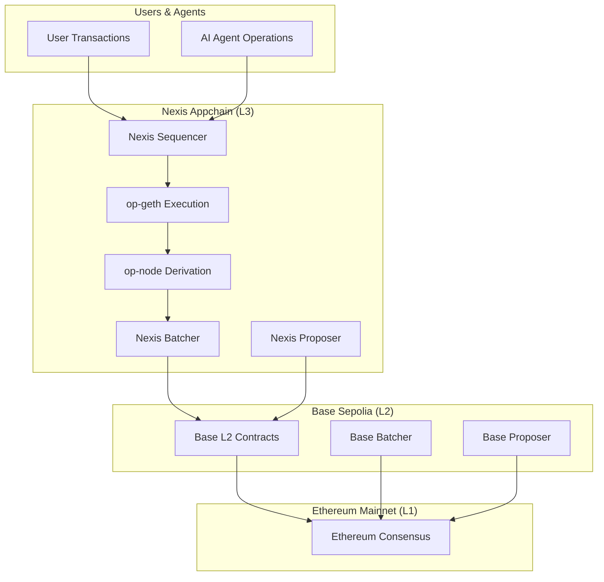
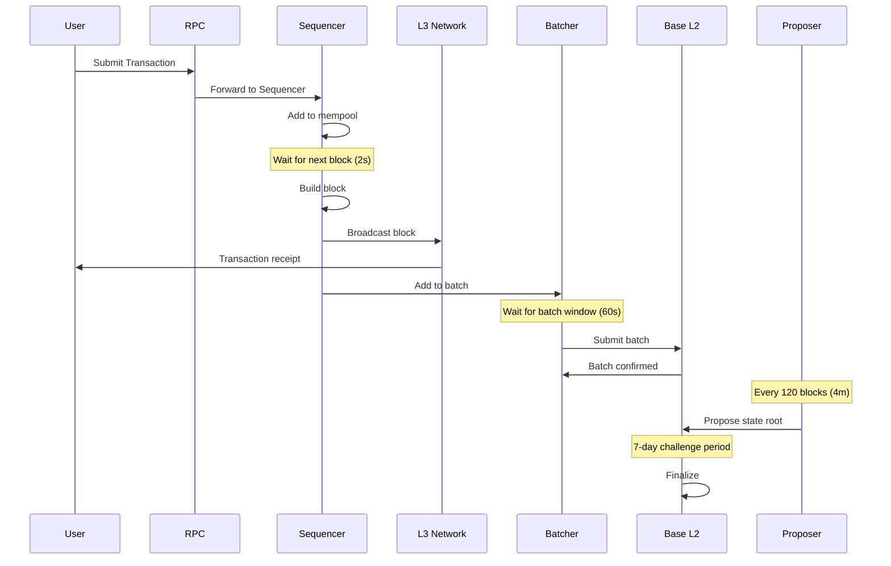
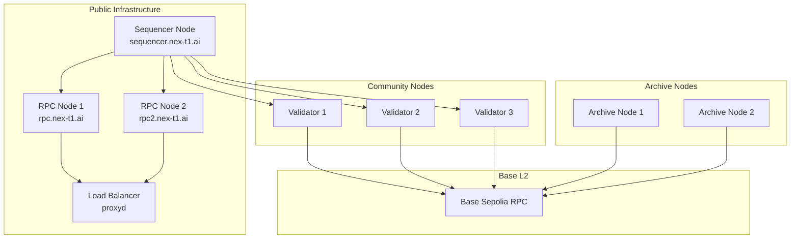

# Infrastructure Overview

Nexis Appchain is a production-grade Layer 3 blockchain built on the OP Stack, specifically optimized for AI agent coordination and verifiable inference workloads. This document provides a comprehensive overview of the technical architecture and design decisions.

## Architecture Summary

<CardGroup cols={2}>
  <Card title="Layer 3 on Base" icon="layer-group">
    Built as an OP Stack L3 on top of Base Sepolia (L2), inheriting Ethereum security
  </Card>
  <Card title="2-Second Blocks" icon="clock">
    High-throughput block production for sub-second transaction finality
  </Card>
  <Card title="Fault Proofs" icon="shield-halved">
    Permissionless validation with 73-step bisection game for security
  </Card>
  <Card title="EVM Compatible" icon="code">
    Full Ethereum compatibility - use existing tools and contracts
  </Card>
</CardGroup>

## Network Specifications

| Parameter | Value | Notes |
|-----------|-------|-------|
| **Chain ID** | 84532 | Unique identifier for the network |
| **Block Time** | 2 seconds | Consistent block production rate |
| **Gas Limit** | 30,000,000 | Per-block gas limit |
| **Base Fee** | 1 gwei | Minimum gas price (EIP-1559) |
| **L1 Settlement** | Base Sepolia | L2 that batches our L3 transactions |
| **Consensus** | OP Stack Derivation | Deterministic block derivation from L1 data |
| **Finality** | ~3-5 minutes | Until L2 batch is confirmed |

## OP Stack Layer Architecture



### Layer Responsibilities

**L1 (Ethereum Mainnet)**
- Ultimate source of truth and security
- Stores Base L2 state commitments
- Hosts Base L2 fraud proof contracts

**L2 (Base Sepolia)**
- Settles Nexis L3 transactions
- Stores L3 batched transaction data
- Provides data availability guarantees
- Runs fault proof system for L3

**L3 (Nexis Appchain)**
- Executes AI agent transactions
- Produces blocks every 2 seconds
- Optimized for high-frequency operations
- Custom smart contracts for agent coordination

## Core Components

### 1. op-geth (Execution Layer)

The execution layer is a modified version of go-ethereum (geth) with OP Stack enhancements:

```bash
# op-geth configuration
op-geth \
  --datadir=/data/nexis \
  --http \
  --http.addr=0.0.0.0 \
  --http.port=8545 \
  --http.api=eth,net,web3,debug,txpool \
  --ws \
  --ws.addr=0.0.0.0 \
  --ws.port=8546 \
  --ws.api=eth,net,web3,debug,txpool \
  --authrpc.addr=0.0.0.0 \
  --authrpc.port=8551 \
  --authrpc.jwtsecret=/data/jwt.hex \
  --rollup.sequencerhttp=https://sequencer.nex-t1.ai \
  --rollup.disabletxpoolgossip=true \
  --networkid=84532 \
  --syncmode=full \
  --gcmode=archive \
  --maxpeers=100
```

**Key Features:**
- **EVM Execution**: Processes smart contract calls and state transitions
- **Transaction Pool**: Manages pending transactions from users and agents
- **State Database**: Stores account balances, contract storage, and code
- **JSON-RPC**: Exposes Ethereum-compatible APIs for wallets and dApps
- **Archive Mode**: Optional full historical state for analytics

### 2. op-node (Consensus Layer)

The consensus layer derives L3 blocks from L2 data and manages the rollup protocol:

```bash
# op-node configuration
op-node \
  --l1=https://sepolia.base.org \
  --l2=http://localhost:8551 \
  --l2.jwt-secret=/data/jwt.hex \
  --rollup.config=/config/rollup.json \
  --rpc.addr=0.0.0.0 \
  --rpc.port=9545 \
  --p2p.listen.ip=0.0.0.0 \
  --p2p.listen.tcp=9222 \
  --p2p.listen.udp=9222 \
  --sequencer.enabled=false \
  --sequencer.l1-confs=4
```

**Responsibilities:**
- **Block Derivation**: Reconstructs L3 blocks from L2 data
- **State Synchronization**: Keeps execution layer in sync
- **P2P Networking**: Propagates blocks to other nodes
- **Rollup Protocol**: Implements OP Stack state transition logic

### 3. Sequencer

The sequencer is the privileged node that orders and batches transactions:

**Sequencer Workflow:**
1. **Receive** transactions from users via JSON-RPC
2. **Order** transactions into a canonical sequence
3. **Execute** transactions through op-geth
4. **Produce** blocks every 2 seconds
5. **Broadcast** blocks to all nodes via P2P
6. **Batch** transactions for L2 submission

```javascript Sequencer Operation
// Simplified sequencer logic
class NexisSequencer {
  async produceBlock() {
    const pendingTxs = await this.txPool.getPending();
    const orderedTxs = this.orderTransactions(pendingTxs);

    // Execute transactions
    const block = await this.opGeth.buildBlock(orderedTxs);

    // Broadcast to network
    await this.p2p.broadcastBlock(block);

    // Add to batch for L2 submission
    this.batcher.addBlock(block);

    // Produce next block in 2 seconds
    setTimeout(() => this.produceBlock(), 2000);
  }

  orderTransactions(txs) {
    // Priority ordering:
    // 1. Agent operations (staking, task claims)
    // 2. Proof submissions
    // 3. Regular transactions
    return txs.sort((a, b) => {
      if (this.isAgentOp(a) && !this.isAgentOp(b)) return -1;
      if (this.isProofSubmission(a) && !this.isProofSubmission(b)) return -1;
      return a.gasPrice - b.gasPrice;
    });
  }
}
```

### 4. Batcher

The batcher aggregates L3 transactions and submits them to Base L2 for data availability:

```go
// Batcher configuration
type BatcherConfig struct {
    L2URL              string
    L2ChainID          *big.Int
    RollupRPC          string
    MaxChannelDuration uint64  // 30 blocks
    SubSafetyMargin    uint64  // 10 blocks
    PollInterval       time.Duration
    BatchType          string // "zlib" or "none"
}

// Batch submission flow
func (b *Batcher) SubmitBatch() error {
    // 1. Collect blocks since last batch
    blocks := b.GetPendingBlocks()

    // 2. Compress transaction data
    compressed := zlib.Compress(blocks)

    // 3. Split into chunks if necessary
    chunks := b.SplitIntoChannels(compressed, MAX_CHANNEL_SIZE)

    // 4. Submit each chunk to L2
    for _, chunk := range chunks {
        tx := b.BuildBatchTx(chunk)
        receipt, err := b.l2Client.SendTransaction(tx)
        if err != nil {
            return err
        }
        log.Printf("Batch submitted: %s", receipt.TxHash)
    }

    return nil
}
```

**Batching Parameters:**
- **Channel Duration**: 30 L2 blocks (~1 minute)
- **Max Batch Size**: 128 KB per transaction
- **Compression**: Zlib for data efficiency
- **Submission Frequency**: Every ~60 seconds or when batch size reached

### 5. Proposer

The proposer submits L3 state root commitments to Base L2 for finality:

```solidity
// L2OutputOracle on Base Sepolia
interface IL2OutputOracle {
    function proposeL2Output(
        bytes32 _outputRoot,
        uint256 _l2BlockNumber,
        bytes32 _l1BlockHash,
        uint256 _l1BlockNumber
    ) external payable;
}

// Proposer submits every N blocks
function proposeOutput() external {
    // Get latest L3 state root
    bytes32 outputRoot = getL3StateRoot();
    uint256 l3BlockNumber = getL3BlockNumber();

    // Get L1 (Base) context
    bytes32 l1BlockHash = block.blockhash(block.number - 1);
    uint256 l1BlockNumber = block.number;

    // Submit to L2 Oracle
    l2OutputOracle.proposeL2Output{value: PROPOSAL_BOND}(
        outputRoot,
        l3BlockNumber,
        l1BlockHash,
        l1BlockNumber
    );
}
```

**Proposal Parameters:**
- **Frequency**: Every 120 L3 blocks (~4 minutes)
- **Bond Requirement**: 1 ETH on Base Sepolia
- **Challenge Period**: 7 days for fault proofs
- **Finalization**: After challenge period with no successful disputes

## Data Flow

### Transaction Lifecycle



### State Derivation

Any node can independently derive the canonical L3 chain from L2 data:

```python
def derive_l3_chain(l2_data_source):
    """Derive L3 blocks from L2 batches"""
    l3_chain = []

    for batch in l2_data_source.get_batches():
        # Decompress batch data
        decompressed = zlib.decompress(batch.data)

        # Parse transactions
        transactions = parse_batch_transactions(decompressed)

        # Derive blocks
        blocks = group_into_blocks(transactions, BLOCK_TIME=2)

        # Execute state transitions
        for block in blocks:
            state = execute_block(block, previous_state)
            l3_chain.append(block)
            previous_state = state

    return l3_chain
```

## Security Model

### Trust Assumptions

1. **Liveness**: Sequencer must be available (centralized currently, decentralizing soon)
2. **Data Availability**: Base L2 must store and serve batch data
3. **Fault Proofs**: At least one honest verifier must challenge invalid proposals
4. **L1 Security**: Ethereum mainnet remains secure and censorship-resistant

### Security Guarantees

- **State Validity**: Enforced by fault proofs (anyone can challenge invalid state)
- **Data Availability**: Guaranteed by Base L2 (inherits from Ethereum)
- **Censorship Resistance**: Users can force inclusion via L2 contracts
- **Finality**: Economic finality after L2 confirmation, absolute after L1 finalization

### Fault Proof System

Nexis uses the OP Stack fault proof game for security:

```
Dispute Game Flow:
1. Proposer submits state root to L2
2. Challenger notices invalid state
3. Challenger posts counter-claim bond
4. Bisection game begins (73 steps max)
5. Game narrows to single instruction
6. On-chain VM executes instruction
7. Winner receives loser's bond
```

See [Fault Proofs](/infrastructure/fault-proofs) for detailed mechanics.

## Performance Characteristics

### Throughput

| Metric | Value | Notes |
|--------|-------|-------|
| **Blocks/second** | 0.5 | One block every 2 seconds |
| **Gas/block** | 30M | Same as Ethereum mainnet |
| **Theoretical TPS** | ~1,500 | Simple transfers (21,000 gas each) |
| **Realistic TPS** | ~200-400 | Complex smart contract interactions |
| **AI Agent TPS** | ~50-100 | Proof submissions (higher gas) |

### Latency

| Operation | Latency | Notes |
|-----------|---------|-------|
| **Transaction inclusion** | < 2 seconds | Next block |
| **Soft confirmation** | ~2 seconds | Sequencer broadcast |
| **Safe confirmation** | ~4 minutes | After L2 batch + margin |
| **Finalized confirmation** | ~15 minutes | After L1 (Base) finalization |
| **Withdrawal delay** | 7 days | Challenge period |

### Cost Analysis

```javascript
// Example gas costs for common operations
const GAS_COSTS = {
  // Standard operations
  transfer: 21_000,
  erc20Transfer: 65_000,
  uniswapSwap: 150_000,

  // Nexis-specific operations
  registerAgent: 250_000,
  stakeTokens: 120_000,
  createTask: 180_000,
  claimTask: 90_000,
  submitProof: 150_000,
  attestProof: 80_000,

  // At 1 gwei base fee
  costInGwei: function(operation) {
    return this[operation];
  },

  costInETH: function(operation) {
    return (this[operation] * 1e-9).toFixed(9);
  },

  costInUSD: function(operation, ethPrice) {
    return (this[operation] * 1e-9 * ethPrice).toFixed(4);
  }
};

// Example: Register agent costs
console.log(GAS_COSTS.costInETH('registerAgent')); // 0.000250000 ETH
console.log(GAS_COSTS.costInUSD('registerAgent', 2000)); // $0.5000
```

## Network Topology



## Comparison to Other Chains

| Feature | Nexis L3 | Base L2 | Ethereum L1 | Polygon PoS |
|---------|----------|---------|-------------|-------------|
| **Block Time** | 2s | 2s | 12s | 2s |
| **Finality** | ~15min | ~15min | ~15min | ~30s |
| **Gas Cost** | 1 gwei | ~0.05 gwei | ~30 gwei | ~100 gwei |
| **Security** | Fault proofs | Fault proofs | PoS consensus | PoS consensus |
| **EVM Compatible** | ✅ | ✅ | ✅ | ✅ |
| **DA Layer** | Base L2 | Ethereum L1 | Ethereum L1 | Ethereum L1 |

## Roadmap

<Steps>
  <Step title="Phase 1: Testnet (Current)">
    Fully functional testnet with centralized sequencer
  </Step>
  <Step title="Phase 2: Mainnet Launch (Q2 2025)">
    Production deployment with decentralized validation
  </Step>
  <Step title="Phase 3: Decentralized Sequencing (Q3 2025)">
    Implement shared sequencing or leader election
  </Step>
  <Step title="Phase 4: ZK Proofs (2026)">
    Transition to ZK fault proofs for faster finality
  </Step>
</Steps>

## Learn More

<CardGroup cols={2}>
  <Card title="Consensus Mechanism" icon="cubes" href="/infrastructure/consensus">
    Deep dive into block derivation and sequencing
  </Card>
  <Card title="Fault Proofs" icon="shield-halved" href="/infrastructure/fault-proofs">
    Understand the security model and dispute resolution
  </Card>
  <Card title="Run a Node" icon="server" href="/developers/validator-node">
    Participate in the network as a validator
  </Card>
  <Card title="RPC Infrastructure" icon="network-wired" href="/infrastructure/rpc-nodes">
    Learn about the RPC architecture and endpoints
  </Card>
</CardGroup>

---

<Note>
**Want to contribute to infrastructure?** We're looking for node operators, validator runners, and infrastructure developers. Join our [Discord #infrastructure](https://discord.gg/nexis) channel.
</Note>