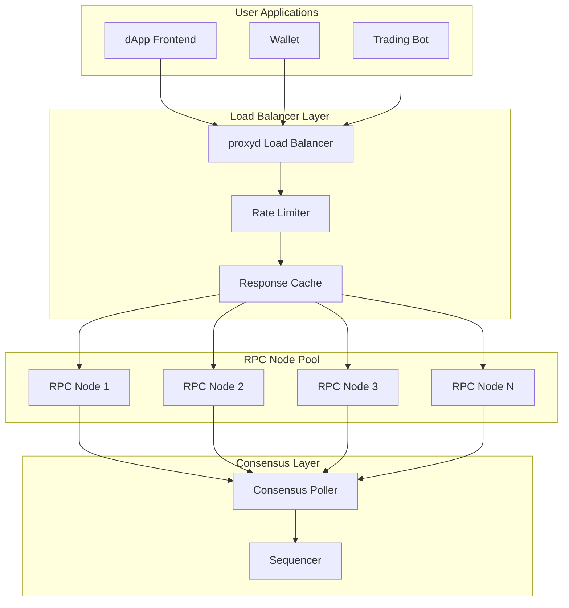

# RPC Infrastructure

Nexis Appchain provides robust RPC infrastructure for developers to interact with the network. This document covers the architecture, available endpoints, and best practices for integrating with Nexis RPC services.

## Public RPC Endpoints

<CardGroup cols={2}>
  <Card title="Mainnet RPC" icon="network-wired">
    `https://rpc.nex-t1.ai` (Coming Soon)
  </Card>
  <Card title="Testnet RPC" icon="flask">
    `https://testnet-rpc.nex-t1.ai`
  </Card>
  <Card title="WebSocket" icon="plug">
    `wss://testnet-ws.nex-t1.ai`
  </Card>
  <Card title="Rate Limits" icon="gauge-high">
    100 requests/second (free tier)
  </Card>
</CardGroup>

## Quick Start

```javascript
const { ethers } = require('ethers');

// HTTP Provider
const provider = new ethers.JsonRpcProvider('https://testnet-rpc.nex-t1.ai');

// WebSocket Provider (for subscriptions)
const wsProvider = new ethers.WebSocketProvider('wss://testnet-ws.nex-t1.ai');

// Get latest block
const blockNumber = await provider.getBlockNumber();
console.log('Latest block:', blockNumber);

// Get balance
const balance = await provider.getBalance('0x...');
console.log('Balance:', ethers.formatEther(balance));
```

## RPC Architecture



### Components

**proxyd (Load Balancer)**
- Routes requests to healthy RPC nodes
- Implements rate limiting and caching
- Provides failover and redundancy
- Monitors node health

**RPC Nodes**
- Run op-geth execution client
- Serve JSON-RPC API requests
- Maintain state database
- Sync with sequencer

**Consensus Poller**
- Ensures all nodes agree on head
- Removes inconsistent nodes from pool
- Prevents serving stale data

## proxyd Configuration

The load balancer uses proxyd, Optimism's production-grade RPC proxy:

```toml
# proxyd.toml
[server]
rpc_host = "0.0.0.0"
rpc_port = 8545
ws_host = "0.0.0.0"
ws_port = 8546
max_body_size_bytes = 10485760  # 10MB
max_concurrent_rpcs = 1000

[cache]
enabled = true
ttl = "5s"

[redis]
url = "redis://localhost:6379"

[rate_limit]
enabled = true
max_requests_per_second = 100
exemptions = ["0x1234..."] # Whitelisted addresses

[metrics]
enabled = true
host = "0.0.0.0"
port = 9090

# Backend RPC nodes
[[backends]]
rpc_url = "http://rpc1.internal:8545"
ws_url = "ws://rpc1.internal:8546"
max_retries = 3
max_response_time_seconds = 5

[[backends]]
rpc_url = "http://rpc2.internal:8545"
ws_url = "ws://rpc2.internal:8546"
max_retries = 3
max_response_time_seconds = 5

[[backends]]
rpc_url = "http://rpc3.internal:8545"
ws_url = "ws://rpc3.internal:8546"
max_retries = 3
max_response_time_seconds = 5

# Consensus configuration
[consensus]
enabled = true
poll_interval = "2s"
consensus_method = "eth_getBlockByNumber"

# Method-specific routing
[[method_mappings]]
method = "eth_call"
backend_groups = ["main"]

[[method_mappings]]
method = "eth_getLogs"
backend_groups = ["archive"]
```

## Consensus Polling

Consensus polling ensures all RPC nodes return consistent data:

### How It Works

```javascript
class ConsensusPoller {
  constructor(backends) {
    this.backends = backends;
    this.consensusBlock = 0;
  }

  async poll() {
    // Query all backends for latest block
    const blocks = await Promise.all(
      this.backends.map(b => b.getBlockNumber())
    );

    // Find consensus (majority)
    const consensus = this.findConsensus(blocks);

    // Remove non-consensus backends
    this.backends = this.backends.filter((backend, i) =>
      blocks[i] >= consensus - 1 // Allow 1 block lag
    );

    this.consensusBlock = consensus;
  }

  findConsensus(blocks) {
    // Find most common block number
    const counts = {};
    for (const block of blocks) {
      counts[block] = (counts[block] || 0) + 1;
    }

    let maxCount = 0;
    let consensusBlock = 0;

    for (const [block, count] of Object.entries(counts)) {
      if (count > maxCount) {
        maxCount = count;
        consensusBlock = parseInt(block);
      }
    }

    return consensusBlock;
  }
}

// Poll every 2 seconds
setInterval(() => poller.poll(), 2000);
```

### Consensus Requirements

For a backend to be considered "in consensus":
- Block number within 1 of consensus
- Block hash matches at consensus height
- Responds within 500ms
- No recent errors (< 1% error rate)

## Available Methods

### Standard Ethereum Methods

<AccordionGroup>
  <Accordion title="eth_* - Ethereum JSON-RPC" icon="ethereum">
```bash
# Block queries
eth_blockNumber
eth_getBlockByNumber
eth_getBlockByHash
eth_getBlockTransactionCountByNumber
eth_getBlockTransactionCountByHash

# Transaction queries
eth_getTransactionByHash
eth_getTransactionReceipt
eth_getTransactionByBlockHashAndIndex
eth_getTransactionByBlockNumberAndIndex
eth_sendRawTransaction

# State queries
eth_getBalance
eth_getCode
eth_getStorageAt
eth_call
eth_estimateGas

# Filter & logs
eth_newFilter
eth_newBlockFilter
eth_newPendingTransactionFilter
eth_getFilterChanges
eth_getFilterLogs
eth_getLogs

# Chain info
eth_chainId
eth_gasPrice
eth_feeHistory
```
  </Accordion>

  <Accordion title="net_* - Network Information" icon="network-wired">
```bash
net_version      # Network ID (84532)
net_listening    # Whether node is listening
net_peerCount    # Number of connected peers
```
  </Accordion>

  <Accordion title="web3_* - Web3 Utilities" icon="globe">
```bash
web3_clientVersion  # Client version
web3_sha3          # Keccak-256 hash
```
  </Accordion>

  <Accordion title="debug_* - Debugging (Archive Only)" icon="bug">
```bash
debug_traceTransaction
debug_traceCall
debug_traceBlockByNumber
debug_traceBlockByHash
```
  </Accordion>
</AccordionGroup>

### Optimism-Specific Methods

```bash
# Rollup info
optimism_rollupConfig      # Get rollup configuration
optimism_syncStatus        # Get sync status (unsafe/safe/finalized heads)
optimism_outputAtBlock     # Get output root at block

# Fee estimation
optimism_estimateFees      # Estimate L1 + L2 fees
optimism_getProof          # Get Merkle proof for withdrawals
```

## Usage Examples

### Get Sync Status

```javascript
const syncStatus = await provider.send('optimism_syncStatus', []);

console.log('Unsafe head:', syncStatus.unsafe_l2.number);
console.log('Safe head:', syncStatus.safe_l2.number);
console.log('Finalized head:', syncStatus.finalized_l2.number);

// Check if node is synced
const latestBlock = await provider.getBlockNumber();
const isSynced = latestBlock === syncStatus.unsafe_l2.number;
```

### Subscribe to New Blocks

```javascript
// WebSocket subscription
const wsProvider = new ethers.WebSocketProvider(
  'wss://testnet-ws.nex-t1.ai'
);

wsProvider.on('block', (blockNumber) => {
  console.log('New block:', blockNumber);
});

// Or use polling
provider.on('block', async (blockNumber) => {
  const block = await provider.getBlock(blockNumber);
  console.log('Block:', block);
});
```

### Query Event Logs

```javascript
// Get logs for a specific contract
const logs = await provider.getLogs({
  address: '0x742d35Cc6634C0532925a3b844Bc9e7595f0bEb', // Tasks contract
  fromBlock: 1000000,
  toBlock: 'latest',
  topics: [
    ethers.id('TaskCreated(uint256,address,string,uint256)') // Event signature
  ]
});

console.log('Found', logs.length, 'TaskCreated events');

// Decode logs
const iface = new ethers.Interface([
  'event TaskCreated(uint256 indexed taskId, address indexed creator, string description, uint256 reward)'
]);

for (const log of logs) {
  const decoded = iface.parseLog(log);
  console.log('Task', decoded.args.taskId, 'created with reward', decoded.args.reward);
}
```

### Estimate Gas with L1 Fees

```javascript
// Nexis transactions include L1 data costs
const tx = {
  to: '0x742d35Cc6634C0532925a3b844Bc9e7595f0bEb',
  data: tasksContract.interface.encodeFunctionData('createTask', [...args])
};

// Estimate L2 execution gas
const gasLimit = await provider.estimateGas(tx);

// Estimate total cost including L1
const feeData = await provider.getFeeData();
const l2Cost = gasLimit * feeData.gasPrice;

// L1 cost (data availability on Base)
const serializedTx = ethers.Transaction.from(tx).serialized;
const l1GasUsed = serializedTx.length * 16; // Rough estimate
const l1GasPrice = 5000000000n; // ~5 gwei on Base
const l1Cost = BigInt(l1GasUsed) * l1GasPrice;

const totalCost = l2Cost + l1Cost;
console.log('Total cost:', ethers.formatEther(totalCost), 'ETH');
```

## Rate Limits

### Free Tier

| Method Type | Limit | Notes |
|------------|-------|-------|
| **Read Methods** | 100 req/s | eth_call, eth_getBalance, etc. |
| **Write Methods** | 20 req/s | eth_sendRawTransaction |
| **Logs/Filters** | 10 req/s | eth_getLogs |
| **WebSocket** | 100 sub | Concurrent subscriptions |

### Rate Limit Headers

```bash
curl -i https://testnet-rpc.nex-t1.ai \
  -X POST \
  -H "Content-Type: application/json" \
  -d '{"jsonrpc":"2.0","method":"eth_blockNumber","params":[],"id":1}'

# Response headers:
X-RateLimit-Limit: 100
X-RateLimit-Remaining: 95
X-RateLimit-Reset: 1234567890
```

### Handle Rate Limits

```javascript
class RateLimitedProvider extends ethers.JsonRpcProvider {
  constructor(url) {
    super(url);
    this.queue = [];
    this.processing = false;
  }

  async send(method, params) {
    return new Promise((resolve, reject) => {
      this.queue.push({ method, params, resolve, reject });
      this.processQueue();
    });
  }

  async processQueue() {
    if (this.processing || this.queue.length === 0) return;

    this.processing = true;

    while (this.queue.length > 0) {
      const request = this.queue.shift();

      try {
        const result = await super.send(request.method, request.params);
        request.resolve(result);
      } catch (error) {
        if (error.code === 429) { // Rate limited
          // Re-queue request
          this.queue.unshift(request);
          // Wait before retrying
          await new Promise(r => setTimeout(r, 1000));
        } else {
          request.reject(error);
        }
      }

      // Throttle to ~10 req/s to stay under limit
      await new Promise(r => setTimeout(r, 100));
    }

    this.processing = false;
  }
}
```

## Running Your Own RPC Node

For production applications, consider running your own RPC infrastructure:

### Hardware Requirements

| Component | Minimum | Recommended |
|-----------|---------|-------------|
| **CPU** | 4 cores | 8+ cores |
| **RAM** | 16 GB | 32+ GB |
| **Storage** | 500 GB SSD | 1+ TB NVMe |
| **Network** | 100 Mbps | 1+ Gbps |

### Setup Guide

See [RPC Node Setup](/developers/rpc-node) for detailed instructions.

### Quick Start

```bash
# Clone repo
git clone https://github.com/Nexis-AI/Nexis-appchain
cd nexis-base-appchain

# Configure node
cp .env.example .env
# Edit .env with your settings

# Start RPC node
docker-compose up -d op-geth op-node

# Check sync status
curl -X POST http://localhost:8545 \
  -H "Content-Type: application/json" \
  -d '{"jsonrpc":"2.0","method":"optimism_syncStatus","params":[],"id":1}'
```

## Best Practices

### Connection Management

```javascript
// Use connection pooling
const provider = new ethers.JsonRpcProvider(
  'https://testnet-rpc.nex-t1.ai',
  {
    staticNetwork: ethers.Network.from(84532),
    batchMaxCount: 100, // Batch up to 100 requests
    batchStallTime: 10   // Wait 10ms for batching
  }
);

// Implement retries
async function withRetry(fn, maxRetries = 3) {
  for (let i = 0; i < maxRetries; i++) {
    try {
      return await fn();
    } catch (error) {
      if (i === maxRetries - 1) throw error;
      await new Promise(r => setTimeout(r, 1000 * (i + 1)));
    }
  }
}

// Use it
const balance = await withRetry(() =>
  provider.getBalance('0x...')
);
```

### Caching

```javascript
class CachedProvider extends ethers.JsonRpcProvider {
  constructor(url) {
    super(url);
    this.cache = new Map();
    this.cacheTTL = 2000; // 2 seconds
  }

  async getBlock(blockTag) {
    // Only cache historical blocks (immutable)
    if (typeof blockTag === 'number') {
      const cacheKey = `block_${blockTag}`;
      const cached = this.cache.get(cacheKey);

      if (cached && Date.now() - cached.timestamp < this.cacheTTL) {
        return cached.data;
      }

      const block = await super.getBlock(blockTag);
      this.cache.set(cacheKey, {
        data: block,
        timestamp: Date.now()
      });

      return block;
    }

    // Don't cache 'latest', 'pending', etc.
    return super.getBlock(blockTag);
  }
}
```

### Error Handling

```javascript
try {
  const receipt = await provider.getTransactionReceipt(txHash);
} catch (error) {
  if (error.code === 'TIMEOUT') {
    // RPC node is slow/overloaded
    console.error('Request timed out');
  } else if (error.code === 'SERVER_ERROR') {
    // RPC node returned error
    console.error('Server error:', error.body);
  } else if (error.code === 'NETWORK_ERROR') {
    // Network connectivity issue
    console.error('Network error:', error.message);
  } else {
    // Other error
    console.error('Unknown error:', error);
  }
}
```

## Monitoring and Metrics

### Health Check Endpoint

```bash
# Check if RPC is healthy
curl https://testnet-rpc.nex-t1.ai/health

# Response:
{
  "status": "healthy",
  "block": 1234567,
  "lag": 0,
  "peers": 25,
  "syncing": false
}
```

### Metrics

```javascript
// Track RPC performance
class RPCMetrics {
  constructor() {
    this.requestCount = 0;
    this.errorCount = 0;
    this.totalLatency = 0;
  }

  async trackRequest(fn) {
    const start = Date.now();
    this.requestCount++;

    try {
      const result = await fn();
      this.totalLatency += Date.now() - start;
      return result;
    } catch (error) {
      this.errorCount++;
      throw error;
    }
  }

  getStats() {
    return {
      totalRequests: this.requestCount,
      errors: this.errorCount,
      errorRate: this.errorCount / this.requestCount,
      avgLatency: this.totalLatency / this.requestCount
    };
  }
}

// Usage
const metrics = new RPCMetrics();

const balance = await metrics.trackRequest(() =>
  provider.getBalance('0x...')
);

console.log(metrics.getStats());
```

## Learn More

<CardGroup cols={2}>
  <Card title="Run an RPC Node" icon="server" href="/developers/rpc-node">
    Setup your own RPC infrastructure
  </Card>
  <Card title="RPC Methods" icon="code" href="/developers/rpc-calls">
    Complete API reference
  </Card>
  <Card title="Infrastructure Overview" icon="diagram-project" href="/infrastructure/overview">
    Understand the architecture
  </Card>
  <Card title="Quickstart" icon="rocket" href="/quickstart">
    Start building with RPC
  </Card>
</CardGroup>

---

<Tip>
**Need higher rate limits?** Contact us on [Discord](https://discord.gg/nexis) for enterprise plans with dedicated infrastructure.
</Tip>