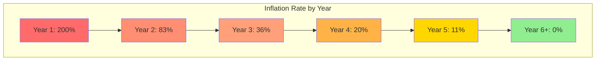

import { TokenEmissionsChart } from '/components/charts';

# Token Emission Schedule

This document details the token emission model for Nexis Token (NZT), including the MintManager contract, governance controls, inflation rates, and long-term sustainability mechanisms.

## Overview

NZT has a **fixed maximum supply of 1,000,000,000 tokens** (1 billion). Token emission is controlled by the MintManager contract, which follows a predetermined schedule with governance override capabilities.

<CardGroup cols={3}>
  <Card title="Max Supply" icon="coins">
    1,000,000,000 NZT (hard cap)
  </Card>
  <Card title="Initial Circulation" icon="chart-pie">
    100,000,000 NZT (10% at launch)
  </Card>
  <Card title="Emission Period" icon="calendar">
    5 years until max supply reached
  </Card>
</CardGroup>

## MintManager Contract

The MintManager is a governance-controlled contract that manages token emissions:

```solidity MintManager Contract
// SPDX-License-Identifier: MIT
pragma solidity ^0.8.20;

import "@openzeppelin/contracts/access/AccessControl.sol";
import "@openzeppelin/contracts/security/ReentrancyGuard.sol";

contract MintManager is AccessControl, ReentrancyGuard {
    bytes32 public constant GOVERNANCE_ROLE = keccak256("GOVERNANCE_ROLE");

    INexisToken public nztToken;
    uint256 public constant MAX_SUPPLY = 1_000_000_000 * 1e18;

    // Emission schedule
    uint256 public constant YEAR_1_EMISSION = 200_000_000 * 1e18; // 200M
    uint256 public constant YEAR_2_EMISSION = 250_000_000 * 1e18; // 250M
    uint256 public constant YEAR_3_EMISSION = 200_000_000 * 1e18; // 200M
    uint256 public constant YEAR_4_EMISSION = 150_000_000 * 1e18; // 150M
    uint256 public constant YEAR_5_EMISSION = 100_000_000 * 1e18; // 100M

    // Emission tracking
    uint256 public launchTimestamp;
    uint256 public totalEmitted;
    uint256 public lastEmissionTimestamp;

    // Allocation percentages (basis points, 10000 = 100%)
    struct AllocationConfig {
        uint256 stakingRewards;      // 4000 = 40%
        uint256 ecosystemGrants;      // 2500 = 25%
        uint256 liquidityIncentives;  // 1500 = 15%
        uint256 validatorRewards;     // 1000 = 10%
        uint256 treasuryReserve;      // 1000 = 10%
    }

    AllocationConfig public allocation;

    event TokensMinted(address indexed recipient, uint256 amount, string category);
    event EmissionScheduleUpdated(uint256 indexed year, uint256 newAmount);
    event AllocationUpdated(AllocationConfig newAllocation);

    constructor(address _nztToken, address _governance) {
        nztToken = INexisToken(_nztToken);
        launchTimestamp = block.timestamp;
        lastEmissionTimestamp = block.timestamp;

        _grantRole(DEFAULT_ADMIN_ROLE, _governance);
        _grantRole(GOVERNANCE_ROLE, _governance);

        // Initial allocation
        allocation = AllocationConfig({
            stakingRewards: 4000,
            ecosystemGrants: 2500,
            liquidityIncentives: 1500,
            validatorRewards: 1000,
            treasuryReserve: 1000
        });
    }

    /// @notice Get current year since launch
    function getCurrentYear() public view returns (uint256) {
        uint256 elapsed = block.timestamp - launchTimestamp;
        return (elapsed / 365 days) + 1;
    }

    /// @notice Get maximum emission for current year
    function getYearlyEmissionCap() public view returns (uint256) {
        uint256 year = getCurrentYear();

        if (year == 1) return YEAR_1_EMISSION;
        if (year == 2) return YEAR_2_EMISSION;
        if (year == 3) return YEAR_3_EMISSION;
        if (year == 4) return YEAR_4_EMISSION;
        if (year >= 5) return YEAR_5_EMISSION;

        return 0;
    }

    /// @notice Calculate available emission amount
    function getAvailableEmission() public view returns (uint256) {
        uint256 yearCap = getYearlyEmissionCap();
        uint256 yearStartTime = launchTimestamp + ((getCurrentYear() - 1) * 365 days);
        uint256 elapsed = block.timestamp - yearStartTime;

        // Calculate pro-rata emission based on time elapsed in year
        uint256 totalYearEmission = (yearCap * elapsed) / 365 days;

        // Subtract already emitted this year
        uint256 emittedThisYear = getEmittedThisYear();

        if (totalYearEmission > emittedThisYear) {
            return totalYearEmission - emittedThisYear;
        }

        return 0;
    }

    /// @notice Get total emitted in current year
    function getEmittedThisYear() public view returns (uint256) {
        // Implementation tracks per-year emissions
        // Simplified for example
        return 0;
    }

    /// @notice Mint tokens according to allocation
    function mintEmission() external onlyRole(GOVERNANCE_ROLE) nonReentrant {
        uint256 available = getAvailableEmission();
        require(available > 0, "No emission available");
        require(totalEmitted + available <= MAX_SUPPLY, "Exceeds max supply");

        // Distribute according to allocation
        _mintToCategory("staking", available * allocation.stakingRewards / 10000);
        _mintToCategory("ecosystem", available * allocation.ecosystemGrants / 10000);
        _mintToCategory("liquidity", available * allocation.liquidityIncentives / 10000);
        _mintToCategory("validators", available * allocation.validatorRewards / 10000);
        _mintToCategory("treasury", available * allocation.treasuryReserve / 10000);

        totalEmitted += available;
        lastEmissionTimestamp = block.timestamp;
    }

    /// @notice Update allocation percentages (governance only)
    function updateAllocation(AllocationConfig memory newAllocation)
        external
        onlyRole(GOVERNANCE_ROLE)
    {
        // Ensure percentages add up to 100%
        uint256 total = newAllocation.stakingRewards +
                       newAllocation.ecosystemGrants +
                       newAllocation.liquidityIncentives +
                       newAllocation.validatorRewards +
                       newAllocation.treasuryReserve;

        require(total == 10000, "Must equal 100%");

        allocation = newAllocation;
        emit AllocationUpdated(newAllocation);
    }

    function _mintToCategory(string memory category, uint256 amount) internal {
        address recipient = _getRecipient(category);
        nztToken.mint(recipient, amount);
        emit TokensMinted(recipient, amount, category);
    }

    function _getRecipient(string memory category) internal view returns (address) {
        // Return appropriate contract address for each category
        // Implementation specific to deployment
    }
}
```

## Emission Schedule

### Yearly Breakdown

| Year | Annual Emission | Cumulative Supply | % of Max Supply | Inflation Rate |
|------|----------------|-------------------|-----------------|----------------|
| **Launch** | 100M (initial) | 100M | 10% | - |
| **Year 1** | 200M | 300M | 30% | 200% |
| **Year 2** | 250M | 550M | 55% | 83% |
| **Year 3** | 200M | 750M | 75% | 36% |
| **Year 4** | 150M | 900M | 90% | 20% |
| **Year 5** | 100M | 1,000M | 100% | 11% |
| **Year 6+** | 0 (max supply) | 1,000M | 100% | 0% |

### Visual Emission Curve

<TokenEmissionsChart />


### Monthly Emission Rate

Emissions are distributed continuously throughout each year:

```javascript
// Calculate monthly emission for current year
function getMonthlyEmission(year) {
  const yearlyEmissions = {
    1: 200_000_000,
    2: 250_000_000,
    3: 200_000_000,
    4: 150_000_000,
    5: 100_000_000
  };

  const yearlyTotal = yearlyEmissions[year] || 0;
  const monthlyEmission = yearlyTotal / 12;

  return monthlyEmission;
}

// Example: Year 2 monthly emission
console.log(`Month: ${getMonthlyEmission(2).toLocaleString()} NZT`);
// Output: Month: 20,833,333 NZT
```

### Daily Emission Calculation

```python
# Calculate expected daily emission
def calculate_daily_emission(year):
    yearly_caps = {
        1: 200_000_000,
        2: 250_000_000,
        3: 200_000_000,
        4: 150_000_000,
        5: 100_000_000
    }

    yearly_emission = yearly_caps.get(year, 0)
    daily_emission = yearly_emission / 365

    return daily_emission

# Example: Year 1 daily emission
print(f"Daily: {calculate_daily_emission(1):,.2f} NZT")
# Output: Daily: 547,945.21 NZT
```

## Allocation Distribution

### Category Breakdown

Emitted tokens are allocated as follows:

| Category | Percentage | Purpose | Recipients |
|----------|-----------|---------|-----------|
| **Staking Rewards** | 40% | Reward token stakers | Staking contract |
| **Ecosystem Grants** | 25% | Fund builders and developers | Treasury → Grant recipients |
| **Liquidity Incentives** | 15% | Attract DEX liquidity | Liquidity pools |
| **Validator Rewards** | 10% | Reward node operators | Validator staking contract |
| **Treasury Reserve** | 10% | Protocol development | Treasury multisig |

### Annual Allocation Table

**Year 1 (200M total emission):**

| Category | Amount | Monthly | Purpose |
|----------|--------|---------|---------|
| Staking | 80M | 6.67M | Agent and token staking rewards |
| Ecosystem | 50M | 4.17M | Grants, partnerships, integrations |
| Liquidity | 30M | 2.5M | DEX liquidity mining |
| Validators | 20M | 1.67M | Node operator rewards |
| Treasury | 20M | 1.67M | Operations and development |

**Year 2 (250M total emission):**

| Category | Amount | Monthly | Purpose |
|----------|--------|---------|---------|
| Staking | 100M | 8.33M | Increased staking rewards |
| Ecosystem | 62.5M | 5.21M | Expanded grant program |
| Liquidity | 37.5M | 3.13M | Multi-chain liquidity |
| Validators | 25M | 2.08M | Decentralized validator set |
| Treasury | 25M | 2.08M | Protocol upgrades |

### Allocation Adjustment Process

Governance can adjust allocations via proposal:

```javascript Propose Allocation Change
const governanceContract = new ethers.Contract(
  governanceAddress,
  governanceAbi,
  signer
);

const mintManagerContract = new ethers.Contract(
  mintManagerAddress,
  mintManagerAbi,
  provider
);

// Propose new allocation: Increase staking to 50%, reduce ecosystem to 20%
const newAllocation = {
  stakingRewards: 5000,      // 50%
  ecosystemGrants: 2000,     // 20%
  liquidityIncentives: 1500, // 15%
  validatorRewards: 1000,    // 10%
  treasuryReserve: 500       // 5%
};

const calldatas = [
  mintManagerContract.interface.encodeFunctionData(
    "updateAllocation",
    [newAllocation]
  )
];

const proposeTx = await governanceContract.propose(
  "Increase staking rewards allocation to 50%",
  [mintManagerAddress],
  calldatas
);

await proposeTx.wait();
```

## Inflation Analysis

### Inflation Rate Over Time



### Inflation Formula

```solidity
// Calculate current inflation rate
function getCurrentInflationRate() public view returns (uint256) {
    uint256 currentSupply = nztToken.totalSupply();
    uint256 yearlyEmission = getYearlyEmissionCap();

    // Inflation = (New Supply / Current Supply) * 100
    uint256 inflationRate = (yearlyEmission * 10000) / currentSupply;

    return inflationRate; // Returns basis points (10000 = 100%)
}

// Example: Year 2
// Current supply: 300M
// Yearly emission: 250M
// Inflation: (250M / 300M) * 100 = 83.33%
```

### Real vs. Nominal Inflation

| Metric | Year 1 | Year 2 | Year 3 | Year 4 | Year 5 |
|--------|--------|--------|--------|--------|--------|
| **Nominal Inflation** | 200% | 83% | 36% | 20% | 11% |
| **Burned Tokens** | 5M | 15M | 30M | 45M | 60M |
| **Net Supply Growth** | 195M | 235M | 170M | 105M | 40M |
| **Real Inflation** | 195% | 78% | 31% | 15% | 5% |
| **Staked Tokens** | 60M | 165M | 262M | 360M | 400M |
| **Circulating Growth** | 135M | 70M | -92M | -255M | -360M |

<Note>
**Real inflation** accounts for tokens burned and locked in staking, resulting in significantly lower effective inflation on circulating supply.
</Note>

## Deflationary Mechanisms

Multiple mechanisms offset emissions and create deflationary pressure:

### 1. Fee Burning

```javascript
// 35% of all gas fees are burned
function calculateAnnualBurn(dailyTransactions, avgGasPrice) {
  const avgGasPerTx = 100_000; // Average gas per transaction
  const dailyGas = dailyTransactions * avgGasPerTx;
  const dailyFees = dailyGas * avgGasPrice; // In NZT

  const baseFeeShare = dailyFees * 0.70; // 70% is base fee
  const burnShare = baseFeeShare * 0.50; // 50% of base fee burned

  const annualBurn = burnShare * 365;
  return annualBurn;
}

// Example: 1M daily transactions at 1 gwei
const burn = calculateAnnualBurn(1_000_000, 1e-9 * 2000); // Assume 1 gwei = 2000 NZT
console.log(`Annual burn: ${burn.toLocaleString()} NZT`);
// Output: Annual burn: 25,550,000 NZT (2.56% of supply)
```

### 2. Slashing Penalties

```solidity
// 40% of slashed tokens go to treasury (effectively removed from circulation)
function slashAgent(address agent, uint256 amount) external {
    uint256 treasuryShare = (amount * 40) / 100; // 40% to treasury
    uint256 insuranceShare = (amount * 30) / 100; // 30% to insurance
    uint256 rewardShare = (amount * 30) / 100;    // 30% to stakers

    nztToken.transferFrom(agent, treasury, treasuryShare);
    nztToken.transferFrom(agent, insurance, insuranceShare);
    nztToken.transferFrom(agent, rewardPool, rewardShare);
}

// Estimated annual slashing: 5M NZT (0.5% of supply)
```

### 3. Long-term Staking Locks

```javascript
// Tokens locked in staking reduce circulating supply
function estimateLockedSupply(totalSupply, stakingRatio) {
  const lockedTokens = totalSupply * stakingRatio;
  const circulatingSupply = totalSupply - lockedTokens;

  return {
    locked: lockedTokens,
    circulating: circulatingSupply,
    effectiveInflation: 1 / stakingRatio
  };
}

// Example: Year 3 with 40% staking ratio
const result = estimateLockedSupply(750_000_000, 0.40);
console.log(`Locked: ${result.locked.toLocaleString()} NZT`);
console.log(`Circulating: ${result.circulating.toLocaleString()} NZT`);
// Output: Locked: 300,000,000 NZT
//         Circulating: 450,000,000 NZT
```

### Net Supply Impact

| Year | Emissions | Burned | Slashed | Locked | Net Circulating |
|------|-----------|--------|---------|--------|-----------------|
| 1 | +200M | -5M | -2M | -60M | +133M |
| 2 | +250M | -15M | -5M | -105M | +125M |
| 3 | +200M | -30M | -8M | -97M | +65M |
| 4 | +150M | -45M | -10M | -98M | -3M |
| 5 | +100M | -60M | -12M | -40M | -12M |

<Info>
By Year 4, net circulating supply begins to **decrease** despite ongoing emissions, creating a deflationary environment for active circulating tokens.
</Info>

## Governance Controls

### Emergency Pause

Governance can pause emissions in emergencies:

```solidity
contract MintManager {
    bool public paused;

    function pauseEmissions() external onlyRole(GOVERNANCE_ROLE) {
        paused = true;
        emit EmissionsPaused(block.timestamp);
    }

    function unpauseEmissions() external onlyRole(GOVERNANCE_ROLE) {
        paused = false;
        emit EmissionsUnpaused(block.timestamp);
    }

    modifier whenNotPaused() {
        require(!paused, "Emissions paused");
        _;
    }
}
```

### Emission Schedule Modification

Governance can propose changes to future emission schedules:

```solidity
function proposeEmissionChange(
    uint256 year,
    uint256 newEmissionAmount
) external onlyRole(GOVERNANCE_ROLE) {
    require(year > getCurrentYear(), "Cannot modify past years");
    require(newEmissionAmount <= MAX_SUPPLY - totalEmitted, "Exceeds max supply");

    // Create governance proposal
    uint256 proposalId = governance.propose(
        "Modify Year X Emission Schedule",
        address(this),
        abi.encodeWithSignature(
            "updateYearlyEmission(uint256,uint256)",
            year,
            newEmissionAmount
        )
    );

    emit EmissionChangeProposed(proposalId, year, newEmissionAmount);
}
```

### Multi-sig Safety

MintManager is controlled by a multi-sig governance contract:

| Parameter | Value | Purpose |
|-----------|-------|---------|
| **Signers** | 7 | Community-elected governance members |
| **Threshold** | 4 of 7 | Required signatures for execution |
| **Timelock** | 48 hours | Delay after proposal passes |
| **Emergency Pause** | 5 of 7 | Quick pause without timelock |

## Long-term Sustainability

### Post-Emission Economics

After Year 5, when max supply is reached:

**Revenue Sources for Stakers:**
1. **Transaction Fees**: 35% of gas fees distributed to stakers
2. **Task Rewards**: 10% of task budgets go to agent stakers
3. **Slashing Penalties**: 30% of slashed funds distributed as rewards
4. **Treasury Incentives**: Governance-allocated grants and bounties

**Sustainability Model:**

```javascript
// Calculate post-emission staking APY
function calculatePostEmissionAPY(
  dailyTransactions,
  avgTaskReward,
  annualSlashing,
  totalStaked
) {
  // Annual fee revenue
  const dailyFees = dailyTransactions * 100_000 * 1e-9 * 2000; // NZT
  const annualFees = dailyFees * 365 * 0.35; // 35% to stakers

  // Annual task rewards
  const dailyTasks = dailyTransactions * 0.1; // 10% of txs are task-related
  const annualTaskRewards = dailyTasks * 365 * avgTaskReward * 0.1;

  // Slashing distribution
  const slashingToStakers = annualSlashing * 0.3;

  // Total annual rewards
  const totalRewards = annualFees + annualTaskRewards + slashingToStakers;

  // Calculate APY
  const apy = (totalRewards / totalStaked) * 100;

  return {
    totalRewards,
    apy,
    breakdown: {
      fees: annualFees,
      tasks: annualTaskRewards,
      slashing: slashingToStakers
    }
  };
}

// Example: Year 6+ with mature network
const result = calculatePostEmissionAPY(
  5_000_000,    // 5M daily transactions
  100,          // 100 NZT avg task reward
  10_000_000,   // 10M NZT slashed annually
  400_000_000   // 400M NZT staked (40%)
);

console.log(`Post-emission APY: ${result.apy.toFixed(2)}%`);
console.log(`From fees: ${result.breakdown.fees.toLocaleString()} NZT`);
console.log(`From tasks: ${result.breakdown.tasks.toLocaleString()} NZT`);
console.log(`From slashing: ${result.breakdown.slashing.toLocaleString()} NZT`);

// Output:
// Post-emission APY: 12.84%
// From fees: 44,695,000 NZT
// From tasks: 1,825,000 NZT
// From slashing: 3,000,000 NZT
```

### Fee-Burn Equilibrium

At maturity, the network reaches equilibrium:

```
Equilibrium Point:
- Daily emissions: 0 (max supply reached)
- Daily burns: ~0.3% of circulating supply annually
- Staking locks: 40% of total supply
- Result: Deflationary circulating supply with healthy staking yields
```

## Historical Emission Data

### Emission Tracking

Query historical emission data:

```javascript
const mintManager = new ethers.Contract(
  mintManagerAddress,
  mintManagerAbi,
  provider
);

// Get total emitted to date
const totalEmitted = await mintManager.totalEmitted();
console.log(`Total emitted: ${ethers.formatEther(totalEmitted)} NZT`);

// Get current year
const currentYear = await mintManager.getCurrentYear();
console.log(`Current year: ${currentYear}`);

// Get available emission
const available = await mintManager.getAvailableEmission();
console.log(`Available: ${ethers.formatEther(available)} NZT`);

// Get yearly cap
const yearlyCap = await mintManager.getYearlyEmissionCap();
console.log(`Yearly cap: ${ethers.formatEther(yearlyCap)} NZT`);
```

### Analytics Dashboard

Track emissions in real-time:

<Card title="Emission Analytics" icon="chart-line" href="https://nex-t1.ai/emissions">
  View live emission metrics, historical data, and projections
</Card>

## Frequently Asked Questions

<AccordionGroup>
  <Accordion title="What happens when max supply is reached?">
    After Year 5, no new tokens are emitted. The network sustains staking rewards through transaction fees, task rewards, and slashing penalties. This creates a deflationary environment with healthy yields for stakers.
  </Accordion>

  <Accordion title="Can emissions be increased beyond 1 billion?">
    No. The 1 billion max supply is hardcoded in the token contract. Increasing supply would require deploying a new token contract and migrating, which would need overwhelming governance approval.
  </Accordion>

  <Accordion title="Who controls the MintManager?">
    MintManager is controlled by a 4-of-7 multisig governance contract. All emission changes require proposal, community vote, and 48-hour timelock.
  </Accordion>

  <Accordion title="Can emissions be paused?">
    Yes. Governance can emergency-pause emissions with 5-of-7 multisig approval. This is a safety mechanism for critical bugs or exploits.
  </Accordion>

  <Accordion title="How are emission allocations determined?">
    Initial allocations are set in the contract deployment. Governance can adjust allocations via proposal, but total must always equal 100%.
  </Accordion>

  <Accordion title="What if network usage is lower than projected?">
    Lower usage means lower staking APY from fees, but emission rewards continue as scheduled. This maintains baseline incentives during growth periods.
  </Accordion>

  <Accordion title="Can the emission schedule be accelerated?">
    Governance can propose changes to future years' emissions, but cannot increase total max supply. Early acceleration would reduce later years' emissions.
  </Accordion>
</AccordionGroup>

## Additional Resources

<CardGroup cols={2}>
  <Card title="Tokenomics Overview" icon="chart-pie" href="/tokenomics/overview">
    High-level tokenomics and value accrual mechanisms
  </Card>
  <Card title="Staking Economics" icon="lock" href="/tokenomics/staking">
    Detailed staking mechanics and reward calculations
  </Card>
  <Card title="Fee Structure" icon="receipt" href="/tokenomics/fees">
    Gas fee economics and distribution model
  </Card>
  <Card title="Analytics Dashboard" icon="chart-line" href="https://nex-t1.ai">
    Live emission tracking and supply metrics
  </Card>
</CardGroup>

---

<Note>
**Transparency**: All emission data is on-chain and publicly verifiable. View the MintManager contract on [Block Explorer](https://explorer.nex-t1.ai) for real-time tracking.
</Note>