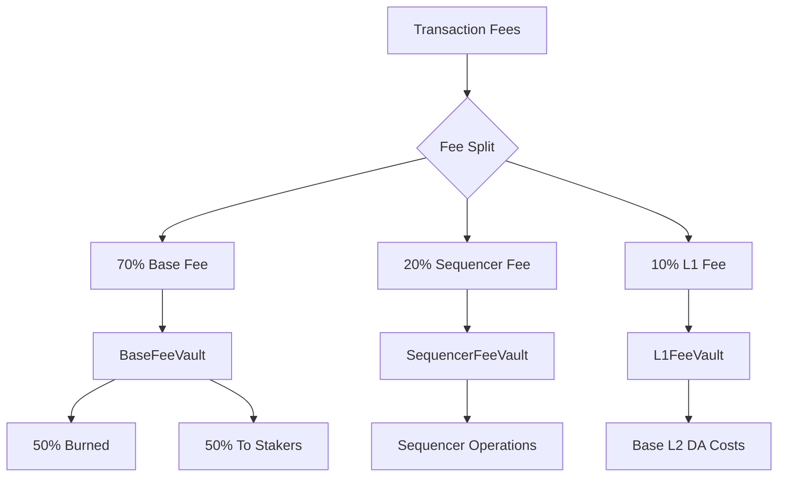

import { FeeDistributionChart, PerformanceBenchmarkChart } from '/components/charts';

# Fee Structure & Economics

Nexis Appchain implements a sophisticated fee structure based on EIP-1559, optimized for low-cost AI agent operations while maintaining economic sustainability and security.

## Overview

<CardGroup cols={3}>
  <Card title="Base Fee" icon="gas-pump">
    1 gwei minimum (adjustable)
  </Card>
  <Card title="EIP-1559" icon="chart-line">
    Dynamic fee market with priority tips
  </Card>
  <Card title="Multi-Vault" icon="vault">
    3-vault system for fee distribution
  </Card>
</CardGroup>

## EIP-1559 Implementation

### Fee Components

Every transaction on Nexis has two fee components:

```javascript
Total Fee = (Base Fee + Priority Fee) × Gas Used
```

**1. Base Fee**
- Minimum: 1 gwei
- Dynamic: Adjusts based on block utilization
- Target: 50% block capacity (15M gas)
- Burned/Redistributed: 70% of base fee

**2. Priority Fee (Tip)**
- Minimum: 0 gwei
- User-defined: Higher tips = faster inclusion
- Recipient: 100% to sequencer
- Typical: 0-2 gwei for normal priority

### Base Fee Adjustment

```solidity Base Fee Calculation
contract FeeManager {
    uint256 public constant BASE_FEE_MIN = 1 gwei;
    uint256 public constant BASE_FEE_MAX = 100 gwei;
    uint256 public constant TARGET_GAS_PER_BLOCK = 15_000_000;
    uint256 public constant MAX_GAS_PER_BLOCK = 30_000_000;

    uint256 public baseFee = 1 gwei;

    /// @notice Update base fee based on previous block usage
    /// @param gasUsed Gas used in previous block
    function updateBaseFee(uint256 gasUsed) external {
        if (gasUsed > TARGET_GAS_PER_BLOCK) {
            // Increase base fee by 12.5% per block above target
            uint256 increase = (baseFee * (gasUsed - TARGET_GAS_PER_BLOCK)) /
                              TARGET_GAS_PER_BLOCK / 8;
            baseFee = min(baseFee + increase, BASE_FEE_MAX);
        } else if (gasUsed < TARGET_GAS_PER_BLOCK) {
            // Decrease base fee by 12.5% per block below target
            uint256 decrease = (baseFee * (TARGET_GAS_PER_BLOCK - gasUsed)) /
                              TARGET_GAS_PER_BLOCK / 8;
            baseFee = max(baseFee - decrease, BASE_FEE_MIN);
        }
    }

    /// @notice Calculate transaction cost
    function calculateTxCost(
        uint256 gasUsed,
        uint256 priorityFee
    ) public view returns (uint256) {
        return gasUsed * (baseFee + priorityFee);
    }
}
```

### Fee Estimation

<CodeGroup>

```javascript ethers.js
const provider = new ethers.JsonRpcProvider('https://rpc.nex-t1.ai');

// Get current fee data
const feeData = await provider.getFeeData();
console.log(`Base Fee: ${ethers.formatUnits(feeData.gasPrice, 'gwei')} gwei`);
console.log(`Max Fee: ${ethers.formatUnits(feeData.maxFeePerGas, 'gwei')} gwei`);
console.log(`Priority Fee: ${ethers.formatUnits(feeData.maxPriorityFeePerGas, 'gwei')} gwei`);

// Estimate transaction cost
const gasEstimate = await provider.estimateGas({
  from: senderAddress,
  to: recipientAddress,
  value: ethers.parseEther("1.0")
});

const baseFee = feeData.gasPrice;
const priorityFee = feeData.maxPriorityFeePerGas || 0n;
const totalCost = gasEstimate * (baseFee + priorityFee);

console.log(`Gas Estimate: ${gasEstimate.toString()}`);
console.log(`Total Cost: ${ethers.formatEther(totalCost)} NZT`);
```

```python Web3.py
from web3 import Web3

w3 = Web3(Web3.HTTPProvider('https://rpc.nex-t1.ai'))

# Get current base fee
latest_block = w3.eth.get_block('latest')
base_fee = latest_block['baseFeePerGas']
print(f"Base Fee: {w3.from_wei(base_fee, 'gwei')} gwei")

# Estimate gas for transaction
gas_estimate = w3.eth.estimate_gas({
    'from': sender_address,
    'to': recipient_address,
    'value': w3.to_wei(1, 'ether')
})

# Calculate total cost (base fee + priority fee)
priority_fee = w3.to_wei(1, 'gwei')  # 1 gwei priority
total_fee = gas_estimate * (base_fee + priority_fee)

print(f"Gas Estimate: {gas_estimate}")
print(f"Total Cost: {w3.from_wei(total_fee, 'ether')} NZT")
```

```bash cURL
# Get current gas price
curl -X POST https://rpc.nex-t1.ai \
  -H "Content-Type: application/json" \
  -d '{
    "jsonrpc": "2.0",
    "method": "eth_gasPrice",
    "params": [],
    "id": 1
  }'

# Response: {"jsonrpc":"2.0","id":1,"result":"0x3b9aca00"} // 1 gwei

# Estimate gas for transaction
curl -X POST https://rpc.nex-t1.ai \
  -H "Content-Type: application/json" \
  -d '{
    "jsonrpc": "2.0",
    "method": "eth_estimateGas",
    "params": [{
      "from": "0xYOUR_ADDRESS",
      "to": "0xRECIPIENT_ADDRESS",
      "value": "0xde0b6b3a7640000"
    }],
    "id": 2
  }'
```

</CodeGroup>

## Fee Vault System

Nexis implements a three-vault system for fee distribution:

<FeeDistributionChart />



### 1. BaseFeeVault

The BaseFeeVault receives 70% of all transaction fees:

```solidity BaseFeeVault Contract
contract BaseFeeVault {
    address public constant BURN_ADDRESS = 0x000000000000000000000000000000000000dEaD;
    address public stakingContract;

    uint256 public constant BURN_PERCENTAGE = 50; // 50%
    uint256 public constant STAKING_PERCENTAGE = 50; // 50%

    uint256 public totalCollected;
    uint256 public totalBurned;
    uint256 public totalDistributed;

    event FeesCollected(uint256 amount);
    event FeesBurned(uint256 amount);
    event FeesDistributed(uint256 amount);

    /// @notice Distribute accumulated fees
    function distribute() external {
        uint256 balance = address(this).balance;
        require(balance > 0, "No fees to distribute");

        uint256 burnAmount = (balance * BURN_PERCENTAGE) / 100;
        uint256 stakingAmount = balance - burnAmount;

        // Burn 50%
        (bool burnSuccess,) = BURN_ADDRESS.call{value: burnAmount}("");
        require(burnSuccess, "Burn failed");
        totalBurned += burnAmount;

        // Send 50% to staking contract
        (bool stakingSuccess,) = stakingContract.call{value: stakingAmount}("");
        require(stakingSuccess, "Staking transfer failed");
        totalDistributed += stakingAmount;

        emit FeesBurned(burnAmount);
        emit FeesDistributed(stakingAmount);
    }

    /// @notice Receive fees from block production
    receive() external payable {
        totalCollected += msg.value;
        emit FeesCollected(msg.value);
    }
}
```

**Distribution Breakdown:**
- **50% Burned**: Permanently removed from circulation → deflationary pressure
- **50% Staking Rewards**: Distributed to NZT stakers → yield generation

### 2. SequencerFeeVault

Receives 20% of fees to fund sequencer operations:

```solidity SequencerFeeVault Contract
contract SequencerFeeVault {
    address public sequencerOperator;
    uint256 public withdrawalThreshold = 10 ether; // 10 NZT

    event SequencerWithdrawal(address indexed operator, uint256 amount);

    /// @notice Withdraw fees for sequencer operations
    function withdraw() external {
        require(msg.sender == sequencerOperator, "Not sequencer");
        require(address(this).balance >= withdrawalThreshold, "Below threshold");

        uint256 amount = address(this).balance;
        (bool success,) = sequencerOperator.call{value: amount}("");
        require(success, "Withdrawal failed");

        emit SequencerWithdrawal(sequencerOperator, amount);
    }

    receive() external payable {}
}
```

**Usage:**
- Infrastructure costs (servers, bandwidth)
- Monitoring and maintenance
- Emergency reserves
- Future decentralized sequencer rewards

### 3. L1FeeVault

Receives 10% to cover Base L2 data availability costs:

```solidity L1FeeVault Contract
contract L1FeeVault {
    address public batcherAddress;

    event L1CostsCovered(uint256 amount, bytes32 batchHash);

    /// @notice Pay for L2 batch submission
    function coverL1Costs(bytes32 batchHash, uint256 amount) external {
        require(msg.sender == batcherAddress, "Not batcher");
        require(address(this).balance >= amount, "Insufficient balance");

        (bool success,) = batcherAddress.call{value: amount}("");
        require(success, "Payment failed");

        emit L1CostsCovered(amount, batchHash);
    }

    receive() external payable {}
}
```

**Purpose:**
- Pay for batch submission to Base L2
- Cover calldata costs on Base
- Buffer for gas price spikes
- Ensure data availability

## L1 Data Availability Costs

Nexis batches transactions and posts them to Base L2 for data availability. This incurs costs:

### Cost Calculation

```javascript
function calculateL1Cost(
  batchSize,        // Bytes in batch
  baseL2GasPrice,   // Base L2 gas price (wei)
  calldataGas       // 16 gas per non-zero byte
) {
  // L1 gas = calldata cost
  const l1Gas = batchSize * calldataGas;

  // L1 cost in Base L2 native token (ETH)
  const l1CostETH = l1Gas * baseL2GasPrice;

  // Convert to NZT equivalent
  const ethToNztRate = 2000; // 1 ETH = 2000 NZT
  const l1CostNZT = l1CostETH * ethToNztRate;

  return {
    l1Gas,
    l1CostETH,
    l1CostNZT,
    costPerTx: l1CostNZT / (batchSize / 200) // Assume 200 bytes per tx
  };
}

// Example: 100 KB batch at 1 gwei Base L2 gas price
const result = calculateL1Cost(
  100_000,   // 100 KB
  1e9,       // 1 gwei
  16         // Calldata gas per byte
);

console.log(`L1 Gas: ${result.l1Gas.toLocaleString()}`);
console.log(`L1 Cost: ${result.l1CostETH} ETH`);
console.log(`L1 Cost: ${result.l1CostNZT.toLocaleString()} NZT`);
console.log(`Cost per tx: ${result.costPerTx.toFixed(6)} NZT`);

// Output:
// L1 Gas: 1,600,000
// L1 Cost: 0.0016 ETH
// L1 Cost: 3,200 NZT
// Cost per tx: 6.4 NZT
```

### Batch Optimization

```python
# Optimize batch size for cost efficiency
def optimize_batch(tx_count, avg_tx_size, base_l2_gas_price):
    """
    Calculate optimal batch size considering:
    - Calldata costs on Base L2
    - Batch submission overhead
    - Transaction inclusion delay
    """
    batch_size = tx_count * avg_tx_size
    calldata_cost = batch_size * 16 * base_l2_gas_price

    # Add overhead for batch header, proof, etc.
    overhead = 500 * base_l2_gas_price

    total_cost = calldata_cost + overhead
    cost_per_tx = total_cost / tx_count

    return {
        'batch_size_bytes': batch_size,
        'total_l1_cost': total_cost,
        'cost_per_tx': cost_per_tx,
        'efficiency': tx_count / (batch_size / 1000)  # txs per KB
    }

# Example: Optimize for 1000 transactions
result = optimize_batch(
    tx_count=1000,
    avg_tx_size=200,
    base_l2_gas_price=1e9  # 1 gwei
)

print(f"Batch size: {result['batch_size_bytes']:,} bytes")
print(f"Total L1 cost: {result['total_l1_cost']:.6f} ETH")
print(f"Cost per tx: {result['cost_per_tx']:.9f} ETH")
print(f"Efficiency: {result['efficiency']:.2f} txs/KB")
```

## Gas Costs by Operation

### Standard Operations

| Operation | Gas Cost | At 1 gwei | At 10 gwei | USD (@ $2000/ETH) |
|-----------|----------|-----------|------------|-------------------|
| **ETH Transfer** | 21,000 | 0.000021 NZT | 0.00021 NZT | $0.000042 |
| **ERC-20 Transfer** | 65,000 | 0.000065 NZT | 0.00065 NZT | $0.00013 |
| **ERC-721 Mint** | 100,000 | 0.0001 NZT | 0.001 NZT | $0.0002 |
| **Uniswap Swap** | 150,000 | 0.00015 NZT | 0.0015 NZT | $0.0003 |

### Nexis-Specific Operations

| Operation | Gas Cost | At 1 gwei | At 10 gwei | USD (@ $2000/ETH) |
|-----------|----------|-----------|------------|-------------------|
| **Register Agent** | 250,000 | 0.00025 NZT | 0.0025 NZT | $0.0005 |
| **Stake Tokens** | 120,000 | 0.00012 NZT | 0.0012 NZT | $0.00024 |
| **Create Task** | 180,000 | 0.00018 NZT | 0.0018 NZT | $0.00036 |
| **Claim Task** | 90,000 | 0.00009 NZT | 0.0009 NZT | $0.00018 |
| **Submit Proof** | 150,000 | 0.00015 NZT | 0.0015 NZT | $0.0003 |
| **Attest Proof** | 80,000 | 0.00008 NZT | 0.0008 NZT | $0.00016 |
| **Delegate Stake** | 100,000 | 0.0001 NZT | 0.001 NZT | $0.0002 |
| **Unstake Request** | 95,000 | 0.000095 NZT | 0.00095 NZT | $0.00019 |

### Gas Cost Calculator

```javascript
class GasCostCalculator {
  constructor(baseFee, priorityFee, nztToUSD) {
    this.baseFee = baseFee;        // in gwei
    this.priorityFee = priorityFee; // in gwei
    this.nztToUSD = nztToUSD;      // NZT price in USD
  }

  calculateCost(gasUsed) {
    const totalGwei = gasUsed * (this.baseFee + this.priorityFee);
    const totalNZT = totalGwei / 1e9;
    const totalUSD = totalNZT * this.nztToUSD;

    return {
      gas: gasUsed,
      gwei: totalGwei,
      nzt: totalNZT,
      usd: totalUSD
    };
  }

  compareOperations(operations) {
    return operations.map(op => ({
      operation: op.name,
      ...this.calculateCost(op.gas)
    }));
  }
}

// Example usage
const calculator = new GasCostCalculator(
  1,     // 1 gwei base fee
  0.5,   // 0.5 gwei priority fee
  0.05   // $0.05 per NZT
);

const operations = [
  { name: 'Register Agent', gas: 250_000 },
  { name: 'Submit Proof', gas: 150_000 },
  { name: 'Stake Tokens', gas: 120_000 }
];

const costs = calculator.compareOperations(operations);
console.table(costs);

// Output:
// ┌─────────────────────┬──────────┬──────────┬──────────┬─────────┐
// │     operation       │   gas    │   gwei   │   nzt    │   usd   │
// ├─────────────────────┼──────────┼──────────┼──────────┼─────────┤
// │  Register Agent     │  250000  │  375000  │ 0.000375 │ 0.00002 │
// │  Submit Proof       │  150000  │  225000  │ 0.000225 │ 0.00001 │
// │  Stake Tokens       │  120000  │  180000  │ 0.000180 │ 0.00001 │
// └─────────────────────┴──────────┴──────────┴──────────┴─────────┘
```

## Cost Comparison with Other Chains

### Transaction Cost Comparison

<PerformanceBenchmarkChart />

| Chain | Block Time | Base Fee | ETH Transfer Cost | Swap Cost | Relative Cost |
|-------|-----------|----------|-------------------|-----------|---------------|
| **Nexis L3** | 2s | 1 gwei | $0.000042 | $0.0003 | **1x** |
| **Base L2** | 2s | 0.05 gwei | $0.000002 | $0.000015 | **0.07x** |
| **Optimism** | 2s | 0.08 gwei | $0.000003 | $0.000024 | **0.1x** |
| **Arbitrum** | 0.25s | 0.1 gwei | $0.000004 | $0.00003 | **0.13x** |
| **Polygon PoS** | 2s | 100 gwei | $0.0042 | $0.03 | **100x** |
| **Ethereum L1** | 12s | 30 gwei | $1.26 | $9 | **30,000x** |

<Note>
**Why higher than Base L2?** Nexis is an L3 that batches to Base L2, adding one layer of overhead. However, Nexis optimizes for AI agent workloads with custom contracts and is still **70x cheaper than Polygon** and **30,000x cheaper than Ethereum L1**.
</Note>

### AI Agent Operation Costs

Comparing Nexis-specific operations across chains:

| Operation | Nexis L3 | Base L2 | Ethereum L1 | Nexis Advantage |
|-----------|---------|---------|-------------|-----------------|
| **Register Agent** | $0.0005 | N/A | N/A | Native |
| **Submit Proof** | $0.0003 | $0.000015 | $9 | 20x cheaper than Base |
| **Stake 1000 NZT** | $0.00024 | $0.000012 | $7.2 | 30,000x cheaper than L1 |
| **Daily Agent Ops** | ~$0.05 | ~$0.0025 | ~$1,500 | Optimized for AI |

### Monthly Cost Estimates

For a typical AI agent running on Nexis:

```javascript
function estimateMonthlyCost(
  dailyTaskClaims,
  dailyProofSubmissions,
  dailyStakingOps,
  avgGasPrice
) {
  const gasCosts = {
    claimTask: 90_000,
    submitProof: 150_000,
    stakingOp: 120_000
  };

  const dailyCost =
    (dailyTaskClaims * gasCosts.claimTask +
     dailyProofSubmissions * gasCosts.submitProof +
     dailyStakingOps * gasCosts.stakingOp) *
    avgGasPrice / 1e9; // Convert to NZT

  const monthlyCost = dailyCost * 30;

  return {
    dailyGas: dailyCost / avgGasPrice * 1e9,
    dailyCostNZT: dailyCost,
    monthlyCostNZT: monthlyCost,
    monthlyCostUSD: monthlyCost * 0.05 // Assume $0.05 per NZT
  };
}

// Example: Active agent
const activeCost = estimateMonthlyCost(
  10,    // 10 task claims per day
  10,    // 10 proof submissions per day
  2,     // 2 staking operations per day
  1e-9   // 1 gwei
);

console.log(`Daily gas: ${activeCost.dailyGas.toLocaleString()}`);
console.log(`Monthly cost: ${activeCost.monthlyCostNZT.toFixed(6)} NZT`);
console.log(`Monthly cost: $${activeCost.monthlyCostUSD.toFixed(4)}`);

// Output:
// Daily gas: 1,140,000
// Monthly cost: 0.034200 NZT
// Monthly cost: $0.0017

// Compare to Ethereum L1
const l1MonthlyCost = activeCost.monthlyCostUSD * 30000;
console.log(`Same operations on L1: $${l1MonthlyCost.toFixed(2)}`);
// Output: Same operations on L1: $51.00
```

## Fee Revenue & Distribution

### Revenue Projections

Based on network activity:

| Scenario | Daily Txs | Avg Gas | Daily Fees (NZT) | Annual Fees (NZT) | Annual Fees (USD @ $0.05) |
|----------|-----------|---------|------------------|-------------------|---------------------------|
| **Launch** | 10,000 | 100k | 1,000 | 365,000 | $18,250 |
| **Growth** | 100,000 | 100k | 10,000 | 3,650,000 | $182,500 |
| **Mature** | 1,000,000 | 100k | 100,000 | 36,500,000 | $1,825,000 |
| **High Usage** | 10,000,000 | 100k | 1,000,000 | 365,000,000 | $18,250,000 |

### Distribution Breakdown

For mature network (1M daily transactions):

```javascript
const dailyFees = 100_000; // NZT

const distribution = {
  baseFee: dailyFees * 0.70,      // 70,000 NZT
  sequencerFee: dailyFees * 0.20, // 20,000 NZT
  l1Fee: dailyFees * 0.10         // 10,000 NZT
};

const baseFeeDistribution = {
  burned: distribution.baseFee * 0.50,  // 35,000 NZT
  stakers: distribution.baseFee * 0.50  // 35,000 NZT
};

console.log('Daily Fee Distribution:');
console.log(`Total Fees: ${dailyFees.toLocaleString()} NZT`);
console.log(`\nBase Fee (70%): ${distribution.baseFee.toLocaleString()} NZT`);
console.log(`  - Burned: ${baseFeeDistribution.burned.toLocaleString()} NZT`);
console.log(`  - Stakers: ${baseFeeDistribution.stakers.toLocaleString()} NZT`);
console.log(`\nSequencer (20%): ${distribution.sequencerFee.toLocaleString()} NZT`);
console.log(`L1 Costs (10%): ${distribution.l1Fee.toLocaleString()} NZT`);

// Annual impact
const annualBurn = baseFeeDistribution.burned * 365;
const annualStaking = baseFeeDistribution.stakers * 365;

console.log(`\nAnnual Burn: ${annualBurn.toLocaleString()} NZT (1.28% of supply)`);
console.log(`Annual Staking: ${annualStaking.toLocaleString()} NZT (1.28% of supply)`);
```

## Fee Optimization Strategies

### For Users

<AccordionGroup>
  <Accordion title="Use Lower Priority Fees">
    Unless urgent, use 0 gwei priority fee. 2-second blocks mean fast inclusion even without tips.
  </Accordion>

  <Accordion title="Batch Operations">
    Combine multiple operations (stake + claim task) into one transaction to save on base transaction costs.
  </Accordion>

  <Accordion title="Monitor Base Fee">
    Use fee estimation APIs to transact when base fee is at 1 gwei minimum (typically during low-usage periods).
  </Accordion>

  <Accordion title="Optimize Smart Contract Calls">
    Use efficient contract patterns, minimize storage writes, and leverage view functions where possible.
  </Accordion>
</AccordionGroup>

### For Developers

```solidity Gas Optimization Patterns
contract OptimizedAgent {
    // ❌ Bad: Multiple storage writes
    function registerBad(string memory name, string memory metadata) external {
        agents[msg.sender].name = name;
        agents[msg.sender].metadata = metadata;
        agents[msg.sender].timestamp = block.timestamp;
    }

    // ✅ Good: Single storage write
    function registerOptimized(string memory name, string memory metadata) external {
        agents[msg.sender] = Agent({
            name: name,
            metadata: metadata,
            timestamp: block.timestamp
        });
    }

    // ✅ Even better: Pack data to reduce storage slots
    struct PackedAgent {
        string name;
        string metadata;
        uint64 timestamp;  // Packed with other fields
        uint64 reputation;
        uint64 stakeAmount;
        uint64 taskCount;
    }
}
```

## Governance Controls

Fee parameters are governance-controlled:

```solidity
contract FeeGovernance {
    // Adjustable parameters
    uint256 public minBaseFee = 1 gwei;
    uint256 public maxBaseFee = 100 gwei;
    uint256 public baseFeePercentage = 70;    // 70%
    uint256 public sequencerPercentage = 20;  // 20%
    uint256 public l1Percentage = 10;         // 10%

    /// @notice Update fee split (governance only)
    function updateFeeSplit(
        uint256 _baseFee,
        uint256 _sequencer,
        uint256 _l1
    ) external onlyGovernance {
        require(_baseFee + _sequencer + _l1 == 100, "Must equal 100%");

        baseFeePercentage = _baseFee;
        sequencerPercentage = _sequencer;
        l1Percentage = _l1;

        emit FeeSplitUpdated(_baseFee, _sequencer, _l1);
    }

    /// @notice Update min/max base fee (governance only)
    function updateBaseFeeRange(
        uint256 _min,
        uint256 _max
    ) external onlyGovernance {
        require(_min < _max, "Invalid range");
        minBaseFee = _min;
        maxBaseFee = _max;

        emit BaseFeeRangeUpdated(_min, _max);
    }
}
```

## Monitoring & Analytics

### Real-time Fee Tracking

<CodeGroup>

```javascript Track Fee Metrics
const provider = new ethers.JsonRpcProvider('https://rpc.nex-t1.ai');

async function trackFees() {
  // Get latest block
  const block = await provider.getBlock('latest');

  // Calculate metrics
  const baseFee = block.baseFeePerGas;
  const gasUsed = block.gasUsed;
  const totalFees = baseFee * gasUsed;

  // Get vault balances
  const baseFeeVault = '0x...';
  const sequencerVault = '0x...';
  const l1Vault = '0x...';

  const vaultBalances = await Promise.all([
    provider.getBalance(baseFeeVault),
    provider.getBalance(sequencerVault),
    provider.getBalance(l1Vault)
  ]);

  return {
    blockNumber: block.number,
    baseFee: ethers.formatUnits(baseFee, 'gwei'),
    gasUsed: gasUsed.toString(),
    totalFees: ethers.formatEther(totalFees),
    vaults: {
      baseFee: ethers.formatEther(vaultBalances[0]),
      sequencer: ethers.formatEther(vaultBalances[1]),
      l1: ethers.formatEther(vaultBalances[2])
    }
  };
}

// Monitor fees every block
provider.on('block', async (blockNumber) => {
  const metrics = await trackFees();
  console.log(`Block ${blockNumber}:`, metrics);
});
```

```python Analytics Dashboard
import asyncio
from web3 import Web3
from datetime import datetime

w3 = Web3(Web3.HTTPProvider('https://rpc.nex-t1.ai'))

async def analyze_fees(hours=24):
    """Analyze fees over last N hours"""
    current_block = w3.eth.block_number
    blocks_per_hour = 1800  # 2-second blocks
    blocks_to_analyze = hours * blocks_per_hour

    total_fees = 0
    total_gas = 0
    total_txs = 0

    for i in range(blocks_to_analyze):
        block = w3.eth.get_block(current_block - i)

        total_gas += block['gasUsed']
        total_txs += len(block['transactions'])

        base_fee = block.get('baseFeePerGas', 1e9)
        block_fees = block['gasUsed'] * base_fee
        total_fees += block_fees

    avg_gas_per_block = total_gas / blocks_to_analyze
    avg_txs_per_block = total_txs / blocks_to_analyze
    avg_fee_per_tx = total_fees / total_txs if total_txs > 0 else 0

    return {
        'period_hours': hours,
        'total_fees': w3.from_wei(total_fees, 'ether'),
        'total_transactions': total_txs,
        'avg_gas_per_block': avg_gas_per_block,
        'avg_txs_per_block': avg_txs_per_block,
        'avg_fee_per_tx': w3.from_wei(avg_fee_per_tx, 'ether'),
        'daily_fees_projected': w3.from_wei(total_fees, 'ether') * (24/hours)
    }

# Run analysis
metrics = asyncio.run(analyze_fees(24))
print("24-Hour Fee Analysis:")
for key, value in metrics.items():
    print(f"  {key}: {value}")
```

</CodeGroup>

### Public Dashboard

Track live fee metrics:

<Card title="Fee Analytics Dashboard" icon="chart-line" href="https://nex-t1.ai/fees">
  Real-time fee tracking, vault balances, and historical trends
</Card>

## Frequently Asked Questions

<AccordionGroup>
  <Accordion title="Why are fees higher than Base L2?">
    Nexis is an L3 built on Base L2, adding one layer of coordination overhead. However, fees are optimized for AI agent operations and are still 30,000x cheaper than Ethereum L1.
  </Accordion>

  <Accordion title="Can I pay fees in tokens other than NZT?">
    Not directly. However, you can use meta-transactions or account abstraction to have a relayer pay NZT fees while you pay in USDC or other tokens.
  </Accordion>

  <Accordion title="What happens to burned fees?">
    Burned fees are sent to address 0x000...dEaD and permanently removed from circulation, creating deflationary pressure on NZT supply.
  </Accordion>

  <Accordion title="Can base fee go below 1 gwei?">
    No. 1 gwei is the hardcoded minimum to prevent spam and ensure economic security. Governance can adjust this minimum via proposal.
  </Accordion>

  <Accordion title="How often do vaults distribute funds?">
    BaseFeeVault distributes when balance exceeds threshold (typically every 24 hours). Sequencer and L1 vaults distribute as needed for operations.
  </Accordion>

  <Accordion title="What if L1 vault runs out of funds?">
    Sequencer can temporarily subsidize L1 costs. Governance can also adjust fee split to allocate more to L1 vault if data costs spike.
  </Accordion>
</AccordionGroup>

## Additional Resources

<CardGroup cols={2}>
  <Card title="Tokenomics Overview" icon="chart-pie" href="/tokenomics/overview">
    High-level economics and value accrual
  </Card>
  <Card title="Staking Rewards" icon="lock" href="/tokenomics/staking">
    Earn from fee distribution through staking
  </Card>
  <Card title="Fee Analytics" icon="chart-line" href="https://nex-t1.ai/fees">
    Live fee tracking and historical data
  </Card>
  <Card title="Gas Optimization Guide" icon="gauge-high" href="/developers/gas-optimization">
    Tips for minimizing transaction costs
  </Card>
</CardGroup>

---

<Note>
**Cost Efficient AI Infrastructure**: Nexis fees are designed to enable economically viable AI agent operations while maintaining network security and sustainability.
</Note>