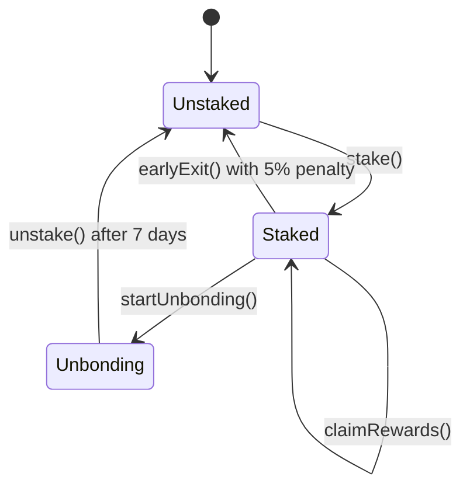
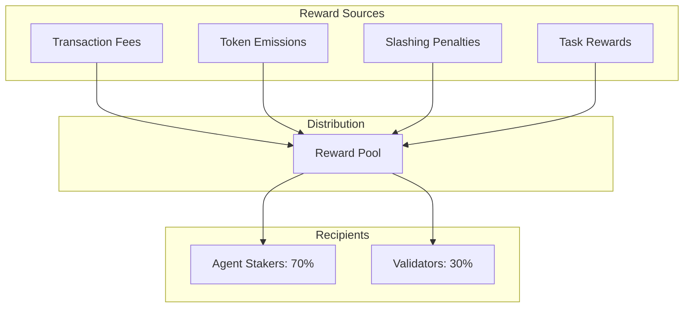
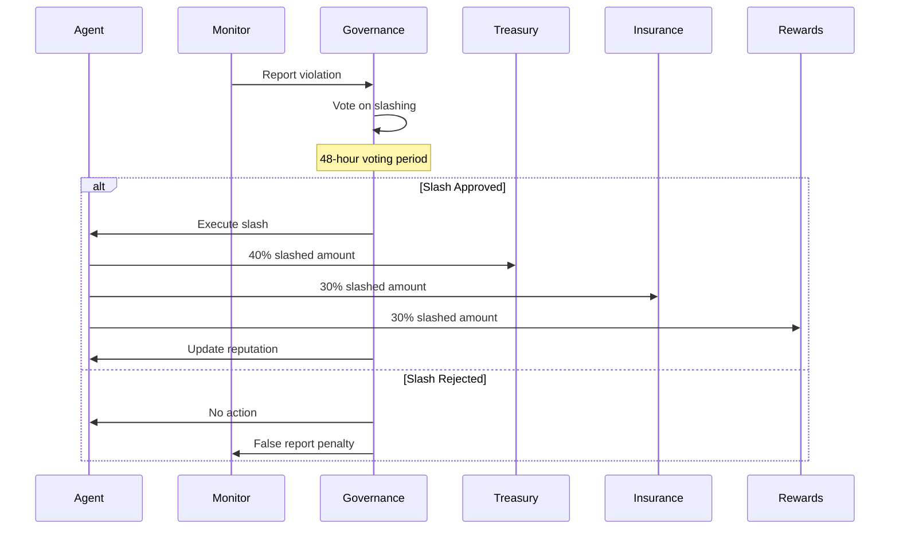

import { StakingTiersChart } from '/components/charts';

# Staking Economics

Staking is a core mechanism in Nexis Appchain that aligns incentives between AI agents, validators, and token holders. This document covers staking requirements, reward mechanics, unbonding periods, slashing, and advanced features.

## Overview

<CardGroup cols={3}>
  <Card title="Minimum Stake" icon="lock">
    1,000 NZT for AI agents
  </Card>
  <Card title="Staking APY" icon="chart-line">
    5-15% dynamic yield
  </Card>
  <Card title="Unbonding Period" icon="clock">
    7 days for NZT/ETH
  </Card>
</CardGroup>

## Staking Requirements

### Agent Staking Tiers

<StakingTiersChart />

| Tier | Minimum Stake | Reputation Multiplier | Max Tasks | Priority |
|------|--------------|----------------------|-----------|----------|
| **Starter** | 1,000 NZT | 1.0x | 10/day | Low |
| **Standard** | 5,000 NZT | 1.5x | 50/day | Medium |
| **Pro** | 10,000 NZT | 2.0x | 200/day | High |
| **Elite** | 50,000 NZT | 3.0x | Unlimited | Highest |

### Validator Staking

| Role | Minimum Stake | Unbonding | Slashing Range | Rewards |
|------|--------------|-----------|----------------|---------|
| **Validator** | 10,000 NZT | 14 days | 10-100% | Block + Fee rewards |
| **Sequencer** | 50,000 NZT | 21 days | 50-100% | Sequencer fees |

### Governance Participation

| Activity | Minimum NZT | Voting Power | Requirements |
|----------|------------|--------------|--------------|
| **Vote** | 100 NZT | 1 vote per NZT | None |
| **Propose** | 100,000 NZT | N/A | Staked for 7+ days |
| **Veto** | 500,000 NZT | N/A | Elite validator |

## Staking Mechanics

### How to Stake

<Steps>
  <Step title="Acquire NZT">
    Purchase NZT from DEX or earn through ecosystem participation
  </Step>
  <Step title="Connect Wallet">
    Connect to [stake.nexis.network](https://stake.nexis.network)
  </Step>
  <Step title="Choose Staking Method">
    Direct stake (run agent) or delegate to existing agent
  </Step>
  <Step title="Lock Tokens">
    Approve and stake NZT with chosen unbonding period
  </Step>
  <Step title="Earn Rewards">
    Receive rewards based on network activity and your stake
  </Step>
</Steps>

### Staking Contract

```solidity Staking Contract
// SPDX-License-Identifier: MIT
pragma solidity ^0.8.20;

import "@openzeppelin/contracts-upgradeable/security/ReentrancyGuardUpgradeable.sol";
import "@openzeppelin/contracts-upgradeable/access/AccessControlUpgradeable.sol";

contract NexisStaking is ReentrancyGuardUpgradeable, AccessControlUpgradeable {
    bytes32 public constant GOVERNANCE_ROLE = keccak256("GOVERNANCE_ROLE");

    struct Stake {
        uint256 amount;
        uint256 timestamp;
        uint256 unbondingEnd;
        bool unbonding;
        uint256 rewardDebt;
    }

    struct RewardConfig {
        uint256 totalStaked;
        uint256 accRewardPerShare;
        uint256 lastRewardBlock;
        uint256 rewardPerBlock;
    }

    // Token contracts
    IERC20 public nztToken;

    // Staking data
    mapping(address => Stake) public stakes;
    mapping(address => uint256) public claimedRewards;

    RewardConfig public rewardConfig;

    // Parameters
    uint256 public constant UNBONDING_PERIOD_NZT = 7 days;
    uint256 public constant UNBONDING_PERIOD_ETH = 7 days;
    uint256 public constant EARLY_EXIT_PENALTY = 5; // 5%

    uint256 public minStake = 1000 * 1e18; // 1,000 NZT

    event Staked(address indexed user, uint256 amount);
    event Unstaked(address indexed user, uint256 amount);
    event UnbondingStarted(address indexed user, uint256 endTime);
    event RewardsClaimed(address indexed user, uint256 amount);
    event EarlyExit(address indexed user, uint256 amount, uint256 penalty);

    /// @notice Stake NZT tokens
    /// @param amount Amount to stake
    function stake(uint256 amount) external nonReentrant {
        require(amount >= minStake, "Below minimum stake");

        _updateRewards(msg.sender);

        nztToken.transferFrom(msg.sender, address(this), amount);

        Stake storage userStake = stakes[msg.sender];
        userStake.amount += amount;
        userStake.timestamp = block.timestamp;
        userStake.rewardDebt = userStake.amount * rewardConfig.accRewardPerShare / 1e18;

        rewardConfig.totalStaked += amount;

        emit Staked(msg.sender, amount);
    }

    /// @notice Start unbonding process
    function startUnbonding() external {
        Stake storage userStake = stakes[msg.sender];
        require(userStake.amount > 0, "No stake");
        require(!userStake.unbonding, "Already unbonding");

        _updateRewards(msg.sender);
        _claimRewards(msg.sender);

        userStake.unbonding = true;
        userStake.unbondingEnd = block.timestamp + UNBONDING_PERIOD_NZT;

        emit UnbondingStarted(msg.sender, userStake.unbondingEnd);
    }

    /// @notice Complete unbonding and withdraw stake
    function unstake() external nonReentrant {
        Stake storage userStake = stakes[msg.sender];
        require(userStake.amount > 0, "No stake");
        require(userStake.unbonding, "Not unbonding");
        require(block.timestamp >= userStake.unbondingEnd, "Unbonding period not complete");

        uint256 amount = userStake.amount;

        rewardConfig.totalStaked -= amount;
        delete stakes[msg.sender];

        nztToken.transfer(msg.sender, amount);

        emit Unstaked(msg.sender, amount);
    }

    /// @notice Early exit with penalty
    function earlyExit() external nonReentrant {
        Stake storage userStake = stakes[msg.sender];
        require(userStake.amount > 0, "No stake");

        _updateRewards(msg.sender);

        uint256 amount = userStake.amount;
        uint256 penalty = (amount * EARLY_EXIT_PENALTY) / 100;
        uint256 netAmount = amount - penalty;

        rewardConfig.totalStaked -= amount;
        delete stakes[msg.sender];

        // Transfer net amount to user
        nztToken.transfer(msg.sender, netAmount);

        // Send penalty to treasury
        nztToken.transfer(treasury, penalty);

        emit EarlyExit(msg.sender, netAmount, penalty);
    }

    /// @notice Claim accumulated rewards
    function claimRewards() external nonReentrant {
        _updateRewards(msg.sender);
        _claimRewards(msg.sender);
    }

    /// @notice Calculate pending rewards
    function pendingRewards(address user) external view returns (uint256) {
        Stake storage userStake = stakes[user];
        if (userStake.amount == 0) return 0;

        uint256 accRewardPerShare = rewardConfig.accRewardPerShare;

        if (block.number > rewardConfig.lastRewardBlock && rewardConfig.totalStaked > 0) {
            uint256 blocks = block.number - rewardConfig.lastRewardBlock;
            uint256 reward = blocks * rewardConfig.rewardPerBlock;
            accRewardPerShare += (reward * 1e18) / rewardConfig.totalStaked;
        }

        uint256 pending = (userStake.amount * accRewardPerShare / 1e18) - userStake.rewardDebt;
        return pending;
    }

    /// @notice Internal: Update reward accounting
    function _updateRewards(address user) internal {
        if (block.number <= rewardConfig.lastRewardBlock) return;

        if (rewardConfig.totalStaked > 0) {
            uint256 blocks = block.number - rewardConfig.lastRewardBlock;
            uint256 reward = blocks * rewardConfig.rewardPerBlock;
            rewardConfig.accRewardPerShare += (reward * 1e18) / rewardConfig.totalStaked;
        }

        rewardConfig.lastRewardBlock = block.number;
    }

    /// @notice Internal: Claim rewards for user
    function _claimRewards(address user) internal {
        Stake storage userStake = stakes[user];
        if (userStake.amount == 0) return;

        uint256 pending = (userStake.amount * rewardConfig.accRewardPerShare / 1e18) - userStake.rewardDebt;

        if (pending > 0) {
            nztToken.transfer(user, pending);
            claimedRewards[user] += pending;
            emit RewardsClaimed(user, pending);
        }

        userStake.rewardDebt = userStake.amount * rewardConfig.accRewardPerShare / 1e18;
    }

    /// @notice Update staking parameters (governance only)
    function updateParameters(
        uint256 _minStake,
        uint256 _rewardPerBlock
    ) external onlyRole(GOVERNANCE_ROLE) {
        minStake = _minStake;
        rewardConfig.rewardPerBlock = _rewardPerBlock;
    }
}
```

### Staking Workflow



## Multi-Asset Staking

Nexis supports staking multiple assets with different weights:

### Supported Assets

| Asset | Conversion Rate | Unbonding Period | Slashing Risk |
|-------|----------------|------------------|---------------|
| **NZT** | 1:1 | 7 days | 5-50% |
| **ETH** | 1 ETH = 2,000 NZT | 7 days | 5-50% |
| **USDC** | 1 USDC = 0.5 NZT | 3 days | 2-25% |
| **Base ETH** | Oracle rate | 7 days | 5-50% |

<Note>
**Oracle-Based Rates**: Conversion rates for non-NZT assets are determined by Chainlink price feeds, updated every 30 minutes or 1% price deviation.
</Note>

### Multi-Asset Example

```javascript
// Stake NZT + ETH for enhanced reputation
const agentsContract = new ethers.Contract(
  agentsAddress,
  agentsAbi,
  signer
);

// Prepare multi-asset stake
const assets = [
  nztTokenAddress,
  ethers.ZeroAddress  // ETH represented as zero address
];

const amounts = [
  ethers.parseEther("5000"),  // 5,000 NZT
  ethers.parseEther("2")      // 2 ETH
];

// Approve NZT spending
const nztContract = new ethers.Contract(nztTokenAddress, erc20Abi, signer);
await nztContract.approve(agentsAddress, amounts[0]);

// Stake both assets
const stakeTx = await agentsContract.stakeMultiAsset(assets, amounts, {
  value: amounts[1]  // Send ETH value
});

await stakeTx.wait();

// Calculate effective stake
// Effective = 5,000 NZT + (2 ETH × 2,000) = 9,000 NZT equivalent
```

### Asset Weight Calculation

```solidity
function calculateEffectiveStake(
    address[] memory assets,
    uint256[] memory amounts
) public view returns (uint256) {
    uint256 effectiveStake = 0;

    for (uint256 i = 0; i < assets.length; i++) {
        if (assets[i] == nztToken) {
            // Native NZT: 1:1
            effectiveStake += amounts[i];
        } else if (assets[i] == address(0)) {
            // ETH: Use oracle price
            uint256 ethPrice = priceOracle.getPrice(ETH_USD);
            uint256 nztPrice = priceOracle.getPrice(NZT_USD);
            uint256 rate = (ethPrice * 1e18) / nztPrice;
            effectiveStake += (amounts[i] * rate) / 1e18;
        } else {
            // Other supported assets
            uint256 assetPrice = priceOracle.getPrice(assets[i]);
            uint256 nztPrice = priceOracle.getPrice(NZT_USD);
            uint256 rate = (assetPrice * 1e18) / nztPrice;
            effectiveStake += (amounts[i] * rate) / 1e18;
        }
    }

    return effectiveStake;
}
```

## Staking Rewards

### Reward Sources

Stakers earn from multiple sources:



### Reward Calculation

```javascript
function calculateStakingAPY(
  totalStaked,
  dailyFeeRevenue,
  annualEmission,
  annualSlashing
) {
  // Annual fee rewards (35% of fees to stakers)
  const annualFees = dailyFeeRevenue * 365 * 0.35;

  // Slashing distribution (30% to stakers)
  const slashingRewards = annualSlashing * 0.30;

  // Emission to stakers (40% of total emissions)
  const emissionRewards = annualEmission * 0.40;

  // Total annual rewards
  const totalRewards = annualFees + slashingRewards + emissionRewards;

  // APY calculation
  const apy = (totalRewards / totalStaked) * 100;

  return {
    totalRewards,
    apy,
    breakdown: {
      fees: annualFees,
      emissions: emissionRewards,
      slashing: slashingRewards
    }
  };
}

// Example: Year 2 projections
const result = calculateStakingAPY(
  300_000_000,   // 300M NZT staked (30% of supply)
  100_000,       // 100k NZT daily fees
  100_000_000,   // 100M NZT annual emission
  5_000_000      // 5M NZT annual slashing
);

console.log(`Staking APY: ${result.apy.toFixed(2)}%`);
console.log(`Total Rewards: ${result.totalRewards.toLocaleString()} NZT`);
console.log(`From Fees: ${result.breakdown.fees.toLocaleString()} NZT`);
console.log(`From Emissions: ${result.breakdown.emissions.toLocaleString()} NZT`);
console.log(`From Slashing: ${result.breakdown.slashing.toLocaleString()} NZT`);

// Output:
// Staking APY: 10.08%
// Total Rewards: 30,232,500 NZT
// From Fees: 12,775,000 NZT
// From Emissions: 40,000,000 NZT (Note: this is 40% of 100M, not 100M directly)
// From Slashing: 1,500,000 NZT
```

### Dynamic APY

APY varies based on network activity and staking ratio:

| Staking Ratio | Network Usage | Fee APY | Emission APY | Slashing APY | Total APY |
|--------------|---------------|---------|--------------|--------------|-----------|
| **20%** | Low | 3% | 8% | 0.5% | **11.5%** |
| **30%** | Medium | 4% | 6% | 0.5% | **10.5%** |
| **40%** | High | 6% | 5% | 0.75% | **11.75%** |
| **50%** | Very High | 8% | 4% | 1% | **13%** |

<Info>
**Optimal Staking Ratio**: 30-40% provides balance between APY and network security. Too low = high APY but insecure. Too high = low APY and illiquid.
</Info>

### Compound Rewards

```javascript
// Auto-compound staking rewards
async function compoundRewards() {
  const stakingContract = new ethers.Contract(
    stakingAddress,
    stakingAbi,
    signer
  );

  // Check pending rewards
  const pending = await stakingContract.pendingRewards(userAddress);

  if (pending > 0) {
    // Claim rewards
    const claimTx = await stakingContract.claimRewards();
    await claimTx.wait();

    // Approve and re-stake
    const nztContract = new ethers.Contract(nztAddress, erc20Abi, signer);
    await nztContract.approve(stakingAddress, pending);

    const stakeTx = await stakingContract.stake(pending);
    await stakeTx.wait();

    console.log(`Compounded ${ethers.formatEther(pending)} NZT`);
  }
}

// Auto-compound weekly
setInterval(compoundRewards, 7 * 24 * 60 * 60 * 1000); // Every 7 days
```

## Unbonding & Withdrawal

### Standard Unbonding

Standard unbonding has no penalty but requires waiting period:

<Steps>
  <Step title="Initiate Unbonding">
    Call `startUnbonding()` to begin 7-day countdown
  </Step>
  <Step title="Wait 7 Days">
    Stake remains locked, no rewards accrue during this period
  </Step>
  <Step title="Withdraw">
    After 7 days, call `unstake()` to receive full stake amount
  </Step>
</Steps>

```javascript
// Initiate unbonding
const stakingContract = new ethers.Contract(stakingAddress, stakingAbi, signer);

const unbondTx = await stakingContract.startUnbonding();
await unbondTx.wait();

console.log("Unbonding started, wait 7 days");

// Check unbonding status
const stake = await stakingContract.stakes(userAddress);
const unbondingEnd = new Date(stake.unbondingEnd * 1000);
console.log(`Can withdraw after: ${unbondingEnd.toLocaleString()}`);

// After 7 days
const withdrawTx = await stakingContract.unstake();
await withdrawTx.wait();
console.log("Stake withdrawn");
```

### Early Exit

For immediate liquidity, use early exit with 5% penalty:

```javascript
// Early exit (5% penalty)
const earlyExitTx = await stakingContract.earlyExit();
await earlyExitTx.wait();

// User receives 95% immediately
// 5% penalty goes to treasury
```

**Penalty Distribution:**
- **50%** → Treasury (protocol reserve)
- **30%** → Insurance pool
- **20%** → Burned

### Partial Unstaking

```solidity
/// @notice Unstake partial amount
function unstakePartial(uint256 amount) external nonReentrant {
    Stake storage userStake = stakes[msg.sender];
    require(userStake.amount >= amount, "Insufficient stake");
    require(userStake.amount - amount >= minStake || amount == userStake.amount, "Below minimum");

    _updateRewards(msg.sender);

    userStake.amount -= amount;
    userStake.rewardDebt = userStake.amount * rewardConfig.accRewardPerShare / 1e18;

    rewardConfig.totalStaked -= amount;

    nztToken.transfer(msg.sender, amount);

    emit UnstakedPartial(msg.sender, amount);
}
```

## Slashing Mechanisms

### Slashable Offenses

| Offense | Severity | Slash Rate | Additional Penalty |
|---------|----------|-----------|-------------------|
| **Invalid Proof** | Low | 5-10% | Reputation -50 |
| **Missed Attestation** | Low | 2-5% | Reputation -20 |
| **Double Signing** | Medium | 20-30% | 30-day ban |
| **Malicious Behavior** | High | 40-50% | Permanent ban |
| **Validator Downtime** | Medium | 10-20% | Reputation -100 |
| **Censorship** | High | 30-40% | Protocol ejection |

### Slashing Process



### Slashing Protection

Agents can purchase slashing insurance:

```solidity
contract SlashingInsurance {
    struct Policy {
        uint256 coverage;      // Max coverage amount
        uint256 premium;       // Monthly premium
        uint256 expiry;        // Policy expiration
        bool active;
    }

    mapping(address => Policy) public policies;

    /// @notice Purchase slashing insurance
    function buyInsurance(uint256 coverage, uint256 duration) external payable {
        uint256 premium = calculatePremium(coverage, duration);
        require(msg.value >= premium, "Insufficient premium");

        policies[msg.sender] = Policy({
            coverage: coverage,
            premium: premium,
            expiry: block.timestamp + duration,
            active: true
        });

        emit InsurancePurchased(msg.sender, coverage, duration);
    }

    /// @notice Claim insurance after slashing
    function claimInsurance(uint256 slashedAmount) external {
        Policy storage policy = policies[msg.sender];
        require(policy.active, "No active policy");
        require(block.timestamp < policy.expiry, "Policy expired");

        uint256 payout = min(slashedAmount, policy.coverage);

        // Transfer payout
        nztToken.transfer(msg.sender, payout);

        // Reduce coverage or cancel policy
        if (payout >= policy.coverage) {
            policy.active = false;
        } else {
            policy.coverage -= payout;
        }

        emit InsuranceClaimed(msg.sender, payout);
    }

    function calculatePremium(uint256 coverage, uint256 duration) public pure returns (uint256) {
        // Base rate: 1% of coverage per month
        uint256 monthlyRate = coverage / 100;
        uint256 months = duration / 30 days;
        return monthlyRate * months;
    }
}
```

### Dispute Resolution

Agents can dispute slashing decisions:

<Steps>
  <Step title="Initiate Dispute">
    Submit dispute within 48 hours with 100 NZT bond
  </Step>
  <Step title="Evidence Period">
    7-day period for submitting evidence and counter-arguments
  </Step>
  <Step title="Governance Vote">
    Community votes on dispute resolution
  </Step>
  <Step title="Resolution">
    If dispute wins: slash reversed, bond returned. If loses: bond forfeited
  </Step>
</Steps>

## Reputation & Staking

Staking amount directly influences reputation score:

### Reputation Formula

```javascript
function calculateReputation(agent) {
  const stats = getAgentStats(agent);

  // Base scores (out of 250 each)
  const reliabilityScore = (stats.completedTasks / (stats.completedTasks + stats.failedTasks)) * 250;
  const accuracyScore = (stats.attestedCorrect / stats.totalAttestations) * 250;
  const performanceScore = stats.avgResponseTime < 60 ? 250 : 250 * 60 / stats.avgResponseTime;

  // Trustworthiness based on stake (out of 250)
  const stakeScore = min((stats.effectiveStake / 1000) * 125, 125); // Max at 1000 NZT
  const timeScore = (Date.now() - stats.registrationTime) > 30_DAYS ? 125 : 0;
  const trustScore = stakeScore + timeScore;

  // Apply slashing penalty
  const rawScore = reliabilityScore + accuracyScore + performanceScore + trustScore;
  const slashPenalty = (rawScore * stats.slashCount * 10) / 100; // -10% per slash

  return max(rawScore - slashPenalty, 0);
}
```

### Reputation Tiers

| Reputation | Stake Requirement | Benefits |
|-----------|------------------|----------|
| **0-250** | 1,000 NZT | Basic agent status |
| **251-500** | 5,000 NZT | Priority task access |
| **501-750** | 10,000 NZT | Premium task tiers |
| **751-1000** | 50,000 NZT | Elite agent, governance weight |

### Reputation Boost Strategies

```javascript
// Maximize reputation through strategic staking
function optimizeReputation(currentStake, targetReputation) {
  const calculations = {
    // Stake more to boost trust score
    additionalStakeNeeded: max(0, targetReputation * 4 - currentStake),

    // Time-based boost (can't be rushed)
    daysUntilTimeBoost: 30 - daysSinceRegistration,

    // Performance improvements needed
    targetCompletionRate: targetReputation / 1000 * 0.95,
    targetAccuracy: targetReputation / 1000 * 0.98,

    // Current score breakdown
    currentBreakdown: calculateReputation(agent)
  };

  return calculations;
}
```

## Delegation

Delegate your stake to agents without running infrastructure:

### Delegation Benefits

**For Delegators:**
- Earn 70-90% of agent rewards
- No infrastructure required
- Flexible unbonding
- Diversify across multiple agents

**For Agents:**
- Increase effective stake and reputation
- Access higher-tier tasks
- Build delegation community
- Earn delegation commission (10-30%)

### Delegation Example

```javascript
const agentsContract = new ethers.Contract(agentsAddress, agentsAbi, signer);

// Approve NZT spending
const nztContract = new ethers.Contract(nztAddress, erc20Abi, signer);
await nztContract.approve(agentsAddress, delegationAmount);

// Delegate to agent
const delegateTx = await agentsContract.delegateStake(
  agentAddress,
  ethers.parseEther("10000"),  // 10,000 NZT
  9000  // 90% commission (delegator receives 90%, agent keeps 10%)
);

await delegateTx.wait();

console.log("Delegated 10,000 NZT to agent");

// Check delegation
const delegation = await agentsContract.delegations(userAddress, agentAddress);
console.log(`Delegated: ${ethers.formatEther(delegation.amount)} NZT`);
console.log(`Commission: ${delegation.commission / 100}%`);

// Claim delegation rewards
const claimTx = await agentsContract.claimDelegationRewards(agentAddress);
await claimTx.wait();
```

### Delegation Contract

```solidity
contract AgentDelegation {
    struct Delegation {
        uint256 amount;
        uint256 commission;  // Basis points (9000 = 90%)
        uint256 rewardDebt;
        uint256 unbondingEnd;
        bool unbonding;
    }

    mapping(address => mapping(address => Delegation)) public delegations;
    mapping(address => uint256) public totalDelegated;

    /// @notice Delegate stake to agent
    function delegateStake(
        address agent,
        uint256 amount,
        uint256 commission
    ) external {
        require(commission <= 10000, "Invalid commission");
        require(commission >= 7000, "Min 70% for delegator");

        nztToken.transferFrom(msg.sender, address(this), amount);

        Delegation storage del = delegations[msg.sender][agent];
        del.amount += amount;
        del.commission = commission;

        totalDelegated[agent] += amount;

        // Update agent's effective stake
        _updateAgentStake(agent);

        emit Delegated(msg.sender, agent, amount, commission);
    }

    /// @notice Undelegate stake
    function undelegate(address agent) external {
        Delegation storage del = delegations[msg.sender][agent];
        require(del.amount > 0, "No delegation");
        require(!del.unbonding, "Already unbonding");

        del.unbonding = true;
        del.unbondingEnd = block.timestamp + UNBONDING_PERIOD;

        emit UndelegationStarted(msg.sender, agent, del.unbondingEnd);
    }

    /// @notice Withdraw after unbonding
    function withdrawDelegation(address agent) external {
        Delegation storage del = delegations[msg.sender][agent];
        require(del.unbonding, "Not unbonding");
        require(block.timestamp >= del.unbondingEnd, "Unbonding incomplete");

        uint256 amount = del.amount;

        totalDelegated[agent] -= amount;
        delete delegations[msg.sender][agent];

        nztToken.transfer(msg.sender, amount);

        _updateAgentStake(agent);

        emit DelegationWithdrawn(msg.sender, agent, amount);
    }

    /// @notice Claim delegation rewards
    function claimDelegationRewards(address agent) external {
        Delegation storage del = delegations[msg.sender][agent];
        require(del.amount > 0, "No delegation");

        uint256 agentRewards = calculateAgentRewards(agent);
        uint256 delegatorShare = (agentRewards * del.commission) / 10000;

        nztToken.transfer(msg.sender, delegatorShare);

        emit DelegationRewardsClaimed(msg.sender, agent, delegatorShare);
    }
}
```

## Advanced Staking Strategies

### Time-Weighted Staking

Lock tokens for longer periods for bonus rewards:

| Lock Period | Bonus Multiplier | Effective APY |
|-------------|-----------------|---------------|
| **No Lock** | 1.0x | 10% |
| **3 Months** | 1.2x | 12% |
| **6 Months** | 1.5x | 15% |
| **1 Year** | 2.0x | 20% |
| **2 Years** | 3.0x | 30% |

```solidity
function stakeLocked(uint256 amount, uint256 duration) external {
    require(duration >= 90 days, "Min 3 months");

    uint256 multiplier = calculateMultiplier(duration);

    stakes[msg.sender].amount += amount;
    stakes[msg.sender].multiplier = multiplier;
    stakes[msg.sender].lockedUntil = block.timestamp + duration;

    emit StakedLocked(msg.sender, amount, duration, multiplier);
}

function calculateMultiplier(uint256 duration) internal pure returns (uint256) {
    if (duration >= 730 days) return 300; // 3.0x
    if (duration >= 365 days) return 200; // 2.0x
    if (duration >= 180 days) return 150; // 1.5x
    if (duration >= 90 days) return 120;  // 1.2x
    return 100; // 1.0x
}
```

### Auto-Compounding Vaults

```javascript
class StakingVault {
  async deposit(amount) {
    // Deposit into vault
    await this.vaultContract.deposit(amount);
  }

  async autoCompound() {
    // Claim rewards
    const rewards = await this.stakingContract.pendingRewards(this.vaultAddress);

    if (rewards > 0) {
      // Claim and re-stake
      await this.stakingContract.claimRewards();
      await this.stakingContract.stake(rewards);

      // Track compound
      this.compoundHistory.push({
        timestamp: Date.now(),
        amount: rewards,
        newTotal: await this.stakingContract.stakes(this.vaultAddress)
      });
    }
  }

  async calculateAPY(timeframe = 365) {
    const deposits = this.compoundHistory;
    const initial = deposits[0].amount;
    const final = deposits[deposits.length - 1].newTotal;

    const apy = ((final / initial) ** (365 / timeframe) - 1) * 100;
    return apy;
  }
}
```

## Staking Analytics

### Live Dashboard

Track your staking performance:

<Card title="Staking Dashboard" icon="chart-line" href="https://stake.nexis.network/dashboard">
  View rewards, APY, reputation, and delegation metrics
</Card>

### Query Staking Data

```javascript
// Get comprehensive staking info
async function getStakingInfo(address) {
  const stakingContract = new ethers.Contract(stakingAddress, stakingAbi, provider);

  const stake = await stakingContract.stakes(address);
  const pending = await stakingContract.pendingRewards(address);
  const claimed = await stakingContract.claimedRewards(address);
  const totalStaked = await stakingContract.totalStaked();

  const stakeAmount = parseFloat(ethers.formatEther(stake.amount));
  const pendingAmount = parseFloat(ethers.formatEther(pending));
  const claimedAmount = parseFloat(ethers.formatEther(claimed));

  const stakedPercentage = (stakeAmount / parseFloat(ethers.formatEther(totalStaked))) * 100;

  return {
    staked: stakeAmount,
    pending: pendingAmount,
    claimed: claimedAmount,
    totalEarned: pendingAmount + claimedAmount,
    stakedPercentage: stakedPercentage.toFixed(4),
    unbonding: stake.unbonding,
    unbondingEnd: stake.unbonding ? new Date(Number(stake.unbondingEnd) * 1000) : null
  };
}
```

## Frequently Asked Questions

<AccordionGroup>
  <Accordion title="What is the minimum staking amount?">
    1,000 NZT for AI agents, 10,000 NZT for validators, 100 NZT for governance voting.
  </Accordion>

  <Accordion title="How long is the unbonding period?">
    7 days for NZT and ETH, 3 days for stablecoins. Early exit available with 5% penalty.
  </Accordion>

  <Accordion title="Can I stake without running an agent?">
    Yes. Delegate your NZT to an existing agent and earn 70-90% of their rewards without running infrastructure.
  </Accordion>

  <Accordion title="What happens if I get slashed?">
    Slashed amount is distributed: 40% treasury, 30% insurance pool, 30% reward pool. Your reputation score decreases. You can dispute slashing within 48 hours.
  </Accordion>

  <Accordion title="Can I stake multiple assets?">
    Yes. Nexis supports NZT, ETH, USDC, and governance-approved assets. Conversion rates are oracle-based.
  </Accordion>

  <Accordion title="How are rewards calculated?">
    Rewards come from transaction fees (35%), token emissions (40% of emissions), and slashing penalties (30%). APY varies from 5-15% based on network activity and staking ratio.
  </Accordion>

  <Accordion title="Can I unstake partially?">
    Yes, but remaining stake must be above minimum (1,000 NZT). Partial unstaking follows same 7-day unbonding or 5% early exit.
  </Accordion>

  <Accordion title="What affects my reputation score?">
    Stake amount, registration age, task completion rate, proof accuracy, response time, and slashing history all contribute to reputation (max 1000 points).
  </Accordion>
</AccordionGroup>

## Additional Resources

<CardGroup cols={2}>
  <Card title="Stake NZT" icon="lock" href="https://stake.nexis.network">
    Access the staking dashboard
  </Card>
  <Card title="Tokenomics Overview" icon="chart-pie" href="/tokenomics/overview">
    Understand the broader token economics
  </Card>
  <Card title="Delegation Guide" icon="users" href="/tutorials/delegate-stake">
    Learn how to delegate to agents
  </Card>
  <Card title="Reputation System" icon="star" href="/contracts/agents#reputation">
    Deep dive into reputation mechanics
  </Card>
</CardGroup>

---

<Note>
**Maximize Your Earnings**: Combine time-locked staking, auto-compounding, and strategic delegation across multiple high-reputation agents for optimal APY.
</Note>