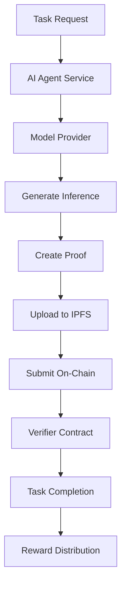

# Integrate AI Models with Nexis Appchain

This comprehensive tutorial covers building a production-ready AI agent that integrates with Nexis for verifiable inference. You'll learn how to set up AI model endpoints, generate cryptographic proofs, use IPFS for proof storage, implement verifiers, and deploy to production.

## What You'll Build

A complete AI agent system with:

- AI model inference endpoint (OpenAI, Anthropic, or self-hosted)
- Cryptographic proof generation for all inferences
- IPFS integration for decentralized proof storage
- On-chain commitment recording
- Verifier contract for proof validation
- LangGraph workflow orchestration
- Production deployment checklist

<Note>
**Time Required:** 2-3 hours for complete integration and testing
</Note>

## Prerequisites

<CardGroup cols={2}>
  <Card title="AI API Access" icon="key">
    OpenAI, Anthropic, or Hugging Face API key
  </Card>
  <Card title="Development Setup" icon="code">
    Node.js, TypeScript, and ethers.js
  </Card>
  <Card title="Registered Agent" icon="robot">
    Complete [agent registration](/tutorials/register-agent) first
  </Card>
  <Card title="IPFS Account" icon="database">
    Pinata, NFT.Storage, or local IPFS node
  </Card>
</CardGroup>

## Part 1: Architecture Overview

### System Components



### Proof-of-Inference Flow

1. **Receive Task**: Agent claims task from smart contract
2. **Execute Inference**: Run AI model with task input
3. **Generate Proof**: Create cryptographic commitments
4. **Store Proof**: Upload detailed proof to IPFS
5. **Submit Commitment**: Record hashes on-chain
6. **Verification**: Verifier validates proof structure
7. **Completion**: Task marked complete, reward released

## Part 2: Environment Setup

### Step 1: Initialize Project

```bash
# Create project
mkdir nexis-ai-agent
cd nexis-ai-agent

# Initialize npm
npm init -y

# Install core dependencies
npm install ethers@6 openai anthropic dotenv express

# Install IPFS and crypto tools
npm install ipfs-http-client multihashes bs58

# Install development tools
npm install --save-dev typescript @types/node @types/express ts-node

# Initialize TypeScript
npx tsc --init
```

### Step 2: Configure Environment

Create `.env`:

```bash .env
# Network Configuration
NEXIS_RPC_URL=https://testnet-rpc.nex-t1.ai
CHAIN_ID=84532
PRIVATE_KEY=your_wallet_private_key

# Contract Addresses
AGENTS_CONTRACT=0x1234567890abcdef1234567890abcdef12345678
TASKS_CONTRACT=0x742d35Cc6634C0532925a3b844Bc9e7595f0bEb
VERIFIER_CONTRACT=0xabcdef1234567890abcdef1234567890abcdef12

# AI Model Configuration
OPENAI_API_KEY=sk-...
ANTHROPIC_API_KEY=sk-ant-...
DEFAULT_MODEL=gpt-4-turbo
MAX_TOKENS=2000
TEMPERATURE=0.7

# IPFS Configuration
IPFS_API_URL=https://api.pinata.cloud
PINATA_JWT=your_pinata_jwt_token
# Or use NFT.Storage
NFT_STORAGE_API_KEY=your_nft_storage_key

# Service Configuration
PORT=3000
SERVICE_ENDPOINT=https://your-agent-api.com
AGENT_NAME=MyAIAgent
```

### Step 3: Project Structure

```
nexis-ai-agent/
├── src/
│   ├── agent/
│   │   ├── AgentService.ts       # Main agent logic
│   │   ├── TaskMonitor.ts        # Watch for new tasks
│   │   └── ProofGenerator.ts     # Generate proofs
│   ├── inference/
│   │   ├── OpenAIProvider.ts     # OpenAI integration
│   │   ├── AnthropicProvider.ts  # Anthropic integration
│   │   └── ModelRegistry.ts      # Model management
│   ├── proof/
│   │   ├── ProofStorage.ts       # IPFS storage
│   │   ├── ProofVerifier.ts      # Verify proofs
│   │   └── Commitment.ts         # Crypto commitments
│   ├── blockchain/
│   │   ├── ContractClient.ts     # Contract interaction
│   │   └── TransactionManager.ts # Tx handling
│   ├── api/
│   │   └── server.ts             # REST API
│   └── index.ts                  # Entry point
├── contracts/
│   └── Verifier.sol              # Proof verifier contract
├── test/
│   └── integration.test.ts
└── package.json
```

## Part 3: Implement AI Model Integration

### Step 1: Create Model Provider Interface

Create `src/inference/IModelProvider.ts`:

```typescript
export interface InferenceRequest {
  prompt: string;
  model: string;
  maxTokens?: number;
  temperature?: number;
  systemPrompt?: string;
  metadata?: Record<string, any>;
}

export interface InferenceResponse {
  output: string;
  model: string;
  tokensUsed: {
    prompt: number;
    completion: number;
    total: number;
  };
  inferenceTime: number;
  finishReason: string;
  metadata?: Record<string, any>;
}

export interface IModelProvider {
  name: string;
  supportedModels: string[];
  infer(request: InferenceRequest): Promise<InferenceResponse>;
}
```

### Step 2: Implement OpenAI Provider

Create `src/inference/OpenAIProvider.ts`:

```typescript
import OpenAI from 'openai';
import { IModelProvider, InferenceRequest, InferenceResponse } from './IModelProvider';

export class OpenAIProvider implements IModelProvider {
  name = 'openai';
  supportedModels = ['gpt-4-turbo', 'gpt-4', 'gpt-3.5-turbo'];

  private client: OpenAI;

  constructor(apiKey: string) {
    this.client = new OpenAI({ apiKey });
  }

  async infer(request: InferenceRequest): Promise<InferenceResponse> {
    const startTime = Date.now();

    const completion = await this.client.chat.completions.create({
      model: request.model,
      messages: [
        ...(request.systemPrompt ? [{ role: 'system' as const, content: request.systemPrompt }] : []),
        { role: 'user' as const, content: request.prompt }
      ],
      max_tokens: request.maxTokens || 2000,
      temperature: request.temperature || 0.7
    });

    const inferenceTime = Date.now() - startTime;

    return {
      output: completion.choices[0].message.content || '',
      model: completion.model,
      tokensUsed: {
        prompt: completion.usage?.prompt_tokens || 0,
        completion: completion.usage?.completion_tokens || 0,
        total: completion.usage?.total_tokens || 0
      },
      inferenceTime,
      finishReason: completion.choices[0].finish_reason,
      metadata: {
        id: completion.id,
        created: completion.created,
        systemFingerprint: completion.system_fingerprint
      }
    };
  }
}
```

### Step 3: Implement Anthropic Provider

Create `src/inference/AnthropicProvider.ts`:

```typescript
import Anthropic from '@anthropic-ai/sdk';
import { IModelProvider, InferenceRequest, InferenceResponse } from './IModelProvider';

export class AnthropicProvider implements IModelProvider {
  name = 'anthropic';
  supportedModels = ['claude-3-opus', 'claude-3-sonnet', 'claude-3-haiku'];

  private client: Anthropic;

  constructor(apiKey: string) {
    this.client = new Anthropic({ apiKey });
  }

  async infer(request: InferenceRequest): Promise<InferenceResponse> {
    const startTime = Date.now();

    const message = await this.client.messages.create({
      model: request.model,
      max_tokens: request.maxTokens || 2000,
      temperature: request.temperature || 0.7,
      system: request.systemPrompt,
      messages: [
        { role: 'user', content: request.prompt }
      ]
    });

    const inferenceTime = Date.now() - startTime;

    return {
      output: message.content[0].type === 'text' ? message.content[0].text : '',
      model: message.model,
      tokensUsed: {
        prompt: message.usage.input_tokens,
        completion: message.usage.output_tokens,
        total: message.usage.input_tokens + message.usage.output_tokens
      },
      inferenceTime,
      finishReason: message.stop_reason || 'end_turn',
      metadata: {
        id: message.id,
        type: message.type,
        role: message.role
      }
    };
  }
}
```

## Part 4: Implement Proof Generation

### Step 1: Create Proof Generator

Create `src/proof/ProofGenerator.ts`:

```typescript
import { ethers } from 'ethers';
import { InferenceRequest, InferenceResponse } from '../inference/IModelProvider';

export interface ProofData {
  version: string;
  agent: string;
  taskId: number;
  timestamp: number;

  input: {
    prompt: string;
    hash: string;
  };

  output: {
    text: string;
    hash: string;
  };

  model: {
    name: string;
    hash: string;
    provider: string;
  };

  execution: {
    inferenceTime: number;
    tokensUsed: number;
    startTime: number;
    endTime: number;
  };

  commitment: {
    inputHash: string;
    outputHash: string;
    modelHash: string;
    combinedHash: string;
  };

  signature?: string;
}

export class ProofGenerator {
  constructor(
    private agentAddress: string,
    private signer: ethers.Wallet
  ) {}

  generateProof(
    taskId: number,
    request: InferenceRequest,
    response: InferenceResponse
  ): ProofData {
    const timestamp = Date.now();

    // Generate cryptographic hashes
    const inputHash = ethers.keccak256(ethers.toUtf8Bytes(request.prompt));
    const outputHash = ethers.keccak256(ethers.toUtf8Bytes(response.output));
    const modelHash = ethers.keccak256(ethers.toUtf8Bytes(response.model));

    // Combined commitment hash
    const combinedHash = ethers.keccak256(
      ethers.AbiCoder.defaultAbiCoder().encode(
        ['bytes32', 'bytes32', 'bytes32', 'uint256'],
        [inputHash, outputHash, modelHash, timestamp]
      )
    );

    const proof: ProofData = {
      version: '1.0',
      agent: this.agentAddress,
      taskId,
      timestamp,

      input: {
        prompt: request.prompt,
        hash: inputHash
      },

      output: {
        text: response.output,
        hash: outputHash
      },

      model: {
        name: response.model,
        hash: modelHash,
        provider: request.metadata?.provider || 'unknown'
      },

      execution: {
        inferenceTime: response.inferenceTime,
        tokensUsed: response.tokensUsed.total,
        startTime: timestamp - response.inferenceTime,
        endTime: timestamp
      },

      commitment: {
        inputHash,
        outputHash,
        modelHash,
        combinedHash
      }
    };

    return proof;
  }

  async signProof(proof: ProofData): Promise<ProofData> {
    // Create signature of the proof
    const message = ethers.keccak256(
      ethers.toUtf8Bytes(JSON.stringify(proof.commitment))
    );

    const signature = await this.signer.signMessage(ethers.getBytes(message));

    return {
      ...proof,
      signature
    };
  }

  encodeProofForChain(proof: ProofData): string {
    // Encode proof data for smart contract
    return ethers.AbiCoder.defaultAbiCoder().encode(
      ['uint256', 'string', 'string', 'string', 'uint256', 'uint256', 'uint256', 'address'],
      [
        proof.timestamp,
        proof.input.prompt,
        proof.output.text,
        proof.model.name,
        proof.execution.inferenceTime,
        proof.execution.tokensUsed,
        proof.taskId,
        proof.agent
      ]
    );
  }
}
```

## Part 5: Implement IPFS Storage

### Step 1: Create IPFS Storage Client

Create `src/proof/ProofStorage.ts`:

```typescript
import { create as createIPFSClient, IPFSHTTPClient } from 'ipfs-http-client';
import axios from 'axios';
import { ProofData } from './ProofGenerator';

export class ProofStorage {
  private ipfs?: IPFSHTTPClient;
  private usePinata: boolean;

  constructor() {
    this.usePinata = !!process.env.PINATA_JWT;

    if (!this.usePinata && process.env.IPFS_API_URL) {
      // Use local or remote IPFS node
      this.ipfs = createIPFSClient({
        url: process.env.IPFS_API_URL
      });
    }
  }

  async storeProof(proof: ProofData): Promise<string> {
    const proofJSON = JSON.stringify(proof, null, 2);

    if (this.usePinata) {
      return await this.storeToPinata(proofJSON, proof);
    } else if (this.ipfs) {
      return await this.storeToIPFS(proofJSON);
    } else {
      throw new Error('No IPFS storage configured');
    }
  }

  private async storeToPinata(
    proofJSON: string,
    proof: ProofData
  ): Promise<string> {
    const data = JSON.stringify({
      pinataContent: JSON.parse(proofJSON),
      pinataMetadata: {
        name: `proof-task-${proof.taskId}.json`,
        keyvalues: {
          taskId: proof.taskId.toString(),
          agent: proof.agent,
          model: proof.model.name,
          timestamp: proof.timestamp.toString()
        }
      },
      pinataOptions: {
        cidVersion: 1
      }
    });

    const response = await axios.post(
      'https://api.pinata.cloud/pinning/pinJSONToIPFS',
      data,
      {
        headers: {
          'Content-Type': 'application/json',
          'Authorization': `Bearer ${process.env.PINATA_JWT}`
        }
      }
    );

    const cid = response.data.IpfsHash;
    console.log('✅ Proof stored on IPFS (Pinata):', cid);

    return `ipfs://${cid}`;
  }

  private async storeToIPFS(proofJSON: string): Promise<string> {
    const result = await this.ipfs!.add(proofJSON);
    console.log('✅ Proof stored on IPFS:', result.cid.toString());

    return `ipfs://${result.cid.toString()}`;
  }

  async retrieveProof(proofURI: string): Promise<ProofData> {
    const cid = proofURI.replace('ipfs://', '');

    if (this.usePinata) {
      const response = await axios.get(
        `https://gateway.pinata.cloud/ipfs/${cid}`
      );
      return response.data;
    } else {
      const chunks = [];
      for await (const chunk of this.ipfs!.cat(cid)) {
        chunks.push(chunk);
      }
      const proofJSON = Buffer.concat(chunks).toString();
      return JSON.parse(proofJSON);
    }
  }

  async verifyProofExists(proofURI: string): Promise<boolean> {
    try {
      await this.retrieveProof(proofURI);
      return true;
    } catch {
      return false;
    }
  }
}
```

## Part 6: Implement Agent Service

### Step 1: Create Main Agent Service

Create `src/agent/AgentService.ts`:

```typescript
import { ethers } from 'ethers';
import { ProofGenerator } from '../proof/ProofGenerator';
import { ProofStorage } from '../proof/ProofStorage';
import { OpenAIProvider } from '../inference/OpenAIProvider';
import { IModelProvider } from '../inference/IModelProvider';

export class AgentService {
  private provider: ethers.JsonRpcProvider;
  private wallet: ethers.Wallet;
  private tasksContract: ethers.Contract;
  private proofGenerator: ProofGenerator;
  private proofStorage: ProofStorage;
  private modelProvider: IModelProvider;

  constructor() {
    // Setup blockchain connection
    this.provider = new ethers.JsonRpcProvider(process.env.NEXIS_RPC_URL);
    this.wallet = new ethers.Wallet(process.env.PRIVATE_KEY!, this.provider);

    // Setup contracts
    this.tasksContract = new ethers.Contract(
      process.env.TASKS_CONTRACT!,
      [
        'function claimTask(uint256 taskId) external payable',
        'function submitProof(uint256 taskId, bytes32 inputHash, bytes32 outputHash, bytes32 modelHash, bytes proof) external',
        'function getTask(uint256 taskId) external view returns (tuple(uint256 id, address creator, address agent, string description, uint256 reward, uint256 deadline, uint8 status, bytes32 resultHash, uint256 createdAt, uint256 claimedAt, uint256 completedAt))',
        'event TaskCreated(uint256 indexed taskId, address indexed creator, uint256 reward, uint256 deadline)'
      ],
      this.wallet
    );

    // Setup proof system
    this.proofGenerator = new ProofGenerator(this.wallet.address, this.wallet);
    this.proofStorage = new ProofStorage();

    // Setup AI model
    this.modelProvider = new OpenAIProvider(process.env.OPENAI_API_KEY!);
  }

  async processTask(taskId: number): Promise<void> {
    console.log(`\n🤖 Processing Task #${taskId}`);
    console.log('='.repeat(60));

    try {
      // Step 1: Claim task
      await this.claimTask(taskId);

      // Step 2: Get task details
      const task = await this.tasksContract.getTask(taskId);
      console.log('\n📋 Task:', task.description);

      // Step 3: Execute inference
      console.log('\n🧠 Running inference...');
      const request = {
        prompt: task.description,
        model: process.env.DEFAULT_MODEL!,
        maxTokens: parseInt(process.env.MAX_TOKENS || '2000'),
        temperature: parseFloat(process.env.TEMPERATURE || '0.7')
      };

      const response = await this.modelProvider.infer(request);
      console.log('   ✅ Inference completed in', response.inferenceTime, 'ms');
      console.log('   Tokens used:', response.tokensUsed.total);
      console.log('   Output preview:', response.output.substring(0, 100) + '...');

      // Step 4: Generate proof
      console.log('\n🔐 Generating proof...');
      const proof = this.proofGenerator.generateProof(taskId, request, response);
      const signedProof = await this.proofGenerator.signProof(proof);
      console.log('   Input Hash:', proof.commitment.inputHash);
      console.log('   Output Hash:', proof.commitment.outputHash);
      console.log('   Model Hash:', proof.commitment.modelHash);

      // Step 5: Store proof on IPFS
      console.log('\n📦 Storing proof on IPFS...');
      const proofURI = await this.proofStorage.storeProof(signedProof);
      console.log('   Proof URI:', proofURI);

      // Step 6: Submit on-chain
      console.log('\n📤 Submitting proof on-chain...');
      await this.submitProof(
        taskId,
        proof.commitment.inputHash,
        proof.commitment.outputHash,
        proof.commitment.modelHash,
        this.proofGenerator.encodeProofForChain(signedProof)
      );

      console.log('\n✅ Task completed successfully!');
      console.log('='.repeat(60));

    } catch (error) {
      console.error('\n❌ Task processing failed:', error);
      throw error;
    }
  }

  private async claimTask(taskId: number): Promise<void> {
    console.log('\n📋 Claiming task...');

    const task = await this.tasksContract.getTask(taskId);
    const bondRequired = ethers.parseEther('10'); // 10 NZT bond

    const tx = await this.tasksContract.claimTask(taskId, {
      value: bondRequired,
      gasLimit: 300000
    });

    console.log('   Transaction:', tx.hash);
    await tx.wait();
    console.log('   ✅ Task claimed with', ethers.formatEther(bondRequired), 'NZT bond');
  }

  private async submitProof(
    taskId: number,
    inputHash: string,
    outputHash: string,
    modelHash: string,
    encodedProof: string
  ): Promise<void> {
    const tx = await this.tasksContract.submitProof(
      taskId,
      inputHash,
      outputHash,
      modelHash,
      encodedProof,
      { gasLimit: 500000 }
    );

    console.log('   Transaction:', tx.hash);
    const receipt = await tx.wait();
    console.log('   ✅ Proof submitted in block:', receipt.blockNumber);
  }

  async startMonitoring(): Promise<void> {
    console.log('👀 Monitoring for new tasks...\n');

    this.tasksContract.on(
      this.tasksContract.filters.TaskCreated(),
      async (taskId, creator, reward, deadline) => {
        console.log('\n🆕 New task detected!');
        console.log('   Task ID:', taskId.toString());
        console.log('   Creator:', creator);
        console.log('   Reward:', ethers.formatEther(reward), 'NZT');
        console.log('   Deadline:', new Date(Number(deadline) * 1000).toISOString());

        // Auto-process if criteria met
        if (Number(ethers.formatEther(reward)) >= 0.1) {
          try {
            await this.processTask(Number(taskId));
          } catch (error) {
            console.error('Failed to process task:', error);
          }
        } else {
          console.log('   ⏭️  Skipped (reward too low)');
        }
      }
    );
  }
}
```

## Part 7: Deploy Verifier Contract

### Step 1: Create Verifier Smart Contract

Create `contracts/ProofVerifier.sol`:

```solidity
// SPDX-License-Identifier: MIT
pragma solidity ^0.8.20;

import "@openzeppelin/contracts/access/Ownable.sol";

/**
 * @title ProofVerifier
 * @dev Verifies AI inference proofs submitted by agents
 */
contract ProofVerifier is Ownable {
    struct Proof {
        bytes32 inputHash;
        bytes32 outputHash;
        bytes32 modelHash;
        bytes32 combinedHash;
        address agent;
        uint256 timestamp;
        bool verified;
    }

    mapping(uint256 => Proof) public proofs;
    mapping(bytes32 => bool) public usedCommitments;

    event ProofVerified(
        uint256 indexed taskId,
        address indexed agent,
        bytes32 combinedHash
    );

    event ProofRejected(
        uint256 indexed taskId,
        address indexed agent,
        string reason
    );

    function verifyProof(
        uint256 taskId,
        bytes32 inputHash,
        bytes32 outputHash,
        bytes32 modelHash,
        bytes calldata proofData
    ) external returns (bool) {
        // Decode proof data
        (
            uint256 timestamp,
            string memory input,
            string memory output,
            string memory model,
            uint256 inferenceTime,
            uint256 tokensUsed,
            uint256 proofTaskId,
            address agent
        ) = abi.decode(
            proofData,
            (uint256, string, string, string, uint256, uint256, uint256, address)
        );

        // Verify task ID matches
        require(proofTaskId == taskId, "Task ID mismatch");

        // Verify hashes match provided data
        require(
            keccak256(abi.encodePacked(input)) == inputHash,
            "Input hash mismatch"
        );
        require(
            keccak256(abi.encodePacked(output)) == outputHash,
            "Output hash mismatch"
        );
        require(
            keccak256(abi.encodePacked(model)) == modelHash,
            "Model hash mismatch"
        );

        // Calculate combined hash
        bytes32 combinedHash = keccak256(
            abi.encode(inputHash, outputHash, modelHash, timestamp)
        );

        // Ensure commitment hasn't been used
        require(!usedCommitments[combinedHash], "Commitment already used");

        // Verify reasonable values
        require(inferenceTime > 0 && inferenceTime < 300000, "Invalid inference time");
        require(tokensUsed > 0 && tokensUsed < 100000, "Invalid token count");
        require(timestamp <= block.timestamp, "Future timestamp");
        require(timestamp >= block.timestamp - 1 days, "Timestamp too old");

        // Store proof
        proofs[taskId] = Proof({
            inputHash: inputHash,
            outputHash: outputHash,
            modelHash: modelHash,
            combinedHash: combinedHash,
            agent: agent,
            timestamp: timestamp,
            verified: true
        });

        usedCommitments[combinedHash] = true;

        emit ProofVerified(taskId, agent, combinedHash);

        return true;
    }

    function getProof(uint256 taskId)
        external
        view
        returns (Proof memory)
    {
        return proofs[taskId];
    }

    function isProofVerified(uint256 taskId) external view returns (bool) {
        return proofs[taskId].verified;
    }
}
```

## Part 8: Production Deployment

### Step 1: Create Deployment Checklist

```markdown
# Production Deployment Checklist

## Security
- [ ] All private keys stored in secure key management (AWS KMS, HashiCorp Vault)
- [ ] Environment variables not hardcoded
- [ ] Rate limiting implemented on API endpoints
- [ ] HTTPS/TLS enabled for all endpoints
- [ ] API authentication tokens rotated regularly
- [ ] Smart contracts audited by professional firm
- [ ] Multi-sig wallet for agent operations

## Infrastructure
- [ ] Load balancer configured for high availability
- [ ] Auto-scaling enabled for compute instances
- [ ] Database backups automated (if used)
- [ ] IPFS pinning service configured with redundancy
- [ ] Monitoring and alerting setup (Datadog, New Relic)
- [ ] Log aggregation configured (ELK, CloudWatch)
- [ ] Disaster recovery plan documented

## Testing
- [ ] Unit tests coverage > 80%
- [ ] Integration tests passing
- [ ] Load testing completed (1000+ req/min)
- [ ] Testnet deployment stable for 7+ days
- [ ] Edge cases handled (timeouts, network failures)
- [ ] Gas estimation accurate across scenarios

## Performance
- [ ] Inference response time < 5 seconds
- [ ] IPFS upload time < 2 seconds
- [ ] On-chain submission time < 10 seconds
- [ ] Memory usage optimized
- [ ] Connection pooling configured
- [ ] Caching strategy implemented

## Monitoring
- [ ] Health check endpoint responding
- [ ] Metrics exposed (Prometheus format)
- [ ] Error tracking configured (Sentry)
- [ ] Transaction success rate monitored
- [ ] Reputation score tracked
- [ ] Cost tracking implemented

## Documentation
- [ ] API documentation published
- [ ] Deployment guide written
- [ ] Architecture diagram created
- [ ] Incident response procedures documented
- [ ] On-call rotation established
```

### Step 2: Deploy Production Service

```typescript
// src/index.ts
import { AgentService } from './agent/AgentService';
import express from 'express';

const app = express();
const agent = new AgentService();

// Health check endpoint
app.get('/health', (req, res) => {
  res.json({
    status: 'healthy',
    timestamp: Date.now(),
    agent: process.env.AGENT_NAME
  });
});

// Metrics endpoint
app.get('/metrics', async (req, res) => {
  // Return Prometheus-style metrics
  res.set('Content-Type', 'text/plain');
  res.send(`
# HELP tasks_processed_total Total tasks processed
# TYPE tasks_processed_total counter
tasks_processed_total 42

# HELP inference_duration_seconds Inference duration
# TYPE inference_duration_seconds histogram
inference_duration_seconds_sum 1234.5
inference_duration_seconds_count 42
  `);
});

// Start agent monitoring
agent.startMonitoring().catch(console.error);

// Start API server
const PORT = process.env.PORT || 3000;
app.listen(PORT, () => {
  console.log(`✅ Agent service running on port ${PORT}`);
  console.log(`   Health: http://localhost:${PORT}/health`);
  console.log(`   Metrics: http://localhost:${PORT}/metrics`);
});
```

## Next Steps

<CardGroup cols={2}>
  <Card title="LangGraph Integration" icon="diagram-project" href="/ai-ml/langgraph">
    Build complex AI workflows with orchestration
  </Card>
  <Card title="Deploy Contract" icon="file-contract" href="/tutorials/deploy-contract">
    Deploy your verifier contract
  </Card>
  <Card title="Monitor Performance" icon="chart-line" href="/developers/monitoring">
    Track agent metrics and reputation
  </Card>
  <Card title="API Reference" icon="code" href="/api-reference/agents-api">
    Complete contract method documentation
  </Card>
</CardGroup>

---

<Tip>
**Pro Tip:** Start with testnet deployment and run for at least one week before mainnet. Monitor error rates, gas usage, and reputation changes closely.
</Tip>